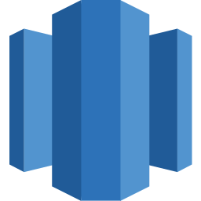
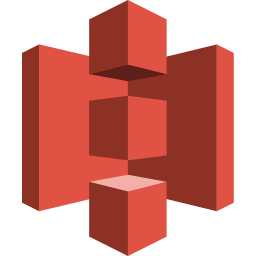

<p align="center">
  <a href="https://datahub.com">
    
  </a>
</p>

<p align="center">
  <a href="https://github.com/datahub-project/datahub/actions/workflows/build-and-test.yml"></a>
  <a href="https://pypi.org/project/acryl-datahub/"></a>
  <a href="https://pypi.org/project/acryl-datahub/"></a>
  <a href="https://hub.docker.com/r/acryldata/datahub-gms"></a>
  <a href="https://datahub.com/slack"></a>
  <a href="https://github.com/datahub-project/datahub/stargazers"></a>
  <a href="https://github.com/datahub-project/datahub/blob/master/LICENSE"></a>
</p>

<p align="center">
  <a href="#quick-start"><b>Quickstart</b></a> ·
  <a href="https://demo.datahub.com"><b>Live Demo</b></a> ·
  <a href="https://docs.datahub.com"><b>Docs</b></a> ·
  <a href="https://datahub.com/slack"><b>Slack Community</b></a>
</p>

<p align="center">
  <i>Built with ❤️ by <a href="https://datahub.com">DataHub</a> and <a href="https://engineering.linkedin.com">LinkedIn</a></i> · <a href="https://github.com/datahub-project/datahub">⭐ Star us on GitHub</a>
</p>

# DataHub

DataHub transforms enterprise data into trusted context, enabling intelligent decision making by humans and AI agents. The company was founded by the creators of the popular DataHub open source product that has more than 16,000 community members and 750+ contributors and is used by thousands of organizations. The company’s flagship product, DataHub Cloud, is the leading context management platform trusted by the Global 2000 to ensure that context is always relevant, reliable and continuously refreshed across the entire data estate.

<p align="center">
  <a href="https://demo.datahub.com">
    
  </a>
</p>

<p align="center">
  Trusted in production by teams at Netflix, Visa, Etsy, Slack, Apple, FIS, Miro, and <a href="https://datahub.com/resources/customer-stories/">3,000+ organizations worldwide →</a> · <a href="ADOPTERS.md">See all adopters</a>
</p>

## Pick your path

### DataHub OSS

Self-host on your own infrastructure. Apache 2.0 licensed. Full access to the metadata graph, 150+ integrations, column-level lineage, governance, and discovery. Best for teams that want full control and are comfortable running their own stack.

[Run it locally ↓](#quick-start) · [Quickstart guide →](https://docs.datahub.com/docs/quickstart) · [Deploy on Kubernetes →](https://docs.datahub.com/docs/deploy/kubernetes)

### DataHub Cloud

Managed, SLA-backed, enterprise-ready. Access data observability and the full Context Platform: Context Intelligence, Context Hub, and native agent integrations out of the box. No infrastructure to run.

[Start a free trial →](https://datahub.com/free-trial/) · [Compare OSS vs Cloud →](https://docs.datahub.com/docs/managed-datahub/managed-datahub-overview)

## Core capabilities

### Context Platform

Turn your data estate into a trusted knowledge base for AI agents.

- **Context Ingestion** pulls metadata from 150+ integrations, dbt, Power BI, Confluence, Notion into a unified context graph
- **Context Intelligence** mines years of query history to build a semantic index of how your organization actually uses its data; no manual authoring required
- **Context Hub** - a workspace where domain experts review, approve, and enrich AI-proposed context before it reaches any agent
- **Context Activation** serves validated context to any agent via Model Context Protocol (MCP), GraphQL, API, or SDK

[Learn more about the Context Platform →](https://datahub.com/products/context-platform/)

### Discovery

Find the right data, fast.

- Universal search using natural language across your entire data estate
- Column-level lineage to trace data from source to consumption
- Data profiling: schema, statistics, ownership, usage in one place

[Learn more about Discovery →](https://datahub.com/products/data-discovery/)

### Governance

Make data trustworthy at scale.

- Business glossary with shared definitions, owned and versioned
- Ownership and stewardship for every asset
- Access policies and compliance controls

[Learn more about Governance →](https://datahub.com/products/data-governance/)

### Observability

Know when something breaks before your users do.

- Data quality assertions and monitoring
- Freshness checks and SLA tracking
- Incident tracking and root cause lineage

[Learn more about Observability →](https://datahub.com/products/data-observability/)

[→ See the full product tour at datahub.com](https://datahub.com/product-tour/)

## Quick start

- [**Try the live demo →**](https://demo.datahub.com) No installation required.

- **Run locally.** Requires Docker (8GB RAM) and Python 3.10+.

  ```sh
  pip install acryl-datahub
  datahub docker quickstart
  # → http://localhost:9002 (username: datahub, password: datahub)
  ```

  [Full quickstart guide →](https://docs.datahub.com/docs/quickstart)

- **Connect your AI assistant via MCP.** Add the DataHub MCP server to your MCP client (Claude Desktop, Cursor, and more).

  ```sh
  uvx mcp-server-datahub@latest
  ```

  [MCP server setup →](https://docs.datahub.com/docs/features/feature-guides/mcp)

**Next steps:** [Ingest metadata](https://docs.datahub.com/docs/metadata-ingestion/cli-ingestion) · [Search the catalog](https://docs.datahub.com/docs/api/tutorials/sdk/search_client) · [Query lineage](https://docs.datahub.com/docs/api/tutorials/lineage) · [Add documentation](https://docs.datahub.com/docs/api/tutorials/descriptions)

## Why DataHub

- **Cross-platform by design.** DataHub started at LinkedIn in 2019 to manage metadata at hyperscale. That foundation with column-level lineage across 150+ integrations, spanning your entire data estate is what makes trusted context possible. Context is only as good as the lineage underneath it, and lineage is only as good as its coverage.

- **Battle-tested at scale.** Born at LinkedIn to handle one of the largest data estates in the world. Manages 10M+ assets in production today.

- **Accuracy you can measure.** Customers report text-to-SQL accuracy improving from 50% to 90% after connecting DataHub. 119% more AI/ML models reach production when teams can trust their data. _([IDC, March 2026](https://datahub.com/roi/))_

- **Discovery that actually works.** Business users find trusted data in five minutes, down from 50 — a 91% reduction in search time. _([IDC, March 2026](https://datahub.com/roi/))_

- **Open by default, extensible by design.** Apache 2.0. Built on open standards: MCP for agent delivery, GraphQL and REST APIs. Bring your own agents, your own LLM, your own stack.

[Compare DataHub Core and DataHub Cloud →](https://datahub.com/products/cloud-vs-core/)

## Integrations

Production-grade integrations across your full data stack.

<p align="center">
  &nbsp;&nbsp;
  &nbsp;&nbsp;
  &nbsp;&nbsp;
  &nbsp;&nbsp;
  &nbsp;&nbsp;
  &nbsp;&nbsp;
  &nbsp;&nbsp;
  &nbsp;&nbsp;
  &nbsp;&nbsp;
  &nbsp;&nbsp;
  &nbsp;&nbsp;
  &nbsp;&nbsp;
</p>

<p align="center">
  <a href="https://docs.datahub.com/integrations"><b>See all 150+ integrations →</b></a>
</p>

Missing a source? [Build a custom connector](https://docs.datahub.com/docs/how/add-custom-ingestion-source). [DataHub Skills](https://github.com/datahub-project/datahub-skills) can help your AI coding assistant plan and review it.

## DataHub ecosystem

- **[Analytics Agent](https://github.com/datahub-project/analytics-agent)** – Open-source agent grounded in your DataHub catalog. Ask data questions in plain English and get SQL, results, and charts back. Apache 2.0, bring your own LLM.
- **[MCP Server](https://github.com/acryldata/mcp-server-datahub)** – The official Model Context Protocol server for DataHub.
- **[DataHub Skills](https://github.com/datahub-project/datahub-skills)** – Agent skills for working with DataHub: search, lineage, enrichment, and quality workflows.

[See the full ecosystem →](docs/ecosystem.md)

## Built by the community

DataHub has 16,000+ community members and 750+ contributors across 3,000+ organizations. Every connector, integration, and improvement you use was built by people like you.

- Join [Slack](https://datahub.com/slack) community
- Watch demos and events on [YouTube](https://www.youtube.com/@DataHubCloud)
- Register to [Monthly Town Hall](https://datahub.com/community/datahub-town-halls/)
- Read our [Blog](https://datahub.com/blog/)
- Learn from teams using DataHub in [case studies and talks](docs/links.md)
- Found a bug? [Open an issue](https://github.com/datahub-project/datahub/issues)

Ready to contribute? See [CONTRIBUTING.md](docs/CONTRIBUTING.md) for guidelines and the [Developer's Guide](https://docs.datahub.com/docs/developers) to set up your local development environment.

## Explore DataHub Now

[Live Demo](https://demo.datahub.com) · [Docs](https://docs.datahub.com) · [Slack](https://datahub.com/slack) · [LinkedIn](https://www.linkedin.com/company/datahub-cloud/) · [X](https://x.com/DataHubCloud) · [Security](https://docs.datahub.com/docs/security) · [Feature Requests](https://datahubspace.slack.com/archives/C02FWNS2F08) · [⭐ Star us on GitHub](https://github.com/datahub-project/datahub)

## License

Apache License 2.0. See [LICENSE](LICENSE).

Copyright 2015-2026 LinkedIn Corporation<br />
Copyright 2025-Present DataHub Project Contributors
