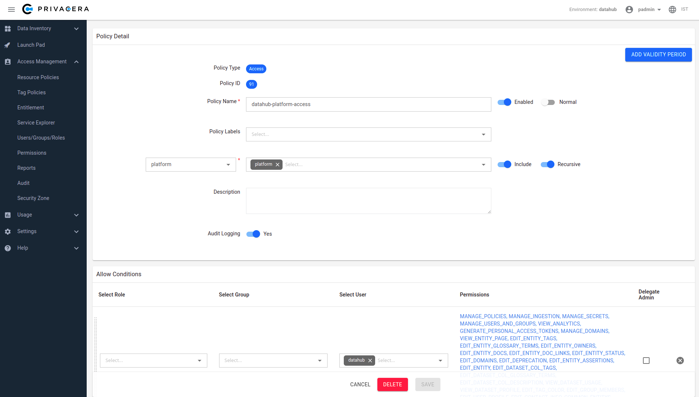

# Configuring Authorization with Apache Ranger
DataHub integration with Apache Ranger allows DataHub Authorization policies to be controlled inside Apache Ranger.
Admins can create users, groups and roles on Apache Ranger, and then assign them to Ranger policies to control the authorization of requests to DataHub.

We'll break down configuration of the DataHub Apache Ranger Plugin into two parts:

1. Configuring your Apache Ranger Deployment
2. Configuring your DataHub Deployment

> Disclaimer: All configurations shown in this documented were tested against [Privacera Platform](https://privacera.com/) v6.3.0.1.

# Prerequisites 
- User identifier present in CorpRole URN should be the name of the AD/LDAP user. For example in URN **urn:li:corpuser:datahub**, the **datahub** should present as name of user in AD/LDAP  
- Apache Ranger and DataHub are configured for authentication via same IDP (either LDAP + JaaS or OIDC SSO)
- Apache Ranger service available via HTTP
- Basic authentication is enabled on Apache Ranger Service

# Configuration 

## Configuring your Apache Ranger Deployment

Perform the following steps to configure an Apache Ranger deployment to support creating access policies compatible with DataHub.
For kubernetes example command, please replace the &lt;ranger-pod-name&gt; and &lt;namespace&gt; as per your environment.

1. Download the **datahub-ranger-plugin** from [Maven](https://mvnrepository.com/artifact/io.acryl/datahub-ranger-plugin)
2. Create a "datahub" directory inside the "ranger-plugins" directory where Apache Ranger is deployed. For example, to do this in a Privacera container

    *Docker command:*
    ```bash
    docker exec privacera_ranger_1 mkdir ews/webapp/WEB-INF/classes/ranger-plugins/datahub
    ```
   *Kubernetes command:*
    ```bash
   kubectl exec <ranger-pod-name> mkdir ews/webapp/WEB-INF/classes/ranger-plugins/datahub -n <namespace>
   ```
3. Copy the downloaded **datahub-ranger-plugin** jar into the newly created "datahub" directory. For example, to do this in a Privacera container

   *Docker command:*
    ```bash
    docker cp datahub-ranger-plugin-<version>.jar privacera_ranger_1:/opt/ranger/ranger-2.1.0-admin/ews/webapp/WEB-INF/classes/ranger-plugins/datahub/
    ```
   *Kubernetes command:*
    ```bash
   kubectl cp datahub-ranger-plugin-<version>.jar <ranger-pod-name>:/opt/ranger/ranger-2.1.0-admin/ews/webapp/WEB-INF/classes/ranger-plugins/datahub/ -n <namespace>
   ```
4. Download the [service definition file](../datahub-ranger-plugin/conf/servicedef.json). This service definition is the ranger service definition JSON file for datahub-ranger-plugin-&lt;version&gt;.jar 
5. Register the downloaded service definition file with Apache Ranger Service. To do this executes the below curl command <br /> 
Replace variables with corresponding values in curl command
   - &lt;ranger-admin-username&gt;
   - &lt;ranger-admin-password&gt;
   - &lt;ranger-host&gt;
    ```bash 
    curl -u <ranger-admin-username>:<ranger-admin-password> -X POST -H "Accept: application/json" -H "Content-Type: application/json" --data @servicedef.json http://<ranger-host>:6080/service/public/v2/api/servicedef
    ```

### Defining a Ranger Policy

Now, you should have the DataHub plugin registered with Apache Ranger. Next, we'll create a sample user and add them to our first resource policy.

1. Login into the Apache Ranger UI (Privacera Portal) to performs below steps. 
2. Verify **datahub-ranger-plugin** is registered successfully: The  **datahub-ranger-plugin** should be visible as **DATAHUB**  in  *Access Management -> Resource Policies*. 
3. Create a service under the plugin **DATAHUB** with name **ranger_datahub**

      **DATAHUB** plugin and **ranger_datahub** service is shown in below screenshot: <br/>
      
      

4. Create a new policy under service **ranger_datahub** - this will be used to control DataHub authorization. 
5. Create a test user & assign them to a policy. We'll use the `datahub` user, which is the default root user inside DataHub.

   To do this performs below steps
      - Create a user  **datahub** 
      - Create a policy under **ranger_datahub** service. To assign [Platform Privileges](../docs/authorization/policies.md) (e.g. Admin privileges), simply use the "platform" resource type which is defined. To test the flow, we can simply assign the **datahub** user all platform privileges that are available through the Ranger UI. This will enable the "datahub" to have full platform admin privileges. 

     > To define fine-grained resource privileges, e.g. for DataHub Datasets, Dashboards, Charts, and more, you can simply select the appropriate Resource Type in the Ranger policy builder. You should also see a list of privileges that are supported for each resource type, which correspond to the actions that you can perform. To learn more about supported privileges, check out the DataHub [Policies Guide](../docs/authorization/policies.md). 
      
      DataHub platform access policy screenshot: <br/>
      
      

Once we've created our first policy, we can set up DataHub to start authorizing requests using Ranger policies. 


## Configuring your DataHub Deployment

Perform the following steps to configure DataHub to send incoming requests to Apache Ranger for authorization.

1. Download Apache Ranger security xml [ranger-datahub-security.xml](../datahub-ranger-plugin/conf/ranger-datahub-security.xml)
2. In  **ranger-datahub-security.xml**  edit the value of property  *ranger.plugin.datahub.policy.rest.url*. Sample snippet is shown below
    ```xml
        <property>
            <name>ranger.plugin.datahub.policy.rest.url</name>
            <value>http://199.209.9.70:6080</value>
            <description>
                URL to Ranger Admin
            </description>
        </property>
    ```

As per your deployment follow either Docker or Kubernetes section below
### Docker 
   Configure DataHub to use a Ranger **Authorizer**. On the host where `datahub-gms` is deployed, follow these steps:
   1. Create directory **~/.datahub/plugins/auth/resources/**: Executes below command 
        ```bash
        mkdir -p ~/.datahub/plugins/auth/resources/
      ```
   2. Copy **ranger-datahub-security.xml** file to ~/.datahub/plugins/auth/resources/ 
   3. [Optional] Disable the DataHub default policy authorizer by setting the following environment variable on the `datahub-gms` container:
        ```bash
      export AUTH_POLICIES_ENABLED=false
      ```
   4. Enable the Apache Ranger authorizer by setting the following environment variable on the `datahub-gms` container:
        ```bash
      export RANGER_AUTHORIZER_ENABLED=true 
      ```
   5. Set the Apache Ranger admin username by setting the following environment variable on the `datahub-gms` container:
        ```bash
      export RANGER_USERNAME=<username>
      ```
   6. Set the Apache Ranger admin password by setting the following environment variable on the `datahub-gms` container:
        ```bash
      export RANGER_PASSWORD=<password>
      ```
   7. Redeploy DataHub (`datahub-gms`) with the new environment variables
### Kubernetes
   Configure DataHub to use a Ranger **Authorizer**. On the host where `kubectl` is installed, follow these steps:

   For kubernetes example command, please replace the &lt;namespace&gt; as per your environment.


   1. Download kubernetes configMap for DataHub Apache Ranger authorizer [auth-plugin-configuration-configMap.kubernetes.yaml](../datahub-ranger-plugin/conf/auth-plugin-configuration-configMap.kubernetes.yaml)

   2. In **auth-plugin-configuration-configMap.kubernetes.yaml**  edit the value of property  *ranger.plugin.datahub.policy.rest.url*. Sample snippet is shown below
        ```xml
        <property>
            <name>ranger.plugin.datahub.policy.rest.url</name>
            <value>http://199.222.9.70:6080</value>
            <description>
                URL to Ranger Admin
            </description>
        </property>
      ```

   3. Create a kubernetes configMap resource: Execute below command to create an *auth-plugin-configuration* configMap resource
       ```bash
        kubectl apply -f auth-plugin-configuration-configMap.kubernetes.yaml -n <namespace>
       ```

   4. Edit **datahub-datahub-gms** deployment to set environment variables & volume-mount points: Execute below command to open deployment editor<br/>
      ```
      kubectl edit deployment datahub-datahub-gms
      ```
      1. Add below environment variables in under *spec.template.spec.containers[0].env*: Replace &lt;username&gt; by Apache Ranger admin username and &lt;password&gt; by Apache Ranger admin user password.
         ```yaml
         - name: AUTH_POLICIES_ENABLED
           value: "false"
         - name: RANGER_AUTHORIZER_ENABLED
           value: "true"
         - name: RANGER_USERNAME
           value: "<username>"
         - name: RANGER_PASSWORD
           value: "<password>"
         ``` 

       2. Add *volumes* under spec.template.spec: Copy & paste below yaml snippet under *spec.template.spec*
             ```yaml
                  volumes:
                  - configMap:
                    name: auth-plugin-configuration
                  name: auth-resource-volume
            ```
       3. Add *volumeMounts* under spec.template.spec.containers[0]: Copy & paste below yaml snippet under spec.template.spec.containers[0]
             ```yaml
                 volumeMounts:
                 - mountPath: /etc/datahub/plugins/auth/resources
                   name: auth-resource-volume
                   readOnly: true
 
             ```
   5. Save and quit the editor 
   6. Check status of **datahub-datahub-gms** deployment rollout: Execute below command
   ```bash 
   kubectl rollout status deployment/datahub-datahub-gms
   ```
   On successful rollout you should see a message *deployment "datahub-datahub-gms" successfully rolled out* 


That's it! Now we can test out the integration. 

### Validating your Setup
To verify that things are working as expected, we can test that the root **datahub** user has all Platform Privileges and is able to perform all operations: managing users & groups, creating domains, and more. To do this, simply log into your DataHub deployment via the root DataHub user. 

# Revert the Configuration 
If you want to revert your deployment configuration and don't want Apache Ranger to control the authorization of your DataHub deployment 
then follow the below sections to undo the configuration steps you have performed in section *Configuring Authorization with Apache Ranger*

1. Revert Configuration of your Apache Ranger Deployment
2. Revert Configuration of your DataHub Deployment

## Revert Configuration of your Apache Ranger Deployment
   For kubernetes example command, please replace the &lt;ranger-pod-name&gt; and &lt;namespace&gt; as per your environment.

   1. Delete **ranger_datahub** service: Login into the Privacera Portal and delete service **ranger_datahub**

      **ranger_datahub** service is shown in below screenshot: <br/>

      

   2. Delete **datahub** plugin: Execute below curl command to delete **datahub** plugin
      Replace variables with corresponding values in curl command
      - &lt;ranger-admin-username&gt;
      - &lt;ranger-admin-password&gt;
      - &lt;ranger-host&gt;

      ```bash
      curl -u <ranger-admin-username>:<ranger-admin-password> -X DELETE -H "Accept: application/json" -H "Content-Type: application/json" http://<ranger-host>:6080/service/public/v2/api/servicedef/name/datahub
      ```
   3. Delete **datahub** plugin directory: Execute below command to delete the **datahub** plugin directory from Apache Ranger

      *Docker command:*
      ```bash
      docker exec privacera_ranger_1 rm -rf ews/webapp/WEB-INF/classes/ranger-plugins/datahub
      ```
      *Kubernetes command:*
      ```bash
      kubectl exec <ranger-pod-name> -n <namespace> -- sh -c 'rm -rf ews/webapp/WEB-INF/classes/ranger-plugins/datahub'
      ```

      
## Revert Configuration of your DataHub Deployment
### Docker 
   1. Unset environment variables: Execute below command to unset the environment variables
        ```bash
        unset AUTH_POLICIES_ENABLED
        unset RANGER_AUTHORIZER_ENABLED
        unset RANGER_USERNAME
        unset RANGER_PASSWORD
      ```
   2. Redeploy DataHub (`datahub-gms`)
### Kubernetes
   For kubernetes example command, please replace the &lt;namespace&gt; as per your environment.
1. Open deployment editor: Execute below command
    ```bash
      kubectl edit deployment datahub-datahub-gms -n <namespace>
    ```
2. Remove below environments variables 
   1. AUTH_POLICIES_ENABLED
   2. RANGER_AUTHORIZER_ENABLED
   3. RANGER_USERNAME
   4. RANGER_PASSWORD
3. Remove below volumes related settings 
   1. volumes 
   2. volumeMounts
4. Save and quit the editor and use below command to check status of **datahub-datahub-gms** deployment rollout
    ```bash 
    kubectl rollout status deployment/datahub-datahub-gms -n <namespace>
    ```
    On successful rollout you should see a message *deployment "datahub-datahub-gms" successfully rolled out*


### Validating your Setup
To verify that things are working as expected, we can test that the root **datahub** user has all Platform Privileges and is able to perform all operations: managing users & groups, creating domains, and more. To do this, simply log into your DataHub deployment via the root DataHub user. 
