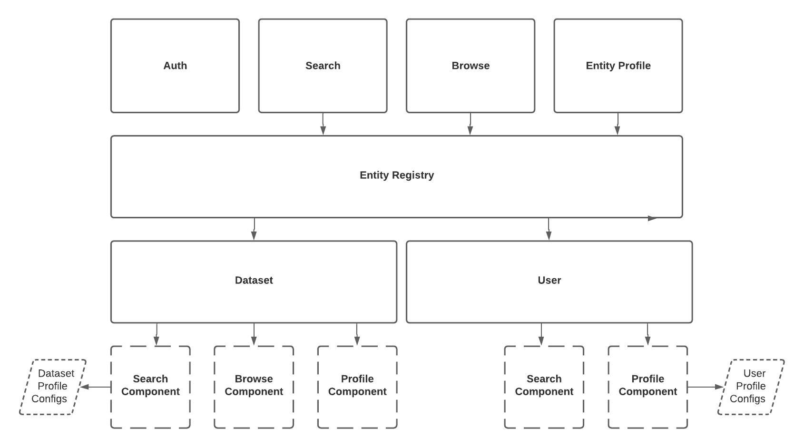

# DataHub React App

## About
This module contains a React application that serves as the DataHub UI.

Feel free to take a look around, deploy, and contribute. 

For details about the motivation please see [this RFC](../docs/rfc/active/2055-react-app/README.md). 

## Functional Goals
The initial milestone for the app was to achieve functional parity with the previous Ember app. This meant supporting

- Dataset Profiles, Search, Browse Experience
- User Profiles, Search
- LDAP Authentication Flow

This has since been achieved. The new set of functional goals are reflected in the latest version of the [DataHub Roadmap](../docs/roadmap.md). 

## Design Goals
In building out the client experience, we intend to leverage learnings from the previous Ember-based app and incorporate feedback gathered
from organizations operating DataHub. Two themes have emerged to serve as guideposts:

1. **Configurability**: The client experience should be configurable, such that deploying organizations can tailor certain 
   aspects to their needs. This includes theme / styling configurability, showing and hiding specific functionality, 
   customizing copy & logos, etc. 
   
2. **Extensibility**: Extending the *functionality* of DataHub should be as simple as possible. Making changes like 
   extending an existing entity & adding a new entity should require minimal effort and should be well covered in detailed 
   documentation. 

## Starting the Application

### Quick Start

Navigate to the `docker` directory and run the following to spin up the react app:
```
./quickstart.sh
```
at `http://localhost:9002`.

If you want to make changes to the UI see them live without having to rebuild the `datahub-frontend-react` docker image, you
can run the following in this directory:

`yarn install && yarn run start`

which will start a forwarding server at `localhost:3000`. Note that to fetch real data, `datahub-frontend` server will also
need to be deployed, still at `http://localhost:9002`, to service GraphQL API requests.

Optionally you could also start the app with the mock server without running the docker containers by executing `yarn start:mock`. See [here](src/graphql-mock/fixtures/searchResult/userSearchResult.ts#L6) for available login users.

### Functional testing

Automated functional testing is powered by Cypress and MirageJS. When running the web server with Cypress the port is set to 3010 so that the usual web server running on port 3000 used for development can be started without interruptions.

#### During development

`yarn test:e2e`

#### CI

`yarn test:e2e:ci`

#### Troubleshooting
`Error: error:0308010C:digital envelope routines::unsupported`: This error message shows up when using Node 17, due to an OpenSSL update related to md5.  
The best workaround is to revert to the Active LTS version of Node, 16.13.0 with the command `nvm install 16.13.0` and if necessary reinstall yarn `npm install --global yarn`.


### Theming

#### Customizing your App without rebuilding assets

To see the results of any change to a theme, you will need to rebuild your datahub-frontend-react container. While this may work for some users, if you don't want to rebuild your container
you can change two things without rebuilding.

1. You customize the logo on the homepage & the search bar header by setting the `REACT_APP_LOGO_URL` env variable when deploying GMS.
2. You can customize the favicon (the icon on your browser tab) by setting the `REACT_APP_FAVICON_URL` env var when deploying GMS.

#### Selecting a theme

Theme configurations are stored in `./src/conf/theme`. To select a theme, choose one and update the `REACT_APP_THEME_CONFIG` env variable stored in `.env`.
To change the selected theme, update the `.env` file and re-run `yarn start` from `datahub/datahub-web-react`.

#### Editing a theme

To edit an existing theme, the recommendation is to clone one of the existing themes into a new file with the name `<your_themes_name>.config.json`,
and then update the env variable as descibed above. The theme files have three sections, `styles`, `assets` and `content`. The type of the theme configs is specified
in `./src/conf/theme/types.ts`.

`styles` configure overrides for the apps theming variables.

`assets` configures the logo url.

`content` specifies customizable text fields.

While developing on your theme, all changes to assets and content are seen immediately in your local app. However, changes to styles require
you to terminate and re-run `yarn start` to see updated styles.

## Design Details

### Package Organization

The `src` dir of the app is broken down into the following modules

**conf** - Stores global configuration flags that can be referenced across the app. For example, the number of 
search results shown per page, or the placeholder text in the search bar box. It serves as a location where levels
for functional configurability should reside. 

**app** - Contains all important components of the app. It has a few sub-modules:

- `auth`: Components used to render the user authentication experience. 
- `browse`: Shared components used to render the 'browse-by-path' experience. The experience is akin to navigating a filesystem hierarchy.
- `preview`: Shared components used to render Entity 'preview' views. These can appear in search results, browse results,
  and within entity profile pages. 
- `search`: Shared components used to render the full-text search experience. 
- `shared`: Misc. shared components
- `entity`: Contains Entity definitions, where entity-specific functionality resides.
  Configuration is provided by implementing the 'Entity' interface. (See DatasetEntity.tsx for example) 
  There are 2 visual components each entity should supply:
    - `profiles`: display relevant details about an individual entity. This serves as the entity's 'profile'.
    - `previews`: provide a 'preview', or a smaller details card, containing the most important information about an entity instance.
        
        When rendering a preview, the entity's data and the type of preview (SEARCH, BROWSE, PREVIEW) are provided. This 
        allows you to optionally customize the way an entities preview is rendered in different views.
  
    - `entity registry`: There's another very important piece of code living within this module: the **EntityRegistry**. This is a layer 
        of abstraction over the intimate details of rendering a particular entity. It is used
        to render a view associated with a particular entity type (user, dataset, etc.).
  
    


**graphql** - The React App talks to the `dathub-frontend` server using GraphQL. This module is where the *queries* issued
against the server are defined. Once defined, running `yarn run generate` will code-gen TypeScript objects to make invoking 
these queries extremely easy. An example can be found at the top of `SearchPage.tsx.`

**images** - Images to be displayed within the app. This is where one would place a custom logo image. 

## Adding an Entity

The following outlines a series of steps required to introduce a new entity into the React app:

1. Declare the GraphQL Queries required to display the new entity 
   - If search functionality should be supported, extend the "search" query within `search.graphql` to fetch the new 
      entity data.
   - If browse functionality should be supported, extend the "browse" query within `browse.graphql` to fetch the new 
      entity data. 
   - If display a 'profile' should be supported (most often), introduce a new `<entity-name>.graphql` file that contains a 
    `get` query to fetch the entity by primary key (urn). 
     
    Note that your new entity *must* implement the `Entity` GraphQL type interface, and thus must have a corresponding
     `EntityType`.
   

2. Implement the `Entity` interface 
    - Create a new folder under `src/components/entity` corresponding to your entity
    - Create a class that implements the `Entity` interface (example: `DatasetEntity.tsx`)
    - Provide an implementation each method defined on the interface. 
        - This class specifies whether your new entity should be searchable & browsable, defines the names used to 
          identify your entity when instances are rendered in collection / when entity appears 
          in the URL path, and provides the ability to render your entity given data returned by the GQL API. 
          

3. Register the new entity in the `EntityRegistry`
    - Update `App.tsx` to register an instance of your new entity. Now your entity will be accessible via the registry 
      and appear in the UI. To manually retrieve the info about your entity or others, simply use an instance
      of the `EntityRegistry`, which is provided via `ReactContext` to *all* components in the hierarchy. 
      For example
      ```
      entityRegistry.getCollectionName(EntityType.YOUR_NEW_ENTITY)
      ```
    
That's it! For any questions, do not hesitate to reach out on the DataHub Slack community in #datahub-react. 
