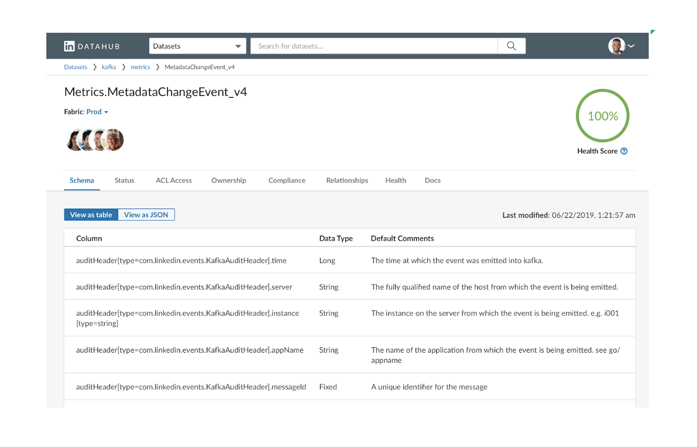

# DataHub Web
The DataHub web application is written in [TypeScript](https://www.typescriptlang.org/) and [EmberJs](https://emberjs.com/).
The application is developed using a modular monorepo architecture, via [Yarn Workspaces](https://classic.yarnpkg.com/en/docs/workspaces), that allows us to split the application features into individually installable packages.



## Folder Layout
The folder structure is organized as below:
```sh
datahub-web
├── @datahub # application modules / packages
├── blueprints # EmberJs blueprints for the app
├── configs # configuration sources for building the app
├── node_modules # installed packages dependencies
├── packages # application source directory
└── scripts # helper shell scripts
```

## Prerequisites
* [Also see Frontend](https://github.com/linkedin/datahub/blob/master/datahub-frontend/README.md#pre-requisites)
* Other dependencies are installed as part of the build step

## Build
Running the build script `./gradlew build` from the top-level directory `<DOWNLOAD_DIRECTORY>/datahub` will build the entire app.

To build the web client (Ember application), you can run the following from the top-level directory

```sh
datahub> ./gradlew emberBuild
```
or

```sh
datahub> ./gradlew :datahub-web:build
```

Building will run the monorepo test suite and transpile the TypeScript application into the `datahub-web/dist` folder.

## Developing & Running the web application
Once [DataHub GMS](../gms) and the [DataHub Frontend](../datahub-frontend) are running you can start [DataHub Web](./) by running:
```sh
datahub> ./gradlew emberServe
```

or

```sh
datahub-web> yarn # To install dependencies, if you skipped the build step above
datahub-web> yarn run dev # serve the ember application
```
This will start the ember application and proxy to your running instance of [DataHub Frontend](../datahub-frontend).
NOTE: If you are running [DataHub Frontend](../datahub-frontend) on a port other than 9001, you will need to update the proxy to this port number in the [gradle script](./build.gradle). 

## Testing

To run all tests
```sh
datahub> ./gradlew emberTest
```

or

```sh
datahub> yarn test
```

To run test for a specific package / workspace in the [DataHub Web](./) monorepo, you can execute
```sh
datahub> yarn workspace <WORKSPACE_NAME> test # where WORKSPACE_NAME is a yarn workspace in @datathub/
```

For example:
```sh
datahub> yarn workspace @datahub/data-models test
```

## Contributing
[See contributing.md](../CONTRIBUTING.md)
