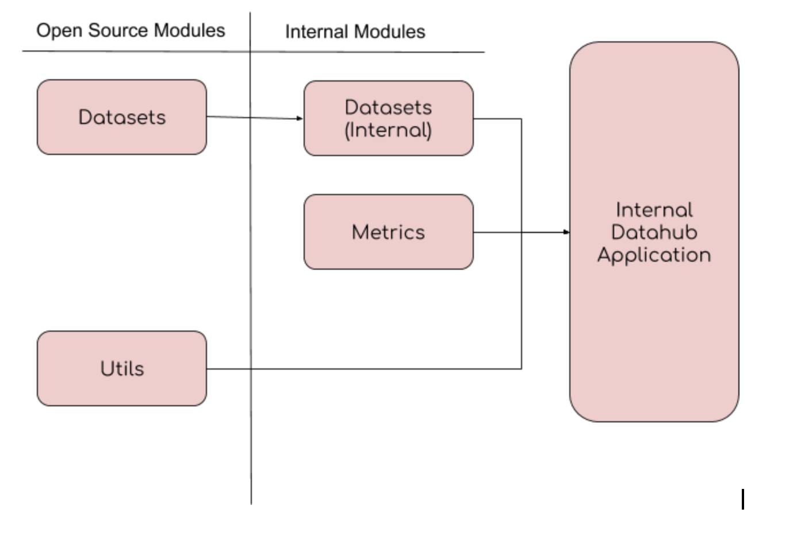

A History of DataHub Frontend/UI
==========================================================

### *Where we came from, and how we got here*

Through providing a historical context for DataHub UI, we hope to provide more insight into the decisions and
architecture behind our UI client.

---------------------------------------

 

## **Before GDPR**

DataHub was originally an open source project focused on just search and discovery of datasets known as Wherehows.
During those times, our UI application would best be described as a jQuery application written inside an Ember
wrapper. Eventually, we adopted better code practices and aligned with Ember 2.x. However, there was no clear
unified thought process behind how we did things. Every feature or task was done ad hoc, and for the most part the
primary goal was to get things working.

### **Why Ember?**

We chose Ember as a framework because of its support internally at LinkedIn. A lot of libraries that we could take
advantage of were made specifically to be compatible with our internal wrapper around the Ember framework, known as
"Pemberly."

As time went on, though, we did take note that Ember is a very opinionated framework with a steep learning curve
early on. But it's for those very same reasons that the framework itself allows quick and clean iteration for code
for those who are intimately familiar with it. Additionally, as members join and leave the team internally, people
generally come in with some baseline knowledge already about Ember, which means faster ramp up time for any new
Ember application than coming into an unfamiliar React application.

Ultimately, the decision comes down to support, and we wanted to take advantage of as much as possible internally
in order to devote more time to developing new features and maintaining the existing application.

 

## **GDPR Times - The Trenches**

Before we could devote a lot of time to coming up with a proper frontend architecture within the Ember ecosystem in
which we found ourselves, a rush order came. Companies around the world sought to find ways to meet GDPR compliance
and user privacy standards, and ours was no different. Internally, people realized that our application, which had
originally intended to only be a data warehouse and search tool, and its aggregation of metadata across the company was
the key to creating the backbone on which compliance efforts could be built.

And so, we got to work, the backend built to take on this new compliance pipeline and the frontend to fill in features
related to compliance tasks. Unfortunately, this rush also meant that our open source story became neglected, and tech
debt accumulated. Our UI code's maintainability was tested to the extreme... and it failed. Quick iterations are great,
but the maintainability cost in our case was too high.

### **But We Got TypeScript**

One long term benefit that arose from this period, though, was that seeing the need to increase the maintainability of
what was becoming a larger scale application internally led us to adopt TypeScript. TypeScript provides a great
avenue for maintainability in our opinion. It's not just the compilation time safety of values and variables. There was
the added benefit of editor functions like accurate autocomplete and protection against null values and undefined
objects/properties. Plus, we were able to start using classes much earlier than the point where they became widely used.

 

## **Post GDPR - A New Mission**

After GDPR, our Metadata team at LinkedIn found ourselves in a new position as a team that had the most horizontal view
of all the data at LinkedIn, and that had the tools to potential solve many of the big data problems in our
organization. With this new true north in mind, we began a project called Starfleet, which effectively was meant to be
a revamp of Wherehows. Not only were we keen to solve the internal challenges, but we also wanted to revisit our open
source story and bring life back into a project that had been effectively neglected during the GDPR rush.

We found ourselves asking two questions on the UI code:

- How did we plan to be able to work with multiple teams and allow contributions from different sources?
- How did we plan to accommodate code that should exist in our internal repository and expose only what is necessary to
open source?

To solve both issues, we began looking at 2 options to do the same thing, which was to split our single Ember
into multiple modules or packages known as Ember addons. A quick introduction to what addons are can be found on the
[Ember documentation website](https://guides.emberjs.com/v3.3.0/tutorial/installing-addons/).

Each module (addon) would ultimately be consumed by our actual application. The role of the application at that point
would be to aggregate addons and ensure that the whole of the project worked properly. Each team that wanted to
collaborate with us could write an addon instead of having to learn the entire DataHub codebase, and our role on the
team would be to guide them on how to integrate with our full application at the end.

The benefit of this also extends to the open source story. How we laid out the addons was simple. There would be a
subset of modules designated as "open source" modules. These would be the components that make up DataHub UI in
the open source. Internally, we would have additional modules for two reasons:

- One, the module is an "extension" of an existing open source module that contains additional logic that would be
specific only to our internal code. Basically if the open source was our parent class, then the internal would be
a more specialized child class.
- Two, the module is an "internal only" feature or entity that should not be exposed to open source.

With the above layout and some minor tooling, we could effectively expose only said external logic to the open
source and ensure that we weren't polluting our pushes with internal business logic or features not relevant to
the open source community. A diagram that outlines this is shown below:

 

### **We're a monorepo now**

Ultimately, this development led to our application becoming laid out as a mono-repository, or monorepo, using
yarn workspaces. For more information about the specifics of this, check out our documentation about our
monorepo [here](02-MONOREPO.md).

 

## **Achieving More Stability**

As the development of Starfleet kicked off and we experimented for a quarter or two, there were some very valuable
lessons learned. One of the most valuable of these was that a quickly iterating team leads to a very dynamic backend.
And a very dynamic backend leads to lots of things changing and breaking on the frontend.

While developing the UI for an internal entity we wanted to onboard, metrics, we found the hard way that models, apis,
and contracts constantly change (who knew!). What we found ourselves doing, that seemed very unnecessary, though, was
constantly making massive file changes to accommodate constantly evolving interfaces. Because we called our APIs and
directly used the returned objects in our components, we made heavy assumptions on how to retrieve properties and pass
them from parent to child components or into various methods that dealt with those objects. The result was that a
single API change could unnecessarily snowball and also be prone to errors.

### **Data Models: A framework for indirection**

Our solution to the above problem was to channel the API responses through a secondary object, a JavaScript class
that defined a consistent interface. This class has knowledge of how the API behaves and contains a series of
computations and getters that expose the relevant API information in a stable way to the UI. Thus, we divided the app
into three layers: an API definition layer, a data fetching and translation layer, and a component (view) layer. If
this sounds like simply the literal definition of an MVC framework, it is. If our solution also sounds like a poor
person's GraphQL alternative solution, that's also pretty accurate.

However, Ember makes it very easy to forget these disciplines and mix concerns, and in the trenches it can be
difficult to see the greater picture. What the data models ultimately did was bring us back on track and start to
define and move toward a promised land for our UI.

For more information on our data models, read that section of our introduction [here](03-DATAMODELS.md). For more
information on where we are going with this and how we plan to move forward, check out our `forward` section of the
documentation, particularly our thoughts on adopted [GraphQL](../forward/GRAPHQL.md) and a more
[framework agnostic approach](../forward/NOFRAMEWORK.md).

 

## **Rapid Growth and Quicker Onboarding**

Since the beginning of Project Starfleet our team has experienced rapid growth. Wherehows became re-branded as DataHub,
and its use internally at LinkedIn skyrocketed. We began to realize that our UI code would have difficulty scaling to
accommodate every team, feature, or entity ask that exists internally and in the open source community. One of the
goals for the UI has become allowing a quicker onboarding process for new entities, aspects, or features.

Of course, not everything can always be simply plug and play, as much as we would love that. There are many specialized
components that need to be hand made to accommodate very specific or unique use cases. However, for a large number of
cases, we can often break down the asks into basic components that share similar behaviors with other features. If we
can create a way to simply configure how those components appear on a page, and even include configurations to plug
in the more specialized components, then we could significantly improve how new asks can be onboarded for the UI.

### **And so, render props came along**

Render props are our in progress solution to the generalized UI problem, where we want to template-ize as much as
possible and allow people with little frontend knowledge to be able to modify what is essentially a JSON object to
make major modifications to the frontend UI. The idea is that, for each entity, we want to be able to hook up
behavior for how certain pages are defined and laid out, and even how they behave, based on a configuration. For
more information about how render props work on our application, check out the in-depth look
[here](04-RENDERPROPS.md).

 

## **Conclusion**

In this document, we've outlined but a few of the many challenges and learnings we've come across on our journey
so far. While many of these specific challenges are not necessarily new to the frontend world, they are more
interesting because of having to make these solutions work for a big data-centric application, which often has
much more complex and specialized use cases than a typical application.

While GMA aims to solve the generalized metadata challenge, DataHub UI aims to solve the generalized data UI
challenge associated with big metadata. For more information about our overall UI architecture, please continue
reading the rest of the `introduction`, starting [here](02-MONOREPO.md). For more information about where we plan to
take our learnings and go next, visit the `forward` section, like our thoughts on
[supporting React](../forward/REACT.md), for example.
