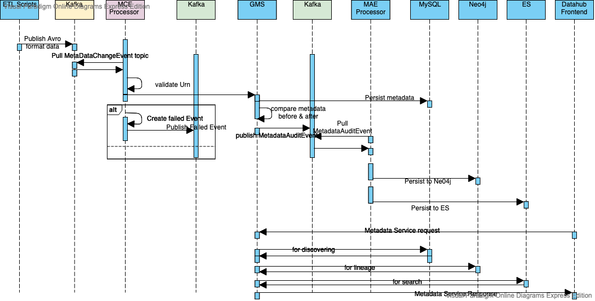

# Introduction

DataHub is LinkedIn's generalized metadata search & discovery tool. To learn more about DataHub, check out our 
[LinkedIn blog post](https://engineering.linkedin.com/blog/2019/data-hub) and [Strata presentation](https://speakerdeck.com/shirshanka/the-evolution-of-metadata-linkedins-journey-strata-nyc-2019). You should also visit [DataHub Architecture](architecture/architecture.md) to get a better understanding of how DataHub is implemented and [DataHub Onboarding Guide](how/entity-onboarding.md) to understand how to extend DataHub for your own use case.

In general, Datahub has two types of users in mind. One has metadata, and use tools provided by Datahub to ingest metadata into Datahub;  The other is to use Datahub to discover metadatas available within Datahub. Datahub provides intuitive UI, full text search capablitity, and graph relationship presentation to make the metadata discover and understanding much eaiser. 

The following sequence diagram highlights the key features Datahub has, and how the two types of users - metadata ingestion engineers and metadata discover users, can take full advantage of the Datahub.

1. It starts with ingesting your metadata into datahub. We provide a [collection of sample Python scripts](https://github.com/linkedin/datahub/tree/master/metadata-ingestion) for you. Those scripts work with the popular relationship databases, find metadata of the data source, and publish metadata in Avro data format to MetadataChangeEvent(MCE) Kafka topic.
2. A MetadataChangeEvent (MCE) processor consumes Kafka message with given topic, and make necessary transformation, send to Generalized Metadata Service (GMS), and GMS persists the metadata to a relational database of your choice. Currently we support MySQL, PostgreSQL and MariaDB.
3. GMS also checks the received metadata to find out whether there is a previous version. If so, it will publish the difference to Kafka’s MetadataAuditEvent (MAE) topic.
4. MAE processor consumes MetadataAuditEvent message from Kafka, and persist to Neo4j & Elastic Search (ES).
5. The frontend of Datahub talks to the metadata restful API services of GMS. The metadata discovering users can browse, search metadatas, get the details of metadata such as the owner, the lineage and other customer tags. 

# Documentation
* [DataHub Developer's Guide](developers.md)
* [DataHub Architecture](architecture/architecture.md)
* [DataHub Onboarding Guide](how/entity-onboarding.md)
* [Docker Images](https://github.com/linkedin/datahub/tree/master/docker)
* [Frontend](https://github.com/linkedin/datahub/tree/master/datahub-frontend)
* [Web App](https://github.com/linkedin/datahub/tree/master/datahub-web)
* [Generalized Metadata Service](https://github.com/linkedin/datahub/tree/master/gms)
* [Metadata Ingestion](https://github.com/linkedin/datahub/tree/master/metadata-ingestion)
* [Metadata Processing Jobs](https://github.com/linkedin/datahub/tree/master/metadata-jobs)
* [The RFC Process](rfc.md)
