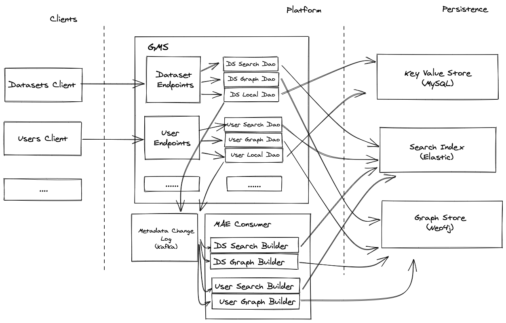
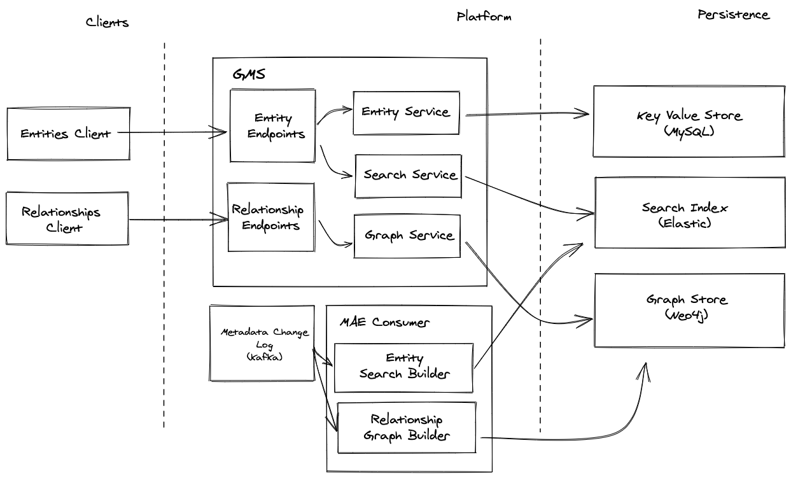

# Sin metadatos de código

## Resumen de los cambios

Como parte de la iniciativa No Code Metadata Modeling, hemos realizado cambios radicales en la pila de DataHub.

Específicamente, hemos

*   Desacoplado la capa de persistencia de Java + Rest.li conceptos específicos
*   Consolidar los recursos Rest.li por entidad en un único recurso de entidad de propósito general
*   Consolidó el Graph Index Writers + Readers por entidad en un único DAO Neo4J de propósito general
*   Consolidó el Search Index Writers + Readers por entidad en un único DAO ES de propósito general.
*   Mecanismos desarrollados para declarar configuraciones de indexación de búsqueda + relaciones de clave externa como anotaciones
    en los propios modelos PDL.
*   Se introdujo un aspecto especial de "Browse Paths" que permite que la configuración de browse sea
    empujado en DataHub, a diferencia de calculado en una lambda de caja negra que se encuentra dentro de DataHub
*   Se introdujeron aspectos especiales de "Clave" para representar convenientemente la información que identifica a las entidades de DataHub a través de
    una estructura normal.
*   Se eliminó la necesidad de Elastic escrito a mano `settings.json` y `mappings.json`. (Ahora generado en tiempo de ejecución)
*   Se ha eliminado la necesidad del contenedor Elastic Set Up (los índices no se registran en tiempo de ejecución)
*   Se ha simplificado el número de modelos que deben mantenerse para cada entidad de DataHub. Eliminamos la necesidad de
    1.  Modelos de relación
    2.  Modelos de entidad
    3.  Modelos de urna + las clases de contenedor Java asociadas
    4.  Modelos de 'valor', aquellos que son devueltos por el recurso Rest.li

Al hacerlo, reducir drásticamente el nivel de esfuerzo requerido para agregar o ampliar una entidad existente.

Para obtener más información sobre las consideraciones de diseño, consulte el **Diseño** sección a continuación.

## Especificaciones de ingeniería

Esta sección proporcionará una visión general más detallada de las consideraciones de diseño que estaban en juego al trabajar en el No
Iniciativa de código.

# Casos de uso

¿Quién necesita qué y por qué?

| Como | Quiero | porque
| ---------------- | ------------------------ | ------------------------------
| | del operador DataHub Agregar nuevas entidades | El modelo de dominio predeterminado no coincide con las necesidades de mi negocio
| | del operador DataHub Ampliar la | de entidades existentes El modelo de dominio predeterminado no coincide con las necesidades de mi negocio

Lo que escuchamos de la gente de la comunidad es que agregar nuevas entidades + aspectos es solo **demasiado difícil**.

Estarían felices si este proceso fuera simplificado y simple. **Extra** feliz si no hubiera posibilidad de fusionar conflictos en el futuro. (no es necesario bifurcarse)

# Metas

### Objetivo principal

**Reducir la fricción** de agregar nuevas entidades, aspectos y relaciones.

### Objetivo secundario

Logre el objetivo principal de una manera que no requiera una bifurcación.

# Requisitos

### Imprescindibles

1.  Mecanismos para **Agregar** una entidad GMS navegable, con capacidad de búsqueda y vinculable mediante la definición de uno o más modelos PDL

*   Punto de enlace de GMS para la entidad de obtención
*   GMS Endpoint para obtener relaciones de entidad
*   GMS Endpoint para entidad de búsqueda
*   GMS Endpoint para entidad de exploración

2.  Mecanismos para **extendiendo** una entidad GMS \*\*\*\*navegable, con capacidad de búsqueda y vinculable mediante la definición de uno o más modelos PDL

*   Punto de enlace de GMS para la entidad de obtención
*   GMS Endpoint para obtener relaciones de entidad
*   GMS Endpoint para entidad de búsqueda
*   GMS Endpoint para entidad de exploración

3.  Mecanismos + convenios para introducir un nuevo **relación** entre 2 entidades GMS sin escribir código
4.  Documentación clara que describe cómo realizar acciones en # 1, # 2 y # 3 publicada anteriormente en [datahubproject.io](http://datahubproject.io)

## Agradable para tener

1.  Mecanismos para generar automáticamente una API de GraphQL que funcione utilizando los modelos PDL de entidad
2.  Posibilidad de añadir/ampliar entidades GMS sin bifurcación.

*   p. ej.. **Registro** nueva entidad / extensiones *en tiempo de ejecución*. (Poco probable debido a la generación de código)
*   o **configurar** nuevas entidades en *tiempo de implementación*

## Cómo se ve el éxito

1.  Agregar una nueva entidad navegable y con capacidad de búsqueda a GMS (no a DataHub UI / frontend) lleva 1 < 15 minutos.
2.  La extensión de una entidad existente que se puede navegar y buscar en GMS lleva 1 < 15 minutos de desarrollo
3.  Agregar una nueva relación entre 2 entidades GMS toma 1 < 15 minutos
4.  \[Bono] Aplicación de la `datahub-frontend` La API de GraphQL para una entidad nueva / extendida tarda < 10 minutos

## Diseño

## Estado del mundo

### Modelado

Actualmente, existen varios modelos en GMS:

1.  [Urna](https://github.com/datahub-project/datahub/blob/master/li-utils/src/main/pegasus/com/linkedin/common/DatasetUrn.pdl) - Estructuras componiendo claves primarias
2.  \[Raíz] [Instantáneas](https://github.com/datahub-project/datahub/blob/master/metadata-models/src/main/pegasus/com/linkedin/metadata/snapshot/Snapshot.pdl) - Contenedor de aspectos
3.  [Aspectos](https://github.com/datahub-project/datahub/blob/master/metadata-models/src/main/pegasus/com/linkedin/metadata/aspect/DashboardAspect.pdl) - Contenedor opcional de campos
4.  [Valores](https://github.com/datahub-project/datahub/blob/master/gms/api/src/main/pegasus/com/linkedin/dataset/Dataset.pdl), [Llaves](https://github.com/datahub-project/datahub/blob/master/gms/api/src/main/pegasus/com/linkedin/dataset/DatasetKey.pdl) - Modelo devuelto por GMS [Rest.li](http://rest.li) API (cara al público)
5.  [Entidades](https://github.com/datahub-project/datahub/blob/master/metadata-models/src/main/pegasus/com/linkedin/metadata/entity/DatasetEntity.pdl) - Registros con campos derivados de la URN. Utilizado sólo en gráficos / relaciones
6.  [Relaciones](https://github.com/datahub-project/datahub/blob/master/metadata-models/src/main/pegasus/com/linkedin/metadata/relationship/Relationship.pdl) - Aristas entre 2 entidades con propiedades de aristas opcionales
7.  [Buscar documentos](https://github.com/datahub-project/datahub/blob/master/metadata-models/src/main/pegasus/com/linkedin/metadata/search/ChartDocument.pdl) - Documentos planos para indexación dentro de Elastic index

*   Y el índice correspondiente [mappings.json](https://github.com/datahub-project/datahub/blob/master/gms/impl/src/main/resources/index/chart/mappings.json), [configuración.json](https://github.com/datahub-project/datahub/blob/master/gms/impl/src/main/resources/index/chart/settings.json)

Varios componentes de GMS dependen de / hacen suposiciones sobre estos tipos de modelos:

1.  IndexBuilders depende de **Documentos**
2.  GraphBuilders depende de **Instantáneas**
3.  Los Constructores de Relaciones dependen de **Aspectos**
4.  El procesador Mae depende de **Instantáneas, documentos, relaciones**
5.  El procesador Mce depende de **Instantáneas, Urnas**
6.  [Rest.li](http://rest.li) Recursos sobre **Documentos, instantáneas, aspectos, valores, urnas**
7.  Graph Reader Dao (BaseQueryDao) depende de **Relaciones, Entidad**
8.  Graph Writer Dao (BaseGraphWriterDAO) depende de **Relaciones, Entidad**
9.  Dao local depende de **aspectos, urnas**
10. Buscar Dao depende de **Documentos**

Además, hay algunos conceptos implícitos que requieren advertencias / lógica adicionales:

1.  Examinar rutas: requiere definir la lógica en un generador de índices específico de la entidad para generar.
2.  Urnas - Requiere definir a) un modelo PDL de urna y b) una clase de urna escrita a mano

Como puede ver, hay muchos conceptos atados. Cambiar fundamentalmente el modelo requeriría una gran cantidad de refactorización, ya que requeriría nuevas versiones de numerosos componentes.

El desafío es, ¿cómo podemos cumplir con los requisitos sin alterar fundamentalmente el modelo?

## Solución propuesta

En pocas palabras, la idea es consolidar el número de modelos + código que necesitamos escribir por entidad.
Pretendemos lograr esto haciendo que la configuración del índice de búsqueda + relación sea declarativa, especificada como parte del modelo.
definición en sí.

Usaremos esta configuración para impulsar versiones más genéricas de los constructores de índices + recursos rest,
con la intención de reducir la superficie total de GMS.

Durante esta iniciativa, también buscaremos que los conceptos de Browse Paths y Urns sean declarativos. Explorar rutas
se proporcionará utilizando un aspecto especial de BrowsePaths. Las urnas ya no estarán fuertemente tipadas.

Para lograr esto, intentaremos generar muchos componentes a lo largo de la pila. Actualmente, muchos de ellos se definen en
un *por entidad* base, incluyendo

*   Recursos Rest.li
*   Constructores de índices
*   Constructores de gráficos
*   LOCAL, Buscar, Examinar, Graficar DAO
*   Clientes
*   Examinar la lógica de ruta

junto con la simplificación del número de modelos de datos sin procesar que deben definirse, incluyendo

*   Rest.li modelos de recursos
*   Buscar modelos de documentos
*   Modelos de relación
*   Urnas + sus clases java

De un PoV arquitectónico, pasaremos de un antes que se ve algo así:

a un después que se ve así

Es decir, un alejamiento de los patrones de escritura fuerte en todas partes a un mundo más genérico + flexible.

### ¿Cómo lo haremos?

Lograremos esto construyendo lo siguiente:

1.  Conjunto de anotaciones personalizadas para permitir configuraciones declarativas de entidades, búsquedas y gráficos
    *   @Entity y @Aspect
    *   @Searchable
    *   @Relationship
2.  Registro de entidades: estructuras en memoria para representar, almacenar y servir metadatos asociados con una entidad en particular, incluidas las configuraciones de búsqueda y relación.
3.  Clases genéricas de entidad, búsqueda, servicio de gráficos: reemplaza los DAO tradicionales de tipo fuerte con API flexibles y conectables que se pueden usar para CRUD, búsqueda y gráfico en todas las entidades.
4.  Recursos Rest.li genéricos:
    *   1 permitir la lectura, escritura, búsqueda, autocompletado y navegación por entidades arbitrarias
    *   1 permitir la lectura de bordes arbitrarios de la relación entidad-entidad
5.  Generador de índices de búsqueda genéricos: dado un MAE y una especificación de la configuración de búsqueda para una entidad, actualiza el índice de búsqueda.
6.  Generador de índices de gráficos genéricos: dado un MAE y una especificación de la configuración de relaciones para una entidad, actualiza el índice de gráficos.
7.  Generador de índices genéricos + asignaciones: genera dinámicamente asignaciones de índices y crea índices sobre la marcha.
8.  Introducción de aspectos especiales para abordar otros requisitos imperativos del código
    *   Aspecto BrowsePaths: incluye un aspecto para permitir la personalización de las rutas de navegación indizadas.
    *   Aspectos clave: Incluir aspectos "virtuales" para representar los campos que identifican de forma única una Entidad para facilitar
        lectura por parte de clientes de DataHub.

### Experiencia final del desarrollador: definición de una entidad

Describiremos cómo debería ser la experiencia de agregar una nueva Entidad. Imaginaremos que queremos definir una entidad "Servicio" que represente
microservicios en línea.

#### Paso 1. Añadir aspectos

ServiceKey.pdl

    namespace com.linkedin.metadata.key

    /**
     * Key for a Service
     */
    @Aspect = {
      "name": "serviceKey"
    }
    record ServiceKey {
      /**
      * Name of the service
      */
      @Searchable = {
        "fieldType": "TEXT_PARTIAL",
        "enableAutocomplete": true
      }
      name: string
    }

ServiceInfo.pdl

    namespace com.linkedin.service

    import com.linkedin.common.Urn

    /**
     * Properties associated with a Tag
     */
    @Aspect = {
      "name": "serviceInfo"
    }
    record ServiceInfo {

      /**
       * Description of the service
       */
      @Searchable = {} 
      description: string

      /**
       * The owners of the
       */
      @Relationship = {
         "name": "OwnedBy",
         "entityTypes": ["corpUser"] 
      }
      owner: Urn
    }

#### Paso 2. Añadir unión de aspectos.

ServiceAspect.pdl

    namespace com.linkedin.metadata.aspect

    import com.linkedin.metadata.key.ServiceKey
    import com.linkedin.service.ServiceInfo
    import com.linkedin.common.BrowsePaths

    /**
     * Service Info
     */
    typeref ServiceAspect = union[
      ServiceKey,
      ServiceInfo,
      BrowsePaths
    ]

#### Paso 3. Agregar modelo de instantánea.

ServiceSnapshot.pdl

    namespace com.linkedin.metadata.snapshot

    import com.linkedin.common.Urn
    import com.linkedin.metadata.aspect.ServiceAspect

    @Entity = {
      "name": "service",
      "keyAspect": "serviceKey"
    }
    record ServiceSnapshot {

      /**
       * Urn for the service
       */
      urn: Urn

      /**
       * The list of service aspects
       */
      aspects: array[ServiceAspect]
    }

#### Paso 4. Actualizar la unión de instantáneas.

Snapshot.pdl

    namespace com.linkedin.metadata.snapshot

    /**
     * A union of all supported metadata snapshot types.
     */
    typeref Snapshot = union[
      ... 
      ServiceSnapshot
    ]

### Interacción con la nueva entidad

1.  Entidad de escritura

<!---->

    curl 'http://localhost:8080/entities?action=ingest' -X POST -H 'X-RestLi-Protocol-Version:2.0.0' --data '{
       "entity":{ 
          "value":{
             "com.linkedin.metadata.snapshot.ServiceSnapshot":{
                "urn": "urn:li:service:mydemoservice",
                "aspects":[
                   {
                      "com.linkedin.service.ServiceInfo":{
                         "description":"My demo service",
                         "owner": "urn:li:corpuser:user1"                     
                      }
                   },
                   {
                      "com.linkedin.common.BrowsePaths":{
                         "paths":[
                            "/my/custom/browse/path1",
                            "/my/custom/browse/path2"
                         ]
                      }
                   }
                ]
             }
          }
       }
    }'

2.  Leer entidad

<!---->

    curl 'http://localhost:8080/entities/urn%3Ali%3Aservice%3Amydemoservice' -H 'X-RestLi-Protocol-Version:2.0.0'

3.  Entidad de búsqueda

<!---->

    curl --location --request POST 'http://localhost:8080/entities?action=search' \
    --header 'X-RestLi-Protocol-Version: 2.0.0' \
    --header 'Content-Type: application/json' \
    --data-raw '{
        "input": "My demo",
        "entity": "service",
        "start": 0,
        "count": 10
    }'

4.  Autocompletar

<!---->

    curl --location --request POST 'http://localhost:8080/entities?action=autocomplete' \
    --header 'X-RestLi-Protocol-Version: 2.0.0' \
    --header 'Content-Type: application/json' \
    --data-raw '{
        "query": "mydem",
        "entity": "service",
        "limit": 10
    }'

5.  Hojear

<!---->

    curl --location --request POST 'http://localhost:8080/entities?action=browse' \
    --header 'X-RestLi-Protocol-Version: 2.0.0' \
    --header 'Content-Type: application/json' \
    --data-raw '{
        "path": "/my/custom/browse",
        "entity": "service",
        "start": 0,
        "limit": 10
    }'

6.  Relaciones

<!---->

    curl --location --request GET 'http://localhost:8080/relationships?direction=INCOMING&urn=urn%3Ali%3Acorpuser%3Auser1&types=OwnedBy' \
    --header 'X-RestLi-Protocol-Version: 2.0.0'
