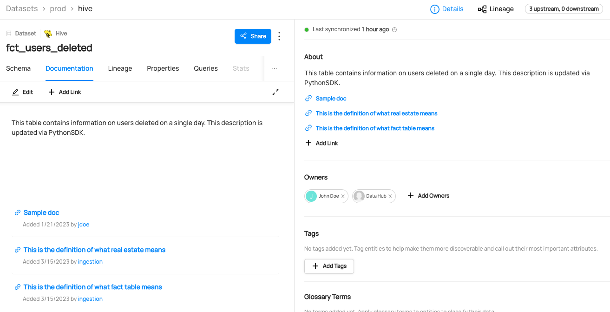

# Adding Description on Datasets

## Why Would You Add Description on Dataset? 
Adding a description and related link to a dataset can provide important information about the data, such as its source, collection methods, and potential uses. This can help others understand the context of the data and how it may be relevant to their own work or research. Including a related link can also provide access to additional resources or related datasets, further enriching the information available to users.

### Goal Of This Guide
This guide will show you how to add a description and a link to dataset `fct_users_deleted`.


## Prerequisites
For this tutorial, you need to deploy DataHub Quickstart and ingest sample data. 
For detailed steps, please refer to [Prepare Local DataHub Environment](/docs/api/tutorials/references/prepare-datahub.md).

:::note
Before adding a description, you need to ensure the targeted dataset is already present in your datahub. 
If you attempt to manipulate entities that do not exist, your operation will fail. 
In this guide, we will be using data from sample ingestion.
:::

In this example, we will add a description to `user_name `column of a dataset `fct_users_deleted`.

## Add Description With GraphQL (Not Supported)
> 🚫 Adding Description on Dataset via GraphQL is currently not supported.
> Please check out [API feature comparison table](/docs/api/datahub-apis.md#datahub-api-comparison) for more information, 


## Add Description With Python SDK
Following code add a description and link to a dataset named `fct_users_deleted`.
For more information, please refer to [dataset_add_documentation.py](https://github.com/datahub-project/datahub/blob/master/metadata-ingestion/examples/library/dataset_add_documentation.py)

```python
import logging
import time

from datahub.emitter.mce_builder import make_dataset_urn
from datahub.emitter.mcp import MetadataChangeProposalWrapper

# read-modify-write requires access to the DataHubGraph (RestEmitter is not enough)
from datahub.ingestion.graph.client import DatahubClientConfig, DataHubGraph

# Imports for metadata model classes
from datahub.metadata.schema_classes import (
    AuditStampClass,
    EditableDatasetPropertiesClass,
    InstitutionalMemoryClass,
    InstitutionalMemoryMetadataClass,
)

log = logging.getLogger(__name__)
logging.basicConfig(level=logging.INFO)


# Inputs -> owner, ownership_type, dataset
documentation_to_add = "This table contains information on users deleted on a single day. This description is updated via PythonSDK."
link_to_add = "https://en.wikipedia.org/wiki/Fact_table"
link_description = "This is the definition of what fact table means"
dataset_urn = make_dataset_urn(platform="hive", name="fct_users_deleted", env="PROD")

# Some helpful variables to fill out objects later
now = int(time.time() * 1000)  # milliseconds since epoch
current_timestamp = AuditStampClass(time=now, actor="urn:li:corpuser:ingestion")
institutional_memory_element = InstitutionalMemoryMetadataClass(
    url=link_to_add,
    description=link_description,
    createStamp=current_timestamp,
)


# First we get the current owners
gms_endpoint = "http://localhost:8080"
graph = DataHubGraph(config=DatahubClientConfig(server=gms_endpoint))

current_editable_properties = graph.get_aspect(
    entity_urn=dataset_urn, aspect_type=EditableDatasetPropertiesClass
)

need_write = False
if current_editable_properties:
    if documentation_to_add != current_editable_properties.description:
        current_editable_properties.description = documentation_to_add
        need_write = True
else:
    # create a brand new editable dataset properties aspect
    current_editable_properties = EditableDatasetPropertiesClass(
        created=current_timestamp, description=documentation_to_add
    )
    need_write = True

if need_write:
    event: MetadataChangeProposalWrapper = MetadataChangeProposalWrapper(
        entityUrn=dataset_urn,
        aspect=current_editable_properties,
    )
    graph.emit(event)
    log.info(f"Documentation added to dataset {dataset_urn}")

else:
    log.info("Documentation already exists and is identical, omitting write")


current_institutional_memory = graph.get_aspect(
    entity_urn=dataset_urn, aspect_type=InstitutionalMemoryClass
)

need_write = False

if current_institutional_memory:
    if link_to_add not in [x.url for x in current_institutional_memory.elements]:
        current_institutional_memory.elements.append(institutional_memory_element)
        need_write = True
else:
    # create a brand new institutional memory aspect
    current_institutional_memory = InstitutionalMemoryClass(
        elements=[institutional_memory_element]
    )
    need_write = True

if need_write:
    event = MetadataChangeProposalWrapper(
        entityUrn=dataset_urn,
        aspect=current_institutional_memory,
    )
    graph.emit(event)
    log.info(f"Link {link_to_add} added to dataset {dataset_urn}")

else:
    log.info(f"Link {link_to_add} already exists and is identical, omitting write")
```

We're using the `MetdataChangeProposalWrapper` to change entities in this example.
For more information about the `MetadataChangeProposal`, please refer to [MetadataChangeProposal & MetadataChangeLog Events](/docs/advanced/mcp-mcl.md)


## Expected Outcomes
You can now see the description is added to `fct_users_deleted`. 



