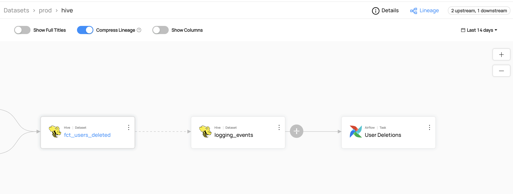

# Adding Lineage

## Why Would You Add Lineage?

Lineage is used to capture data dependencies within an organization. It allows you to track the inputs from which a data asset is derived, along with the data assets that depend on it downstream.
For more information about lineage, refer to [About DataHub Lineage](/docs/lineage/lineage-feature-guide.md).

### Goal Of This Guide

This guide will show you how to add lineage between two hive datasets named `fct_users_deleted` and `logging_events`.

## Prerequisites

For this tutorial, you need to deploy DataHub Quickstart and ingest sample data.
For detailed steps, please refer to [Datahub Quickstart Guide](/docs/quickstart.md).

:::note
Before adding lineage, you need to ensure the targeted dataset is already present in your datahub.
If you attempt to manipulate entities that do not exist, your operation will fail.
In this guide, we will be using data from sample ingestion.
:::

## Add Lineage With GraphQL

:::note
Please note that there are two available endpoints (`:8000`, `:9002`) to access `graphql`.
For more information about the differences between these endpoints, please refer to [DataHub Metadata Service](../../../metadata-service/README.md#graphql-api)
:::

### GraphQL Explorer

GraphQL Explorer is the fastest way to experiment with `graphql` without any dependencies.
Navigate to GraphQL Explorer (`http://localhost:9002/api/graphiql`) and run the following query.

```json
mutation updateLineage {
  updateLineage(
    input: {
      edgesToAdd: [
        {
          downstreamUrn: "urn:li:dataset:(urn:li:dataPlatform:hive,logging_events,PROD)"
          upstreamUrn: "urn:li:dataset:(urn:li:dataPlatform:hive,fct_users_deleted,PROD)"
        }
      ]
      edgesToRemove: []
    }
  )
}
```

Note that you can create a list of edges. For example, if you want to assign multiple upstream entities to a downstream entity, you can do the following.

```json
mutation updateLineage {
  updateLineage(
    input: {
      edgesToAdd: [
        {
          downstreamUrn: "urn:li:dataset:(urn:li:dataPlatform:hive,logging_events,PROD)"
          upstreamUrn: "urn:li:dataset:(urn:li:dataPlatform:hive,fct_users_deleted,PROD)"
        }
        {
          downstreamUrn: "urn:li:dataset:(urn:li:dataPlatform:hive,logging_events,PROD)"
          upstreamUrn: "urn:li:dataset:(urn:li:dataPlatform:hive,fct_users_created,PROD)"
        }
      ]
      edgesToRemove: []
    }
  )
}

```

For more information about the `updateLineage` mutation, please refer to [updateLineage](https://datahubproject.io/docs/graphql/mutations/#updatelineage).

If you see the following response, the operation was successful:

```python
{
  "data": {
    "updateLineage": true
  },
  "extensions": {}
}
```

### CURL

With CURL, you need to provide tokens. To generate a token, please refer to [Access Token Management](/docs/api/graphql/token-management.md).
With `accessToken`, you can run the following command.

```shell
curl --location --request POST 'http://localhost:8080/api/graphql' \
--header 'Authorization: Bearer <my-access-token>' \
--header 'Content-Type: application/json'  --data-raw '{ "query": "mutation updateLineage { updateLineage( input:{ edgesToAdd : { downstreamUrn: \"urn:li:dataset:(urn:li:dataPlatform:hive,fct_users_deleted,PROD)\", upstreamUrn : \"urn:li:dataset:(urn:li:dataPlatform:hive,logging_events,PROD)\"}, edgesToRemove :{downstreamUrn: \"urn:li:dataset:(urn:li:dataPlatform:hive,fct_users_deleted,PROD)\",upstreamUrn : \"urn:li:dataset:(urn:li:dataPlatform:hive,fct_users_deleted,PROD)\" } })}", "variables":{}}'
```

Expected Response:

```json
{ "data": { "updateLineage": true }, "extensions": {} }
```

## Add Lineage With Python SDK

You can refer to the related code in [lineage_emitter_rest.py](https://github.com/datahub-project/datahub/blob/master/metadata-ingestion/examples/library/lineage_emitter_rest.py).

```python
import datahub.emitter.mce_builder as builder
from datahub.emitter.rest_emitter import DatahubRestEmitter

# Construct a lineage object.
lineage_mce = builder.make_lineage_mce(
    [
        builder.make_dataset_urn("hive", "fct_users_deleted"), # Upstream
    ],
    builder.make_dataset_urn("hive", "logging_events"), # Downstream
)

# Create an emitter to the GMS REST API.
emitter = DatahubRestEmitter("http://localhost:8080")

# Emit metadata!
emitter.emit_mce(lineage_mce)
```

We're using the `MetdataChangeEvent` emitter to change entities in this example.
For more information about the `MetadataChangeEvent`, please refer to [Metadata Change Event (MCE)](/docs/what/mxe.md#metadata-change-event-mce)

## Expected Outcomes

You can now see the lineage between `fct_users_deleted` and `logging_events`.


