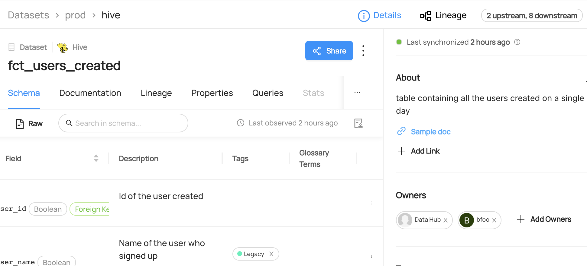

# Adding Owners On Datasets/Columns

## Why Would You Add Owners?

Assigning an owner to an entity helps to establish accountability for the metadata and collaborating as a team.
If there are any issues or questions about the data, the designated owner can serve as a reliable point of contact.

### Goal Of This Guide

This guide will show you how to add user group `bfoo` as an owner to the `fct_users_created` datatset.

## Pre-requisites

For this tutorial, you need to deploy DataHub Quickstart and ingest sample data.
For detailed information, please refer to [Datahub Quickstart Guide](/docs/quickstart.md).

:::note
Before adding owners, you need to ensure the targeted dataset and the owner are already present in your datahub.
If you attempt to manipulate entities that do not exist, your operation will fail.
In this guide, we will be using data from a sample ingestion.
:::

## Add Owners With GraphQL

:::note
Please note that there are two available endpoints (`:8000`, `:9002`) to access `graphql`.
For more information about the differences between these endpoints, please refer to [DataHub Metadata Service](../../../metadata-service/README.md#graphql-api)
:::

### GraphQL Explorer

GraphQL Explorer is the fastest way to experiment with `graphql` without any dependancies.
Navigate to GraphQL Explorer (`http://localhost:9002/api/graphiql`) and run the following query.

```python
mutation addOwners {
    addOwner(
      input: {
        ownerUrn: "urn:li:corpGroup:bfoo",
        resourceUrn: "urn:li:dataset:(urn:li:dataPlatform:hive,fct_users_created,PROD)",
        ownerEntityType: CORP_GROUP,
        type: TECHNICAL_OWNER
			}
    )
}
```

Expected Response:

```python
{
  "data": {
    "addOwner": true
  },
  "extensions": {}
}
```

### CURL

With CURL, you need to provide tokens. To generate a token, please refer to [Access Token Management](/docs/api/graphql/token-management.md).
With `accessToken`, you can run the following command.

```shell
curl --location --request POST 'http://localhost:8080/api/graphql' \
--header 'Authorization: Bearer <my-access-token>' \
--header 'Content-Type: application/json' \
--data-raw '{ "query": "mutation addOwners { addOwner(input: { ownerUrn: \"urn:li:corpGroup:bfoo\", resourceUrn: \"urn:li:dataset:(urn:li:dataPlatform:hive,fct_users_created,PROD)\", ownerEntityType: CORP_GROUP, type: TECHNICAL_OWNER }) }", "variables":{}}'
```

## Add Ownerships With Python SDK

Following codes add an owner named `bfoo` to a hive dataset named `fct_users_created`.
You can refer to a full code in [dataset_add_column_ownership.py](https://github.com/datahub-project/datahub/blob/master/metadata-ingestion/examples/library/dataset_add_owner.py).

```python
# inlined from metadata-ingestion/examples/library/dataset_add_column_ownership.py
import logging
from typing import Optional

from datahub.emitter.mce_builder import make_dataset_urn, make_user_urn
from datahub.emitter.mcp import MetadataChangeProposalWrapper

# read-modify-write requires access to the DataHubGraph (RestEmitter is not enough)
from datahub.ingestion.graph.client import DatahubClientConfig, DataHubGraph

# Imports for metadata model classes
from datahub.metadata.schema_classes import (
    OwnerClass,
    OwnershipClass,
    OwnershipTypeClass,
)

log = logging.getLogger(__name__)
logging.basicConfig(level=logging.INFO)


# Inputs -> owner, ownership_type, dataset
owner_to_add = make_user_urn("bfoo")
ownership_type = OwnershipTypeClass.TECHNICAL_OWNER
dataset_urn = make_dataset_urn(platform="hive", name="fct_users_created", env="PROD")

# Some objects to help with conditional pathways later
owner_class_to_add = OwnerClass(owner=owner_to_add, type=ownership_type)
ownership_to_add = OwnershipClass(owners=[owner_class_to_add])


# First we get the current owners
gms_endpoint = "http://localhost:8080"
graph = DataHubGraph(DatahubClientConfig(server=gms_endpoint))


current_owners: Optional[OwnershipClass] = graph.get_aspect(
    entity_urn=dataset_urn, aspect_type=OwnershipClass
)


need_write = False
if current_owners:
    if (owner_to_add, ownership_type) not in [
        (x.owner, x.type) for x in current_owners.owners
    ]:
        # owners exist, but this owner is not present in the current owners
        current_owners.owners.append(owner_class_to_add)
        need_write = True
else:
    # create a brand new ownership aspect
    current_owners = ownership_to_add
    need_write = True

if need_write:
    event: MetadataChangeProposalWrapper = MetadataChangeProposalWrapper(
        entityUrn=dataset_urn,
        aspect=current_owners,
    )
    graph.emit(event)
    log.info(
        f"Owner {owner_to_add}, type {ownership_type} added to dataset {dataset_urn}"
    )

else:
    log.info(f"Owner {owner_to_add} already exists, omitting write")
```

We're using the `MetdataChangeProposalWrapper` to change entities in this example.
For more information about the `MetadataChangeProposal`, please refer to [MetadataChangeProposal & MetadataChangeLog Events](/docs/advanced/mcp-mcl.md)

Expected Response:

```json
{ "data": { "addOwner": true }, "extensions": {} }
```

## Expected Outcomes

You can now see `bfoo` has been added as an owner to the `fct_users_created` dataset.


