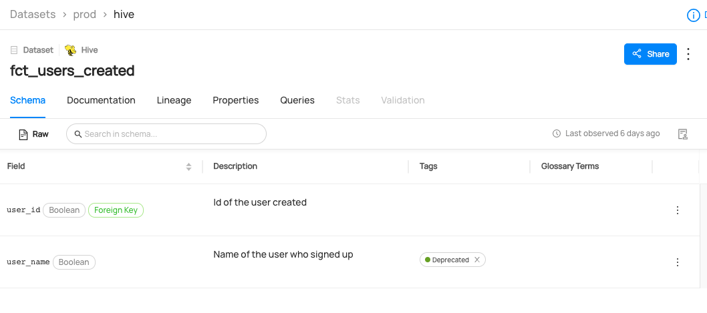

# Adding Tags On Datasets/Columns

## Why Would You Add Tags? 
Tags are informal, loosely controlled labels that help in search & discovery. They can be added to datasets, dataset schemas, or containers, for an easy way to label or categorize entities – without having to associate them to a broader business glossary or vocabulary.

Fore more information about tags, refer to [About DataHub Tags](/docs/tags.md).

### Goal Of This Guide
This guide will show you how to add a `CustomerAccount` tag to the `user_name` column of a dataset called `fct_users_created`.
Additionally, we will cover how to add a tag to the dataset itself.

## Prerequisites
For this tutorial, you need to deploy DataHub Quickstart and ingest sample data. 
For detailed steps, please refer to [Prepare Local DataHub Environment](/docs/api/tutorials/references/prepare-datahub.md).

:::note
Before adding tags, you need to ensure the targeted dataset and the tag are already present in your datahub. 
If you attempt to manipulate entities that do not exist, your operation will fail. 
In this guide, we will be using data from a sample ingestion. 
If you want to know how to create tags using APIs & SDKs, please refer to [Creating Tags](/docs/api/tutorials/creating-tags.md) and [Creating Datasets](/docs/api/tutorials/creating-datasets.md).
.
:::


## Add Tags With GraphQL

:::note
Please note that there are two available endpoints (`:8000`, `:9002`) to access GraphQL.
For more information about the differences between these endpoints, please refer to [DataHub Metadata Service](../../../metadata-service/README.md#graphql-api)
:::
### GraphQL Explorer
GraphQL Explorer is the fastest way to experiment with GraphQL without any dependancies. 
Navigate to GraphQL Explorer (`http://localhost:9002/api/graphiql`) and run the following query.

```json
mutation addTags {
    addTags(
      input: { 
        tagUrns: ["urn:li:tag:Legacy"], 
        resourceUrn: "urn:li:dataset:(urn:li:dataPlatform:hive,fct_users_created,PROD)",
        subResourceType:DATASET_FIELD,
        subResource:"user_name"})
}
```

Note that you can also add a tag on a dataset if you don't specify `subResourceType` and `subResource`. 
```json
mutation addTags {
    addTags(
      input: { 
        tagUrns: ["urn:li:tag:Legacy"], 
        resourceUrn: "urn:li:dataset:(urn:li:dataPlatform:hive,fct_users_created,PROD)",
      }
    )
}
```


If you see the following response, the operation was successful:
```python
{
  "data": {
    "addTags": true
  },
  "extensions": {}
}
```


### CURL

With CURL, you need to provide tokens. To generate a token, please refer to [Generate Access Token](/docs/api/tutorials/references/generate-access-token.md). 
With `accessToken`, you can run the following command.

```shell
curl --location --request POST 'http://localhost:8080/api/graphql' \
--header 'Authorization: Bearer <my-access-token>' \
--header 'Content-Type: application/json' \
--data-raw '{ "query": "mutation addTags { addTags(input: { tagUrns: [\"urn:li:tag:Legacy\"], resourceUrn: \"urn:li:dataset:(urn:li:dataPlatform:hive,fct_users_created,PROD)\" }) }", "variables":{}}'
```
Expected Response:
```json
{"data":{"addTags":true},"extensions":{}}
```


## Add Tags With Python SDK

The following code adds a tag named `Legacy` to the column `user_name` of the hive dataset `fct_users_created`.
You can refer to the full code in [dataset_add_column_tag.py](https://github.com/datahub-project/datahub/blob/master/metadata-ingestion/examples/library/dataset_add_column_tag.py).
```python
# inlined from metadata-ingestion/examples/library/dataset_add_column_tag.py
import logging
import time

from datahub.emitter.mce_builder import make_dataset_urn, make_tag_urn
from datahub.emitter.mcp import MetadataChangeProposalWrapper

# read-modify-write requires access to the DataHubGraph (RestEmitter is not enough)
from datahub.ingestion.graph.client import DatahubClientConfig, DataHubGraph

# Imports for metadata model classes
from datahub.metadata.schema_classes import (
    AuditStampClass,
    EditableSchemaFieldInfoClass,
    EditableSchemaMetadataClass,
    GlobalTagsClass,
    TagAssociationClass,
)

log = logging.getLogger(__name__)
logging.basicConfig(level=logging.INFO)


def get_simple_field_path_from_v2_field_path(field_path: str) -> str:
    """A helper function to extract simple . path notation from the v2 field path"""
    if not field_path.startswith("[version=2.0]"):
        # not a v2, we assume this is a simple path
        return field_path
        # this is a v2 field path
    tokens = [
        t for t in field_path.split(".") if not (t.startswith("[") or t.endswith("]"))
    ]

    return ".".join(tokens)


# Inputs -> the column, dataset and the tag to set
column = "user_name"
dataset_urn = make_dataset_urn(platform="hive", name="fct_users_created", env="PROD")
tag_to_add = make_tag_urn("Legacy")


# First we get the current editable schema metadata
gms_endpoint = "http://localhost:8080"
graph = DataHubGraph(DatahubClientConfig(server=gms_endpoint))


current_editable_schema_metadata = graph.get_aspect(
    entity_urn=dataset_urn,
    aspect_type=EditableSchemaMetadataClass,
)


# Some pre-built objects to help all the conditional pathways
tag_association_to_add = TagAssociationClass(tag=tag_to_add)
tags_aspect_to_set = GlobalTagsClass(tags=[tag_association_to_add])
field_info_to_set = EditableSchemaFieldInfoClass(
    fieldPath=column, globalTags=tags_aspect_to_set
)


need_write = False
field_match = False
if current_editable_schema_metadata:
    for fieldInfo in current_editable_schema_metadata.editableSchemaFieldInfo:
        if get_simple_field_path_from_v2_field_path(fieldInfo.fieldPath) == column:
            # we have some editable schema metadata for this field
            field_match = True
            if fieldInfo.globalTags:
                if tag_to_add not in [x.tag for x in fieldInfo.globalTags.tags]:
                    # this tag is not present
                    fieldInfo.globalTags.tags.append(tag_association_to_add)
                    need_write = True
            else:
                fieldInfo.globalTags = tags_aspect_to_set
                need_write = True

    if not field_match:
        # this field isn't present in the editable schema metadata aspect, add it
        field_info = field_info_to_set
        current_editable_schema_metadata.editableSchemaFieldInfo.append(field_info)
        need_write = True

else:
    # create a brand new editable schema metadata aspect
    now = int(time.time() * 1000)  # milliseconds since epoch
    current_timestamp = AuditStampClass(time=now, actor="urn:li:corpuser:ingestion")
    current_editable_schema_metadata = EditableSchemaMetadataClass(
        editableSchemaFieldInfo=[field_info_to_set],
        created=current_timestamp,
    )
    need_write = True

if need_write:
    event: MetadataChangeProposalWrapper = MetadataChangeProposalWrapper(
        entityUrn=dataset_urn,
        aspect=current_editable_schema_metadata,
    )
    graph.emit(event)
    log.info(f"Tag {tag_to_add} added to column {column} of dataset {dataset_urn}")

else:
    log.info(f"Tag {tag_to_add} already attached to column {column}, omitting write")
```

We're using the `MetdataChangeProposalWrapper` to change entities in this example.
For more information about the `MetadataChangeProposal`, please refer to [MetadataChangeProposal & MetadataChangeLog Events](/docs/advanced/mcp-mcl.md)


## Expected Outcomes
You can now see `CustomerAccount` tag has been added to `user_name` column. 



