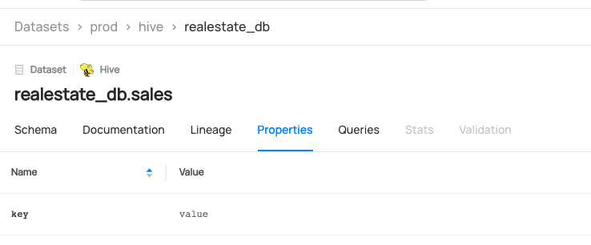

# Creating Datasets

## Why Would You Create Datasets?

The dataset entity is one the most important entities in the metadata model. They represent collections of data that are typically represented as Tables or Views in a database (e.g. BigQuery, Snowflake, Redshift etc.), Streams in a stream-processing environment (Kafka, Pulsar etc.), bundles of data found as Files or Folders in data lake systems (S3, ADLS, etc.).
For more information about datasets, refer to [Dataset](/docs/generated/metamodel/entities/dataset.md).

### Goal Of This Guide

This guide will show you how to create a dataset named `realestate_db.sales` with three columns.

## Prerequisites

For this tutorial, you need to deploy DataHub Quickstart and ingest sample data.
For detailed steps, please refer to [Datahub Quickstart Guide](/docs/quickstart.md).

## Create Datasets With GraphQL (Not Supported)

> 🚫 Creating a dataset via `graphql` is currently not supported.
> Please check out [API feature comparison table](/docs/api/datahub-apis.md#datahub-api-comparison) for more information,

## Create Datasets With Python SDK

The following code creates a Hive dataset named realestate_db.sales with three fields and a URN of urn:li:dataset:(urn:li:dataPlatform:hive,realestate_db.sales,PROD):

```python
{{ inline /metadata-ingestion/examples/library/dataset_schema.py show_path_as_comment }}
```

Note that the `name` property of `make_dataset_urn` sets the display name of the dataset.

After creating the dataset, you can perform various manipulations, such as adding lineage and custom properties. 
Here are some steps to start with, but for more detailed guidance, please refer to the [What's Next](/docs/api/tutorials/creating-datasets.md#whats-next) section.

### Add Lineage
The following code creates a lineage from `fct_users_deleted` to `realestate_db.sales`:

```python
import datahub.emitter.mce_builder as builder
from datahub.emitter.rest_emitter import DatahubRestEmitter

# Construct a lineage object.
lineage_mce = builder.make_lineage_mce(
    [
        builder.make_dataset_urn("hive", "fct_users_deleted"), # Upstream
    ],
    builder.make_dataset_urn("hive", "realestate_db.sales"), # Downstream
)

# Create an emitter to the GMS REST API.
emitter = DatahubRestEmitter("http://localhost:8080")

# Emit metadata!
emitter.emit_mce(lineage_mce)
```
For more information on adding lineages, please refer to [how to add lineage on a dataset using PythonSDK](/docs/api/tutorials/adding-lineage.md#add-lineage-with-python-sdk).

### Add custom properties
You can also set custom properties using the following code:

```python
{{ inline /metadata-ingestion/examples/library/dataset_add_custom_properties.py show_path_as_comment }}
```

Note that this code checks the existing custom properties of the target dataset and updates them. 
If you want to overwrite the current ones, you can simply comment out this part:

```python
if graph.get_aspect(entity_urn=dataset_urn, aspect_type=DatasetPropertiesClass):
    existing_custom_properties = graph.get_aspect(entity_urn=dataset_urn, aspect_type=DatasetPropertiesClass).customProperties
    custom_properties_to_add.update(existing_custom_properties)
```

This will create custom properties like the ones shown below as an outcome.



We're using the `MetdataChangeProposalWrapper` to change entities in this example.
For more information about the `MetadataChangeProposal`, please refer to [MetadataChangeProposal & MetadataChangeLog Events](/docs/advanced/mcp-mcl.md).

## Expected Outcomes

You can now see `realestate_db.sales` dataset has been created.


## What's Next?

Now that you created a dataset, how about enriching it? Here are some guides that you can check out.

- [how to add a tag on a dataset](/docs/api/tutorials/adding-tags.md).
- [how to add a term on a dataset](/docs/api/tutorials/adding-terms.md).
- [how to add owner on a dataset](/docs/api/tutorials/adding-ownerships.md).
- [how to add lineage on a dataset](/docs/api/tutorials/adding-lineage.md).
