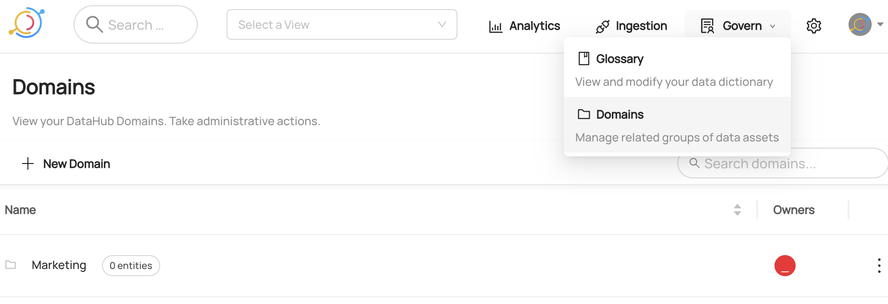

# Creating Domains

## Why Would You Create Domains?

Domains are curated, top-level folders or categories where related assets can be explicitly grouped. Management of Domains can be centralized, or distributed out to Domain owners Currently, an asset can belong to only one Domain at a time.
For more information about domains, refer to [About DataHub Domains](/docs/domains.md).

### Goal Of This Guide

This guide will show you how to create a domain named `Marketing`.

## Prerequisites

For this tutorial, you need to deploy DataHub Quickstart and ingest sample data.
For detailed steps, please refer to [Datahub Quickstart Guide](/docs/quickstart.md).

## Create Domain with GrpahQL

::note
Please note that there are two available endpoints (`:8000`, `:9002`) to access GraphQL.
For more information about the differences between these endpoints, please refer to [DataHub Metadata Service](../../../metadata-service/README.md#graphql-api)
:::

### GraphQL Explorer

GraphQL Explorer is the fastest way to experiment with GraphQL without any dependencies.
Navigate to GraphQL Explorer (`http://localhost:9002/api/graphiql`) and run the following query.

```json
mutation createDomain {
  createDomain(input: { name: "Marketing", description: "Entities related to the marketing department" })
}
```

If you see the following response, the operation was successful:

```json
{
  "data": {
    "createDomain": "<domain_urn>"
  },
  "extensions": {}
}
```

### CURL

With CURL, you need to provide tokens. To generate a token, please refer to [Access Token Management](/docs/api/graphql/token-management.md).
With `accessToken`, you can run the following command.

```shell
curl --location --request POST 'http://localhost:8080/api/graphql' \
--header 'Authorization: Bearer <my-access-token>' \
--header 'Content-Type: application/json' \
--data-raw '{ "query": "mutation createDomain { createDomain(input: { name: \"Marketing\", description: \"Entities related to the marketing department.\" }) }", "variables":{}}'
```

Expected Response:

```json
{ "data": { "createDomain": "<domain_urn>" }, "extensions": {} }
```

## Create a Domain With Python SDK

The following code creates a domain named `Marketing`.

```python
{{ inline /metadata-ingestion/examples/library/create_domain.py show_path_as_comment }}
```

We're using the `MetdataChangeProposalWrapper` to change entities in this example.
For more information about the `MetadataChangeProposal`, please refer to [MetadataChangeProposal & MetadataChangeLog Events](/docs/advanced/mcp-mcl.md)

## Expected Outcomes

You can now see `Marketing` domain has been created under `Govern > Domains`.



## What's Next?

Now that you created a domain, how about enriching it? Here is a guide that you can check out.

- [how to add a dataset to a domain](/docs/api/tutorials/adding-domain.md).
