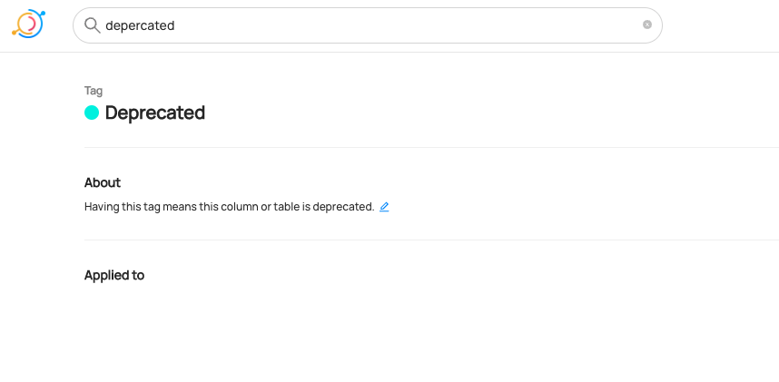

# Creating Tags

## Why Would You Create Tags? 
Tags are informal, loosely controlled labels that help in search & discovery. They can be added to datasets, dataset schemas, or containers, for an easy way to label or categorize entities – without having to associate them to a broader business glossary or vocabulary.

Fore more information about tags, refer to [About DataHub Tags](/docs/tags.md).

### Goal Of This Guide
This guide will show you how to create a tag named `Deprecated`.

## Prerequisites
For this tutorial, you need to deploy DataHub Quickstart and ingest sample data. 
For detailed steps, please refer to [Prepare Local DataHub Environment](/docs/api/tutorials/references/prepare-datahub.md).

## Create Tags With GraphQL

:::note
Please note that there are two available endpoints (`:8000`, `:9002`) to access GraphQL.
For more information about the differences between these endpoints, please refer to [DataHub Metadata Service](../../../metadata-service/README.md#graphql-api)
:::

### GraphQL Explorer
GraphQL Explorer is the fastest way to experiment with GraphQL without any dependancies. 
Navigate to GraphQL Explorer (`http://localhost:9002/api/graphiql`) and run the following query.

```python
mutation createTag {
    createTag(input:
    {
      name: "Deprecated",
      description: "Having this tag means this column or table is deprecated."
    })
}
```
If you see the following response, the operation was successful:
```python
{
  "data": {
    "createTag": "<tag_urn>"
  },
  "extensions": {}
}
```

### CURL

With CURL, you need to provide tokens. To generate a token, please refer to [Generate Access Token](/docs/api/tutorials/references/generate-access-token.md). 
With `accessToken`, you can run the following command.

```shell
curl --location --request POST 'http://localhost:8080/api/graphql' \
--header 'Authorization: Bearer <my-access-token>' \
--header 'Content-Type: application/json' \
--data-raw '{ "query": "mutation createTag { createTag(input: { name: \"Deprecated\", description: \"Having this tag means this column or table is deprecated.\" }) }", "variables":{}}'
```
Expected Response:
```json
{"data":{"createTag":"<tag_urn>"},"extensions":{}}
```


## Create Tags With Python SDK

The following code creates a tag named `Deprecated`.
You can refer to the full code in [create_tag.py](https://github.com/datahub-project/datahub/blob/master/metadata-ingestion/examples/library/create_tag.py).
```python
import logging

from datahub.emitter.mce_builder import make_tag_urn
from datahub.emitter.mcp import MetadataChangeProposalWrapper
from datahub.emitter.rest_emitter import DatahubRestEmitter

# Imports for metadata model classes
from datahub.metadata.schema_classes import TagPropertiesClass

log = logging.getLogger(__name__)
logging.basicConfig(level=logging.INFO)

tag_urn = make_tag_urn("deprecated")
tag_properties_aspect = TagPropertiesClass(
    name="Deprecated",
    description="Having this tag means this column or table is deprecated.",
)

event: MetadataChangeProposalWrapper = MetadataChangeProposalWrapper(
    entityUrn=tag_urn,
    aspect=tag_properties_aspect,
)

# Create rest emitter
rest_emitter = DatahubRestEmitter(gms_server="http://localhost:8080")
rest_emitter.emit(event)
log.info(f"Created tag {tag_urn}")
```

We're using the `MetdataChangeProposalWrapper` to change entities in this example.
For more information about the `MetadataChangeProposal`, please refer to [MetadataChangeProposal & MetadataChangeLog Events](/docs/advanced/mcp-mcl.md)


## Expected Outcomes
You can now see `Deprecated` tag has been created.



## What's Next?

Now that you created a tag, how about adding it to a dataset? Here's a guide on [how to add a tag on a dataset](/docs/api/tutorials/adding-tags.md). 


