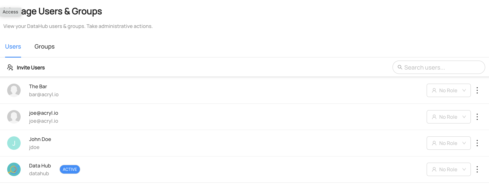

# Creating or Updating Users And Groups

## Why Would You Create or Update Users and Groups?

Users and groups are essential for managing ownership of data.
By creating or updating user accounts and assigning them to appropriate groups, administrators can ensure that the right people can access the data they need to do their jobs.
This helps to avoid confusion or conflicts over who is responsible for specific datasets and can improve the overall effectiveness.

### Goal Of This Guide

This guide will show you how to create or update users and groups.

## Pre-requisites

For this tutorial, you need to deploy DataHub Quickstart and ingest sample data.
For detailed information, please refer to [Datahub Quickstart Guide](/docs/quickstart.md).

:::note
In this guide, ingesting sample data is optional.
:::

## Upsert Users And Groups With Datahub CLI

You can ingest users and groups with `yaml` using Datahub CLI.

### Upsert User

Save this `user.yaml` as a local file.

```yaml
- id: bar@acryl.io
  first_name: The
  last_name: Bar
  email: bar@acryl.io
  slack: "@the_bar_raiser"
  description: "I like raising the bar higher"
  groups:
    - foogroup@acryl.io
- id: datahub
  slack: "@datahubproject"
  phone: "1-800-GOT-META"
  description: "The DataHub Project"
  picture_link: "https://raw.githubusercontent.com/datahub-project/datahub/master/datahub-web-react/src/images/datahub-logo-color-stable.svg"
```

Execute the following CLI command to ingest user data.
Since the user datahub already exists in the sample data, any updates made to the user information will overwrite the existing data.

```
datahub user upsert -f user.yaml
```

If you see the following logs, the operation was successful:

```shell
Update succeeded for urn urn:li:corpuser:bar@acryl.io.
Update succeeded for urn urn:li:corpuser:datahub.
```

### Upsert Group

Save this `group.yaml` as a local file. Note that the group includes a list of users who are owners and members.
Within these lists, you can refer to the users by their ids or their urns, and can additionally specify their metadata inline within the group description itself. See the example below to understand how this works and feel free to make modifications to this file locally to see the effects of your changes in your local DataHub instance.

```yaml
id: foogroup@acryl.io
display_name: Foo Group
owners:
  - datahub
members:
  - bar@acryl.io # refer to a user either by id or by urn
  - id: joe@acryl.io # inline specification of user
    slack: "@joe_shmoe"
    display_name: "Joe's Hub"
```

Execute the following CLI command to ingest this group's information.

```
datahub group upsert -f group.yaml
```

If you see the following logs, the operation was successful:

```shell
Update succeeded for group urn:li:corpGroup:foogroup@acryl.io.
```

## Upsert Users And Groups With Python SDK

### Upsert User

The following code creates a user named `The Bar` with urn `urn:li:corpuser:bar@acryl.io`.
You can refer to the full code in [upsert_user.py](https://github.com/datahub-project/datahub/blob/master/metadata-ingestion/examples/library/upsert_user.py).

```python
{{ inline /metadata-ingestion/examples/library/upsert_user.py show_path_as_comment }}
```

### Upsert Group

The following code creates a group called `Foo Group` with group `urn:li:corpgroup:foogroup@acryl.io`.
You can refer to the full code in [upsert_group.py](https://github.com/datahub-project/datahub/blob/master/metadata-ingestion/examples/library/upsert_group.py).

```python
{{ inline /metadata-ingestion/examples/library/upsert_group.py show_path_as_comment }}
```

We're using the `MetdataChangeProposalWrapper` to change entities in this example.
For more information about the `MetadataChangeProposal`, please refer to [MetadataChangeProposal & MetadataChangeLog Events](/docs/advanced/mcp-mcl.md)

## Expected Outcomes

### User

You can see the user `The bar` has been created and the user `Datahub` has been updated under `Settings > Access > Users & Groups`


### Group

You can see the group `Foo Group` has been created under `Settings > Access > Users & Groups`


## What's Next?

Now that you created users and groups, how about adding them as an owner to a dataset? Here's a guide on [how to add an owner on a dataset](/docs/api/tutorials/adding-ownerships.md).
