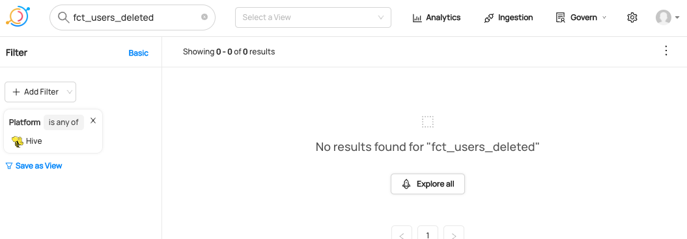

# Deleting Entities By Urn

## Why Would You Delete Entities? 
You may want to delete a dataset if it is no longer needed, contains incorrect or sensitive information, or if it was created for testing purposes and is no longer necessary in production.
It is possible to [delete entities via CLI](/docs/how/delete-metadata.md), but a programmatic approach is necessary for scalability.

There are two methods of deletion: soft delete and hard delete.
**Soft delete** sets the Status aspect of the entity to Removed, which hides the entity and all its aspects from being returned by the UI. 
**Hard delete** physically deletes all rows for all aspects of the entity.

For more information about soft delete and hard delete, please refer to [Removing Metadata from DataHub](/docs/how/delete-metadata.md#delete-by-urn).

### Goal Of This Guide
This guide will show you how to delete a dataset named `fct_user_deleted`.
However, you can delete other entities like tags, terms, and owners with the same approach. 

## Prerequisites
For this tutorial, you need to deploy DataHub Quickstart and ingest sample data. 
For detailed steps, please refer to [Prepare Local DataHub Environment](/docs/api/tutorials/references/prepare-datahub.md).

## Delete Datasets With GraphQL

> 🚫 Hard delete with GraphQL is currently not supported. 
> Please check out [API feature comparison table](/docs/api/datahub-apis.md#datahub-api-comparison) for more information.


### GraphQL Explorer
GraphQL Explorer is the fastest way to experiment with GraphQL without any dependancies. 
Navigate to GraphQL Explorer (`http://localhost:9002/api/graphiql`) and run the following query.

```json
mutation batchUpdateSoftDeleted {
    batchUpdateSoftDeleted(input: 
      { urns: ["urn:li:dataset:(urn:li:dataPlatform:hive,fct_users_deleted,PROD)"], 
        deleted: true })
}
```
If you see the following response, the operation was successful:
```json
{
  "data": {
    "batchUpdateSoftDeleted": true
  },
  "extensions": {}
}
```

### CURL

With CURL, you need to provide tokens. To generate a token, please refer to [Generate Access Token](/docs/api/tutorials/references/generate-access-token.md). 
With `accessToken`, you can run the following command.

```shell
curl --location --request POST 'http://localhost:8080/api/graphql' \
--header 'Authorization: Bearer <my-access-token>' \
--header 'Content-Type: application/json' \
--data-raw '{ "query": "mutation batchUpdateSoftDeleted { batchUpdateSoftDeleted(input: { deleted: true, urns: [\"urn:li:dataset:(urn:li:dataPlatform:hive,fct_users_deleted,PROD)\"] }) }", "variables":{}}'
```

Expected Response:
```json
{"data":{"batchUpdateSoftDeleted":true},"extensions":{}}
```

## Delete Datasets With Python SDK

The following code deletes a hive dataset named `fct_users_deleted`.
You can refer to the complete code in [delete_dataset.py](https://github.com/datahub-project/datahub/blob/master/metadata-ingestion/examples/library/delete_dataset.py).

```python
import logging
from datahub.cli import delete_cli
from datahub.emitter.rest_emitter import DatahubRestEmitter
from datahub.emitter.mce_builder import make_dataset_urn

log = logging.getLogger(__name__)
logging.basicConfig(level=logging.INFO)

rest_emitter = DatahubRestEmitter(gms_server="http://localhost:8080")
dataset_urn = make_dataset_urn(name="fct_users_created", platform="hive")

delete_cli._delete_one_urn(urn=dataset_urn, soft=true, cached_emitter=rest_emitter)

log.info(f"Deleted dataset {dataset_urn}")
```

We're using the `MetdataChangeProposalWrapper` to change entities in this example.
For more information about the `MetadataChangeProposal`, please refer to [MetadataChangeProposal & MetadataChangeLog Events](/docs/advanced/mcp-mcl.md)


## Expected Outcomes
The dataset `fct_users_deleted` has now been deleted, so if you search for a hive dataset named `fct_users_delete`, you will no longer be able to see it.




