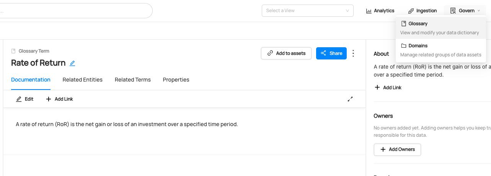
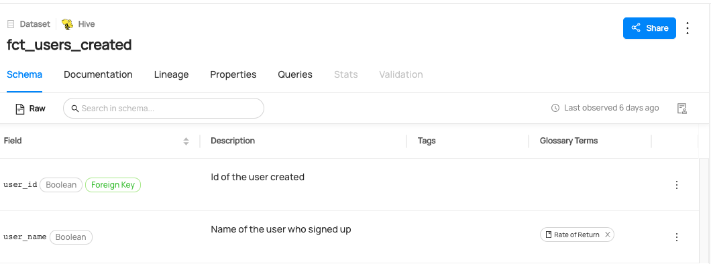
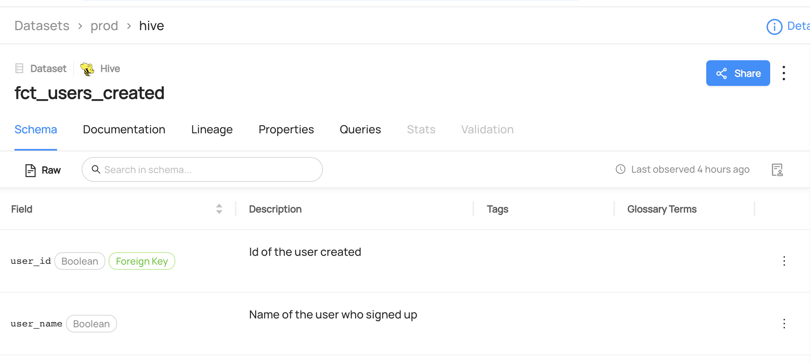

import Tabs from '@theme/Tabs';
import TabItem from '@theme/TabItem';

# Modifying Terms on Datasets

## Why Would You Use Terms on Datasets?

The Business Glossary(Term) feature in DataHub helps you use a shared vocabulary within the orgarnization, by providing a framework for defining a standardized set of data concepts and then associating them with the physical assets that exist within your data ecosystem.

For more information about terms, refer to [About DataHub Business Glossary](/docs/glossary/business-glossary.md).

### Goal Of This Guide

This guide will show you how to 
- Create: create a term named `Rate of Return`.
- Read : read terms attached to a dataset `SampleHiveDataset`.
- Add: add a `CustomerAccount` term to `user_name` column of a dataset named `fct_users_created`.
- Remove: remove a term `CustomerAccount` from the `user_name` column of a dataset called `fct_users_created`.

## Prerequisites

For this tutorial, you need to deploy DataHub Quickstart and ingest sample data.
For detailed information, please refer to [Datahub Quickstart Guide](/docs/quickstart.md).

:::note
Before modifying terms, you need to ensure the target dataset is already present in your DataHub instance.
If you attempt to manipulate entities that do not exist, your operation will fail.
In this guide, we will be using data from sample ingestion.
:::

For more information on how to set up for GraphQL, please refer to [How To Set Up GraphQL](/docs/api/graphql/how-to-set-up-graphql.md).

## Create Terms

The following code creates a term `Rate of Return`.

<Tabs>
<TabItem value="graphql" label="GraphQL" default>

```json
mutation createGlossaryTerm {
  createGlossaryTerm(input: {
    name: "Rate of Return",
    id: "rateofreturn",
    description: "A rate of return (RoR) is the net gain or loss of an investment over a specified time period."
  },
  )
}
```

If you see the following response, the operation was successful:

```python
{
  "data": {
    "createGlossaryTerm": "urn:li:glossaryTerm:rateofreturn"
  },
  "extensions": {}
}
```

</TabItem>

<TabItem value="curl" label="Curl">

```shell
curl --location --request POST 'http://localhost:8080/api/graphql' \
--header 'Authorization: Bearer <my-access-token>' \
--header 'Content-Type: application/json' \
--data-raw '{ "query": "mutation createGlossaryTerm { createGlossaryTerm(input: { name: \"Rate of Return\", id:\"rateofreturn\", description: \"A rate of return (RoR) is the net gain or loss of an investment over a specified time period.\" }) }", "variables":{}}'
```

Expected Response:

```json
{
  "data": { "createGlossaryTerm": "urn:li:glossaryTerm:rateofreturn" },
  "extensions": {}
}
```

</TabItem>

<TabItem value="python" label="Python">

```python
{{ inline /metadata-ingestion/examples/library/create_term.py show_path_as_comment }}
```

</TabItem>
</Tabs>

### Expected Outcome of Creating Terms

You can now see the new term `Rate of Return` has been created.



We can also verify this operation by programmatically searching `Rate of Return` term after running this code using the `datahub` cli.

```shell
datahub get --urn "urn:li:glossaryTerm:rateofreturn" --aspect glossaryTermInfo

{
  "glossaryTermInfo": {
    "definition": "A rate of return (RoR) is the net gain or loss of an investment over a specified time period.",
    "name": "Rate of Return",
    "termSource": "INTERNAL"
  }
}
```

## Read Terms 

<Tabs>
<TabItem value="graphql" label="GraphQL" default>

```json
query {
  dataset(urn: "urn:li:dataset:(urn:li:dataPlatform:hive,fct_users_created,PROD)") {
    glossaryTerms {
      terms {
        term {
          urn
          glossaryTermInfo {
            name
            description
          }
        }
      }
    }
  }
}
```

If you see the following response, the operation was successful:

```python
{
  "data": {
    "dataset": {
      "glossaryTerms": {
        "terms": [
          {
            "term": {
              "urn": "urn:li:glossaryTerm:CustomerAccount",
              "glossaryTermInfo": {
                "name": "CustomerAccount",
                "description": "account that represents an identified, named collection of balances and cumulative totals used to summarize customer transaction-related activity over a designated period of time"
              }
            }
          }
        ]
      }
    }
  },
  "extensions": {}
}
```

</TabItem>
<TabItem value="curl" label="Curl">


```shell
curl --location --request POST 'http://localhost:8080/api/graphql' \
--header 'Authorization: Bearer <my-access-token>' \
--header 'Content-Type: application/json' \
--data-raw '{ "query": "{dataset(urn: \"urn:li:dataset:(urn:li:dataPlatform:hive,fct_users_created,PROD)\") {glossaryTerms {terms {term {urn glossaryTermInfo { name description } } } } } }", "variables":{}}'
```

Expected Response:

````json
{"data":{"dataset":{"glossaryTerms":{"terms":[{"term":{"urn":"urn:li:glossaryTerm:CustomerAccount","glossaryTermInfo":{"name":"CustomerAccount","description":"account that represents an identified, named collection of balances and cumulative totals used to summarize customer transaction-related activity over a designated period of time"}}}]}}},"extensions":{}}```
````

</TabItem>
<TabItem value="python" label="Python">

> Coming Soon!

</TabItem>
</Tabs>


## Add Terms

The following code shows you how can add terms to a dataset.
In the following code, we add a term `Legacy` to a dataset named `fct_users_created`.

<Tabs>
<TabItem value="graphql" label="GraphQL" default>

```python
mutation addTerms {
    addTerms(
      input: {
        termUrns: ["urn:li:glossaryTerm:rateofreturn"],
        resourceUrn: "urn:li:dataset:(urn:li:dataPlatform:hive,fct_users_created,PROD)",
        subResourceType:DATASET_FIELD,
        subResource:"user_name"})
}
```

Note that you can also add a term on a dataset if you don't specify `subResourceType` and `subResource`.

```json
mutation addTerms {
    addTerms(
      input: {
        termUrns: ["urn:li:glossaryTerm:rateofreturn"],
        resourceUrn: "urn:li:dataset:(urn:li:dataPlatform:hive,fct_users_created,PROD)",
      }
  )
}
```

If you see the following response, the operation was successful:

```python
{
  "data": {
    "addTerms": true
  },
  "extensions": {}
}
```

</TabItem>
<TabItem value="curl" label="Curl">

```shell
curl --location --request POST 'http://localhost:8080/api/graphql' \
--header 'Authorization: Bearer <my-access-token>' \
--header 'Content-Type: application/json' \
--data-raw '{ "query": "mutation addTerm { addTerms(input: { termUrns: [\"urn:li:glossaryTerm:rateofreturn\"], resourceUrn: \"urn:li:dataset:(urn:li:dataPlatform:hive,fct_users_created,PROD)\" }) }", "variables":{}}'
```

Expected Response:

```json
{ "data": { "addTerms": true }, "extensions": {} }
```

</TabItem>
<TabItem value="python" label="Python">

```python
{{ inline /metadata-ingestion/examples/library/dataset_add_term.py show_path_as_comment }}
```

</TabItem>
</Tabs>

### Expected Outcome of Adding Terms

You can now see `Legacy` term has been added to `user_name` column.



## Remove Terms

The following code remove a term from a dataset.
After running this code, `Legacy` term will be removed from a `user_name` column.

<Tabs>
<TabItem value="graphql" label="GraphQL" default>

```json
mutation removeTerm {
    removeTerm(
      input: {
        termUrn: "urn:li:glossaryTerm:rateofreturn",
        resourceUrn: "urn:li:dataset:(urn:li:dataPlatform:hive,fct_users_created,PROD)",
        subResourceType:DATASET_FIELD,
        subResource:"user_name"})
}
```

Note that you can also remove a term from a dataset if you don't specify `subResourceType` and `subResource`.

```json
mutation removeTerm {
    removeTerm(
      input: {
        termUrn: "urn:li:glossaryTerm:rateofreturn",
        resourceUrn: "urn:li:dataset:(urn:li:dataPlatform:hive,fct_users_created,PROD)",
      })
}
```

Also note that you can remove terms from multiple entities or subresource using `batchRemoveTerms`.

```json
mutation batchRemoveTerms {
    batchRemoveTerms(
      input: {
        termUrns: ["urn:li:glossaryTerm:rateofreturn"],
        resources: [
          { resourceUrn:"urn:li:dataset:(urn:li:dataPlatform:hdfs,SampleHdfsDataset,PROD)"} ,
          { resourceUrn:"urn:li:dataset:(urn:li:dataPlatform:hive,fct_users_created,PROD)"} ,]
      }
    )
}
```

</TabItem>
<TabItem value="curl" label="Curl">

```shell
curl --location --request POST 'http://localhost:8080/api/graphql' \
--header 'Authorization: Bearer <my-access-token>' \
--header 'Content-Type: application/json' \
--data-raw '{ "query": "mutation removeTerm { removeTerm(input: { termUrn: \"urn:li:glossaryTerm:rateofreturn\", resourceUrn: \"urn:li:dataset:(urn:li:dataPlatform:hdfs,SampleHdfsDataset,PROD)\" }) }", "variables":{}}'
```

</TabItem>
<TabItem value="python" label="Python">

> Coming Soon!

</TabItem>
</Tabs>

### Expected Outcome of Removing Terms

You can now see `Rate of Return` term has been removed to `user_name` column.


