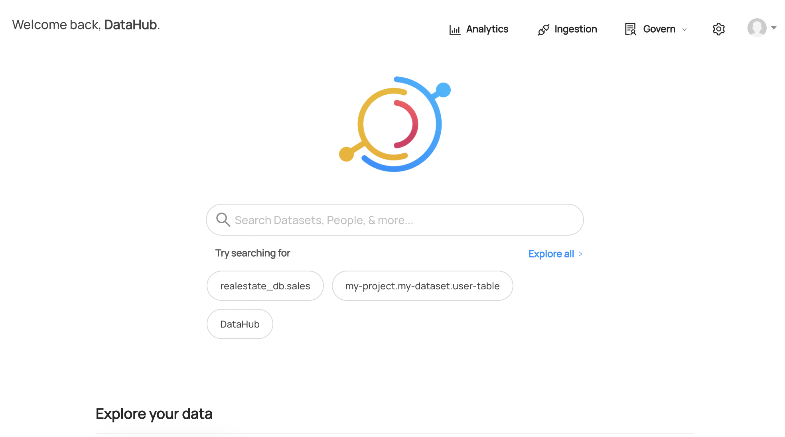

# Preparing Your Local DataHub Environment

## Deploy DataHub Quickstart 

You'll need a local instance of DataHub running for this tutorial:
- Follow the [DataHub Quickstart Guide](/docs/quickstart.md) to get one up and running.
```shell
python3 -m pip install --upgrade pip wheel setuptools
python3 -m pip install --upgrade acryl-datahub
```
If you can see datahub version like this, you're good to go. 
```shell
$ datahub version
DataHub CLI version: 0.10.0.1
Python version: 3.9.6 (default, Jun 16 2022, 21:38:53)
[Clang 13.0.0 (clang-1300.0.27.3)]
```

Run datahub quickstart. This will deploy local datahub server to http://localhost:9002 
```shell
datahub docker quickstart
```
After logging in with the default credential(`username: datahub / password: datahub`), you can see DataHub ready for you. 



Please refer to [DataHub Quickstart Guide](/docs/quickstart.md) for more information. 

## Ingest Sample Data
We will use sample data provided with datahub quickstart. 
If you already have data on your datahub, you might skip this part. 

```shell
datahub docker ingest-sample-data 
```
This will ingest various entities like datasets, terms and tags to your local DataHub.


Now you're ready to start!