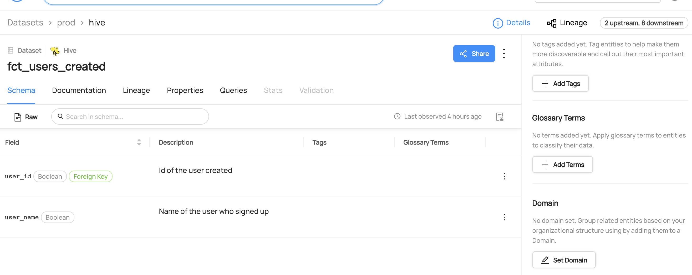

# Reading Domains From Datasets

## Why Would You Remove Domains?

Domains are curated, top-level folders or categories where related assets can be explicitly grouped. Management of Domains can be centralized, or distributed out to Domain owners Currently, an asset can belong to only one Domain at a time.
For more information about domains, refer to [About DataHub Domains](/docs/domains.md).

### Goal Of This Guide

This guide will show you how to remove the domain `Marketing` from the `fct_users_created` datatset.

## Pre-requisites

For this tutorial, you need to deploy DataHub Quickstart and ingest sample data.
For detailed information, please refer to [Datahub Quickstart Guide](/docs/quickstart.md).

:::note
Before removing domains, you need to ensure the targeted dataset and the domain are already present in your datahub.
If you attempt to manipulate entities that do not exist, your operation will fail.
In this guide, we will be using data from a sample ingestion.

Specifically, we will assume that the domain `Marketing` is attached to the dataset `fct_users_created`.
To learn how to add datasets to a domain, please refer to our documentation on [Adding Domain](/docs/api/tutorials/adding-domain.md).
:::

## Remove Domains With GraphQL

:::note
Please note that there are two available endpoints (`:8000`, `:9002`) to access `graphql`.
For more information about the differences between these endpoints, please refer to [DataHub Metadata Service](../../../metadata-service/README.md#graphql-api)
:::

### GraphQL Explorer

GraphQL Explorer is the fastest way to experiment with `graphql` without any dependencies.
Navigate to GraphQL Explorer (`http://localhost:9002/api/graphiql`) and run the following query.

```python
mutation unsetDomain {
    unsetDomain(
      entityUrn:"urn:li:dataset:(urn:li:dataPlatform:hive,fct_users_created,PROD)"
    )
}
```

Expected Response:

```python
{
  "data": {
    "removeDomain": true
  },
  "extensions": {}
}
```

### CURL

With CURL, you need to provide tokens. To generate a token, please refer to [Access Token Management](/docs/api/graphql/token-management.md).
With `accessToken`, you can run the following command.

```shell
curl --location --request POST 'http://localhost:8080/api/graphql' \
--header 'Authorization: Bearer <my-access-token>' \
--header 'Content-Type: application/json' \
--data-raw '{ "query": "mutation unsetDomain { unsetDomain(entityUrn: \"urn:li:dataset:(urn:li:dataPlatform:hive,fct_users_created,PROD)\") }", "variables":{}}'
```

## Remove Domain With Python SDK

Following codes remove an domain named `Marketing` from a dataset named `fct_users_created`.

> Coming Soon!

We're using the `MetdataChangeProposalWrapper` to change entities in this example.
For more information about the `MetadataChangeProposal`, please refer to [MetadataChangeProposal & MetadataChangeLog Events](/docs/advanced/mcp-mcl.md)

## Expected Outcomes

You can now see a domain `Marketing` has been removed from the `fct_users_created` dataset.


