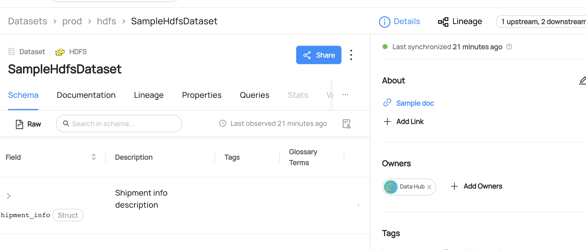

# Removing Owners From Datasets

## Why Would You Remove Owners?

Assigning an owner to an entity helps to establish accountability for the metadata and collaborating as a team.
If there are any issues or questions about the data, the designated owner can serve as a reliable point of contact.

### Goal Of This Guide

This guide will show you how to remove the owner `John Doe` from the `SampleHdfsDataset` datatset.

## Pre-requisites

For this tutorial, you need to deploy DataHub Quickstart and ingest sample data.
For detailed information, please refer to [Datahub Quickstart Guide](/docs/quickstart.md).

:::note
Before removing owners, you need to ensure the targeted dataset and the owner are already present in your datahub.
If you attempt to manipulate entities that do not exist, your operation will fail.
In this guide, we will be using data from a sample ingestion.
:::

## Remove Owners With GraphQL

:::note
Please note that there are two available endpoints (`:8000`, `:9002`) to access `graphql`.
For more information about the differences between these endpoints, please refer to [DataHub Metadata Service](../../../metadata-service/README.md#graphql-api)
:::

### GraphQL Explorer

GraphQL Explorer is the fastest way to experiment with GraphQL without any dependencies.
Navigate to GraphQL Explorer (`http://localhost:9002/api/graphiql`) and run the following query.

```python
mutation removeOwners {
    removeOwner(
      input: {
        ownerUrn: "urn:li:corpuser:jdoe",
        resourceUrn: "urn:li:dataset:(urn:li:dataPlatform:hdfs,SampleHdfsDataset,PROD)",
			}
    )
}
```

Note that you can also remove owners from multiple entities or subresource using `batchRemoveOwners`.

```json
mutation batchRemoveOwners {
    batchRemoveOwners(
      input: {
        ownerUrns: ["urn:li:corpuser:jdoe"],
        resources: [
          { resourceUrn:"urn:li:dataset:(urn:li:dataPlatform:hdfs,SampleHdfsDataset,PROD)"} ,
          { resourceUrn:"urn:li:dataset:(urn:li:dataPlatform:hive,fct_users_created,PROD)"} ,]
      }
    )
}
```

Expected Response:

```python
{
  "data": {
    "removeOwner": true
  },
  "extensions": {}
}
```

### CURL

With CURL, you need to provide tokens. To generate a token, please refer to [Access Token Management](/docs/api/graphql/token-management.md).
With `accessToken`, you can run the following command.

```shell
curl --location --request POST 'http://localhost:8080/api/graphql' \
--header 'Authorization: Bearer <my-access-token>' \
--header 'Content-Type: application/json' \
--data-raw '{ "query": "mutation removeOwner { removeOwner(input: { ownerUrn: \"urn:li:corpuser:jdoe\", resourceUrn: \"urn:li:dataset:(urn:li:dataPlatform:hdfs,SampleHdfsDataset,PROD)\" }) }", "variables":{}}'
```

## Remove Ownerships With Python SDK

Following codes remove an owner named `John Doe` from a dataset named `SampleHdfsDataset`.

> Coming Soon!

We're using the `MetdataChangeProposalWrapper` to change entities in this example.
For more information about the `MetadataChangeProposal`, please refer to [MetadataChangeProposal & MetadataChangeLog Events](/docs/advanced/mcp-mcl.md)

Expected Response:

```json
{ "data": { "removeOwner": true }, "extensions": {} }
```

## Expected Outcomes

You can now see `John Doe` has been removed as an owner from the `fct_users_created` dataset.


