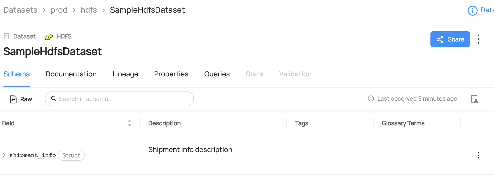

# Removing Tags From Datasets/Columns

## Why Would You Remove Tags?

Tags are informal, loosely controlled labels that help in search & discovery. They can be added to datasets, dataset schemas, or containers, for an easy way to label or categorize entities – without having to associate them to a broader business glossary or vocabulary.

For more information about tags, refer to [About DataHub Tags](/docs/tags.md).

### Goal Of This Guide

This guide will show you how to remove a `Legacy` from the `shipment_info` column of a dataset called `SampleHdfsDataset`.
Additionally, we will cover how to remove a tag from the dataset or from multiple entities.

## Prerequisites

For this tutorial, you need to deploy DataHub Quickstart and ingest sample data.
For detailed steps, please refer to [Datahub Quickstart Guide](/docs/quickstart.md).

:::note
Before removing tags, you need to ensure the targeted dataset and the tag are already present in your datahub.
If you attempt to manipulate entities that do not exist, your operation will fail.
In this guide, we will be using data from a sample ingestion.
If you want to know how to create tags using APIs & SDKs, please refer to [Creating Tags](/docs/api/tutorials/creating-tags.md) and [Creating Datasets](/docs/api/tutorials/creating-datasets.md).
:::

## Remove Tags With GraphQL

:::note
Please note that there are two available endpoints (`:8000`, `:9002`) to access `graphql`.
For more information about the differences between these endpoints, please refer to [DataHub Metadata Service](../../../metadata-service/README.md#graphql-api)
:::

### GraphQL Explorer

GraphQL Explorer is the fastest way to experiment with `graphql` without any dependencies.
Navigate to GraphQL Explorer (`http://localhost:9002/api/graphiql`) and run the following query.

```json
mutation removeTag {
    removeTag(
      input: {
        tagUrn: "urn:li:tag:Legacy",
        resourceUrn: "urn:li:dataset:(urn:li:dataPlatform:hdfs,SampleHdfsDataset,PROD)",
        subResourceType:DATASET_FIELD,
        subResource:"shipment_info"})
}
```

Note that you can also remove a tag from a dataset if you don't specify `subResourceType` and `subResource`.

```json
mutation removeTag {
    removeTag(
      input: {
        tagUrn: "urn:li:tag:Legacy",
        resourceUrn: "urn:li:dataset:(urn:li:dataPlatform:hdfs,SampleHdfsDataset,PROD)",
      }
    )
}
```

Note that you can also remove tags from multiple entities or subresource using `batchRemoveTags`.

```json
mutation batchRemoveTags {
    batchRemoveTags(
      input: {
        tagUrns: ["urn:li:tag:Legacy"],
        resources: [
          { resourceUrn:"urn:li:dataset:(urn:li:dataPlatform:hdfs,SampleHdfsDataset,PROD)"} ,
          { resourceUrn:"urn:li:dataset:(urn:li:dataPlatform:hive,fct_users_created,PROD)"} ,]
      }
    )
}
```

If you see the following response, the operation was successful:

```python
{
  "data": {
    "removeTag": true
  },
  "extensions": {}
}
```

### CURL

With CURL, you need to provide tokens. To generate a token, please refer to [Access Token Management](/docs/api/graphql/token-management.md).
With `accessToken`, you can run the following command.

```shell
curl --location --request POST 'http://localhost:8080/api/graphql' \
--header 'Authorization: Bearer <my-access-token>' \
--header 'Content-Type: application/json' \
--data-raw '{ "query": "mutation removeTag { removeTag(input: { tagUrn: \"urn:li:tag:Legacy\", resourceUrn: \"urn:li:dataset:(urn:li:dataPlatform:hdfs,SampleHdfsDataset,PROD)\" }) }", "variables":{}}'
```

Expected Response:

```json
{ "data": { "removeTag": true }, "extensions": {} }
```

## Remove Tags With Python SDK

The following code removes a tag named `Legacy` from `shipment_info` column of a dataset called `SampleHdfsDataset`.

> Coming Soon!

We're using the `MetdataChangeProposalWrapper` to change entities in this example.
For more information about the `MetadataChangeProposal`, please refer to [MetadataChangeProposal & MetadataChangeLog Events](/docs/advanced/mcp-mcl.md)

## Expected Outcomes

You can now see `Legacy` tag has been removed to `shipment_info` column.


