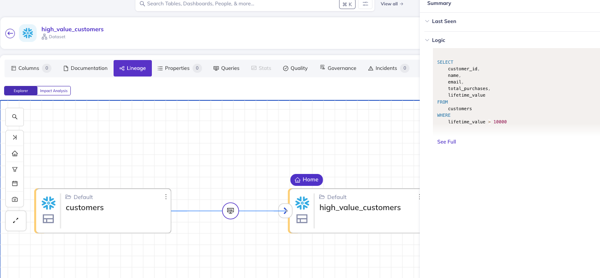
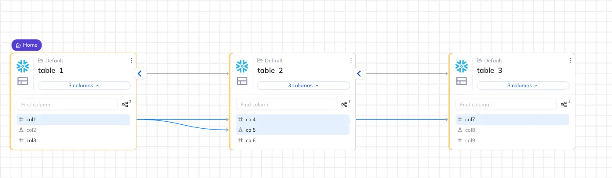

# Lineage

DataHub’s Python SDK allows you to programmatically define and retrieve lineage between metadata entities. With the DataHub Lineage SDK, you can:

- Add table-level and column-level lineage across datasets, data jobs, dashboards, and charts
- Automatically infer lineage from SQL queries
- Retrieve lineage relationships (upstream or downstream) for a given entity or column
- Filter lineage results using structured filters

## Getting Started

To use DataHub SDK, you'll need to install [`acryl-datahub`](https://pypi.org/project/acryl-datahub/) and set up a connection to your DataHub instance. Follow the [installation guide](https://docs.datahub.com/docs/metadata-ingestion/cli-ingestion#installing-datahub-cli) to get started.

Connect to your DataHub instance:

```python
from datahub.sdk import DataHubClient

client = DataHubClient(server="<your_server>", token="<your_token>")
```

- **server**: The URL of your DataHub GMS server
  - local: `http://localhost:8080`
  - hosted: `https://<your_datahub_url>/gms`
- **token**: You'll need to [generate a Personal Access Token](https://docs.datahub.com/docs/authentication/personal-access-tokens) from your DataHub instance.

## Supported Lineage Combinations

The `add_lineage()` and `get_lineage()` APIs support the following entity combinations:

| Upstream Entity | Downstream Entity | Entity-level Lineage | Column-Level Lineage | Query Node |
| --------------- | ----------------- | -------------------- | -------------------- | ---------- |
| Dataset         | Dataset           | ✅ Yes               | ✅ Yes               | ✅ Yes     |
| Dataset         | DataJob           | ✅ Yes               | ❌ No                | ❌ No      |
| DataJob         | Dataset           | ✅ Yes               | ❌ No                | ❌ No      |
| DataJob         | DataJob           | ✅ Yes               | ❌ No                | ❌ No      |
| Dataset         | Dashboard         | ✅ Yes               | ❌ No                | ❌ No      |
| Chart           | Dashboard         | ✅ Yes               | ❌ No                | ❌ No      |
| Dashboard       | Dashboard         | ✅ Yes               | ❌ No                | ❌ No      |
| Dataset         | Chart             | ✅ Yes               | ❌ No                | ❌ No      |

> ℹ️ Column-level lineage and creating query node with transformation text are **only supported** for `Dataset → Dataset` lineage.

## Add Lineage

The `add_lineage()` method allows you to define lineage between two entities.

```python
from datahub.sdk import DataHubClient

client = DataHubClient(server="<your_server>", token="<your_token>")

client.lineage.add_lineage(
    upstream="urn:li:dataset:(platform,sales_raw,PROD)",
    downstream="urn:li:dataset:(platform,sales_agg,PROD)",
    column_lineage=True,  # Optional: True, "auto_fuzzy", "auto_strict", or a mapping
    transformation_text="SELECT region, SUM(revenue) FROM sales_raw GROUP BY region"  # Optional
)
```

#### Parameters

| Parameter             | Description                                                                          |
| --------------------- | ------------------------------------------------------------------------------------ |
| `upstream`            | URN (or string) of the upstream entity                                               |
| `downstream`          | URN (or string) of the downstream entity                                             |
| `column_lineage`      | One of: `False`, a `dict`, `"auto_strict"`, or `"auto_fuzzy"` (dataset→dataset only) |
| `transformation_text` | SQL query used to describe the transformation logic (dataset→dataset only)           |

### Add Column Lineage

For dataset-to-dataset lineage, you can specify `column_lineage` parameter in several ways:

- **False**: No column lineage (default)
- **True**: Automatically match columns based on similar names (same as "auto_fuzzy")
- **"auto_strict"**: Automatically match columns based on exact names (strict matching)
- **Custom Mapping**: Provide a dictionary mapping upstream columns to downstream columns

For custom mapping, you can use a dictionary where keys are downstream column name and values are lists of upstream column names. This allows you to specify complex relationships.

```python
from datahub.sdk import DataHubClient

client = DataHubClient(server="<your_server>", token="<your_token>")

client.lineage.add_lineage(
    upstream="urn:li:dataset:(platform,sales_raw,PROD)",
    downstream="urn:li:dataset:(platform,sales_agg,PROD)",
    # { downstream_column -> [upstream_columns] }
    column_lineage={"id": ["id"], "region": ["region", "region_id"], "revenue": ["total_revenue"]},
)
```

### Add Query Node

If you provide a `transformation_text` to `add_lineage`, DataHub will create a query node that represents the transformation logic. This is useful for tracking how data is transformed between datasets.

Transformation text can be any transformation logic, Python scripts, Airflow DAG code, or any other code that describes how the upstream dataset is transformed into the downstream dataset.



:::note
Providing `transformation_text` will NOT create column level lineage. You need to specify `column_lineage` parameter to enable column-level lineage.

If you have a SQL query that describes the transformation, you can use `infer_lineage_from_sql()` to automatically parse the query and add column level lineage.
:::

### Infer Lineage from SQL

You can infer lineage directly from a SQL query using `infer_lineage_from_sql()`. This will parse the query, determine upstream and downstream datasets, and automatically add lineage (including column-level lineage when possible).

```python
from datahub.sdk import DataHubClient

client = DataHubClient(server="<your_server>", token="<your_token>")

client.lineage.infer_lineage_from_sql(
    query_text="""
        INSERT INTO sales_summary
        SELECT region, SUM(revenue)
        FROM sales_raw
        GROUP BY region
    """,
    platform="snowflake",
    env="PROD"
)
```

#### Parameters

| Parameter           | Description                                       |
| ------------------- | ------------------------------------------------- |
| `query_text`        | The SQL query to parse                            |
| `platform`          | The platform name, e.g., `"snowflake"`, `"mysql"` |
| `platform_instance` | Optional platform instance                        |
| `env`               | Data environment (default: `"PROD"`)              |
| `default_db`        | Optional default DB name to resolve tables        |
| `default_schema`    | Optional default schema name                      |

---

## Get Lineage

### Get Table-Level Lineage

Use `get_lineage()` to retrieve upstream or downstream lineage.

```python
from datahub.sdk import DataHubClient
from datahub.sdk.search_filters import FilterDsl as F

client = DataHubClient(server="<your_server>", token="<your_token>")

results = client.lineage.get_lineage(
    source_urn="urn:li:dataset:(platform,sales_agg,PROD)",
    direction="upstream",
    max_hops=2,
    filter=F.platform("snowflake")
)
```

#### Parameters

| Parameter       | Description                                                                        |
| --------------- | ---------------------------------------------------------------------------------- |
| `source_urn`    | The URN of the source entity (can be column-level URN via `SchemaFieldUrn`)        |
| `source_column` | Optional column name (used to construct `SchemaFieldUrn` from a dataset URN)       |
| `direction`     | `"upstream"` or `"downstream"` (default: `"upstream"`)                             |
| `max_hops`      | Max lineage depth to explore (default: `1`, recommended max for column lineage: 2) |
| `filter`        | Optional structured filter (see below)                                             |
| `count`         | Max number of results to return (default: `500`)                                   |

:::note USING MAX_HOPS
if you provide max_hops bigger than 2, it will traverse the full lineage graph and limit the results by `count`.
:::

#### Return Type

`get_lineage()` returns a list of `LineageResult` objects.

```python
results = [
  LineageResult(
    urn="urn:li:dataset:(urn:li:dataPlatform:snowflake,table_2,PROD)",
    type="DATASET",
    hops=1,
    direction="downstream",
    platform="snowflake",
    name="table_2", # name of the entity 
    paths=[] # Only populated for column-level lineage
  )
]
```

### Get Column-Level Lineage

You can retrieve column-level lineage by either:

- Passing both `source_urn` (a dataset URN) and `source_column` (a string)
- Or passing a full `SchemaFieldUrn` directly as the `source_urn`

Both approaches return lineage paths that show how a specific column influences downstream columns (or is influenced by upstream columns).

```python
from datahub.sdk import DataHubClient

client = DataHubClient(server="<your_server>", token="<your_token>")

# Getting column level lineage with source_urn and source_column
results_with_source_column = client.lineage.get_lineage(
    source_urn="urn:li:dataset:(urn:li:dataPlatform:snowflake,table_1,PROD)",
    source_column="col1",
    direction="downstream",
    max_hops=2,
)

print(list(results_with_source_column))

# Getting column level lineage with SchemaFieldUrn
results_with_schema_field_urn = client.lineage.get_lineage(
    source_urn="urn:li:schemaField:(urn:li:dataset:(urn:li:dataPlatform:snowflake,table_1,PROD),col1)",
    direction="downstream",
    max_hops=2
)

# this will return the same results as results_with_source_column
print(list(results_with_schema_field_urn))
```

#### Interpreting Column Lineage Paths

The `paths` field in the result represents traversal paths from the source column to downstream columns across one or more hops. Each path is a list of schema field URNs.

```python
results = [
  LineageResult(
    urn="urn:li:dataset:(urn:li:dataPlatform:snowflake,table_2,PROD)",
    type="DATASET",
    hops=1,
    direction="downstream",
    platform="snowflake",
    name="table_2", # name of the entity 
    paths=[
      LineagePath(
        urn="urn:li:schemaField:(urn:li:dataset:(urn:li:dataPlatform:snowflake,table_1,PROD),col1)",
        column_name="col1", # name of the column
        entity_name="table_1", # name of the entity that contains the column
      ),
      LineagePath(
        urn="urn:li:schemaField:(urn:li:dataset:(urn:li:dataPlatform:snowflake,table_2,PROD),col4)",
        column_name="col4", # name of the column
        entity_name="table_2", # name of the entity that contains the column
      )
    ] # Only populated for column-level lineage
  )
]
```

For example, let's say we have the following lineage across three tables:



#### Example with `max_hops=1`

```python
>>> client.lineage.get_lineage(
        source_urn="urn:li:dataset:(urn:li:dataPlatform:snowflake,table_1,PROD)",
        source_column="col1",
        direction="downstream",
        max_hops=1
    )
```

Returns:

- `table_2` (hops=1)
  - `table_1.col1 → table_2.col4`
  - `table_1.col1 → table_2.col5`

```python
[
    {
        "urn": "...table_2...",
        "hops": 1,
        "paths": [
            ["...table_1.col1", "...table_2.col4"],
            ["...table_1.col1", "...table_2.col5"]
        ]
    }
]
```

#### Example with `max_hops=2`

```python
>>> client.lineage.get_lineage(
        source_urn="urn:li:dataset:(urn:li:dataPlatform:snowflake,table_1,PROD)",
        source_column="col1",
        direction="downstream",
        max_hops=2
    )
```

Returns:

- `table_2` (hops=1)
  - `col_1 → col_4`
  - `col_1 → col_5`
- `table_3` (hops=2)
  - `col_1 → col_4 → col_7`

```python
[
    {
        "urn": "...table_2...",
        "hops": 1,
        "paths": [
            ["...table_1.col1", "...table_2.col4"],
            ["...table_1.col1", "...table_2.col5"]
        ]
    },
    {
        "urn": "...table_3...",
        "hops": 2,
        "paths": [
            ["...table_1.col1", "...table_2.col4", "...table_3.col7"]
        ]
    }
]
```

### Filtering Lineage Results

Lineage filters use the same `FilterDsl` as the Search SDK. You can filter by platform, type, domain, environment, and more.

```python
from datahub.sdk import DataHubClient
from datahub.sdk.search_filters import FilterDsl as F

client = DataHubClient(server="<your_server>", token="<your_token>")

# get upstream snowflake production datasets.
results = client.lineage.get_lineage(
    source_urn="urn:li:dataset:(platform,sales_agg,PROD)",
    direction="upstream",
    filter=F.and_(
    F.platform("snowflake"),
    F.entity_type("DATASET"),
    F.env("PROD")
)
)
```

You can check more details about the available filters in the [Search SDK documentation]().

## FAQ

**Can I get lineage at the column level?**
Yes — for dataset-to-dataset lineage, both `add_lineage()` and `get_lineage()` support column-level lineage.

**Can I pass a SQL query and get lineage automatically?**
Yes — use `infer_lineage_from_sql()` to parse a query and extract table and column lineage.

**Can I use filters when retrieving lineage?**
Yes — `get_lineage()` accepts structured filters via `FilterDsl`, just like in the Search SDK.
