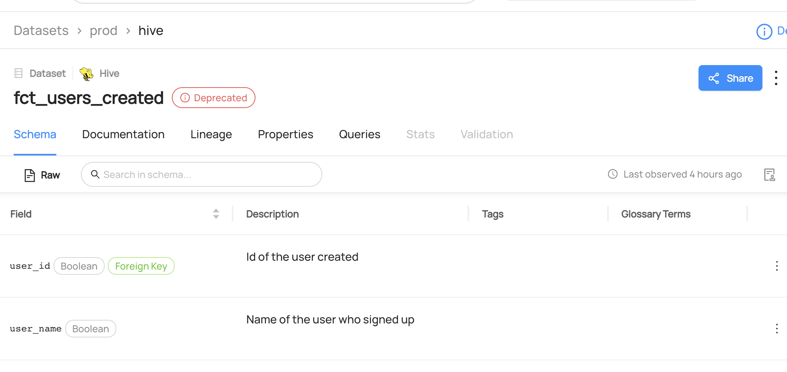

# Update Deprecation

## Why Would You Update Deprecation?

Deprecation indicates the status of an entity. For datasets, keeping the deprecation status up-to-date is important to inform users and downstream systems of changes to the dataset's availability or reliability. By updating the status, you can prevent issues and ensure users have access to the most reliable data.

### Goal Of This Guide

This guide will show you how to update deprecation status of a dataset `fct_users_created`.

## Prerequisites

For this tutorial, you need to deploy DataHub Quickstart and ingest sample data.
For detailed steps, please refer to [Datahub Quickstart Guide](/docs/quickstart.md).

:::note
Before updating deprecation, you need to ensure the targeted dataset is already present in your datahub.
If you attempt to manipulate entities that do not exist, your operation will fail.
In this guide, we will be using data from a sample ingestion.
:::

## Update Deprecation With GraphQL

:::note
Please note that there are two available endpoints (`:8000`, `:9002`) to access GraphQL.
For more information about the differences between these endpoints, please refer to [DataHub Metadata Service](../../../metadata-service/README.md#graphql-api)
:::

### GraphQL Explorer

GraphQL Explorer is the fastest way to experiment with GraphQL without any dependencies.
Navigate to GraphQL Explorer (`http://localhost:9002/api/graphiql`) and run the following query.

```json
mutation updateDeprecation {
    updateDeprecation(input: { urn: "urn:li:dataset:(urn:li:dataPlatform:hive,fct_users_created,PROD)", deprecated: true })
}
```

Also note that you can update deprecation status of multiple entities or subresource using `batchUpdateDeprecation`.

```json
mutation batchUpdateDeprecation {
    batchUpdateDeprecation(
      input: {
        deprecated: true,
        resources: [
          { resourceUrn:"urn:li:dataset:(urn:li:dataPlatform:hdfs,SampleHdfsDataset,PROD)"} ,
          { resourceUrn:"urn:li:dataset:(urn:li:dataPlatform:hive,fct_users_created,PROD)"} ,]
      }
    )
}

```

If you see the following response, the operation was successful:

```python
{
  "data": {
    "updateDeprecation": true
  },
  "extensions": {}
}
```

### CURL

With CURL, you need to provide tokens. To generate a token, please refer to [Access Token Management](/docs/api/graphql/token-management.md).
With `accessToken`, you can run the following command.

```shell
curl --location --request POST 'http://localhost:8080/api/graphql' \
--header 'Authorization: Bearer <my-access-token>' \
--header 'Content-Type: application/json' \
--data-raw '{ "query": "mutation updateDeprecation { updateDeprecation(input: { deprecated: true, urn: \"urn:li:dataset:(urn:li:dataPlatform:hive,fct_users_created,PROD)\" }) }", "variables":{}}'
```

Expected Response:

```json
{ "data": { "removeTag": true }, "extensions": {} }
```

## Update Deprecation With Python SDK

The following code update deprecation status of a dataset `fct_users_created`.

> Coming Soon!

We're using the `MetdataChangeProposalWrapper` to change entities in this example.
For more information about the `MetadataChangeProposal`, please refer to [MetadataChangeProposal & MetadataChangeLog Events](/docs/advanced/mcp-mcl.md)

## Expected Outcomes

You can now see the dataset `fct_users_created` has been marked as `Deprecated.`


