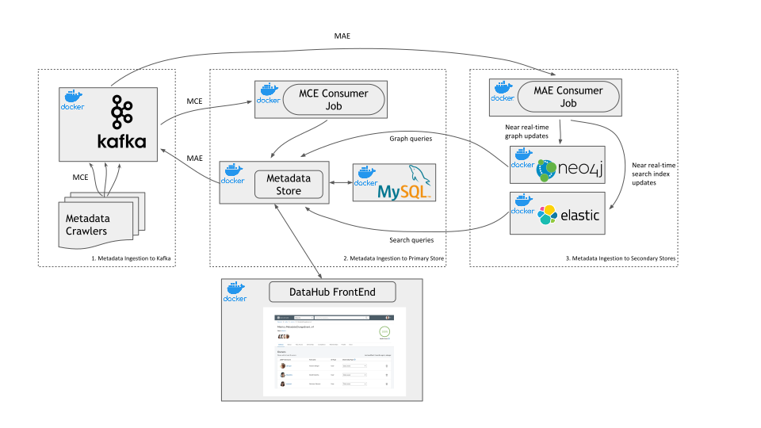

# DataHub Architecture

## Generalized Metadata Architecture (GMA)
Refer to [GMA](../what/gma.md).

## Metadata Serving
Refer to [metadata-serving](metadata-serving.md).

## Metadata Ingestion
Refer to [metadata-ingestion](metadata-ingestion.md).
