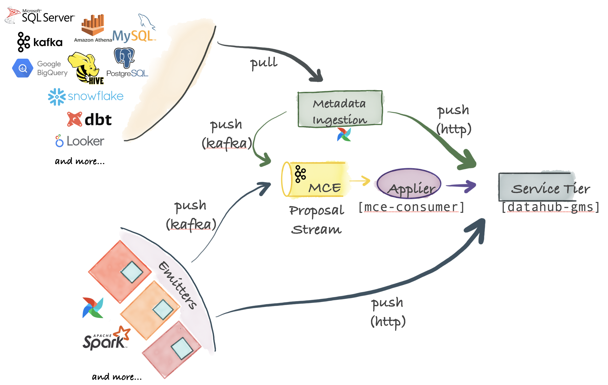

***

## título: "Marco de ingestión"

# Arquitectura de ingesta de metadatos

DataHub admite una arquitectura de ingestión extremadamente flexible que puede admitir modelos push, pull, asincrónicos y síncronos.
La siguiente figura describe todas las opciones posibles para conectar su sistema favorito a DataHub.

## Propuesta de cambio de metadatos: la pieza central

La pieza central para la ingesta son \[Propuestas de cambio de metadatos] que representan solicitudes para realizar un cambio de metadatos en el gráfico de metadatos de una organización.
Las propuestas de cambio de metadatos se pueden enviar a través de Kafka, para una publicación asincrónica altamente escalable desde sistemas de origen. También se pueden enviar directamente al extremo HTTP expuesto por el nivel de servicio de DataHub para obtener respuestas sincrónicas de éxito / error.

## Integración basada en pull

DataHub se envía con un python basado [sistema de ingesta de metadatos](../../metadata-ingestion/README.md) que pueden conectarse a diferentes fuentes para extraer metadatos de ellas. Estos metadatos se envían a través de Kafka o HTTP al nivel de almacenamiento de DataHub. Las canalizaciones de ingesta de metadatos pueden ser [integrado con Airflow](../../metadata-ingestion/README.md#lineage-with-airflow) para configurar la ingestión programada o capturar el linaje. Si no encuentra una fuente ya compatible, es muy fácil [escribe el tuyo propio](../../metadata-ingestion/README.md#contributing).

## Integración basada en push

Siempre y cuando puedas emitir un [Propuesta de cambio de metadatos (MCP)][Metadata Change Proposal (MCP)] evento a Kafka o hacer una llamada REST a través de HTTP, puede integrar cualquier sistema con DataHub. Para mayor comodidad, DataHub también proporciona [Emisores de Python][Python emitters] para que pueda integrarse en sus sistemas para emitir cambios de metadatos (MCP-s) en el punto de origen.

## Componentes internos

### Aplicación de propuestas de cambio de metadatos al servicio de metadatos de DataHub (mce-consumer-job)

DataHub viene con un trabajo basado en Kafka Streams, [mce-consumidor-trabajo][mce-consumer-job], que consume las propuestas de cambio de metadatos y las escribe en el servicio de metadatos de DataHub (datahub-gms) mediante el comando `/ingest` Extremo.

[Metadata Change Proposal (MCP)]: ../what/mxe.md#metadata-change-proposal-mcp

[Metadata Change Log (MCL)]: ../what/mxe.md#metadata-change-log-mcl

[equivalent Pegasus format]: https://linkedin.github.io/rest.li/how_data_is_represented_in_memory#the-data-template-layer

[mce-consumer-job]: ../../metadata-jobs/mce-consumer-job

[Python emitters]: ../../metadata-ingestion/README.md#using-as-a-library
