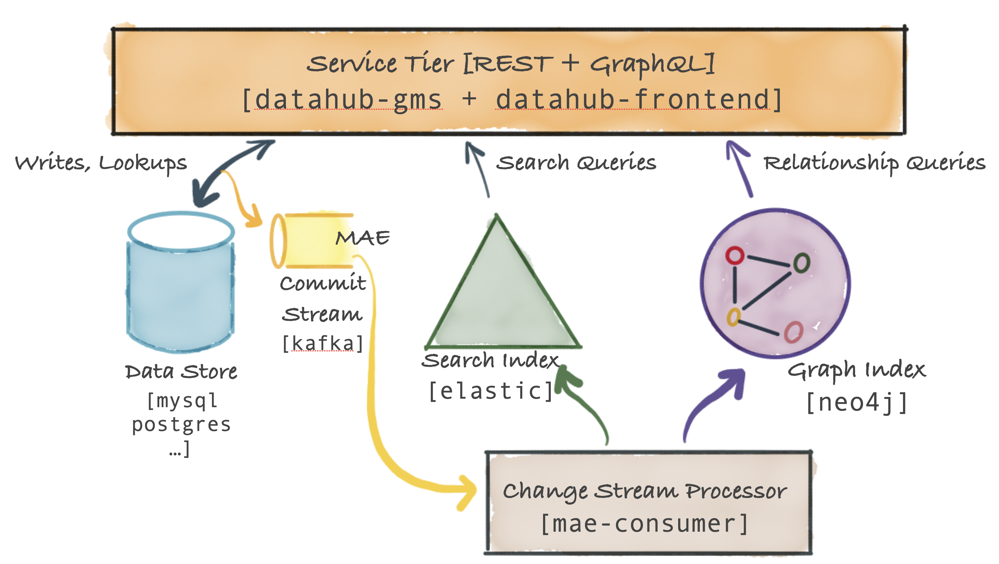

# DataHub Serving Architecture

The figure below shows the high-level system diagram for DataHub's Serving Tier. 

The primary component is called [the Metadata Service](../../metadata-service) and exposes a REST API and a GraphQL API for performing CRUD operations on metadata. The service also exposes search and graph query API-s to support secondary-index style queries, full-text search queries as well as relationship queries like lineage. In addition, the [datahub-frontend](../../datahub-frontend) service expose a GraphQL API on top of the metadata graph. 

## DataHub Serving Tier Components

### Metadata Storage

The DataHub Metadata Service persists metadata in a document store (an RDBMS like MySQL, Postgres, or Cassandra, etc.). 

### Metadata Change Log Stream (MCL)

The DataHub Service Tier also emits a commit event [Metadata Change Log] when a metadata change has been successfully committed to persistent storage. This event is sent over Kafka. 

The MCL stream is a public API and can be subscribed to by external systems (for example, the Actions Framework) providing an extremely powerful way to react in real-time to changes happening in metadata. For example, you could build an access control enforcer that reacts to change in metadata (e.g. a previously world-readable dataset now has a pii field) to immediately lock down the dataset in question.
Note that not all MCP-s will result in an MCL, because the DataHub serving tier will ignore any duplicate changes to metadata.

### Metadata Index Applier (mae-consumer-job)

[Metadata Change Logs]s are consumed by another Spring job, [mae-consumer-job], which applies the changes to the [graph] and [search index] accordingly.
The job is entity-agnostic and will execute corresponding graph & search index builders, which will be invoked by the job when a specific metadata aspect is changed. 
The builder should instruct the job how to update the graph and search index based on the metadata change.

To ensure that metadata changes are processed in the correct chronological order, MCLs are keyed by the entity [URN] — meaning all MAEs for a particular entity will be processed sequentially by a single thread.

### Metadata Query Serving

Primary-key based reads (e.g. getting schema metadata for a dataset based on the `dataset-urn`) on metadata are routed to the document store. Secondary index based reads on metadata are routed to the search index (or alternately can use the strongly consistent secondary index support described [here]()). Full-text and advanced search queries are routed to the search index. Complex graph queries such as lineage are routed to the graph index.

[RecordTemplate]: https://github.com/linkedin/rest.li/blob/master/data/src/main/java/com/linkedin/data/template/RecordTemplate.java
[GenericRecord]: https://github.com/apache/avro/blob/master/lang/java/avro/src/main/java/org/apache/avro/generic/GenericRecord.java
[Pegasus]: https://linkedin.github.io/rest.li/DATA-Data-Schema-and-Templates
[relationship]: ../what/relationship.md
[entity]: ../what/entity.md
[aspect]: ../what/aspect.md
[GMS]: ../what/gms.md
[Metadata Change Log]: ../what/mxe.md#metadata-change-log-mcl
[rest.li]: https://rest.li

[Metadata Change Proposal (MCP)]: ../what/mxe.md#metadata-change-proposal-mcp
[Metadata Change Log (MCL)]: ../what/mxe.md#metadata-change-log-mcl
[MCP]: ../what/mxe.md#metadata-change-proposal-mcp
[MCL]: ../what/mxe.md#metadata-change-log-mcl

[equivalent Pegasus format]: https://linkedin.github.io/rest.li/how_data_is_represented_in_memory#the-data-template-layer
[graph]: ../what/graph.md
[search index]: ../what/search-index.md
[mce-consumer-job]: ../../metadata-jobs/mce-consumer-job
[mae-consumer-job]: ../../metadata-jobs/mae-consumer-job
[Remote DAO]: ../architecture/metadata-serving.md#remote-dao
[URN]: ../what/urn.md
[Metadata Modelling]: ../modeling/metadata-model.md
[Entity]: ../what/entity.md
[Relationship]: ../what/relationship.md
[Search Document]: ../what/search-document.md
[metadata aspect]: ../what/aspect.md
[Python emitters]: https://datahubproject.io/docs/metadata-ingestion/#using-as-a-library
