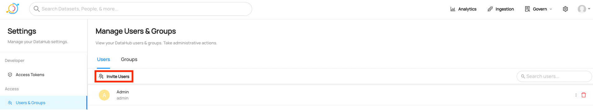
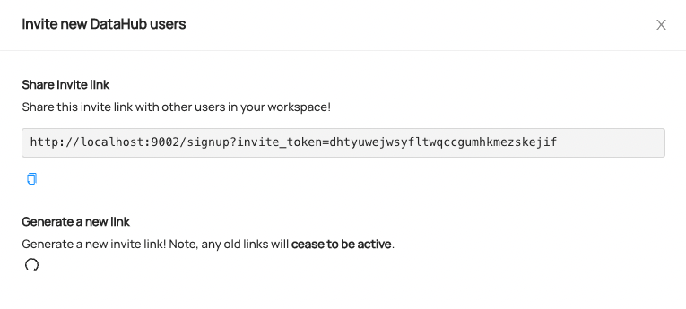
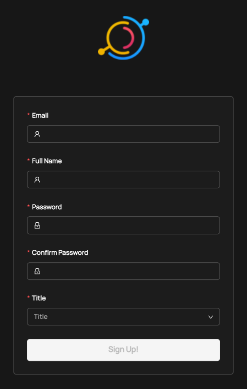
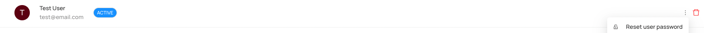
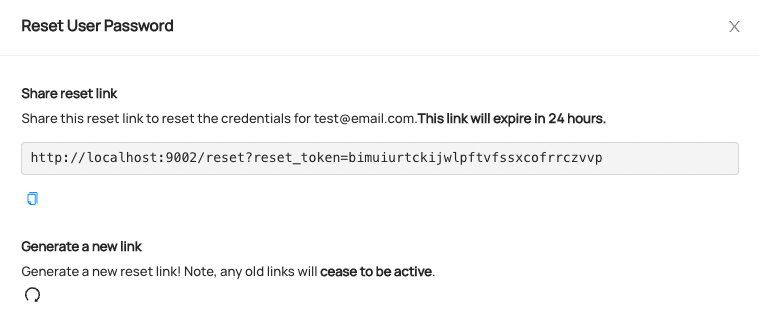
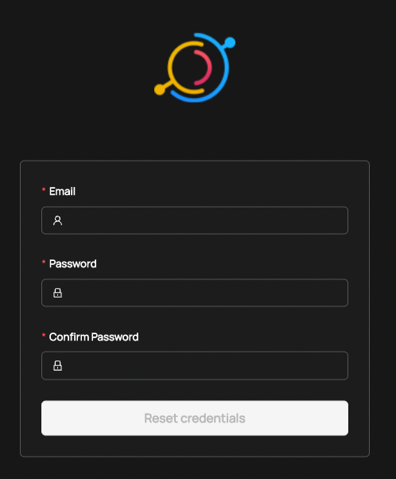

# Adding Users to DataHub

Users can log into DataHub in 3 ways:

1. Invite users via the UI
2. Static credentials
3. Single Sign-On via [OpenID Connect](https://www.google.com/search?q=openid+connect&oq=openid+connect&aqs=chrome.0.0i131i433i512j0i512l4j69i60l2j69i61.1468j0j7&sourceid=chrome&ie=UTF-8) (For Production Use)

which can be enabled simultaneously. Options 1 and 2 are useful for running proof-of-concept exercises, or just getting DataHub up & running quickly. Option 3 is highly recommended for deploying DataHub in production.

# Method 1: Inviting users via the DataHub UI

## Send prospective users an invite link

With the right permissions (`MANAGE_USER_CREDENTIALS`), you can invite new users to your deployed DataHub instance from the UI. It's as simple as sending a link!

First navigate, to the Users and Groups tab (under Access) on the Settings page. You'll then see an `Invite Users` button. Note that this will only be clickable
if you have the correct permissions.



If you click on this button, you'll see a pop-up where you can copy an invite link to send to users, or generate a fresh one.



When a new user visits the link, they will be directed to a sign up screen. Note that if a new link has since been regenerated, the new user won't be able to sign up!



## Reset password for native users

If a user forgets their password, an admin user with the `MANAGE_USER_CREDENTIALS` privilege can go to the Users and Groups tab and click on the respective user's
`Reset user password` button.



Similar to the invite link, you can generate a new reset link and send a link to that user which they can use to reset their credentials.



When that user visits the link, they will be direct to a screen where they can reset their credentials. If the link is older than 24 hours or another link has since
been generated, they won't be able to reset their credentials!



# Method 2: Configuring static credentials

## Changing the default 'datahub' user

The 'datahub' admin user is created for you by default. To override that user please follow these steps. This is due to the way the authentication setup is working - we support a "default" user.props containing the root datahub user and a separate custom file, which does not overwrite the first. 

However, it's still possible to change the password for the default `datahub user`. To change it, follow these steps:

1. Update the `docker-compose.yaml` to mount your default user.props file to the following location inside the `datahub-frontend-react` container using a volume:
`/datahub-frontend/conf/user.props`
   
2. Restart the datahub containers to pick up the new configs 
   
If you're deploying using the CLI quickstart, you can simply download a copy of the [docker-compose file used in quickstart](https://github.com/datahub-project/datahub/blob/master/docker/quickstart/docker-compose.quickstart.yml),
and modify the `datahub-frontend-react` block to contain the extra volume mount. Then simply run

```
datahub docker quickstart —quickstart-compose-file <your-modified-compose>.yml
```

## Create a user.props file to add new users

To define a set of username / password combinations that should be allowed to log in to DataHub, create a new file called `user.props` at the file path `${HOME}/.datahub/plugins/frontend/auth/user.props`. 
This file should contain username:password combinations, with 1 user per line. For example, to create 2 new users,
with usernames "janesmith" and "johndoe", we would define the following file:

```
janesmith:janespassword
johndoe:johnspassword
```

Once you've saved the file, simply start the DataHub containers & navigate to `http://localhost:9002/login`
to verify that your new credentials work.

To change or remove existing login credentials, edit and save the `user.props` file. Then restart DataHub containers. 

If you want to customize the location of the `user.props` file, or if you're deploying DataHub via Helm, proceed to Step 2.

## (Advanced) Mount custom user.props file to container

This step is only required when mounting custom credentials into a Kubernetes pod (e.g. Helm) **or** if you want to change
the default filesystem location from which DataHub mounts a custom `user.props` file (`${HOME}/.datahub/plugins/frontend/auth/user.props)`. 

If you are deploying with `datahub docker quickstart`, or running using Docker Compose, you can most likely skip this step.

### Docker Compose

You'll need to modify the `docker-compose.yml` file to mount a container volume mapping your custom user.props to the standard location inside the container 
(`/etc/datahub/plugins/frontend/auth/user.props`).

For example, to mount a user.props file that is stored on my local filesystem at `/tmp/datahub/user.props`, we'd modify the YAML for the 
`datahub-web-react` config to look like the following:

```aidl
  datahub-frontend-react:
    build:
      context: ../
      dockerfile: docker/datahub-frontend/Dockerfile
    image: linkedin/datahub-frontend-react:${DATAHUB_VERSION:-head}
    .....
    # The new stuff
    volumes:
      - ${HOME}/.datahub/plugins:/etc/datahub/plugins
      - /tmp/datahub:/etc/datahub/plugins/frontend/auth
```

Once you've made this change, restarting DataHub enable authentication for the configured users.

### Helm

You'll need to create a Kubernetes secret, then mount the file as a volume to the `datahub-frontend` pod. 

First, create a secret from your local `user.props` file

```shell
kubectl create secret generic datahub-users-secret --from-file=user.props=./<path-to-your-user.props>
```

Then, configure your `values.yaml` to add the volume to the `datahub-frontend` container.

```YAML
datahub-frontend:
  ...
  extraVolumes:
    - name: datahub-users
      secret:
        defaultMode: 0444
        secretName:  datahub-users-secret
  extraVolumeMounts:
    - name: datahub-users
      mountPath: /etc/datahub/plugins/frontend/auth/user.props
      subPath: user.props
```

Note that if you update the secret you will need to restart the `datahub-frontend` pods so the changes are reflected. To update the secret in-place you can run something like this.

```shell
kubectl create secret generic datahub-users-secret --from-file=user.props=./<path-to-your-user.props> -o yaml --dry-run=client | kubectl apply -f -
```

## URNs

URNs are identifiers that uniquely identify an Entity on DataHub. The usernames defined in the `user.props` file will be used to generate the DataHub user "urn", which uniquely identifies
the user on DataHub. The urn is computed as:

```
urn:li:corpuser:{username}
```

## Caveats

### Adding User Details

If you add a new username / password to the `user.props` file, no other information about the user will exist
about the user in DataHub (full name, email, bio, etc). This means that you will not be able to search to find the user.

In order for the user to become searchable, simply navigate to the new user's profile page (top-right corner) and click
**Edit Profile**. Add some details like a display name, an email, and more. Then click **Save**. Now you should be able
to find the user via search.

> You can also use our Python Emitter SDK to produce custom information about the new user via the CorpUser metadata entity.

For a more comprehensive overview of how users & groups are managed within DataHub, check out [this video](https://www.youtube.com/watch?v=8Osw6p9vDYY).

# Method 3: Configuring SSO via OpenID Connect

Setting up SSO via OpenID Connect means that users will be able to login to DataHub via a central Identity Provider such as

- Azure AD
- Okta 
- Keycloak
- Ping!
- Google Identity

and more. 

This option is recommended for production deployments of DataHub. For detailed information about configuring DataHub to use OIDC to
perform authentication, check out [OIDC Authentication](sso/configure-oidc-react.md). 

## URNs

URNs are identifiers that uniquely identify an Entity on DataHub. The username received from an Identity Provider 
when a user logs into DataHub via OIDC is used to construct a unique identifier for the user on DataHub. The urn is computed as:

```
urn:li:corpuser:<extracted-username>
```

For information about configuring which OIDC claim should be used as the username for Datahub, check out the [OIDC Authentication](sso/configure-oidc-react.md) doc.


## FAQ

1. Can I enable OIDC and username / password (JaaS) authentication at the same time? 

YES! If you have not explicitly disabled JaaS via an environment variable on the datahub-frontend container (AUTH_JAAS_ENABLED),
then you can _always_ access the standard login flow at `http://your-datahub-url.com/login`. 

## Feedback / Questions / Concerns

We want to hear from you! For any inquiries, including Feedback, Questions, or Concerns, reach out on Slack!