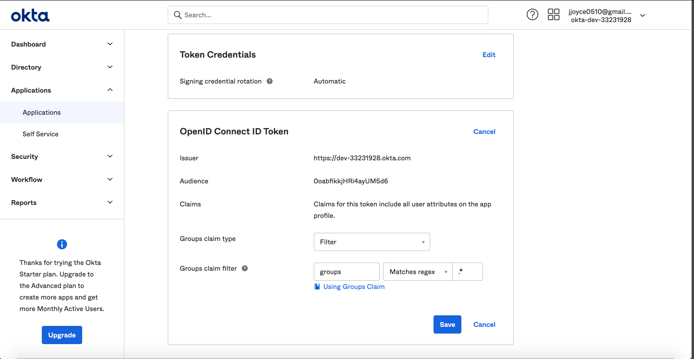

# Configuring Okta Authentication for React App (OIDC)
*Authored on 3/10/2021*

`datahub-frontend` server can be configured to authenticate users over OpenID Connect (OIDC). As such, it can be configured to
delegate authentication responsibility to identity providers like Okta.

This guide will provide steps for configuring DataHub authentication using Okta.

## Steps

### 1. Create an application in Okta Developer Console

a. Log in to your Okta admin account & navigate to the developer console

b. Select **Applications**, then **Add Application**, the **Create New App** to create a new app.

c. Select `Web` as the **Platform**, and `OpenID Connect` as the **Sign on method**

d. Click **Create**

e. Under 'General Settings', name your application

f. Below, add a **Login Redirect URI**. This should be formatted as

```
https://your-datahub-domain.com/callback/oidc
```

If you're just testing locally, this can be `http://localhost:9002/callback/oidc`.

g. Below, add a **Logout Redirect URI**. This should be formatted as

```
https://your-datahub-domain.com
```

h. [Optional] If you're enabling DataHub login as an Okta tile, you'll need to provide the **Initiate Login URI**. You
can set if to

```
https://your-datahub-domain.com/authenticate
```

If you're just testing locally, this can be `http://localhost:9002`.

i. Click **Save**


### 2. Obtain Client Credentials

On the subsequent screen, you should see the client credentials. Bookmark the `Client id` and `Client secret` for the next step.

### 3. Obtain Discovery URI

On the same page, you should see an `Okta Domain`. Your OIDC discovery URI will be formatted as follows:

```
https://your-okta-domain.com/.well-known/openid-configuration
```

for example, `https://dev-33231928.okta.com/.well-known/openid-configuration`.

At this point, you should be looking at a screen like the following:


Success!

### 4. Configure `datahub-frontend` to enable OIDC authentication

a. Open the file `docker/datahub-frontend/env/docker.env`

b. Add the following configuration values to the file:

```
AUTH_OIDC_ENABLED=true
AUTH_OIDC_CLIENT_ID=your-client-id
AUTH_OIDC_CLIENT_SECRET=your-client-secret
AUTH_OIDC_DISCOVERY_URI=https://your-okta-domain.com/.well-known/openid-configuration
AUTH_OIDC_BASE_URL=your-datahub-url
AUTH_OIDC_SCOPE="openid profile email groups"
```

Replacing the placeholders above with the client id & client secret received from Okta in Step 2.

> **Pro Tip!** You can easily enable Okta to return the groups that a user is associated with, which will be provisioned in DataHub, along with the user logging in. This can be enabled by setting the `AUTH_OIDC_EXTRACT_GROUPS_ENABLED` flag to `true`. 
> if they do not already exist in DataHub. You can enable your Okta application to return a 'groups' claim from the Okta Console at Applications > Your Application -> Sign On -> OpenID Connect ID Token Settings (Requires an edit).
> 
> By default, we assume that the groups will appear in a claim named "groups". This can be customized using the `AUTH_OIDC_GROUPS_CLAIM` container configuration. 
> 
> 

### 5. Restart `datahub-frontend-react` docker container

Now, simply restart the `datahub-frontend-react` container to enable the integration.

```
docker-compose -p datahub -f docker-compose.yml -f docker-compose.override.yml  up datahub-frontend-react
```

Navigate to your DataHub domain to see SSO in action.

## Resources
- [OAuth 2.0 and OpenID Connect Overview](https://developer.okta.com/docs/concepts/oauth-openid/)
