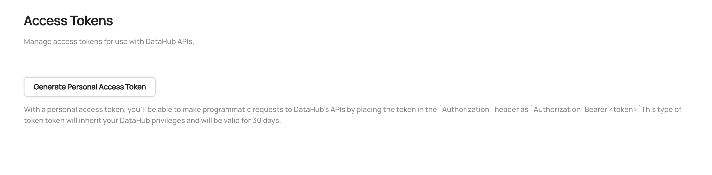

# Personal Access Tokens

With these changes, we introduced a way to generate a "Personal Access Token" suitable for programmatic use with both the DataHub GraphQL
and DataHub Rest.li (Ingestion) APIs.

Personal Access Tokens have a finite lifespan (default 3 months) and currently cannot be revoked without changing the signing key that
DataHub uses to generate these tokens (via the TokenService described above). Most importantly, they inherit the permissions
granted to the user who generates them.

## Generating Personal Access Tokens

To generate a personal access token, users must have been granted the "Generate Personal Access Tokens" (GENERATE_PERSONAL_ACCESS_TOKENS) or "Manage All Access Tokens" Privilege via a [DataHub Policy](../authorization/policies.md). Once
they have this permission, users can navigate to **'Settings'** > **'Access Tokens'** > **'Generate Personal Access Token'** to generate a token.



The token expiration dictates how long the token will be valid for. We recommend setting the shortest duration possible, as tokens are not currently
revokable once granted (without changing the signing key).


## Using Personal Access Tokens

The user will subsequently be able to make authenticated requests to DataHub frontend proxy or DataHub GMS directly by providing
the generated Access Token as a Bearer token in the `Authorization` header:

```
Authorization: Bearer <generated-access-token> 
```

For example, using a curl to the frontend proxy (preferred in production):

`curl 'http://localhost:9002/api/gms/entities/urn:li:corpuser:datahub' -H 'Authorization: Bearer <access-token>`

or to Metadata Service directly:

`curl 'http://localhost:8080/entities/urn:li:corpuser:datahub' -H 'Authorization: Bearer <access-token>`

Since authorization now happens at the GMS level, this means that ingestion is also protected behind access tokens, to use them simply add a `token` to the sink config property as seen below:


:::note

Without an access token, making programmatic requests will result in a 401 result from the server if Metadata Service Authentication
is enabled.

:::
