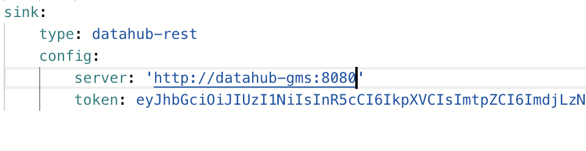

import FeatureAvailability from '@site/src/components/FeatureAvailability';

# About DataHub Personal Access Tokens

<FeatureAvailability/>

Personal Access Tokens or PATs for short, allow users to represent themselves in code and programmatically use DataHub's APIs in deployments where security is a concern. 

Used along-side with [authentication-enabled metadata service](introducing-metadata-service-authentication.md), PATs add a layer of protection to DataHub where only authorized users are able to perform actions in an automated way.

## Personal Access Tokens Setup, Prerequisites, and Permissions

To use PATs, two things are required:
 1. Metadata Authentication must have been enabled in GMS. See `Configuring Metadata Service Authentication` in [authentication-enabled metadata service](introducing-metadata-service-authentication.md).
 2. Users must have been granted the `Generate Personal Access Tokens` or `Manage All Access Tokens` Privilege via a [DataHub Policy](../authorization/policies.md).

Once configured, users should be able to navigate to **'Settings'** > **'Access Tokens'** > **'Generate Personal Access Token'** to generate a token:

<p align="center">
  
</p>

If you have configured permissions correctly the `Generate new token` should be clickable.

:::note

If you see `Token based authentication is currently disabled. Contact your DataHub administrator to enable this feature.` then you must enable authentication in the metadata service (step 1 of the prerequisites).

:::

## Creating Personal Access Tokens

Once in the Manage Access Tokens Settings Tab:

1. Click `Generate new token` where a form should appear.

<p align="center">
  
</p>

2. Fill out the information as needed and click `Create`.
<p align="center">
  
</p>

3. Save the token text somewhere secure! This is what will be used later on!
<p align="center">
  
</p>

## Using Personal Access Tokens

Once a token has been generated, the user that created it will subsequently be able to make authenticated HTTP requests, assuming he/she has permissions to do so, to DataHub frontend proxy or DataHub GMS directly by providing
the generated Access Token as a Bearer token in the `Authorization` header:

```
Authorization: Bearer <generated-access-token> 
```

For example, using a curl to the frontend proxy (preferred in production):

```bash
curl 'http://localhost:9002/api/gms/entities/urn:li:corpuser:datahub' -H 'Authorization: Bearer <access-token>
```

or to Metadata Service directly:

```bash
curl 'http://localhost:8080/entities/urn:li:corpuser:datahub' -H 'Authorization: Bearer <access-token>
```

Since authorization happens at the GMS level, this means that ingestion is also protected behind access tokens, to use them simply add a `token` to the sink config property as seen below:



:::note

Without an access token, making programmatic requests will result in a 401 result from the server if Metadata Service Authentication
is enabled.

:::

## Additional Resources

- Learn more about how this feature is by DataHub [Authentication Metadata Service](introducing-metadata-service-authentication.md).
- Check out our [Authorization Policies](../authorization/policies.md) to see what permissions can be programatically used.

### GraphQL

 - Have a look at [Token Management in GraphQL](../api/graphql/token-management.md) to learn how to manage tokens programatically!
 
## FAQ and Troubleshooting

**The button to create tokens is greyed out - why can’t I click on it?**

This means that the user currently logged in DataHub does not have either `Generate Personal Access Tokens` or `Manage All Access Tokens` permissions.
Please ask your DataHub administrator to grant you those permissions.

**When using a token, I get 401 unauthorized - why?**

A PAT represents a user in DataHub, if that user does not have permissions for a given action, neither will the token.

**Can I create a PAT that represents some other user?**

Yes, although not through the UI correctly, you will have to use the [token management graphQL API](../api/graphql/token-management.md) and the user making the request must have `Manage All Access Tokens` permissions.

*Need more help? Join the conversation in [Slack](http://slack.datahubproject.io)!*

