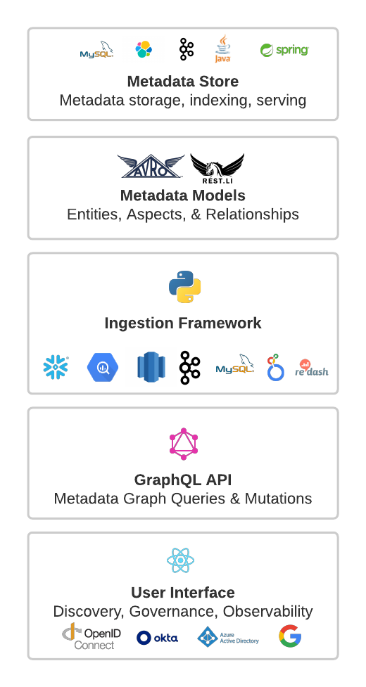

***

## título: "Componentes"

# Información general sobre los componentes de DataHub

La plataforma DataHub consta de los componentes que se muestran en el siguiente diagrama.

## Almacén de metadatos

El almacén de metadatos es responsable de almacenar el [Entidades y Aspectos](https://datahubproject.io/docs/metadata-modeling/metadata-model/) que comprende el gráfico de metadatos. Esto incluye
exponer una API para [ingerir metadatos](https://datahubproject.io/docs/metadata-service#ingesting-entities), [obtención de metadatos por clave principal](https://datahubproject.io/docs/metadata-service#retrieving-entities), [entidades de búsqueda](https://datahubproject.io/docs/metadata-service#search-an-entity)y [buscar relaciones](https://datahubproject.io/docs/metadata-service#get-relationships-edges) entre
Entidades. Consiste en un servicio Java de Spring que aloja un conjunto de [Rest.li](https://linkedin.github.io/rest.li/) Puntos de enlace de API, junto con
MySQL, Elasticsearch y Kafka para almacenamiento primario e indexación.

Comience con el almacén de metadatos siguiendo el [Guía de inicio rápido](https://datahubproject.io/docs/quickstart/).

## Modelos de metadatos

Los modelos de metadatos son esquemas que definen la forma de las entidades y aspectos que componen el gráfico de metadatos, junto con las relaciones entre ellos. Se definen
Usando [PDL](https://linkedin.github.io/rest.li/pdl_schema), un lenguaje de modelado bastante similar en forma a Protobuf mientras que serializa a JSON. Las entidades representan una clase específica de metadatos
Activos como un conjunto de datos, un panel, una canalización de datos y más. Cada *instancia* de una entidad se identifica mediante un identificador único denominado `urn`. Los aspectos representan paquetes relacionados de datos adjuntos
a una instancia de una entidad, como sus descripciones, etiquetas y más. Ver el conjunto actual de entidades admitidas [aquí](https://datahubproject.io/docs/metadata-modeling/metadata-model#exploring-datahubs-metadata-model).

Más información sobre los metadatos de los modelos de DataHub [aquí](https://datahubproject.io/docs/metadata-modeling/metadata-model/).

## Marco de ingestión

Ingestion Framework es una biblioteca de Python modular y extensible para extraer metadatos de sistemas de origen externos (por ejemplo,
Copo de nieve, Looker, MySQL, Kafka), transformándolo en DataHub [Modelo de metadatos](https://datahubproject.io/docs/metadata-modeling/metadata-model/), y escribirlo en DataHub a través de
ya sea Kafka o utilizando directamente las API de Rest del almacén de metadatos. DataHub admite un [extensa lista de conectores de origen](https://datahubproject.io/docs/metadata-ingestion/#installing-plugins) para elegir, junto con
una gran cantidad de capacidades que incluyen extracción de esquemas, perfiles de tablas y columnas, extracción de información de uso y más.

Comenzar con Ingestion Framework es igual de simple: simplemente defina un archivo YAML y ejecute el `datahub ingest` mandar.\
Obtenga más información dirigiéndose a la [Ingesta de metadatos](https://datahubproject.io/docs/metadata-ingestion/) guiar.

## GraphQL API

El [GraphQL](https://graphql.org/) API proporciona una API fuertemente tipada y orientada a entidades que hace que la interacción con las entidades que componen los metadatos
Gráfico simple, incluyendo API para agregar y eliminar etiquetas, propietarios, enlaces y más a entidades de metadatos. En particular, esta API es consumida por la interfaz de usuario (discutida a continuación) para habilitar la búsqueda y el descubrimiento, la gobernanza, la observabilidad
y más.

Para comenzar a usar la API de GraphQL, consulte el [Introducción a GraphQL](https://datahubproject.io/docs/api/graphql/getting-started) guiar.

## Interfaz de usuario

DataHub viene con una interfaz de usuario React que incluye un conjunto de características en constante evolución para que descubrir, gobernar y depurar sus activos de datos sea fácil y encantador.
Para obtener una visión general completa de las capacidades actualmente admitidas, eche un vistazo a la [Funciones](https://datahubproject.io/docs/features/) visión general. Para echar un vistazo a lo que viene a continuación,
dirígete al [Hoja de ruta](https://datahubproject.io/docs/roadmap/).

## Aprende más

Obtenga más información sobre los detalles de la [Arquitectura de DataHub](./architecture/architecture.md) en la Introducción a la arquitectura. Más información sobre el uso y desarrollo de los componentes
de la Plataforma visitando el Módulo READMEs.

## Comentarios / Preguntas / Inquietudes

¡Queremos saber de ti! Para cualquier consulta, incluidos comentarios, preguntas o inquietudes, comuníquese con [Flojo](https://datahubspace.slack.com/join/shared_invite/zt-nx7i0dj7-I3IJYC551vpnvvjIaNRRGw#/shared-invite/email)!
