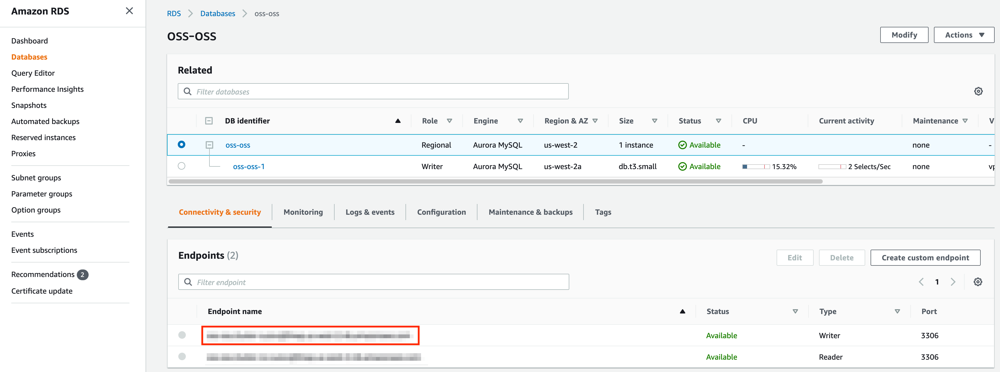
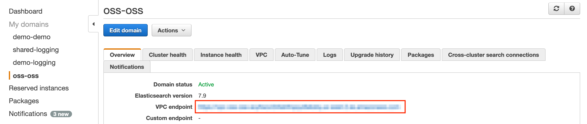
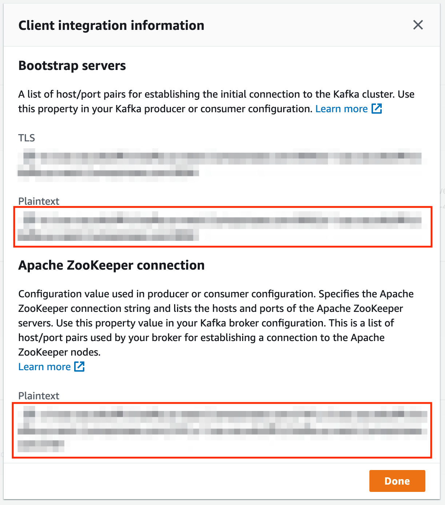

# AWS setup guide

The following is a set of instructions to quickstart DataHub on AWS Elastic Kubernetes Service (EKS). Note, the guide
assumes that you do not have a kubernetes cluster set up. If you are deploying DataHub to an existing cluster, please
skip the corresponding sections.

## Prerequisites

This guide requires the following tools:

- [kubectl](https://kubernetes.io/docs/tasks/tools/) to manage kubernetes resources
- [helm](https://helm.sh/docs/intro/install/) to deploy the resources based on helm charts. Note, we only support Helm
    3.
- [eksctl](https://eksctl.io/introduction/#installation) to create and manage clusters on EKS
- [AWS CLI](https://docs.aws.amazon.com/cli/latest/userguide/cli-chap-install.html) to manage AWS resources

To use the above tools, you need to set up AWS credentials by following
this [guide](https://docs.aws.amazon.com/cli/latest/userguide/cli-configure-profiles.html).

## Start up a kubernetes cluster on AWS EKS

Let’s follow this [guide](https://docs.aws.amazon.com/eks/latest/userguide/getting-started-eksctl.html) to create a new
cluster using eksctl. Run the following command with cluster-name set to the cluster name of choice, and region set to
the AWS region you are operating on.

```
eksctl create cluster \
    --name <<cluster-name>> \
    --region <<region>> \
    --with-oidc \
    --nodes=3
```

The command will provision an EKS cluster powered by 3 EC2 m3.large nodes and provision a VPC based networking layer.

If you are planning to run the storage layer (MySQL, Elasticsearch, Kafka) as pods in the cluster, you need at least 3
nodes. If you decide to use managed storage services, you can reduce the number of nodes or use m3.medium nodes to save
cost. Refer to this [guide](https://eksctl.io/usage/creating-and-managing-clusters/) to further customize the cluster
before provisioning.

Note, OIDC setup is required for following this guide when setting up the load balancer.

Run `kubectl get nodes` to confirm that the cluster has been setup correctly. You should get results like below

```
NAME                                          STATUS   ROLES    AGE   VERSION
ip-192-168-49-49.us-west-2.compute.internal   Ready    <none>   3h    v1.18.9-eks-d1db3c
ip-192-168-64-56.us-west-2.compute.internal   Ready    <none>   3h    v1.18.9-eks-d1db3c
ip-192-168-8-126.us-west-2.compute.internal   Ready    <none>   3h    v1.18.9-eks-d1db3c
```

## Setup DataHub using Helm

Once the kubernetes cluster has been set up, you can deploy DataHub and it’s prerequisites using helm. Please follow the
steps in this [guide](kubernetes.md)

## Expose endpoints using a load balancer

Now that all the pods are up and running, you need to expose the datahub-frontend end point by setting
up [ingress](https://kubernetes.io/docs/concepts/services-networking/ingress/). To do this, you need to first set up an
ingress controller. There are
many [ingress controllers](https://kubernetes.io/docs/concepts/services-networking/ingress-controllers/)  to choose
from, but here, we will follow
this [guide](https://docs.aws.amazon.com/eks/latest/userguide/aws-load-balancer-controller.html) to set up the AWS
Application Load Balancer(ALB) Controller.

First, if you did not use eksctl to setup the kubernetes cluster, make sure to go through the prerequisites listed
[here](https://docs.aws.amazon.com/eks/latest/userguide/alb-ingress.html).

Download the IAM policy document for allowing the controller to make calls to AWS APIs on your behalf.

```
curl -o iam_policy.json https://raw.githubusercontent.com/kubernetes-sigs/aws-load-balancer-controller/v2.2.0/docs/install/iam_policy.json
```

Create an IAM policy based on the policy document by running the following.

```
aws iam create-policy \
    --policy-name AWSLoadBalancerControllerIAMPolicy \
    --policy-document file://iam_policy.json
```

Use eksctl to create a service account that allows us to attach the above policy to kubernetes pods.

```
eksctl create iamserviceaccount \
  --cluster=<<cluster-name>> \
  --namespace=kube-system \
  --name=aws-load-balancer-controller \
  --attach-policy-arn=arn:aws:iam::<<account-id>>:policy/AWSLoadBalancerControllerIAMPolicy \
  --override-existing-serviceaccounts \
  --approve      
```

Install the TargetGroupBinding custom resource definition by running the following.

```
kubectl apply -k "github.com/aws/eks-charts/stable/aws-load-balancer-controller//crds?ref=master"
```

Add the helm chart repository containing the latest version of the ALB controller.

```
helm repo add eks https://aws.github.io/eks-charts
helm repo update
```

Install the controller into the kubernetes cluster by running the following.

```
helm upgrade -i aws-load-balancer-controller eks/aws-load-balancer-controller \
  --set clusterName=<<cluster-name>> \
  --set serviceAccount.create=false \
  --set serviceAccount.name=aws-load-balancer-controller \
  -n kube-system
```

Verify the install completed by running `kubectl get deployment -n kube-system aws-load-balancer-controller`. It should
return a result like the following.

```
NAME                           READY   UP-TO-DATE   AVAILABLE   AGE
aws-load-balancer-controller   2/2     2            2           142m
```

Now that the controller has been set up, we can enable ingress by updating the values.yaml (or any other values.yaml
file used to deploy datahub). Change datahub-frontend values to the following.

```
datahub-frontend:
  enabled: true
  image:
    repository: linkedin/datahub-frontend-react
    tag: "latest"
  ingress:
    enabled: true
    annotations:
      kubernetes.io/ingress.class: alb
      alb.ingress.kubernetes.io/scheme: internet-facing
      alb.ingress.kubernetes.io/target-type: instance
      alb.ingress.kubernetes.io/certificate-arn: <<certificate-arn>>
      alb.ingress.kubernetes.io/inbound-cidrs: 0.0.0.0/0
      alb.ingress.kubernetes.io/listen-ports: '[{"HTTP": 80}, {"HTTPS":443}]'
      alb.ingress.kubernetes.io/actions.ssl-redirect: '{"Type": "redirect", "RedirectConfig": { "Protocol": "HTTPS", "Port": "443", "StatusCode": "HTTP_301"}}'
    hosts:
      - host: <<host-name>>
        redirectPaths:
          - path: /*
            name: ssl-redirect
            port: use-annotation
        paths:
          - /*
```

You need to request a certificate in the AWS Certificate Manager by following this
[guide](https://docs.aws.amazon.com/acm/latest/userguide/gs-acm-request-public.html), and replace certificate-arn with
the ARN of the new certificate. You also need to replace host-name with the hostname of choice like
demo.datahubproject.io.

To have the metadata [authentication service](../authentication/introducing-metadata-service-authentication.md#configuring-metadata-service-authentication) enabled and use [API tokens](../authentication/personal-access-tokens.md#creating-personal-access-tokens) from the UI you will need to set the configuration in the values.yaml for the `gms` and the `frontend` deployments. This could be done by enabling the `metadata_service_authentication`:

```
datahub:
  metadata_service_authentication:
    enabled: true
```

After updating the yaml file, run the following to apply the updates.

```
helm upgrade --install datahub datahub/datahub --values values.yaml
```

Once the upgrade completes, run `kubectl get ingress` to verify the ingress setup. You should see a result like the
following.

```
NAME                       CLASS    HOSTS                         ADDRESS                                                                 PORTS   AGE
datahub-datahub-frontend   <none>   demo.datahubproject.io   k8s-default-datahubd-80b034d83e-904097062.us-west-2.elb.amazonaws.com   80      3h5m
```

Note down the elb address in the address column. Add the DNS CNAME record to the host domain pointing the host-name (
from above) to the elb address. DNS updates generally take a few minutes to an hour. Once that is done, you should be
able to access datahub-frontend through the host-name.

## Use AWS managed services for the storage layer

Managing the storage services like MySQL, Elasticsearch, and Kafka as kubernetes pods requires a great deal of
maintenance workload. To reduce the workload, you can use managed services like AWS [RDS](https://aws.amazon.com/rds),
[Elasticsearch Service](https://aws.amazon.com/elasticsearch-service/), and [Managed Kafka](https://aws.amazon.com/msk/)
as the storage layer for DataHub. Support for using AWS Neptune as graph DB is coming soon.

### RDS

Provision a MySQL database in AWS RDS that shares the VPC with the kubernetes cluster or has VPC peering set up between
the VPC of the kubernetes cluster. Once the database is provisioned, you should be able to see the following page. Take
a note of the endpoint marked by the red box.



First, add the DB password to kubernetes by running the following.

```
kubectl delete secret mysql-secrets
kubectl create secret generic mysql-secrets --from-literal=mysql-root-password=<<password>>
```

Update the sql settings under global in the values.yaml as follows.

```
  sql:
    datasource:
      host: "<<rds-endpoint>>:3306"
      hostForMysqlClient: "<<rds-endpoint>>"
      port: "3306"
      url: "jdbc:mysql://<<rds-endpoint>>:3306/datahub?verifyServerCertificate=false&useSSL=true&useUnicode=yes&characterEncoding=UTF-8"
      driver: "com.mysql.jdbc.Driver"
      username: "root"
      password:
        secretRef: mysql-secrets
        secretKey: mysql-root-password
```

Run `helm upgrade --install datahub datahub/datahub --values values.yaml` to apply the changes.

### Elasticsearch Service

Provision an elasticsearch domain running elasticsearch version 7.9 or above that shares the VPC with the kubernetes
cluster or has VPC peering set up between the VPC of the kubernetes cluster. Once the domain is provisioned, you should
be able to see the following page. Take a note of the endpoint marked by the red box.



Update the elasticsearch settings under global in the values.yaml as follows.

```
  elasticsearch:
    host: <<elasticsearch-endpoint>>
    port: "443"
    useSSL: "true"
```

You can also allow communication via HTTP (without SSL) by using the settings below.

```
  elasticsearch:
    host: <<elasticsearch-endpoint>>
    port: "80"
```

If you have fine-grained access control enabled with basic authentication, first run the following to create a k8s
secret with the password.

```
kubectl delete secret elasticsearch-secrets
kubectl create secret generic elasticsearch-secrets --from-literal=elasticsearch-password=<<password>>
```

Then use the settings below.

```
  elasticsearch:
    host: <<elasticsearch-endpoint>>
    port: "443"
    useSSL: "true"
    auth:
      username: <<username>>
      password:
        secretRef: elasticsearch-secrets
        secretKey: elasticsearch-password
```
If you have access control enabled with IAM auth, enable AWS auth signing in Datahub
```
 OPENSEARCH_USE_AWS_IAM_AUTH=true 
```
Then use the settings below.
```
  elasticsearch:
    host: <<elasticsearch-endpoint>>
    port: "443"
    useSSL: "true"
    region: <<AWS region of Opensearch>>
```

Lastly, you **NEED** to set the following env variable for **elasticsearchSetupJob**. AWS Elasticsearch/Opensearch
service uses OpenDistro version of Elasticsearch, which does not support the "datastream" functionality. As such, we use
a different way of creating time based indices.

```
  elasticsearchSetupJob:
    enabled: true
    image:
      repository: linkedin/datahub-elasticsearch-setup
      tag: "***"
    extraEnvs:
      - name: USE_AWS_ELASTICSEARCH
        value: "true"
```

Run `helm upgrade --install datahub datahub/datahub --values values.yaml` to apply the changes.

**Note:**
If you have a custom setup of elastic search cluster and are deploying through docker, you can modify the configurations
in datahub to point to the specific ES instance -

1. If you are using `docker quickstart` you can modify the hostname and port of the ES instance in docker compose
   quickstart files located [here](../../docker/quickstart/).
    1. Once you have modified the quickstart recipes you can run the quickstart command using a specific docker compose
       file. Sample command for that is
        - `datahub docker quickstart --quickstart-compose-file docker/quickstart/docker-compose-without-neo4j.quickstart.yml`
2. If you are not using quickstart recipes, you can modify environment variable in GMS to point to the ES instance. The
   env files for datahub-gms are located [here](../../docker/datahub-gms/env/).

Further, you can find a list of properties supported to work with a custom ES
instance [here](../../metadata-service/factories/src/main/java/com/linkedin/gms/factory/common/ElasticsearchSSLContextFactory.java)
and [here](../../metadata-service/factories/src/main/java/com/linkedin/gms/factory/common/RestHighLevelClientFactory.java)
.

A mapping between the property name used in the above two files and the name used in docker/env file can be
found [here](../../metadata-service/factories/src/main/resources/application.yml).

### Managed Streaming for Apache Kafka (MSK)

Provision an MSK cluster that shares the VPC with the kubernetes cluster or has VPC peering set up between the VPC of
the kubernetes cluster. Once the domain is provisioned, click on the “View client information” button in the ‘Cluster
Summary” section. You should see a page like below. Take a note of the endpoints marked by the red boxes.



Update the kafka settings under global in the values.yaml as follows.

```
kafka:
    bootstrap:
      server: "<<bootstrap-server endpoint>>"
    zookeeper:
      server:  "<<zookeeper endpoint>>"
    schemaregistry:
      url: "http://prerequisites-cp-schema-registry:8081"
    partitions: 3
    replicationFactor: 3
```

Note, the number of partitions and replicationFactor should match the number of bootstrap servers. This is by default 3
for AWS MSK.

Run `helm upgrade --install datahub datahub/datahub --values values.yaml` to apply the changes.

### AWS Glue Schema Registry

> **WARNING**: AWS Glue Schema Registry DOES NOT have a python SDK. As such, python based libraries like ingestion or datahub-actions (UI ingestion) is not supported when using AWS Glue Schema Registry

You can use AWS Glue schema registry instead of the kafka schema registry. To do so, first provision an AWS Glue schema
registry in the "Schema Registry" tab in the AWS Glue console page.

Once the registry is provisioned, you can change helm chart as follows.

```
kafka:
    bootstrap:
      ...
    zookeeper:
      ...
    schemaregistry:
      type: AWS_GLUE
      glue:
        region: <<AWS region of registry>>
        registry: <<name of registry>>
```

Note, it will use the name of the topic as the schema name in the registry.

Before you update the pods, you need to give the k8s worker nodes the correct permissions to access the schema registry.

The minimum permissions required looks like this

```
{
    "Version": "2012-10-17",
    "Statement": [
        {
            "Sid": "VisualEditor0",
            "Effect": "Allow",
            "Action": [
                "glue:GetRegistry",
                "glue:ListRegistries",
                "glue:CreateSchema",
                "glue:UpdateSchema",
                "glue:GetSchema",
                "glue:ListSchemas",
                "glue:RegisterSchemaVersion",
                "glue:GetSchemaByDefinition",
                "glue:GetSchemaVersion",
                "glue:GetSchemaVersionsDiff",
                "glue:ListSchemaVersions",
                "glue:CheckSchemaVersionValidity",
                "glue:PutSchemaVersionMetadata",
                "glue:QuerySchemaVersionMetadata"
            ],
            "Resource": [
                "arn:aws:glue:*:795586375822:schema/*",
                "arn:aws:glue:us-west-2:795586375822:registry/demo-shared"
            ]
        },
        {
            "Sid": "VisualEditor1",
            "Effect": "Allow",
            "Action": [
                "glue:GetSchemaVersion"
            ],
            "Resource": [
                "*"
            ]
        }
    ]
}
```

The latter part is required to have "*" as the resource because of an issue in the AWS Glue schema registry library.
Refer to [this issue](https://github.com/awslabs/aws-glue-schema-registry/issues/68) for any updates.

Glue currently doesn't support AWS Signature V4. As such, we cannot use service accounts to give permissions to access
the schema registry. The workaround is to give the above permission to the EKS worker node's IAM role. Refer
to [this issue](https://github.com/awslabs/aws-glue-schema-registry/issues/69) for any updates.

Run `helm upgrade --install datahub datahub/datahub --values values.yaml` to apply the changes.

Note, you will be seeing log "Schema Version Id is null. Trying to register the schema" on every request. This log is
misleading, so should be ignored. Schemas are cached, so it does not register a new version on every request (aka no
performance issues). This has been fixed by [this PR](https://github.com/awslabs/aws-glue-schema-registry/pull/64) but
the code has not been released yet. We will update version once a new release is out.

### IAM policies for UI-based ingestion

This section details how to attach policies to the acryl-datahub-actions pod that powers UI-based ingestion. For some of
the ingestion recipes, you sepecify login creds in the recipe itself, making it easy to set up auth to grab metadata
from the data source. However, for AWS resources, the recommendation is to use IAM roles and policies to gate requests
to access metadata on these resources.

To do this, let's follow
this [guide](https://docs.aws.amazon.com/eks/latest/userguide/create-service-account-iam-policy-and-role.html) to
associate a kubernetes service account with an IAM role. Then we can attach this IAM role to the acryl-datahub-actions
pod to let the pod assume the specified role.

First, you must create an IAM policy with all the permissions needed to run ingestion. This is specific to each
connector and the set of metadata you are trying to pull. i.e. profiling requires more permissions, since it needs
access to the data, not just the metadata. Let's say assume the ARN of that policy
is `arn:aws:iam::<<account-id>>:policy/policy1`.

Then, create a service account with the policy attached is to use [eksctl](https://eksctl.io/). You can run the
following command to do so.

```
eksctl create iamserviceaccount \
    --name <<service-account-name>> \
    --namespace <<namespace>> \
    --cluster <<eks-cluster-name>> \
    --attach-policy-arn <<policy-ARN>> \
    --approve \
    --override-existing-serviceaccounts
```

For example, running the following will create a service account "acryl-datahub-actions" in the datahub namespace of
datahub EKS cluster with `arn:aws:iam::<<account-id>>:policy/policy1` attached.

```
eksctl create iamserviceaccount \
    --name acryl-datahub-actions \
    --namespace datahub \
    --cluster datahub \
    --attach-policy-arn arn:aws:iam::<<account-id>>:policy/policy1 \
    --approve \
    --override-existing-serviceaccounts
```

Lastly, in the helm values.yaml, you can add the following to the acryl-datahub-actions to attach the service account to
the acryl-datahub-actions pod.

```yaml
acryl-datahub-actions:
  enabled: true
  serviceAccount:
    name: <<service-account-name>>
  ...
```
