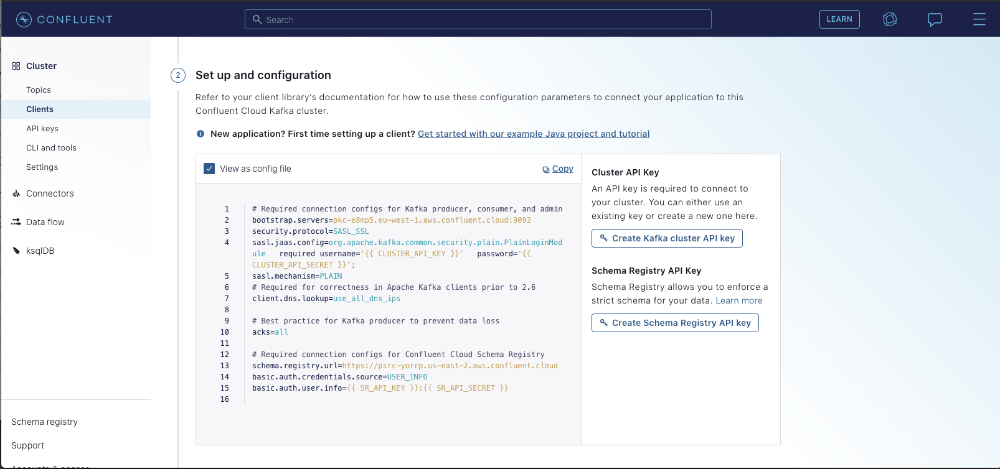
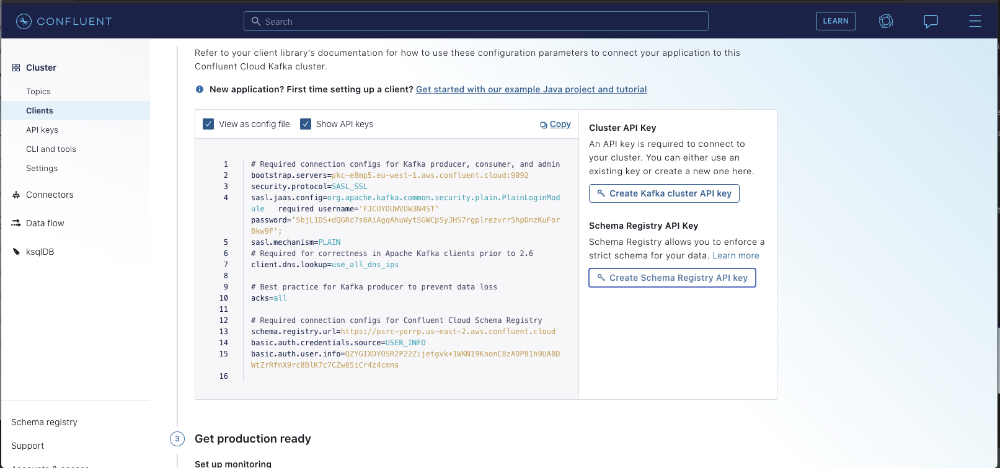

# Integración con Confluent Cloud

DataHub proporciona la capacidad de aprovechar fácilmente Confluent Cloud como su proveedor de Kafka. Para ello, deberá configurar DataHub para que se comunique con un agente y un registro de esquemas alojado por Confluent.

Hacer esto es una cuestión de configurar correctamente el productor y los consumidores de Kafka utilizados por DataHub. Hay 2 lugares donde se debe proporcionar la configuración de Kafka: el servicio de metadatos (GMS) y el servidor frontend (datahub-frontend). Siga los pasos que se indican a continuación para configurar estos componentes para la implementación.

## **Paso 1: Crear temas en el Centro de control de confluentes**

Primero, deberá crear los siguientes temas nuevos en el [Centro de Control de Confluentes](https://docs.confluent.io/platform/current/control-center/index.html). Por defecto tienen los siguientes nombres:

1.  **MetadataChangeProposal_v1**
2.  **FailedMetadataChangeProposal_v1**
3.  **MetadataChangeLog_Versioned_v1**
4.  **MetadataChangeLog_Timeseries_v1**
5.  **DataHubUsageEvent_v1**: Evento de seguimiento del comportamiento del usuario para la interfaz de usuario
6.  (Obsoleto) **MetadataChangeEvent_v4**: Mensajes de propuesta de cambio de metadatos
7.  (Obsoleto) **MetadataAuditEvent_v4**: Mensajes de registro de cambio de metadatos
8.  (Obsoleto) **FailedMetadataChangeEvent_v4**: Error al procesar el evento #1

Los primeros cinco son los más importantes, y se explican con más profundidad en [MCP/MCL](../advanced/mcp-mcl.md). Los temas finales son
los que están en desuso pero que aún se utilizan en determinadas circunstancias. Es probable que en el futuro sean completamente
Desarmado.

Para crear los temas, desplácese hasta su **Clúster** y haga clic en "Crear tema". Siéntase libre de ajustar las configuraciones de tema predeterminadas a
coincide con sus preferencias.


## Paso 2: Configurar DataHub Container para usar Temas de Confluent Cloud

### Docker Componer

Si está implementando DataHub a través de docker compose, habilitar la conexión a Confluent es cuestión de a) crear temas en el Centro de control de Confluent y b) cambiar las variables de entorno de contenedor predeterminadas.

Primero, configure GMS para conectarse a Confluent Cloud cambiando `docker/gms/env/docker.env`:

    KAFKA_BOOTSTRAP_SERVER=pkc-g4ml2.eu-west-2.aws.confluent.cloud:9092
    KAFKA_SCHEMAREGISTRY_URL=https://plrm-qwlpp.us-east-2.aws.confluent.cloud

    # Confluent Cloud Configs
    SPRING_KAFKA_PROPERTIES_SECURITY_PROTOCOL=SASL_SSL
    SPRING_KAFKA_PROPERTIES_SASL_JAAS_CONFIG=org.apache.kafka.common.security.plain.PlainLoginModule   required username='XFA45EL1QFUQP4PA' password='ltyf96EvR1YYutsjLB3ZYfrk+yfCXD8sQHCE3EMp57A2jNs4RR7J1bU9k6lM6rU';
    SPRING_KAFKA_PROPERTIES_SASL_MECHANISM=PLAIN
    SPRING_KAFKA_PROPERTIES_CLIENT_DNS_LOOKUP=use_all_dns_ips
    SPRING_KAFKA_PROPERTIES_BASIC_AUTH_CREDENTIALS_SOURCE=USER_INFO
    SPRING_KAFKA_PROPERTIES_BASIC_AUTH_USER_INFO=P2ETAN5QR2LCWL14:RTjqw7AfETDl0RZo/7R0123LhPYs2TGjFKmvMWUFnlJ3uKubFbB1Sfs7aOjjNi1m23

A continuación, configure datahub-frontend para conectarse a Confluent Cloud cambiando `docker/datahub-frontend/env/docker.env`:

    KAFKA_BOOTSTRAP_SERVER=pkc-g4ml2.eu-west-2.aws.confluent.cloud:9092

    # Confluent Cloud Configs
    KAFKA_PROPERTIES_SECURITY_PROTOCOL=SASL_SSL
    KAFKA_PROPERTIES_SASL_JAAS_CONFIG=org.apache.kafka.common.security.plain.PlainLoginModule   required username='XFA45EL1QFUQP4PA' password='ltyf96EvR1YYutsjLB3ZYfrk+yfCXD8sQHCE3EMp57A2jNs4RR7J1bU9k6lM6rU';
    KAFKA_PROPERTIES_SASL_MECHANISM=PLAIN
    KAFKA_PROPERTIES_CLIENT_DNS_LOOKUP=use_all_dns_ips
    KAFKA_PROPERTIES_BASIC_AUTH_CREDENTIALS_SOURCE=USER_INFO
    KAFKA_PROPERTIES_BASIC_AUTH_USER_INFO=P2ETAN5QR2LCWL14:RTjqw7AfETDl0RZo/7R0123LhPYs2TGjFKmvMWUFnlJ3uKubFbB1Sfs7aOjjNi1m23

Tenga en cuenta que este paso solo es necesario si `DATAHUB_ANALYTICS_ENABLED` La variable de entorno no se establece explícitamente en false para datahub-frontend
contenedor.

Si va a implementar con Docker Compose, no necesita implementar los contenedores Zookeeper, Kafka Broker o Schema Registry que se envían de forma predeterminada.

### Timón

Si está implementando en K8 usando Helm, simplemente puede cambiar el **datahub-helm** `values.yml` para apuntar a Confluent Cloud y deshabilitar algunos contenedores predeterminados:

Primero, deshabilite el `cp-schema-registry` servicio:

    cp-schema-registry:
      enabled: false 

A continuación, deshabilite el botón `kafkaSetupJob` servicio:

    kafkaSetupJob:
        enabled: false

A continuación, actualice el `kafka` configuraciones para apuntar a la instancia del agente de Confluent Cloud y del registro de esquema, junto con los temas que ha creado en el paso 1:

    kafka:
          bootstrap:
            server: pkc-g4ml2.eu-west-2.aws.confluent.cloud:9092
          schemaregistry:
            url: https://plrm-qwlpp.us-east-2.aws.confluent.cloud

A continuación, querrá crear 2 nuevos secretos de Kubernetes, uno para la configuración de JaaS que contiene el nombre de usuario y la contraseña de Confluent,
y otro para la información de usuario utilizada para conectarse al registro de esquemas. Encontrará los valores para cada uno dentro del Centro de control de confluentes. Específicamente
seleccione "Clientes" -> "Configurar nuevo cliente Java". Debería ver una página como la siguiente:



Querrá generar una clave de API de clúster de Kafka y una clave de registro de esquema. Una vez que lo haga, debería ver la configuración
rellena automáticamente con tus nuevos secretos:



Tendrás que copiar los valores de `sasl.jaas.config` y `basic.auth.user.info`
para el siguiente paso.

El siguiente paso es crear secretos K8s que contengan los valores de configuración que acaba de generar. Específicamente, puede ejecutar los siguientes comandos:

```shell
kubectl create secret generic confluent-secrets --from-literal=sasl_jaas_config="<your-sasl.jaas.config>"
kubectl create secret generic confluent-secrets --from-literal=basic_auth_user_info="<your-basic.auth.user.info>"
```

Con los valores de configuración sustituidos según corresponda. Por ejemplo, en nuestro caso ejecutaríamos:

```shell
kubectl create secret generic confluent-secrets --from-literal=sasl_jaas_config="org.apache.kafka.common.security.plain.PlainLoginModule   required username='XFA45EL1QFUQP4PA' password='ltyf96EvR1YYutsjLB3ZYfrk+yfCXD8sQHCE3EMp57A2jNs4RR7J1bU9k6lM6rU';"
kubectl create secret generic confluent-secrets --from-literal=basic_auth_user_info="P2ETAN5QR2LCWL14:RTjqw7AfETDl0RZo/7R0123LhPYs2TGjFKmvMWUFnlJ3uKubFbB1Sfs7aOjjNi1m23"
```

Finalmente, configuraremos nuestros contenedores para recoger las configuraciones de Kafka confluentes cambiando dos bloques de configuración en nuestro `values.yaml` archivo. Tú
debería ver estos bloques comentados en la parte inferior de la plantilla. Querrá quitarles los comentarios y establecerlos en los siguientes valores:

    credentialsAndCertsSecrets:
      name: confluent-secrets
      secureEnv:
        sasl.jaas.config: sasl_jaas_config
        basic.auth.user.info: basic_auth_user_info


    springKafkaConfigurationOverrides:
          security.protocol: SASL
          sasl.mechanism: PLAIN
          client.dns.lookup: use_all_dns_ips
          basic.auth.credentials.source: USER_INFO

Luego, simplemente aplique la actualización `values.yaml` a su clúster K8s a través de `kubectl apply`.

## Contribución

¡Aceptar contribuciones para un script de configuración compatible con Confluent Cloud!

El contenedor kafka-setup-job con el que enviamos solo es compatible con una distribución de Kafka en la que ZooKeeper
está expuesto y disponible. Una versión del trabajo utilizando el [CLI confluente](https://docs.confluent.io/confluent-cli/current/command-reference/kafka/topic/confluent_kafka_topic_create.html)
sería muy útil para la comunidad en general.
