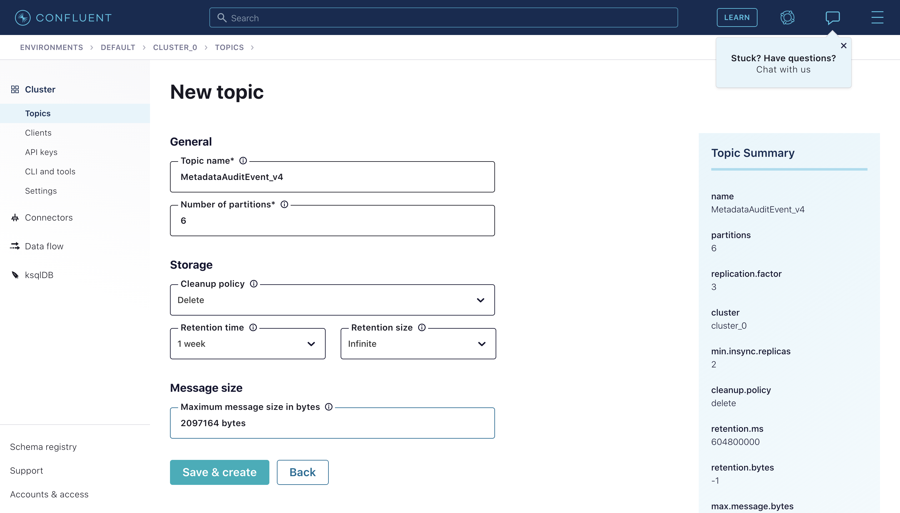

# Integrating with Confluent Cloud 

DataHub provides the ability to easily leverage Confluent Cloud as your Kafka provider. To do so, you'll need to configure DataHub to talk to a broker and schema registry hosted by Confluent.

Doing this is a matter of configuring the Kafka Producer and Consumers used by DataHub correctly. There are 2 places where Kafka configuration should be provided: the metadata server (GMS) and the frontend server (datahub-frontend). Follow the steps below to configure these components for your deployment.

## **Step 1: Create topics in Confluent Control Center**

First, you'll need to create 4 new topics in the [Confluent Control Center](https://docs.confluent.io/platform/current/control-center/index.html). By default they have the following names:

1. **MetadataChangeEvent_v4**: Metadata change proposal messages
2. **MetadataAuditEvent_v4**: Metadata change log messages 
3. **FailedMetadataChangeEvent_v4**: Failed to process #1 event
4. **DataHubUsageEvent_v1**: User behavior tracking event for UI

To do so, navigate to your **Cluster** and click "Create Topic". Feel free to tweak the default topic configurations to
match your preferences.



## Step 2: Configure DataHub Container to use Confluent Cloud Topics

### Docker Compose

If you are deploying DataHub via docker compose, enabling connection to Confluent is a matter of a) creating topics in the Confluent Control Center and b) changing the default container environment variables.

First, configure GMS to connect to Confluent Cloud by changing `docker/gms/env/docker.env`:

```
KAFKA_BOOTSTRAP_SERVER=pkc-e8mp5.eu-west-1.aws.confluent.cloud:9092
KAFKA_SCHEMAREGISTRY_URL=https://psrc-yorrp.us-east-2.aws.confluent.cloud

# Confluent Cloud Configs
SPRING_KAFKA_PROPERTIES_SECURITY_PROTOCOL=SASL_SSL
SPRING_KAFKA_PROPERTIES_SASL_JAAS_CONFIG=org.apache.kafka.common.security.plain.PlainLoginModule   required username='XFA35EL7QFUQP2PA' password='zmkfP6Envr9TYutsjLB3ZYfrk+yfCXD8sQHCE3EMp57A2jNs4RR7J1bU9k6lM6rU';
SPRING_KAFKA_PROPERTIES_SASL_MECHANISM=PLAIN
SPRING_KAFKA_PROPERTIES_CLIENT_DNS_LOOKUP=use_all_dns_ips
SPRING_KAFKA_PROPERTIES_BASIC_AUTH_CREDENTIALS_SOURCE=USER_INFO
SPRING_KAFKA_PROPERTIES_BASIC_AUTH_USER_INFO=U4UXEN6SP3KEWMO4:ESju8ZfETDm2RZo/6KO057hPYs2TGjFKmvMWUFnlJ3uKubFbB1Sfs7aOjUVT6CGe
```

Next, configure datahub-frontend to connect to Confluent Cloud by changing `docker/datahub-frontend/env/docker.env`:

```
KAFKA_BOOTSTRAP_SERVER=pkc-e8mp5.eu-west-1.aws.confluent.cloud:9092

# Confluent Cloud Configs
KAFKA_PROPERTIES_SECURITY_PROTOCOL=SASL_SSL
KAFKA_PROPERTIES_SASL_JAAS_CONFIG=org.apache.kafka.common.security.plain.PlainLoginModule   required username='XFA35EL7QFUQP2PA' password='zmkfP6Envr9TYutsjLB3ZYfrk+yfCXD8sQHCE3EMp57A2jNs4RR7J1bU9k6lM6rU';
KAFKA_PROPERTIES_SASL_MECHANISM=PLAIN
KAFKA_PROPERTIES_CLIENT_DNS_LOOKUP=use_all_dns_ips
KAFKA_PROPERTIES_BASIC_AUTH_CREDENTIALS_SOURCE=USER_INFO
KAFKA_PROPERTIES_BASIC_AUTH_USER_INFO=U4UXEN6SP3KEWMO4:ESju8ZfETDm2RZo/6KO057hPYs2TGjFKmvMWUFnlJ3uKubFbB1Sfs7aOjUVT6CGe
```

Note that this step is only required if DATAHUB_ANALYTICS_ENABLED is not set to false.

If you're deploying with Docker Compose, you do not need to deploy the Zookeeper, Kafka Broker, or Schema Registry containers that ship by default.

### Helm

If you're deploying to K8s using Helm, you can simply change the `datahub-helm` values.yml to point to Confluent Cloud and disable some default containers:

First, disable the `cp-schema-registry` service:

```
cp-schema-registry:
  enabled: false 
```

Next, disable the `kafkaSetupJob` service:

```
kafkaSetupJob:
    enabled: false
```

Then, update the `kafka` configurations to point to your Confluent Cloud broker and schema registry instance, along with the topics you've created in Step 1:

```
kafka:
      bootstrap:
        server: pkc-e8mp5.eu-west-1.aws.confluent.cloud:9092
      schemaregistry:
        url: https://psrc-yorrp.us-east-2.aws.confluent.cloud
```

Finally, set the required Confluent Kafka properties under the `springKafkaConfigurationOverrides` block:

```
springKafkaConfigurationOverrides:
      security.protocol: SASL
      sasl.jaas.config: org.apache.kafka.common.security.plain.PlainLoginModule   required username='XFA35EL7QFUQP2PA' password='zmkfP6Envr9TYutsjLB3ZYfrk+yfCXD8sQHCE3EMp57A2jNs4RR7J1bU9k6lM6rU'; # Provided inside Confluent Control Center
      sasl.mechanism: PLAIN
      client.dns.lookup: use_all_dns_ips
      basic.auth.credentials.source: USER_INFO
      basic.auth.user.info: U4UXEN6SP3KEWMO4:ESju8ZfETDm2RZo/6KO057hPYs2TGjFKmvMWUFnlJ3uKubFbB1Sfs7aOjUVT6CGe # Provided within Confluent Control Center
```

Typically, we suggest that all secrets are managed using K8s native secret manager. If you are using this, you can replace actual credentials with references to your secrets. For example,

```
springKafkaConfigurationOverrides:
		security.protocol: SASL_SSL
    sasl.jaas.config: "org.apache.kafka.common.security.plain.PlainLoginModule required username='{{ kafka_key_id }}' password='{{ kafka_key_secret }}';"
    sasl.mechanism: PLAIN
    client.dns.lookup: use_all_dns_ips
    basic.auth.credentials.source: USER_INFO
    basic.auth.user.info: "{{ kafka_schema_registry_key_id }}:{{ kafka_schema_registry_key_secret }}"
```

Then simply apply the updated `values.yaml` to your K8s cluster via `kubectl apply`. 

## Contribution
Accepting contributions for a setup script compatible with Confluent Cloud!

Currently the kafka-setup-job container we ship with is only compatible with a distribution of Kafka wherein ZooKeeper
is exposed and available. A version of the job using the [Confluent CLI](https://docs.confluent.io/confluent-cli/current/command-reference/kafka/topic/confluent_kafka_topic_create.html) 
would be very useful for the broader community. 