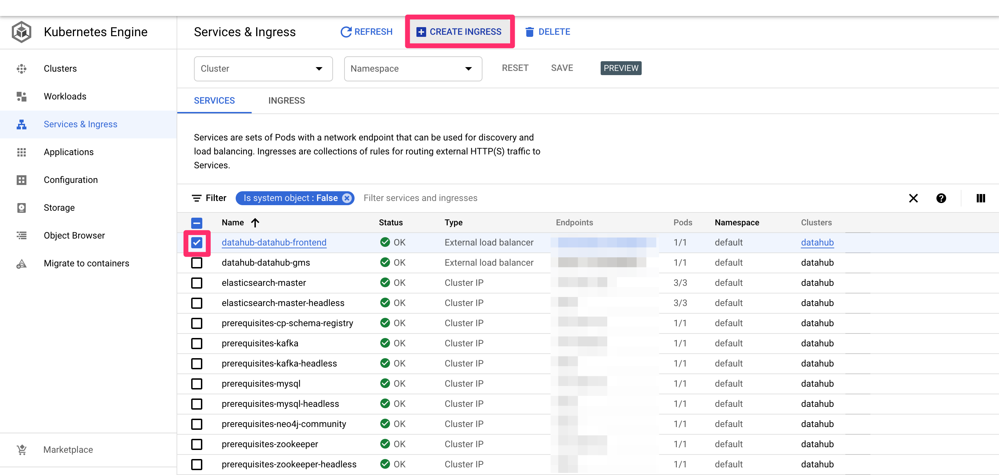
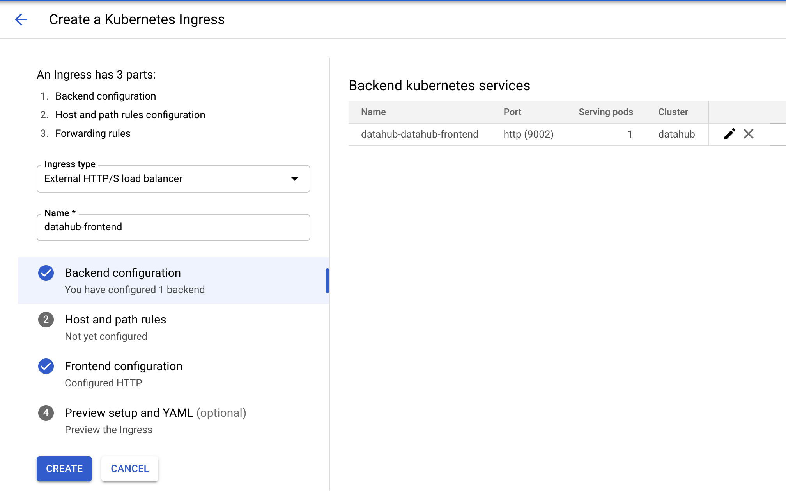
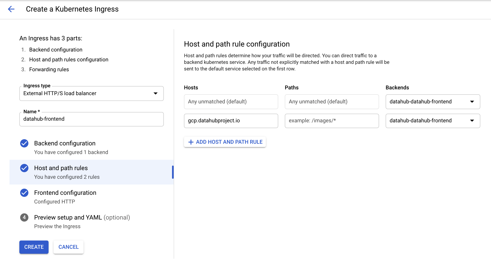
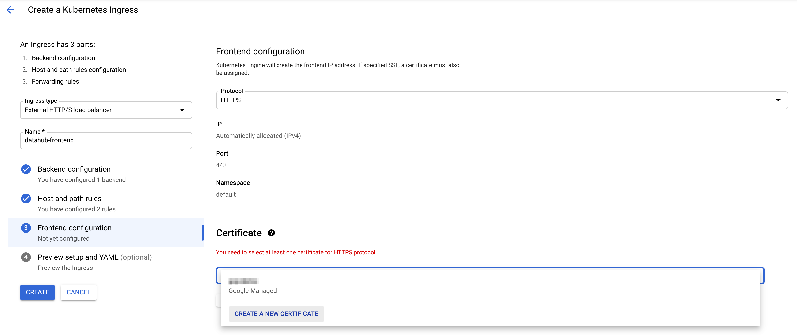
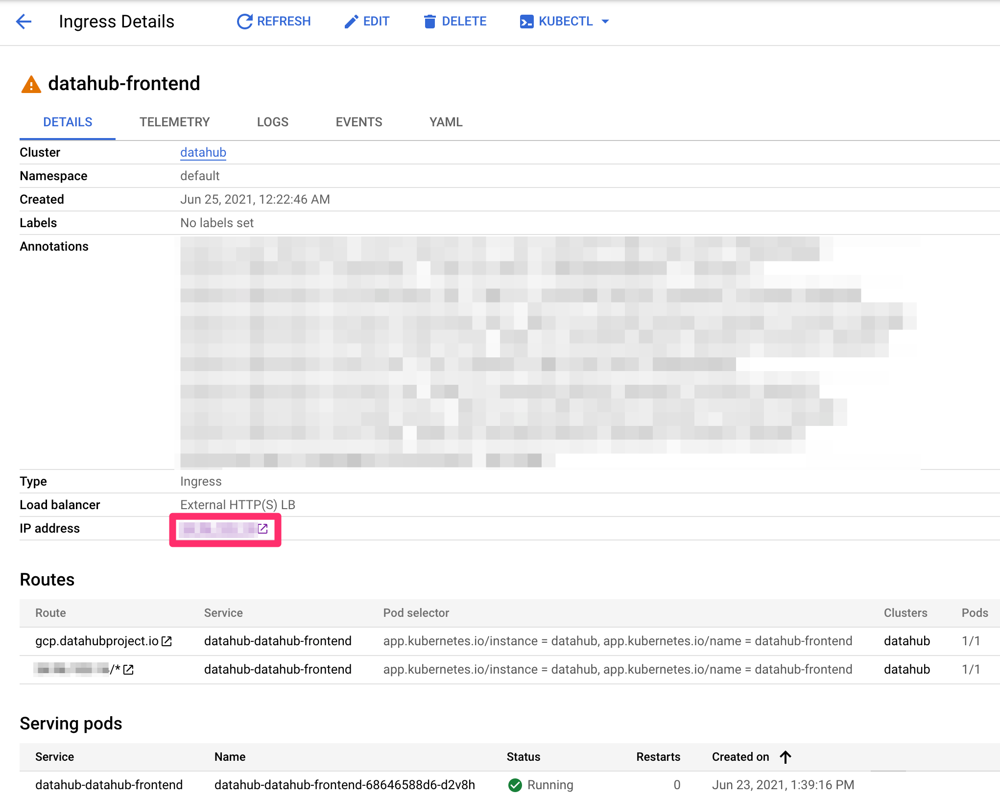
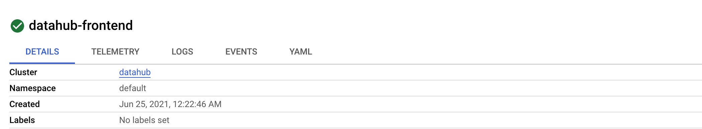

***

## título: "Implementación en GCP"

# Guía de configuración de GCP

El siguiente es un conjunto de instrucciones para iniciar rápidamente DataHub en GCP Google Kubernetes Engine (GKE). Nota, la guía
supone que no tiene configurado un clúster de kubernetes. Si está implementando DataHub en un clúster existente, por favor
omitir las secciones correspondientes.

## Prerrequisitos

Esta guía requiere las siguientes herramientas:

*   [kubectl](https://kubernetes.io/docs/tasks/tools/) para administrar los recursos de Kubernetes
*   [timón](https://helm.sh/docs/intro/install/) para implementar los recursos basados en gráficos de timón. Tenga en cuenta que solo admitimos Helm
    3\.
*   [gcloud](https://cloud.google.com/sdk/docs/install) para administrar los recursos de GCP

Siga el
siguiente [guiar](https://cloud.google.com/kubernetes-engine/docs/how-to/creating-a-zonal-cluster#before_you_begin) Para
configurar correctamente el SDK de Google Cloud.

Después de la configuración, ejecute `gcloud services enable container.googleapis.com` para asegurarse de que el servicio GKE está habilitado.

## Iniciar un clúster de kubernetes en GKE

Sigamos esto [guiar](https://cloud.google.com/kubernetes-engine/docs/how-to/creating-a-zonal-cluster) Para crear un
nuevo clúster usando gcloud. Ejecute el siguiente comando con el nombre del clúster establecido en el nombre del clúster de su elección y la zona establecida en
la zona GCP en la que está operando.

    gcloud container clusters create <<cluster-name>> \
        --zone <<zone>> \
        -m e2-standard-2

El comando aprovisionará un clúster GKE alimentado por 3 nodos e2-standard-2 (2 CPU, 8 GB de RAM).

Si planea ejecutar la capa de almacenamiento (MySQL, Elasticsearch, Kafka) como pods en el clúster, necesita al menos 3
nodos con las especificaciones anteriores. Si decide utilizar servicios de almacenamiento administrado, puede reducir el número de nodos o utilizar
Nodos m3.medium para ahorrar costes. Consulte
éste [guiar](https://cloud.google.com/kubernetes-engine/docs/how-to/creating-a-regional-cluster) para crear un
cluster para una mejor robustez.

Correr `kubectl get nodes` para confirmar que el clúster se ha configurado correctamente. Debería obtener resultados como los siguientes

    NAME                                     STATUS   ROLES    AGE   VERSION
    gke-datahub-default-pool-e5be7c4f-8s97   Ready    <none>   34h   v1.19.10-gke.1600
    gke-datahub-default-pool-e5be7c4f-d68l   Ready    <none>   34h   v1.19.10-gke.1600
    gke-datahub-default-pool-e5be7c4f-rksj   Ready    <none>   34h   v1.19.10-gke.1600

## Configurar DataHub con Helm

Una vez que se ha configurado el clúster de kubernetes, puede implementar DataHub y sus requisitos previos con helm. Por favor, siga el
pasos en este [guiar](kubernetes.md)

## Exponer puntos de conexión mediante el controlador de entrada GKE

Ahora que todos los pods están en funcionamiento, debe exponer el punto final de datahub-frontend configurando
hacia arriba [ingreso](https://kubernetes.io/docs/concepts/services-networking/ingress/). La forma más fácil de configurar la entrada es usar
la página de GKE en [Sitio web de GCP](https://console.cloud.google.com/kubernetes/discovery).

Una vez que toda la implementación sea exitosa, debería ver una página como la siguiente en la pestaña "Servicios e ingresos" a la izquierda.

Marque la casilla de verificación para datahub-datahub-frontend y haga clic en el botón "CREATE INGRESS". Debe aterrizar en la siguiente página.

Escriba un nombre arbitrario para la entrada y haga clic en el segundo paso "Reglas de host y ruta". Debes aterrizar en el
página siguiente.

Seleccione "datahub-datahub-frontend" en el menú desplegable para backends, y luego haga clic en el botón "AGREGAR REGLA DE HOST Y RUTA".
En la segunda fila que se creó, agregue el nombre de host de su elección (aquí gcp.datahubproject.io) y seleccione
"datahub-datahub-frontend" en el menú desplegable backends.

Este paso agrega la regla que permite que las solicitudes del nombre de host de elección se enruten al servicio datahub-frontend. Clic
en el paso 3 "Configuración del frontend". Debe aterrizar en la siguiente página.

Elija HTTPS en el menú desplegable para el protocolo. Para habilitar SSL, debe agregar un certificado. Si no tiene uno,
puede hacer clic en "CREAR UN NUEVO CERTIFICADO" e ingresar el nombre de host de su elección. GCP creará un certificado para usted.

¡Ahora presione el botón "CREAR" a la izquierda para crear la entrada! Después de unos 5 minutos, debería ver lo siguiente.

En su proveedor de dominio, agregue un registro A para el nombre de host establecido anteriormente utilizando la dirección IP en la página de entrada (anotado
con la caja roja). Una vez que se actualice el DNS, ¡debería poder acceder a DataHub a través del nombre de host!

Tenga en cuenta que ignore el icono de advertencia junto a la entrada. Se tarda unos diez minutos en comprobar que el servicio backend
está listo y muestra una marca de verificación de la siguiente manera. Sin embargo, la entrada es completamente funcional una vez que vea la página anterior.

