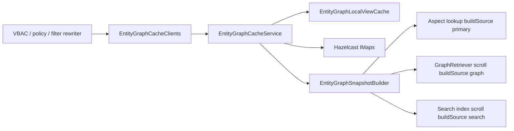
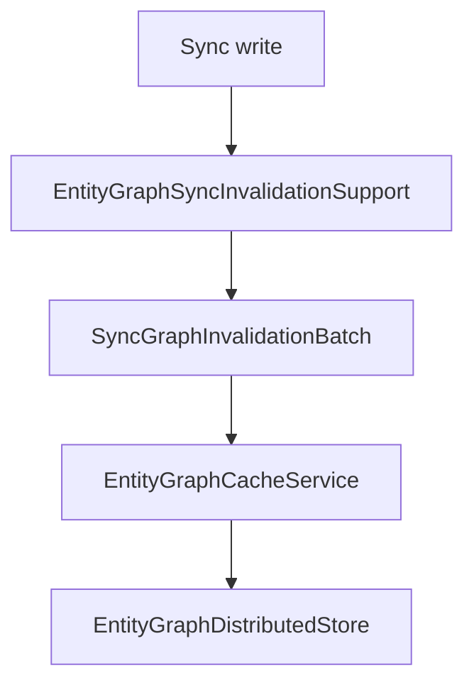

# GMS Entity Graph Cache

This guide explains how to enable, configure, and operate the **GMS entity graph cache** — a distributed cache of pre-built hierarchy snapshots used to expand domain (and other) relationships without repeated primary-storage or search scroll work on every request.

**Deployment scope:** The full cache (Hazelcast snapshots, rebuild threads, config validation) runs when **`datahub.gms.entityGraphCache.enabled=true`** (default on GMS via shared `application.yaml` / `ENTITY_GRAPH_CACHE_ENABLED`). MAE/MCE consumers and `datahub-upgrade` set **`enabled=false`** in module `application.properties` (and consumer Docker env) so [`EntityGraphCacheFactory`](https://github.com/datahub-project/datahub/blob/master/metadata-service/factories/src/main/java/com/linkedin/gms/factory/context/EntityGraphCacheFactory.java) registers only `EntityGraphCache.NO_OP`.

## What this is — and is not

| Mechanism                                                                                               | What it caches                                                                                                                                           | When it applies                                                                                                                    | Configuration                                                                   |
| ------------------------------------------------------------------------------------------------------- | -------------------------------------------------------------------------------------------------------------------------------------------------------- | ---------------------------------------------------------------------------------------------------------------------------------- | ------------------------------------------------------------------------------- |
| **Entity graph cache** (**this guide**)                                                                 | **Directed relationship snapshots** (for example domain `IsPartOf` trees) keyed by graph id, snapshot source, and optional component fingerprint         | View-Based Access Control (VBAC) policy expansion, domain-scoped policy fields, Elasticsearch filter rewriters (`domains.keyword`) | `ENTITY_GRAPH_CACHE_*` env vars; graph definitions in `entity-graph-cache.yaml` |
| **Search service cache** ([Environment Variables — Search](./environment-vars.md#search-configuration)) | **Search query results** (lineage search, etc.)                                                                                                          | Search API / lineage scroll paths                                                                                                  | `searchService.cacheImplementation` (`caffeine` or `hazelcast`)                 |
| **Live traversal**                                                                                      | Nothing — reads primary storage aspects (`DomainFieldResolverProvider`), `GraphRetriever` scroll (filter rewriters), or the search index on each request | When cache is disabled, inactive, in cooldown/over limit, or expansion fails closed                                                | N/A                                                                             |

**This feature does not:**

- Invalidate on **async ingestion** (MCE consumer → GMS without sync-index header, or MAE consumer → Elasticsearch via Kafka)
- Invalidate on **synchronous ingest without the sync gate** (REST/OpenAPI ingest, programmatic `ingestAspects`, or MCE consumer commits that lack UI source and sync-index header)
- Cache **arbitrary Cypher / lineage** queries outside configured graph definitions
- Patch individual edges on update — sync **update** to relationship aspects drops the graph (see [Invalidation (sync writes)](#invalidation-sync-writes)); async and non-gated ingest still rely on TTL (see [Async ingestion staleness window](#async-ingestion-staleness-window))

## Async ingestion staleness window

Metadata writes that **do not pass the sync gate** (see [Invalidation (sync writes)](#invalidation-sync-writes)) **do not invalidate** the entity graph cache. That includes async paths (MCE consumer ingest without sync-index header, MAE consumer Elasticsearch updates, CDC deferred preprocess) and synchronous ingest without UI source or sync-index header (REST API, programmatic ingest). Hierarchy changes from those paths can remain invisible to cache-backed expansion until the snapshot is considered stale.

For bundled `domain` with `population.strategy: SCHEDULED` and `intervalSeconds: 600`, the `entity-graph-scheduler` thread rebuilds `domain@search` every **600 seconds** (when the snapshot is `ACTIVE` and rebuild is not suppressed). Between rebuilds, a snapshot stays **`ACTIVE` and fresh** for up to **600 seconds** after `builtAtMillis` even when the search index already reflects new parent/child relationships. During that window, call sites that receive a **`GraphReadResult` hit** trust it without a live verification step.

**Operational implications:**

- VBAC policy evaluation, search filter rewriters, and GraphQL hierarchy reads may use a hierarchy that lags async ingestion by up to `population.intervalSeconds`.
- After the interval elapses, the scheduled rebuild runs on `entity-graph-scheduler`; until it completes, stale `ACTIVE` snapshots remain **`STALE_SERVABLE`** (reads continue on the previous snapshot). While status is `BUILDING`, reads return **`Miss(STALE_BLOCKED)`** and callers fall back to aspect walks or `GraphRetriever` scroll.

**Runbook:** If domain expansion looks wrong immediately after bulk async ingest, wait for the next scheduled rebuild (at most `population.intervalSeconds`), confirm a rebuild completed (fresh `builtAtMillis`), or diagnose with `SearchFlags.skipCache=true` on search paths. Override `population.intervalSeconds` via `entity-graph-cache.yaml` or `ENTITY_GRAPH_CACHE_CONFIG_JSON` (see [Environment Variables — Entity graph cache](./environment-vars.md#entity-graph-cache)).

## Purpose and call sites

VBAC and domain-scoped policies repeatedly expand domain hierarchies. Without a cache, each authorization or filter rewrite can trigger primary-storage scrolls or search work.

### Bundled domain graph (`domain@search`)

One FULL search-index snapshot — `KnownEntityGraph.DOMAIN` → `domain@search` — shared by all first-party domain call sites. Call sites resolve `{ graphId, source }` via `bindingForKnownGraph` and pass `binding.getSource()` to `expand` (do not hardcode a source).

| Consumer                                                                               | Availability                                                                                       | Expand                                      | Live fallback when cache miss                                                                                                                               |
| -------------------------------------------------------------------------------------- | -------------------------------------------------------------------------------------------------- | ------------------------------------------- | ----------------------------------------------------------------------------------------------------------------------------------------------------------- |
| VBAC / policy `DOMAIN` field (`DomainFieldResolverProvider`)                           | **Core** — `VIEW_AUTHORIZATION_ENABLED`                                                            | `FORWARD` ancestor expand                   | Recursive aspect batch fetch                                                                                                                                |
| Search filter rewriters (`DomainExpansionRewriter`, `domains.keyword`)                 | **Core**                                                                                           | `FORWARD` or `REVERSE` per filter           | `GraphRetriever` scroll                                                                                                                                     |
| Search access-control pushdown (`ESAccessControlUtil`)                                 | **DataHub Cloud** — [Search Access Controls](../features/feature-guides/search-access-controls.md) | `REVERSE`                                   | `GraphRetriever` scroll                                                                                                                                     |
| GraphQL domain hierarchy (`parentDomains`, `relationships` / `children`, `moveDomain`) | **Core**                                                                                           | `FORWARD` or `REVERSE` (often `maxDepth=1`) | Aspect walk or graph scroll                                                                                                                                 |
| GraphQL `deleteDomain` child check                                                     | **Core**                                                                                           | N/A (uses primary-store verify)             | [`AspectDirectChildrenWalker`](https://github.com/datahub-project/datahub/blob/master/metadata-io/src/main/java/com/linkedin/metadata/graph/cache/client/AspectDirectChildrenWalker.java) — not cache-backed |

All domain call sites use [`BoundHierarchyAccess`](https://github.com/datahub-project/datahub/blob/master/metadata-io/src/main/java/com/linkedin/metadata/graph/cache/client/BoundHierarchyAccess.java) with a domain [`HierarchyReadSpec`](https://github.com/datahub-project/datahub/blob/master/metadata-io/src/main/java/com/linkedin/metadata/graph/cache/client/HierarchyReadSpec.java) resolved via [`HierarchyBindings`](https://github.com/datahub-project/datahub/blob/master/metadata-io/src/main/java/com/linkedin/metadata/graph/cache/client/HierarchyBindings.java). Reads are cache-first with explicit `GraphReadResult` / `AncestorWalkResult` outcomes; live fallbacks use [`AspectParentWalker`](https://github.com/datahub-project/datahub/blob/master/metadata-io/src/main/java/com/linkedin/metadata/graph/cache/client/AspectParentWalker.java) and [`GraphScrollFallback`](https://github.com/datahub-project/datahub/blob/master/metadata-io/src/main/java/com/linkedin/metadata/graph/cache/client/GraphScrollFallback.java) only on `Miss`, not on valid `EmptyHit` (e.g. leaf domain with no descendants).

### Domain delete child guard (`AspectDirectChildrenWalker`)

`deleteDomain` rejects deletion when the domain still has **child domains in primary storage**. This check is **not** served from the entity graph cache — it uses [`AspectDirectChildrenWalker.hasDomainDirectChildren`](https://github.com/datahub-project/datahub/blob/master/metadata-io/src/main/java/com/linkedin/metadata/graph/cache/client/AspectDirectChildrenWalker.java):

1. **Candidate discovery** — `EntityClient.filter` on `parentDomain.keyword` (search index; may lag behind primary storage).
2. **Authoritative verify** — `batchGetV2` on `domainProperties` for each candidate; a child counts only when `parentDomain` still points at the parent URN in primary storage.
3. **Truncation safety** — when the filter page is **full** (`entities.size() >= 200`) and `numEntities > 200`, the walker returns `true` conservatively (true pagination). It does **not** treat `numEntities > entities.size()` alone as truncation: [`ValidationUtils.validateSearchResult`](https://github.com/datahub-project/datahub/blob/master/metadata-io/src/main/java/com/linkedin/metadata/entity/validation/ValidationUtils.java) can strip index **ghosts** (entities deleted in primary storage but still counted in ES `numEntities`) without adjusting `numEntities`, so an empty validated entity list with a positive count must fall through to “no children” rather than blocking parent delete.

After a child domain is hard-deleted, the parent should be deletable immediately even when the search index still lists the child — verified by `smoke-test/tests/domains/domains_test.py::test_delete_parent_domain_immediately_after_child_deletion`.

### Soft delete

Soft-deleted domains are **never stored in the entity graph cache**:

| Layer                                         | Behavior                                                                                                                                          |
| --------------------------------------------- | ------------------------------------------------------------------------------------------------------------------------------------------------- |
| **Build**                                     | Search-index builds set `SearchFlags.includeSoftDeleted(false)` — snapshots exclude soft-deleted domains.                                         |
| **Sync invalidation**                         | UI/sync writes that change a domain's `status` aspect remove the vertex from FULL snapshots (or drop PARTIAL graphs).                             |
| **Read (`includeSoftDelete=false`, default)** | Call sites trust cache expand results as-is; fall back to live graph scroll or aspect walk on cache miss. No read-time status aspect batch fetch. |
| **Read (`includeSoftDelete=true`)**           | Cache is bypassed entirely — use live `GraphRetriever` scroll (GraphQL `relationships` with `includeSoftDelete: true`).                           |

VBAC / policy `DOMAIN` field resolution (`DomainFieldResolverProvider`) uses **`FORWARD` expand** on `domain@search` with recursive aspect batch fetch on cache miss; search access-control pushdown and GraphQL child-domain queries use the read rules above.

Config: `buildSource: search`, `scope.mode: FULL`, `population.strategy: SCHEDULED`, **`bounds.maxVertices: 500`** / **`maxEdges: 750`**. Custom graphs omitting `bounds` inherit **10000** / **15000**. Deployments over 500 domains hit **`OVER_LIMIT`** at build time; raise limits via `ENTITY_GRAPH_CACHE_CONFIG_JSON` ([Environment Variables — Entity graph cache](./environment-vars.md#entity-graph-cache)). Monitor search index freshness after metadata changes.



### Client layer

Hierarchy reads are graph-generic. Each bound graph supplies a [`HierarchyReadSpec`](https://github.com/datahub-project/datahub/blob/master/metadata-io/src/main/java/com/linkedin/metadata/graph/cache/client/HierarchyReadSpec.java) (binding, scroll entity types, per-entity-type [`ParentAspectSpec`](https://github.com/datahub-project/datahub/blob/master/metadata-io/src/main/java/com/linkedin/metadata/graph/cache/client/ParentAspectSpec.java) extractors). Call sites resolve specs through [`HierarchyBindings`](https://github.com/datahub-project/datahub/blob/master/metadata-io/src/main/java/com/linkedin/metadata/graph/cache/client/HierarchyBindings.java) (`domainSpec`, `glossarySpec`, `resolveByPolicyFieldWithFallback`, `resolveByFilterFieldWithFallback`).

[`BoundHierarchyAccess`](https://github.com/datahub-project/datahub/blob/master/metadata-io/src/main/java/com/linkedin/metadata/graph/cache/client/BoundHierarchyAccess.java) is the single entry point for ancestor expand, ordered parents, descendant expand, direct children, and `isDescendant`. Cache reads go through [`EntityGraphCacheClients`](https://github.com/datahub-project/datahub/blob/master/metadata-io/src/main/java/com/linkedin/metadata/graph/cache/client/EntityGraphCacheClients.java); on `Miss`, fallbacks run in order: aspect parent walk ([`AspectParentWalker`](https://github.com/datahub-project/datahub/blob/master/metadata-io/src/main/java/com/linkedin/metadata/graph/cache/client/AspectParentWalker.java)), then graph scroll ([`GraphScrollFallback`](https://github.com/datahub-project/datahub/blob/master/metadata-io/src/main/java/com/linkedin/metadata/graph/cache/client/GraphScrollFallback.java)).

To add a new hierarchy graph: register the graph in `entity-graph-cache.yaml`, add a `HierarchyReadSpec` factory in [`HierarchyReadSpecs`](https://github.com/datahub-project/datahub/blob/master/metadata-io/src/main/java/com/linkedin/metadata/graph/cache/client/HierarchyReadSpecs.java) with PDL parent extractors for each seed entity type, wire it through `HierarchyBindings`, and call `BoundHierarchyAccess` with the resolved spec — no entity-specific access class required.

### Bundled glossary graph (`glossary@graph`)

Production ships a reference **PARTIAL** multi-entity graph for glossary hierarchy reads:

| Property     | Value                                                                                                              |
| ------------ | ------------------------------------------------------------------------------------------------------------------ |
| Graph id     | `glossary`                                                                                                         |
| Build source | `graph` (bidirectional `IsPartOf`)                                                                                 |
| Scope        | `PARTIAL`, `maxDepth: 25`                                                                                          |
| Edges        | `glossaryNode → glossaryNode`, `glossaryTerm → glossaryNode`                                                       |
| Population   | `LAZY`, `intervalSeconds: 1200` (20 minutes)                                                                       |
| Bounds       | `maxVertices: 30000`, `maxEdges: 45000` (per WCC component — raise via `ENTITY_GRAPH_CACHE_CONFIG_JSON` if larger) |
| Near cache   | Off — inherits global `eviction.nearCache.partial` (hot reads use Tier 1 `eviction.local` instead)                 |

Glossary call sites use [`BoundHierarchyAccess`](https://github.com/datahub-project/datahub/blob/master/metadata-io/src/main/java/com/linkedin/metadata/graph/cache/client/BoundHierarchyAccess.java) with [`HierarchyBindings.glossarySpec()`](https://github.com/datahub-project/datahub/blob/master/metadata-io/src/main/java/com/linkedin/metadata/graph/cache/client/HierarchyBindings.java):

| Consumer                                                                          | Availability                            | Operation                                | Live fallback when cache miss |
| --------------------------------------------------------------------------------- | --------------------------------------- | ---------------------------------------- | ----------------------------- |
| VBAC / policy `GLOSSARY` field (`GlossaryFieldResolverProvider`)                  | **Core** — `VIEW_AUTHORIZATION_ENABLED` | `FORWARD` ancestor expand                | Aspect parent walk            |
| GraphQL glossary hierarchy (`parentNodes`)                                        | **Core**                                | Ordered `FORWARD` parent walk            | Aspect parent walk            |
| GraphQL glossary children (`relationships` INCOMING `IsPartOf` on `glossaryNode`) | **Core**                                | `REVERSE` direct children (`maxDepth=1`) | Graph scroll                  |
| Glossary mutation auth (`GlossaryUtils.canManageChildrenEntities`)                | **Core**                                | Ordered `FORWARD` parent walk            | Aspect parent walk            |
| GraphQL `updateParentNode` cycle guard (glossary node moves)                      | **Core**                                | `isDescendant`                           | Aspect parent walk            |

PARTIAL graphs cache one snapshot per weakly connected component (WCC). Sync invalidation on `glossaryNodeInfo` / `glossaryTermInfo` updates drops all partial keys for the graph (`DROP_PARTIAL`). **`scope.maxDepth`** is **required** in config (no default) and limits per-direction BFS during build **and** in-memory reads; **`bounds`** cap induced component size at build time (bundled **30000** vertices / **45000** edges). See [PARTIAL components](#partial-components).

### Bundled container graph (`container@graph`)

Production ships a reference **PARTIAL** graph for container nesting reads. The snapshot stores **container → container** `IsPartOf` edges only — not dataset/chart (or other asset) vertices. Assets join the hierarchy via one primary-storage read of the `container` aspect, then cached ancestor walks on container URNs.

| Property     | Value                                                                                                            |
| ------------ | ---------------------------------------------------------------------------------------------------------------- |
| Graph id     | `container`                                                                                                      |
| Build source | `graph` (bidirectional `IsPartOf` on container entities)                                                         |
| Scope        | `PARTIAL`, `maxDepth: 12`                                                                                        |
| Edges        | `container → container` only                                                                                     |
| Population   | `LAZY`, `intervalSeconds: 1200` (20 minutes)                                                                     |
| Bounds       | `maxVertices: 5000`, `maxEdges: 7500` (per WCC — raise via `ENTITY_GRAPH_CACHE_CONFIG_JSON` for large platforms) |
| Near cache   | Off — inherits global `eviction.nearCache.partial`                                                               |

Container call sites use [`BoundHierarchyAccess`](https://github.com/datahub-project/datahub/blob/master/metadata-io/src/main/java/com/linkedin/metadata/graph/cache/client/BoundHierarchyAccess.java) with [`HierarchyBindings.containerSpec()`](https://github.com/datahub-project/datahub/blob/master/metadata-io/src/main/java/com/linkedin/metadata/graph/cache/client/HierarchyBindings.java):

| Consumer                                                                         | Availability                            | Operation                                   | Live fallback when cache miss |
| -------------------------------------------------------------------------------- | --------------------------------------- | ------------------------------------------- | ----------------------------- |
| VBAC / policy `CONTAINER` field (`ContainerFieldResolverProvider`)               | **Core** — `VIEW_AUTHORIZATION_ENABLED` | `FORWARD` ancestor expand on container URNs | Aspect parent walk            |
| GraphQL container hierarchy (`parentContainers` on datasets, charts, containers) | **Core**                                | Ordered `FORWARD` parent walk               | Aspect parent walk            |
| GraphQL container children (`relationships` INCOMING `IsPartOf` on `container`)  | **Core**                                | `REVERSE` direct children (`maxDepth=1`)    | `GraphRetriever` scroll       |
| Search filter rewriters (`ContainerExpansionRewriter`, `container.keyword`)      | **Core**                                | `FORWARD` or `REVERSE` per filter           | `GraphRetriever` scroll       |

Direct-child `relationships` queries return **nested sub-containers only** (container → container edges), not datasets or other assets in the container. Asset listing uses `Container.entities` (search on `container.keyword`).

Sync invalidation on **`container` entity** `container` aspect changes drops all partial keys (`DROP_PARTIAL`). Updates to asset `container` aspects (dataset moves between schemas) do **not** invalidate this graph — call sites read the direct parent from primary storage first.

Large single-platform deployments (10k+ nested containers) may hit `OVER_LIMIT` or `TRUNCATED` when expanding from a platform root; call sites fall back to live graph scroll (same as pre-cache behavior).

### Bundled membership graph (`membership@graph`)

Production ships a **FULL** graph for actor / group / role membership walks used by GraphQL `relationships` on `corpuser`, `corpGroup`, and `dataHubRole`.

| Property     | Value                                                                                                                |
| ------------ | -------------------------------------------------------------------------------------------------------------------- |
| Graph id     | `membership`                                                                                                         |
| Build source | `graph` (`IsMemberOfGroup`, `IsMemberOfNativeGroup`, `IsMemberOfRole` edges)                                         |
| Scope        | `FULL`                                                                                                               |
| Population   | `SCHEDULED` (default 600s)                                                                                           |
| Bounds       | `maxVertices: 21000`, `maxEdges: 60000` (target ~15k users + ~5k groups; raise via `ENTITY_GRAPH_CACHE_CONFIG_JSON`) |

Membership call sites use [`BoundMembershipAccess`](https://github.com/datahub-project/datahub/blob/master/metadata-io/src/main/java/com/linkedin/metadata/graph/cache/client/BoundMembershipAccess.java) with [`MembershipBindings.membershipSpec()`](https://github.com/datahub-project/datahub/blob/master/metadata-io/src/main/java/com/linkedin/metadata/graph/cache/client/MembershipBindings.java):

| Call site                                                               | Path                                                                                           | Fallback                                       |
| ----------------------------------------------------------------------- | ---------------------------------------------------------------------------------------------- | ---------------------------------------------- |
| GraphQL `relationships` OUTGOING on session `corpuser` (groups / roles) | **Session shortcut** — `ActorContext` groups + `AuthorizationContext.resolveSessionActorRoles` | — (no cache / graph)                           |
| GraphQL `relationships` OUTGOING on `corpuser` (groups)                 | Typed `listRelated` depth 1                                                                    | Aspect read or graph scroll                    |
| GraphQL `relationships` OUTGOING on `corpuser` (`IsMemberOfRole`)       | **`effectiveRolesForUser`** (direct roles ∪ roles via groups)                                  | `ActorGroupMembershipService` / graph scroll   |
| GraphQL `relationships` INCOMING on `corpGroup` (members)               | Typed `listRelated` `REVERSE` depth 1                                                          | Graph scroll (ES graph index)                  |
| GraphQL `relationships` OUTGOING on `corpGroup` (roles)                 | Typed `listRelated` depth 1                                                                    | Batch `RoleMembership` on group / graph scroll |
| GraphQL `relationships` INCOMING on `dataHubRole` (assigned users)      | Typed `listRelated` `REVERSE` depth 1                                                          | Graph scroll                                   |

**Effective roles:** Cached / fast-path `IsMemberOfRole` OUTGOING on a `corpuser` returns **effective** roles (direct assignment plus roles inherited via group membership), aligned with [`SessionActorIdentity.resolveAllRoles`](https://github.com/datahub-project/datahub/blob/master/li-utils/src/main/java/com/datahub/authorization/SessionActorIdentity.java). This may differ from a raw Elasticsearch graph scroll that lists only direct user→role edges.

**Cold-cache membership reads:** The bundled `membership` graph uses `population.strategy: SCHEDULED` (default 600s). After sync invalidation drops the snapshot, corpGroup INCOMING member listing **misses** the Hazelcast cache and falls back to batched ES graph scroll via [`MembershipGraphScrollFallback`](https://github.com/datahub-project/datahub/blob/master/metadata-io/src/main/java/com/linkedin/metadata/graph/cache/client/MembershipGraphScrollFallback.java) until `entity-graph-scheduler` rebuilds the snapshot. Primary SQL is **not** scanned for reverse membership lookup. Sync-gated writes update the graph index in `preprocessEvent` before the mutation response returns, so the ES fallback reflects the write immediately. Ops can monitor `entity.graph.cache.membership_scroll.pages` and `entity.graph.cache.membership_scroll.duration` (tagged `graphId=membership`) when investigating slow group member pages while the cache is cold.

Sync invalidation maps `groupMembership`, `nativeGroupMembership`, and `roleMembership` aspect changes on `corpuser` / `corpGroup` to the membership graph (see bundled `entity-graph-cache.yaml` edges).

## Enabling

**Default:** on (`ENTITY_GRAPH_CACHE_ENABLED=true`) with bundled classpath `entity-graph-cache.yaml`.

## Configuration reference

Pod-level toggles and eviction live in **`application.yaml`** (`entityGraphCache.enabled`, `configFile`, `configJson`, `eviction.local` / `memoryPressure` / `hazelcast`). Graph definitions and near-cache defaults live in **`entity-graph-cache.yaml`** (bundled classpath: `metadata-service/configuration/src/main/resources/entity-graph-cache.yaml`).

See [Environment Variables — Entity graph cache](./environment-vars.md#entity-graph-cache) for env var mapping and hazelcast field reference.

### Tier 1 — `application.yaml` (minimal)

```yaml
datahub:
  gms:
    entityGraphCache:
      enabled: true
      configFile:
        enabled: true
        path: entity-graph-cache.yaml
      configJson: ${ENTITY_GRAPH_CACHE_CONFIG_JSON:}
      eviction:
        local:
          enabled: true
          maxViews: 16
          maxEstimatedBytes: 268435456
        memoryPressure:
          enabled: true
          checkIntervalSeconds: 30
          heapUsageThresholdPercent: 85
          action: EVICT_LOCAL_LRU
          cooldownSeconds: 120
          hysteresisPercent: 5
        hazelcast:
          evictionPolicy: MAX_SIZE
          maxSizePerNode: 32
          maxSizePolicy: PER_NODE
          heapMaxSizePercent: 0
          ttlSeconds: 0
          backupCount: 1
```

### Tier 2 — graph file

Mount overrides via `ENTITY_GRAPH_CACHE_CONFIG_FILE` (Helm example: ConfigMap at `/etc/datahub/entity-graph-cache.yaml`). The loader accepts a top-level `graphs:` document or a fragment wrapped in `entityGraphCache:`.

### Tier 3 — `ENTITY_GRAPH_CACHE_CONFIG_JSON`

Optional overlay merged **after** the config file — typical for raising domain bounds without mounting a full file:

```json
{
  "graphs": {
    "domain": {
      "bounds": { "maxVertices": 20000 },
      "population": { "intervalSeconds": 600 }
    }
  }
}
```

Set `ENTITY_GRAPH_CACHE_CONFIG_FILE_ENABLED=false` to supply graphs JSON-only. Invalid JSON fails startup when cache is enabled.

Example overlay to raise glossary depth or component bounds:

```json
{
  "graphs": {
    "glossary": {
      "scope": { "maxDepth": 40 },
      "bounds": { "maxVertices": 50000, "maxEdges": 75000 }
    }
  }
}
```

### Graph fields

| Field                              | Required                     | Notes                                                                                                                                                                |
| ---------------------------------- | ---------------------------- | -------------------------------------------------------------------------------------------------------------------------------------------------------------------- |
| `enabled`                          | Yes                          | Disabled graphs are ignored                                                                                                                                          |
| `buildSource`                      | **Yes**                      | `primary`, `graph`, or `search` — sole build path (see [Terminology — buildSource](#buildsource-required-on-every-graph))                                            |
| `edges[]` or `lineage`             | One mode                     | Mutually exclusive triplet vs lineage edge discovery                                                                                                                 |
| `scope.mode`                       | Yes                          | `FULL` or `PARTIAL`                                                                                                                                                  |
| `scope.maxDepth`                   | **Required > 0 for PARTIAL** | Per-direction BFS cap during **PARTIAL build** and in-memory read traversal (explicit in config only — **no default**). **Invalid for FULL** — use `bounds` instead. |
| `population.strategy`              | **Yes**                      | `LAZY` or `SCHEDULED`                                                                                                                                                |
| `population.rebuildExecution`      | No                           | `SYNC` (default), `BACKGROUND` (LAZY + FULL only — async rebuild, expand fail-closed until fresh)                                                                    |
| `population.intervalSeconds`       | No                           | Staleness / COOLDOWN retry / SCHEDULED interval (default 300; bundled `domain` uses 600; bundled `glossary` uses 1200)                                               |
| `bounds.maxVertices` / `maxEdges`  | No                           | Build caps (defaults 10000 / 15000; bundled `domain` uses 500 / 750; bundled `glossary` uses 30000 / 45000)                                                          |
| `bindings.*`                       | No                           | Custom call-site wiring — see [Known graphs and bindings](#known-graphs-and-bindings)                                                                                |
| `scroll.batchSize`                 | No                           | Build scroll page size (default 500)                                                                                                                                 |
| `entityTypes` + `relationshipType` | No                           | Triplet shorthand — mutually exclusive with `lineage`                                                                                                                |

#### Lineage graph examples

**FULL** (scheduled background rebuild):

```yaml
graphs:
  dataset-lineage:
    buildSource: graph
    enabled: true
    lineage:
      entityTypes: [dataset, chart]
    scope:
      mode: FULL
    population:
      strategy: SCHEDULED
      intervalSeconds: 120
```

**PARTIAL** (bidirectional on-demand BFS per WCC):

```yaml
graphs:
  domain-graph:
    buildSource: graph
    enabled: true
    edges:
      - sourceEntityType: domain
        destinationEntityType: domain
        relationshipType: IsPartOf
    scope:
      mode: PARTIAL
      maxDepth: 15
    population:
      strategy: LAZY
      intervalSeconds: 300
    bounds:
      maxVertices: 10000
      maxEdges: 15000
```

## Runtime behavior

### Graph definitions vs runtime roots

Operators define **which graphs exist** (edges, `buildSource`, scope, population, eviction) in **`entity-graph-cache.yaml`**. Application code supplies **`KnownEntityGraph` or binding lookup** and **`roots`** (seed URNs). See [Terminology](#terminology) for `buildSource` × `scope` rules.

**PARTIAL** graphs require non-empty roots and build via directional BFS in the **direction of the expand/rebuild request**. **`scope.maxDepth` is per traversal direction** — building `REVERSE` does not consume the `FORWARD` depth budget.

**PARTIAL reuse:** different root sets in the same cached WCC share one snapshot. **Multi-root / multi-WCC:** roots spanning disconnected components are resolved separately, unioned into one **ephemeral** in-memory view for that request — no merged Hazelcast key is published.

**PARTIAL limitations:** when traversal coverage for the requested direction is incomplete, expand **fails closed** (`GraphReadResult.Miss`) and call sites use live fallback. Multi-root PARTIAL requests also fail closed when **any** root is not `ACTIVE` or lacks sufficient coverage — see [PARTIAL components](#partial-components).

**Read-time expand:** walks edges already materialized in the snapshot. **`scope.maxDepth` does not apply to FULL reads** — FULL graphs are size-limited at build by `bounds.*`; exceeding `bounds` yields **`OVER_LIMIT`** (no snapshot cached). **PARTIAL reads** are capped at configured `scope.maxDepth` (including incremental/on-demand builds). Call sites may pass an explicit per-call `maxDepth` (e.g. GraphQL direct children = `1`); on PARTIAL graphs explicit depths are clamped to `scope.maxDepth`. `EntityGraphCache.USE_DEFINITION_MAX_DEPTH` means walk the full materialized snapshot for FULL, or `scope.maxDepth` for PARTIAL. Tombstone states (`OVER_LIMIT`, `COOLDOWN`, `INVALID`) return `GraphReadResult.Miss(TOMBSTONE)`. When the per-call **`limit`** is exceeded, GMS returns **`Miss(TRUNCATED)`** without marking the snapshot over limit.

**REVERSE self-only expand:** a root with no descendants returns **`EmptyHit(emptySet)`** — a valid result, not a cache miss. Call sites must not treat this as a miss.

**Seed coverage (all scopes):** when some seed URNs are absent from the materialized snapshot, `expand()` returns reachable vertices for seeds that **are** present (`Hit`) rather than failing closed. PARTIAL multi-root requests fail closed earlier when any root is not cache-ready (see [PARTIAL components](#partial-components)). Call sites that need a complete expansion for every seed should check seed membership or use live fallback when partial results are insufficient.

**LAZY rebuild latency:** missing or stale keys rebuild on the request thread when `rebuildExecution` is `SYNC` (default). **`SCHEDULED`** rebuilds run on `entity-graph-scheduler` (bundled `domain@search`). **`BACKGROUND`** (LAZY + FULL only) enqueues async rebuild — cached reads return **`Miss(STALE_BLOCKED)`** until fresh. While another pod holds `BUILDING`, **FULL**-scope cached reads may still serve the previous `ACTIVE` snapshot until sync invalidation removes stale vertices or drops the graph.

### Traversal coverage

PARTIAL snapshots carry **`TraversalCoverage`** metadata per direction (`explored`, `complete`, `exploredDepth`). Expand requires `explored && complete` for the requested direction; otherwise GMS rebuilds or returns empty. FULL snapshots mark both directions complete after a successful build. On-demand direction extension (PARTIAL + `buildSource: graph`) can merge a second directional build at the same WCC cache key.

### Skip cache

When `SearchFlags.skipCache=true`, `EntityGraphCacheClients` uses **`ReadMode.EPHEMERAL`**. A fresh `ACTIVE` entry with sufficient coverage is served without a live build; otherwise a live build runs. Unlike cached reads, ephemeral callers still receive results on `COOLDOWN` / `OVER_LIMIT` / `INVALID` tombstones, but warm publish is suppressed for those states (and while another pod holds `BUILDING`).

## Storage and eviction

### Hazelcast layout

When `entityGraphCache.enabled=true`, GMS **automatically bootstraps** the shared `HazelcastInstance` — you do **not** need `searchService.cacheImplementation=hazelcast` or `SEARCH_SERVICE_ENABLE_CACHE`. GMS joins the cluster via `searchService.cache.hazelcast.serviceName` (default `hazelcast-service`, env `SEARCH_SERVICE_HAZELCAST_SERVICE_NAME`).

| Map                              | Purpose                                                                                                                                                                                                             |
| -------------------------------- | ------------------------------------------------------------------------------------------------------------------------------------------------------------------------------------------------------------------- |
| `entityGraphSnapshots.full`      | FULL-scope snapshots — key `{graphId}@{source}`; serialized via `EntityGraphSnapshotSerializer` (format version **1**)                                                                                              |
| `entityGraphSnapshots.<graphId>` | PARTIAL-scope snapshots — one key per WCC component                                                                                                                                                                 |
| `entityGraphStatus`              | Operational state: `BUILDING`, `COOLDOWN`, `OVER_LIMIT`, `INVALID`, failure markers. **`ACTIVE` lives on the snapshot**, not here. **No size eviction** — evicting operational entries can mask in-flight rebuilds. |

Rebuilds claim a per-key **`BUILDING` lease** (`tryClaimRebuild`); successful publishes write **`ACTIVE` on the snapshot** and clear the lease. Failed builds write **failure tombstones** — `COOLDOWN` retries after `population.intervalSeconds`; `OVER_LIMIT` / `INVALID` wait for invalidation or config change. Snapshot IMap updates evict matching keys from **`EntityGraphLocalViewCache`** on each pod via `EntryListener`.

### Near cache, local views, and memory pressure

Near-cache defaults: **`entityGraphCache.eviction.nearCache`** in the graph config file (`full`: enabled by default; `partial`: disabled by default). Pod-level **`eviction.local`** and **`eviction.memoryPressure`** live in Tier 1 `application.yaml`.

| Layer              | Config                       | Default intent                                                              |
| ------------------ | ---------------------------- | --------------------------------------------------------------------------- |
| Near cache FULL    | `eviction.nearCache.full`    | Replicate `entityGraphSnapshots.full` on GMS pods                           |
| Near cache PARTIAL | `eviction.nearCache.partial` | Off by default — component snapshots are often large                        |
| Local LRU          | `eviction.local.maxViews`    | 16 views per graph id; ~256 MB estimated heap cap                           |
| Memory pressure    | `eviction.memoryPressure.*`  | Evict local LRU at 85% heap (clear at 80%)                                  |
| Hazelcast LFU      | `eviction.hazelcast.*`       | Cap **snapshot** entries per node — `entityGraphStatus` is not size-evicted |

## Invalidation (sync writes)

When enabled, GMS invalidates the entity graph cache only for **sync-gated** metadata writes — the same gate as inline `UpdateIndicesService.handleChangeEvent()` in `EntityServiceImpl` (UI source or sync-index header). **`deleteAspectWithoutMCL`** bypasses the sync gate and attempts invalidation immediately on successful delete, but only when the deleted entity type or aspect is indexed in the loaded graph configuration (see [Entity delete vs relationship-aspect delete](#entity-delete-vs-relationship-aspect-delete)).

**Not invalidated:** Kafka MCL without sync-index header, MAE-consumer Elasticsearch updates, CDC deferred preprocess, and synchronous `ingestAspects` / REST ingest **without** UI source or sync-index header. GraphQL requests that do not stamp `appSource=ui` on the MCP (for example patch or settings resolvers) also use the async path. Those writes rely on `population.intervalSeconds` staleness (600s for bundled `domain`) and scheduled rebuild. Mitigation: set the sync-index header on connectors that update relationship aspects, use `MutationUtils` / `AspectUtils.buildSynchronousMetadataChangeProposal` for immediate consistency, or lower `population.intervalSeconds`.

#### Sync gate

| Signal                                                  | Where set                                                                                                          | Effect                                         |
| ------------------------------------------------------- | ------------------------------------------------------------------------------------------------------------------ | ---------------------------------------------- |
| `systemMetadata.properties.appSource = ui`              | GraphQL `MutationUtils`, `AspectUtils.buildSynchronousMetadataChangeProposal` (e.g. `GroupService`, `RoleService`) | Sync path when `preProcessHooks.isUiEnabled()` |
| `SYNC_INDEX_UPDATE_HEADER_NAME=true` on MCP/MCL headers | Restore-indices, tooling                                                                                           | Sync path regardless of UI toggle              |

When the sync gate passes, **`preprocessEvent`** runs inline Elasticsearch indexing when `updateIndicesService` is configured (`updateIndicesService.handleChangeEvent`). Graph cache invalidation runs on the same sync gate **independently** of whether search indexing is enabled. Most GraphQL mutations set UI source via [`MutationUtils`](https://github.com/datahub-project/datahub/blob/master/datahub-graphql-core/src/main/java/com/linkedin/datahub/graphql/resolvers/mutate/MutationUtils.java). Service-layer auth writes (`GroupService`, `RoleService`) opt in via [`AspectUtils.buildSynchronousMetadataChangeProposal`](https://github.com/datahub-project/datahub/blob/master/metadata-service/services/src/main/java/com/linkedin/metadata/entity/AspectUtils.java). The gate is **not** tied to `RequestAPI.GRAPHQL` alone — only explicit UI source or the sync-index header triggers inline indexing.

#### Entry points in `EntityServiceImpl`

| Hook                                     | When                                                                                          | Batch builder                                                  | Gate                                    |
| ---------------------------------------- | --------------------------------------------------------------------------------------------- | -------------------------------------------------------------- | --------------------------------------- |
| `invalidateEntityGraphCacheOnSyncWrite`  | `preprocessEvent` for non-ingest MCL paths (e.g. restore-indices)                             | `EntityGraphSyncInvalidationSupport.fromSyncMetadataChangeLog` | Per-item UI source or sync-index header |
| `invalidateEntityGraphCacheOnSyncIngest` | After `ingestAspects` / batch MCP ingest                                                      | `EntityGraphSyncInvalidationSupport.fromSyncIngestBatch`       | Per-item UI source or sync-index header |
| `deleteAspectWithoutMCL` post-commit     | Hard delete, key-aspect delete (`DELETE`), or relationship-aspect version rollback (`UPSERT`) | `fromSyncEntityDelete` / `fromSyncAspectRollback`              | No sync gate; **graph-config gate**     |

Sync-gated **`ingestAspects`** invalidates once at batch end (`fromSyncIngestBatch`); per-MCL `preprocessEvent` skips graph invalidation during ingest so MCL emission does not double-drop graphs. Non-ingest MCL paths (restore-indices) still invalidate via `preprocessEvent`.

`deleteUrn` delegates to `deleteAspectWithoutMCL` on the **key aspect** with `hardDelete=true` (`entireEntity=true`).

**`deleteAspectWithoutMCL` vs sync gate:** Ingest and inline MCL invalidation require UI source or the sync-index header (same gate as inline Elasticsearch indexing). **`deleteAspectWithoutMCL` bypasses that sync gate** — including rollback, restore-indices, and hard delete — so destructive removals can drop or surgically edit the cache immediately rather than waiting for `population.intervalSeconds` staleness. Invalidation still runs only when the delete matches a configured graph (`deleteAffectsConfiguredGraph` in `EntityGraphSyncInvalidationSupport`): relationship-aspect deletes require a non-empty `getCandidateGraphIds` result; entity-wide deletes require a non-empty `getGraphIdsForEntityType` result. Deletes for entity types or aspects not present in any loaded graph definition produce an empty batch and are skipped. Call sites then fail-closed or fall back to live aspect walks / `GraphRetriever` scroll until rebuild completes.

#### Entity delete vs relationship-aspect delete

Graph edges are indexed by **relationship aspect name** (e.g. `domainProperties`), not key aspects (`domainKey`). Sync delete batches are omitted when the registry has no matching graph configuration:

| Delete kind                                 | `aspectName` in batch | Graph lookup                                                                                     | Skipped when                                     |
| ------------------------------------------- | --------------------- | ------------------------------------------------------------------------------------------------ | ------------------------------------------------ |
| **Whole entity** (key aspect / hard delete) | **`null`**            | `EntityGraphRegistry.getGraphIdsForEntityType(entityType)` — graphs indexed for this entity type | No graphs index any relationship aspect for type |
| **Relationship aspect only**                | Aspect name           | `EntityGraphRegistry.getCandidateGraphIds(entityType, aspectName)`                               | Aspect not mapped to any graph edge              |

#### Status-aware behavior

| Cache status          | Create (key aspect in batch)        | Update (relationship aspect)        | Delete (sync path)                                                                       |
| --------------------- | ----------------------------------- | ----------------------------------- | ---------------------------------------------------------------------------------------- |
| `ABSENT`              | Drop FULL graph or all PARTIAL keys | Drop FULL graph or all PARTIAL keys | No-op                                                                                    |
| `ACTIVE` / `COOLDOWN` | Drop FULL graph or all PARTIAL keys | Drop FULL graph or all PARTIAL keys | **FULL:** surgical vertex remove; **PARTIAL:** drop all keys                             |
| `BUILDING`            | Drop FULL graph or all PARTIAL keys | Drop FULL graph or all PARTIAL keys | **FULL:** surgical vertex remove; **PARTIAL:** drop all keys                             |
| `OVER_LIMIT`          | No drop (see note below)            | No drop                             | **FULL:** remove vertex; may clear OVER_LIMIT if under `maxVertices`; **PARTIAL:** no-op |
| `INVALID`             | No-op                               | No-op                               | No-op                                                                                    |

Sync **create** and sync **update** to relationship aspects (e.g. `domainProperties` parent reassignment, `nativeGroupMembership`) drop the whole graph when status is `ABSENT`, `ACTIVE`, `COOLDOWN`, or `BUILDING`. Cold-cache (`ABSENT`) drops bump the per-graph invalidation generation so in-flight lazy rebuilds cannot publish stale partial snapshots before the sync write is visible. **`SCHEDULED` graphs do not rebuild on read** — only `entity-graph-scheduler` runs periodic rebuilds; after sync invalidation, cached reads **miss** and membership call sites fall back to batched ES graph scroll until the next scheduled rebuild. Sync **delete** on FULL graphs removes the vertex surgically (including during `BUILDING`) and **preserves full traversal coverage** so expand continues to serve the remaining snapshot until rebuild. Writes without the sync gate (async MCE/MAE, non-UI REST ingest) are not invalidated — they rely on `population.intervalSeconds` staleness until a sync-gated write or scheduled rebuild refreshes the snapshot.

**`OVER_LIMIT` and sync create:** `handleCreateInvalidation` only drops graphs when status is `ACTIVE` or `COOLDOWN`. Sync creates while `OVER_LIMIT` do **not** drop the graph. Callers already fail-closed or fall back when status is not `ACTIVE`. Recovery: raise `bounds.maxVertices` / `bounds.maxEdges` via `ENTITY_GRAPH_CACHE_CONFIG_JSON`, then manually drop the graph in Hazelcast or wait for ops intervention — see [Environment Variables — Entity graph cache](./environment-vars.md#entity-graph-cache).

Bundled `domain` uses `population.strategy: SCHEDULED`. After sync invalidation **drops** the graph (`DROP_GRAPH`), cached reads **miss** (`ABSENT`) and call sites fall back to aspect walks or `GraphRetriever` scroll until rebuild completes. While another pod holds `BUILDING` during rebuild, FULL-scope reads may still serve the previous snapshot (stale-while-revalidate) until the new snapshot publishes. Monitor snapshot `builtAtMillis` and scheduler logs (`Scheduled entity graph rebuild for domain every 600s`) to confirm rebuild completion.

#### For implementers

Invalidation uses the **same gate as inline search indexing**. Creates drop whole graphs (conservative); FULL deletes are surgical; PARTIAL deletes drop all component keys.



| Component                                              | Role                                                                        |
| ------------------------------------------------------ | --------------------------------------------------------------------------- |
| `EntityGraphSyncInvalidationSupport`                   | Builds batches from ingest, MCLs, entity deletes                            |
| `SyncInvalidationPolicy`                               | Declarative `(status, scope, operation) → action` table used by invalidator |
| `EntityGraphCacheService`                              | Facade: rebuild, read, invalidate                                           |
| `GraphCacheReader` + scope read strategies             | Routes cached/ephemeral reads by `ReadMode` and FULL/PARTIAL scope          |
| `EntityGraphRegistry.getCandidateGraphIds`             | Aspect → graph index (relationship aspects only)                            |
| `EntityGraphRegistry.getGraphIdsForEntityType`         | Entity type → graphs indexed for sync invalidation (entity-wide deletes)    |
| `EntityGraphDistributedStore.removeVertexFromSnapshot` | FULL-scope surgical delete                                                  |
| `EntityServiceImpl` hooks                              | Trigger invalidation after sync writes                                      |

When adding a graph: index relationship aspects in YAML; ensure operators route **sync-gated** writes through UI source or sync-index header when immediate invalidation is required; use **`aspectName = null`** for entity deletes. Not yet implemented: async MCE/MAE invalidation, surgical edge patch on FULL (updates drop the graph instead), PARTIAL component-level delete.

## Terminology

Reference for **custom graphs** and advanced configuration. Configuration YAML uses lowercase strings; runtime enums use uppercase.

### `buildSource` (required on every graph)

Authoritative **storage tier** used to **build** snapshots. Each graph declares exactly one value — no fallback within a single graph.

| YAML value | Runtime enum | Storage tier                                                                                                                                         |
| ---------- | ------------ | ---------------------------------------------------------------------------------------------------------------------------------------------------- |
| `primary`  | `PRIMARY`    | Primary storage **aspect lookup** — `AspectRetriever`                                                                                                |
| `graph`    | `GRAPH`      | Primary storage **relationship scroll** — `GraphRetriever`                                                                                           |
| `search`   | `SEARCH`     | Search index scroll over indexed relationship fields (`includeRestricted: true` on system-context builds so restricted entities appear in snapshots) |

Cache keys: `{graphId}@{source}` (e.g. `domain@search`).

**Build and expand capabilities** depend on both `buildSource` and `scope.mode`:

- **FULL** — scrolls the full configured edge set into one snapshot (size capped by `bounds.*` → `OVER_LIMIT` when exceeded); reads walk all materialized edges unless the call site passes an explicit depth.
- **PARTIAL** — directional BFS from seeds within configured `scope.maxDepth`, capped by `bounds`; reads cannot exceed configured `scope.maxDepth`.

| `buildSource` | `scope.mode: FULL`                                                               | `scope.mode: PARTIAL`                              |
| ------------- | -------------------------------------------------------------------------------- | -------------------------------------------------- |
| **`primary`** | Not supported (`primary_full_unsupported`)                                       | **FORWARD** build/expand only                      |
| **`graph`**   | Full scroll; **FORWARD** and **REVERSE** expand                                  | Bidirectional BFS per direction; merges at WCC key |
| **`search`**  | Full indexed graph; **FORWARD** and **REVERSE** expand (bundled `domain@search`) | **FORWARD** only                                   |

### `scope.mode` and components

| Value     | Meaning                                                                                                                             |
| --------- | ----------------------------------------------------------------------------------------------------------------------------------- |
| `FULL`    | One snapshot per `{graphId}@{source}`. Requires `buildSource: graph` or `search`.                                                   |
| `PARTIAL` | One snapshot per WCC component — key `{graphId}@{source}:{fingerprint}`. Requires roots; see [Runtime behavior](#runtime-behavior). |

A **component** is the weakly connected component (WCC) containing the request roots. Sync invalidation applies to both scopes — see [Invalidation](#invalidation-sync-writes).

### `population.strategy`

| Value       | Meaning                                                                                                                            |
| ----------- | ---------------------------------------------------------------------------------------------------------------------------------- |
| `LAZY`      | Build on first use; rebuild when snapshot age exceeds `population.intervalSeconds`.                                                |
| `SCHEDULED` | Background rebuild every interval, even when ACTIVE. FULL scope only. Skips `COOLDOWN` (until retry), `OVER_LIMIT`, and `INVALID`. |

Bundled `domain` uses `SCHEDULED` with `intervalSeconds: 600` (proactive rebuild on `entity-graph-scheduler`).

### Known graphs and bindings

| Enum / binding               | Config / API            | Notes                                                             |
| ---------------------------- | ----------------------- | ----------------------------------------------------------------- |
| `KnownEntityGraph.DOMAIN`    | `graphs.domain`         | Required when cache enabled; `search` + FULL                      |
| `KnownEntityGraph.GLOSSARY`  | `graphs.glossary`       | Required when cache enabled; `graph` + PARTIAL                    |
| `KnownEntityGraph.CONTAINER` | `graphs.container`      | Required when cache enabled; `graph` + PARTIAL                    |
| `bindings.filterFields`      | `bindingForFilterField` | Requires `search` + FULL                                          |
| `bindings.policyFieldTypes`  | `bindingForPolicyField` | `primary`, or `search` with `scope.mode: FULL` (bundled `domain`) |

Bundled domain, glossary, and container graphs use `KnownEntityGraph` in Java; container and glossary call sites resolve specs via `HierarchyBindings` (not YAML `bindings.*`).

### Traversal direction

| Direction | BFS over stored edges                        |
| --------- | -------------------------------------------- |
| `FORWARD` | Follow edge direction (source → destination) |
| `REVERSE` | Traverse against edge direction              |

Domain edges are **child → parent** (`IsPartOf`): `FORWARD` = ancestors, `REVERSE` = descendants.

### Cache keys and status

| Scope / type   | Key pattern                            | Example                        |
| -------------- | -------------------------------------- | ------------------------------ |
| `FULL`         | `{graphId}@{source}`                   | `domain@search`                |
| `PARTIAL`      | `{graphId}@{source}:{fingerprint}`     | `custom-graph@primary:abc123…` |
| Failure marker | `{graphId}@{source}:marker:{root-urn}` | `…:marker:urn:li:domain:root`  |

| Status       | Meaning                                                                              |
| ------------ | ------------------------------------------------------------------------------------ |
| `ACTIVE`     | Usable for expansion                                                                 |
| `COOLDOWN`   | Transient build failure; retry after `population.intervalSeconds`                    |
| `OVER_LIMIT` | Bounds exceeded; no auto-rebuild until invalidation or bound change                  |
| `INVALID`    | Unsupported build or bad config; no auto-rebuild until invalidation or config change |
| `BUILDING`   | Rebuild lease held by a pod                                                          |
| `ABSENT`     | Cold miss — no snapshot or status entry                                              |

## Observability

| Metric                                        | When                                                                                                      |
| --------------------------------------------- | --------------------------------------------------------------------------------------------------------- |
| `entity.graph.cache.cooldown`                 | Transient build failure (`COOLDOWN`; tags: `graphId`, `reason`)                                           |
| `entity.graph.cache.over_limit`               | Bounds exceeded with no publishable snapshot (`OVER_LIMIT`; tags: `graphId`, `reason`)                    |
| `entity.graph.cache.invalid`                  | Unsupported build or invalid graph config (`INVALID`; tags: `graphId`, `reason`)                          |
| `entity.graph.cache.invalidated`              | Sync write dropped a graph (tag: `graphId`)                                                               |
| `entity.graph.cache.vertex_removed`           | Sync delete removed a vertex from a FULL snapshot (tag: `graphId`)                                        |
| `entity.graph.cache.rebuild.enqueued`         | Background rebuild scheduled (`rebuildExecution: BACKGROUND`; tags: `graphId`, `execution`)               |
| `entity.graph.cache.publish_suppressed_stale` | Rebuild finished but publish skipped because sync invalidation occurred during the build (tag: `graphId`) |
| `entity.graph.build.primary_aspect`           | Aspect batch read during `buildSource: primary` build                                                     |
| `entity.graph.build.search_scroll`            | Search scroll during `buildSource: search` build                                                          |
| `entity.graph.build.graph_scroll`             | `GraphRetriever` scroll during `buildSource: graph` build                                                 |

Failure `reason` tags on cooldown/over_limit/invalid metrics map to `CacheStatus` — e.g. `vertex_limit` → `OVER_LIMIT`, `scroll_incomplete` → `COOLDOWN`.

For async-ingestion lag, correlate `entity.graph.cache.rebuild.enqueued` spikes with bulk ingest volume and compare snapshot `builtAtMillis` (in Hazelcast operational status / snapshot metadata) against metadata change timestamps.

## JGraphT (in-memory expansion)

Hazelcast stores **serialized edge lists** only. Each GMS pod hydrates them into **`EntityGraphView`** (`metadata-io`) for traversal — JGraphT graphs are built **lazily** on first use and cached in **`EntityGraphLocalViewCache`**.

| JGraphT structure                             | Role                                                      |
| --------------------------------------------- | --------------------------------------------------------- |
| `DefaultDirectedGraph`                        | Forward walk over stored edge direction                   |
| `EdgeReversedGraph`                           | Reverse walk (e.g. domain descendants on `domain@search`) |
| `AsUndirectedGraph` + `ConnectivityInspector` | WCC for PARTIAL component keys and induced subgraphs      |

**Used for:** `expand()` BFS (hand-rolled queue over JGraphT neighbors), PARTIAL `inducedComponentEdges` / `componentFingerprint`, `containsVertex` (invalidation and update gating), multi-root WCC checks.

**Not used for:** snapshot build scroll, Hazelcast serialize/deserialize, sync invalidation, or surgical vertex removal (`EntityGraphSnapshotEditor` filters edge lists directly).

## PARTIAL components

PARTIAL graphs store **one Hazelcast entry per WCC** at `{graphId}@{source}:{fingerprint}`. Lookup (`findCacheKeyForSeeds`) uses a **pod-local seed→key index** (maintained on publish and Hazelcast listener updates) with full-map scan fallback when the index is cold; request-scoped memoization avoids repeated lookups within one expand. Request roots are not hashed into keys. Multi-WCC requests load each component separately and union results **in memory only**.

**Fingerprint:** first 16 hex chars of SHA-256 over sorted canonical edge lines (`source`, `destination`, `relationshipType`) from the induced WCC for the build seeds; stored as `topologyFingerprint`.

**Merge-in-place:** rebuilds against an existing key seed from prior edges, extend via directional BFS, and keep the same key (second direction, stale TTL, or incomplete `TraversalCoverage`). Publish is skipped when fingerprint is unchanged and coverage is not a strict improvement (`shouldSkipPublish`).

**Reads:** multi-root requests fail closed if any root is not `ACTIVE` or lacks per-direction coverage. Multi-component unions walk all edges present in each merged component view. Sync invalidation uses `DROP_PARTIAL` (all component keys for the graph id) — not surgical edge removal.

### Config field semantics (build vs read vs operational)

| Field                                      | Build                                      | Read / query                                                                   | Notes                                                                      |
| ------------------------------------------ | ------------------------------------------ | ------------------------------------------------------------------------------ | -------------------------------------------------------------------------- |
| `scope.maxDepth`                           | **PARTIAL only** — caps directional BFS    | **PARTIAL only** — caps in-memory traversal (including incremental rebuilds)   | Required in yaml for PARTIAL; **no code default**. Invalid on FULL.        |
| `bounds.maxVertices` / `maxEdges`          | Caps snapshot size                         | N/A — if exceeded at build → **`OVER_LIMIT`** tombstone, no cached snapshot    | Bundled `domain`: 500 / 750. Registry default when omitted: 10000 / 15000. |
| `scroll.batchSize`                         | Search/graph scroll page size during build | Not used                                                                       | Default 500 when omitted.                                                  |
| `population.intervalSeconds`               | Staleness threshold for rebuild            | Indirect — controls when stale snapshots are rebuilt; not a traversal depth    | Default 300 when omitted.                                                  |
| `population.strategy` / `rebuildExecution` | When/how rebuilds run                      | `BACKGROUND` + FULL: cached reads return **`Miss(STALE_BLOCKED)`** until fresh | Operational scheduling, not expand depth.                                  |
| `bindings.*`                               | N/A                                        | Routes call sites to `{graphId, source}` only                                  | No traversal semantics.                                                    |
| `eviction.*`                               | N/A                                        | Pod/Hazelcast storage tiers only                                               | Not query limits.                                                          |

**Not in `entity-graph-cache.yaml`:** per-request **`limit`** on `EntityGraphCache.expand(...)` comes from search filter rewriter settings (`QueryFilterRewriterConfiguration`), not graph yaml. GraphQL **`maxParentDepth`** and `BoundHierarchyAccess` direct-child depth (`1`) are call-site parameters.

## Verification (smoke tests)

Python smoke tests under [`smoke-test/tests/entity_graph_cache/`](https://github.com/datahub-project/datahub/blob/master/smoke-test/tests/entity_graph_cache/) exercise cache-backed GraphQL hierarchy reads and sync invalidation against a running GMS instance (default bundled `entity-graph-cache.yaml`, no JSON overlay required).

| Test                                                    | What it validates                                                                               |
| ------------------------------------------------------- | ----------------------------------------------------------------------------------------------- |
| `test_domain_parent_domains_hierarchy`                  | `parentDomains` returns ancestor chain after batched MCP setup                                  |
| `test_domain_sync_move_reflects_in_parent_domains`      | GraphQL `moveDomain` updates `parentDomains` (sync invalidation path)                           |
| `test_glossary_parent_nodes_hierarchy`                  | `parentNodes` on a glossary term                                                                |
| `test_glossary_sync_reparent_reflects_in_parent_nodes`  | GraphQL `updateParentNode` updates inherited `parentNodes`                                      |
| `test_glossary_deep_hierarchy_within_bundled_max_depth` | Deep glossary chain within bundled `scope.maxDepth`                                             |
| `test_domain_cache_metrics_when_isolated`               | Optional Prometheus warm-read probe (`entity.graph.build.search_scroll` stable on repeat query) |
| `test_glossary_cache_metrics_when_isolated`             | Optional Prometheus warm-read probe (`entity.graph.build.graph_scroll`)                         |

**Run locally** (after `scripts/dev/datahub-dev.sh start` and rebuild GMS):

```bash
cd smoke-test
pytest tests/entity_graph_cache -q
```

Hierarchy setup uses batched `graph_client.emit_mcp` plus one `wait_for_writes_to_sync()` per test; GraphQL mutations are reserved for sync invalidation cases only. Prometheus counter tests skip when pytest-xdist is active, `BATCH_COUNT > 1`, or GMS management port (`4319`) is not reachable from the test runner — GraphQL assertions are the CI contract.

Related domain regression coverage (including immediate parent delete after child removal): `pytest tests/domains/domains_test.py::test_delete_parent_domain_immediately_after_child_deletion`.

## Related documentation

- [Environment Variables — Entity graph cache](./environment-vars.md#entity-graph-cache)
- [Primary storage read pool](./primary-storage-read-pool.md)
