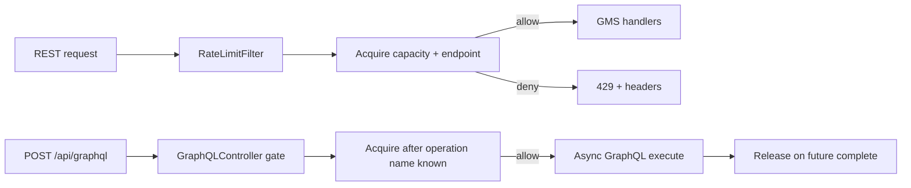

# GMS Rate Limiting

This guide explains how to enable, configure, observe, and troubleshoot **GMS HTTP service rate limiting** — limits on **incoming API traffic to GMS** (GraphQL, OpenAPI, Rest.li, native auth routes). It protects the Metadata Service from overload and caps abuse on sensitive endpoints such as `/auth/signUp`.

## What this is — and is not

DataHub has **three separate load-protection mechanisms**. They are easy to confuse because several can return **429**. This guide covers **only the first**:

| Mechanism                                                                                                                              | What it limits                                                                                 | When it applies                                         | Configuration                                                                                                                        |
| -------------------------------------------------------------------------------------------------------------------------------------- | ---------------------------------------------------------------------------------------------- | ------------------------------------------------------- | ------------------------------------------------------------------------------------------------------------------------------------ |
| **GMS service rate limiting** (**this guide**)                                                                                         | **HTTP requests served by GMS** — UI GraphQL, OpenAPI, Rest.li, `/auth/*` on GMS               | Before/during request handling on the GMS pod           | `RATE_LIMITS_*` env vars; bundled defaults under `datahub.gms.rateLimits` in `application.yaml`                                      |
| **MCP / Kafka ingest throttle** ([`APIThrottle`](https://github.com/datahub-project/datahub/blob/master/metadata-io/src/main/java/com/linkedin/metadata/dao/throttle/APIThrottle.java)) | **Metadata write APIs** when **Kafka consumer lag** (MCL backlog) is too high                  | Backpressure after ingest pipeline falls behind         | `MCP_*` throttle env vars (see [Environment Variables — MCP Throttle](./environment-vars.md#metadata-change-proposal-configuration)) |
| **MCP consumer throttling**                                                                                                            | **Internal MCE/MCL consumer processing** — slows how fast GMS/consumers accept or process MCPs | Pipeline-side backpressure, not a per-client HTTP quota | `MCP_MCE_CONSUMER_THROTTLE_*`, `MCP_VERSIONED_*`, `MCP_TIMESERIES_*`                                                                 |

**This feature does not:**

- Rate-limit **ingestion connectors** (Python CLI, `datahub ingest`) — those are separate clients with their own retry behavior
- Replace **MCP throttle** or **Kafka lag backpressure** — enabling GMS rate limits does not change `metadataChangeProposal.throttle` or consumer lag behavior
- Apply to the **Play frontend** OAuth routes or an external WAF

**Purpose (GMS service rate limiting only)**

GMS rate limiting has two limit types with different semantics:

- **Capacity limits** — Netflix Gradient2 **adaptive in-flight** caps: how many requests of a given class may be executing concurrently on a pod. Sheds serving load before latency and thread pools degrade.
- **Endpoint limits** — Bucket4j **token buckets**: how many requests of a given path may be accepted per refill window (for example sign-up abuse guards on `/auth/signUp`).

### How GMS service rate limiting differs from MCP / Kafka throttling

Both **GMS service rate limiting** and **MCP ingest throttle** can return **429** to API callers, but they answer different questions:

|                       | **GMS service rate limiting**                                                                          | **MCP / Kafka ingest throttle**                                  |
| --------------------- | ------------------------------------------------------------------------------------------------------ | ---------------------------------------------------------------- |
| **Question answered** | “Is this GMS pod accepting more HTTP work right now?”                                                  | “Is the metadata pipeline too far behind to accept more writes?” |
| **Trigger**           | Configured rules + live request latency (Gradient2) or token buckets                                   | Kafka MCL topic backlog / lag                                    |
| **Retry-After**       | Capacity: `minRetryAfterSeconds`. Endpoint: `max(minRetryAfterSeconds, Bucket4j refill wait)` + jitter | Dynamic from lag estimate                                        |
| **Debug headers**     | `X-DataHub-RateLimit-*`                                                                                | Same `X-DataHub-RateLimit-*` (`Type`: `ingest` or `search`)      |
| **Ops entry point**   | `/openapi/v1/rate-limits/*`, `gms.rate_limit.*` metrics                                                | `/openapi/operations/throttle/*`, MCP throttle env vars          |

**Scope**

- GMS HTTP serving path only: GraphQL, OpenAPI, Rest.li, and GMS `/auth/*` routes
- **Capacity limits are per-pod** — no cluster-wide exact cap for adaptive in-flight in v1
- **Endpoint limits** are cluster-wide (distributed via Hazelcast); see [Endpoint limits](#endpoint-limits-token-bucket)

## How it works

Each incoming request is evaluated against **capacity limits** and **endpoint limits** separately. The two types use different algorithms and do not share state.

| Limit type   | Question answered                                                     | Algorithm                                | Rules per request                         |
| ------------ | --------------------------------------------------------------------- | ---------------------------------------- | ----------------------------------------- |
| **Capacity** | “How many requests like this may be in flight on this pod right now?” | Netflix Gradient2 (adaptive concurrency) | **At most one** — finest-grain match wins |
| **Endpoint** | “How many requests like this may be accepted in this time window?”    | Bucket4j token bucket                    | **At most one** — finest-grain match wins |

**Cross-type behavior:** A request must pass **both** checks when both match. For example, `POST /auth/signUp` typically acquires a slot from `_default_capacity` **and** consumes a token from an `auth-signup` endpoint rule. Denial on either type returns 429; if the endpoint bucket denies after capacity was acquired, the capacity slot is released.

**Within a type, rules do not stack.** A GraphQL search request matches either an operation-scoped rule in `capacity.rules` **or** the `capacity.graphql` pool — never both. Finer rules **replace** broader ones for matching traffic; they do not carve a sub-budget out of a parent pool.



### Capacity limits (adaptive in-flight)

Capacity limits cap **concurrent in-flight requests** per rule on each GMS pod. Each enabled capacity rule gets its own independent Gradient2 limiter. Limits adapt up or down based on observed latency for requests that acquired that rule's slot.

**Independent pools — no shared budget.** Capacity rules do **not** coordinate with each other. There is no parent/child accounting: an operation-scoped rule does not subtract from `capacity.graphql`, and neither subtracts from `capacity.default`. Each pool tracks its own in-flight count and adapts independently.

Because pools are disjoint, **total concurrent load on a pod can exceed any single rule's `maxLimit`**. With bundled defaults enabled, worst-case in-flight on one pod is roughly the **sum** of each active pool's current ceiling — for example `_default_capacity` (max 5000) + `_graphql_capacity` (max 2000) + any operation-scoped pools (each with its own max) can all be near their limits at the same time. All pools compete for the same underlying CPU, threads, and datastore, but the limiters do not see each other's pressure.

**Planning guidance:**

- Treat `capacity.default.maxLimit` as the ceiling for Rest.li, OpenAPI, auth, and other non-GraphQL HTTP traffic.
- Treat `capacity.graphql.maxLimit` as the ceiling for GraphQL operations **not** covered by a finer operation rule in `capacity.rules`.
- Treat operation-scoped capacity rules as additional concurrent budgets for heavy queries — not as reductions to the GraphQL pool.
- To enforce a hard total pod ceiling, lower `capacity.default.maxLimit` (and/or disable broader pools) rather than assuming finer rules inherit from a shared parent budget.
- Capacity limits are **per-pod**. Cluster-wide concurrent load is approximately `(GMS replica count) × (sum of per-pool inflight)`. There is no cluster-wide exact cap for adaptive capacity in v1.

**Rule selection (finest grain wins within capacity type):**

| Rank | Match                                                             | Typical rule id           |
| ---- | ----------------------------------------------------------------- | ------------------------- |
| 4    | GraphQL operation name in `graphqlOperationNames`                 | `graphql-search-capacity` |
| 3    | GraphQL path (`capacity.graphql` or path rule without operations) | `_graphql_capacity`       |
| 2    | Non-default path rule (for example `/auth/signUp`)                | custom path rule          |
| 1    | Global default (`capacity.default`)                               | `_default_capacity`       |

**GraphQL lifecycle:** The servlet filter does not acquire capacity for `POST /api/graphql`. The GraphQL controller acquires before execution and releases when the `CompletableFuture` completes. Gradient2 receives `onSuccess` only when the execution has **no GraphQL errors** (HTTP 200 with an `errors` array in the body is treated as a failed execution for adaptive tuning).

**Operation name selection & threat model:** Operation-scoped rule matching (rank 4) uses the request's `operationName`, or when it is omitted the first named operation in the query document. Both are **client-controlled** — the client authors the query and the JSON `operationName`, and the value is **not cross-checked** against the operation actually executed — so a client can rename or mis-name an operation to dodge or re-target an operation-scoped rule. This applies to **both** `capacity.rules` (adaptive, self-correcting) and `endpoint.rules` (hard token buckets): **operation-name matching is advisory, not a security boundary.** For abuse-resistant enforcement, key on dimensions the server observes rather than the client asserts — path/method (`capacity.graphql`, endpoint rules matched by `pathPattern`), the scoped actor chain (`scoped:actor`, keyed on the authenticated actor URN), or the heavy-resolver gate (`scoped.heavyResolvers`, keyed on the server-parsed top-level resolver names) — none of which the client can spoof. Note the unnamed-operation identity is also server-derived (sorted top-level field names). Operation-scoped rules are ignored entirely when `capacity.graphql.operationRulesEnabled=false`.

**Async Spring MVC:** For controllers that return `CompletableFuture` (for example `/auth/*`), the servlet filter registers a servlet `AsyncListener` and holds the capacity slot until async processing completes, times out, or errors — same effective lifecycle as synchronous handlers. GraphQL uses a dedicated controller gate instead of the filter.

| Path class                                  | Async?                                                | Capacity tracking                |
| ------------------------------------------- | ----------------------------------------------------- | -------------------------------- |
| `POST /api/graphql`                         | Yes (`CompletableFuture`)                             | Dedicated controller gate        |
| Rest.li (`/entities/*`, `/aspects/*`, …)    | Internal async, servlet **blocks** on `future.join()` | Filter chain waits for Rest.li   |
| OpenAPI Spring controllers (`/openapi/**`)  | Synchronous in current codebase                       | Servlet filter                   |
| Auth Spring controllers (`/auth/signUp`, …) | Yes — `CompletableFuture.supplyAsync`                 | Servlet filter + `AsyncListener` |

### Endpoint limits (token bucket)

Endpoint limits cap **request rate over time** using Bucket4j token buckets. Each endpoint rule has its own bucket; buckets are independent of capacity pools and of each other.

**Combining with capacity:** Endpoint rules answer a different question than capacity rules. When both match a request, **both must allow** — capacity checks in-flight concurrency, endpoint checks tokens per refill window. A path can be denied because its in-flight pool is full even when tokens remain, or because tokens are exhausted even when in-flight headroom exists.

**Enable flags:** Independent toggles per limiter type (both default to off):

| Flag               | Env var                        | Default | Effect                                |
| ------------------ | ------------------------------ | ------- | ------------------------------------- |
| `capacity.enabled` | `RATE_LIMITS_CAPACITY_ENABLED` | `false` | Adaptive in-flight limits (Gradient2) |
| `endpoint.enabled` | `RATE_LIMITS_ENDPOINT_ENABLED` | `false` | Token-bucket limits (Bucket4j)        |

Enable one or both. Sub-pools (`capacity.default.enabled`, `capacity.graphql.enabled`) and typed rule lists (`capacity.rules`, `endpoint.rules`) further refine enforcement.

**Cluster-wide enforcement (endpoint):**

Endpoint limits always use Bucket4j with shared Hazelcast buckets when `endpoint.enabled=true`. Limits are **cluster totals** — `capacity` and `refill*` apply across all GMS replicas, not per pod.

Provision Hazelcast by setting **`endpoint.enabled=true`** (`RATE_LIMITS_ENDPOINT_ENABLED`). Startup fails if endpoint limits are enabled but Hazelcast cannot be reached. Bucket state is stored in `rateLimits.endpoint.hazelcastMapName` (default `gmsRateLimitEndpointBuckets`). Configure cluster connectivity via `searchService.hazelcast.*` / `SEARCH_SERVICE_HAZELCAST_*` in [Environment Variables — Search](./environment-vars.md#search-service-configuration).

**Planning limits:** Configure `capacity` / `refill*` as cluster-wide caps (e.g. 200 sign-ups/minute total across the fleet).

Example auth rule (under `rateLimits.endpoint` in policy files):

```yaml
rateLimits:
  endpoint:
    enabled: true
    rules:
      - id: auth-signup
        pathPattern: /auth/signUp
        methods: [POST]
        capacity: 200
        refillTokens: 200
        refillPeriodSeconds: 60
```

**429 response**

```json
{ "error": "Rate limit exceeded" }
```

Headers:

| Header                              | Meaning                                                             |
| ----------------------------------- | ------------------------------------------------------------------- |
| `X-DataHub-RateLimit-Rule`          | Winning or denying rule id                                          |
| `X-DataHub-RateLimit-Type`          | `capacity`, `endpoint`, `ingest`, or `search`                       |
| `X-DataHub-RateLimit-Source`        | `servlet-filter`, `graphql-gate`, `metadata-write`, or `opensearch` |
| `X-DataHub-RateLimit-Endpoint-Rule` | Endpoint rule id when both types applied on allow                   |
| `Retry-After`                       | Seconds (429 only)                                                  |

Example:

```bash
curl -sv -X POST http://localhost:8080/auth/signUp -H 'Content-Type: application/json' -d '{}'
```

## Enabling rate limiting

**Default:** off (`capacity.enabled=false`, `endpoint.enabled=false`).

### Staging (env toggles only)

```bash
export RATE_LIMITS_CAPACITY_ENABLED=true
# or: export RATE_LIMITS_ENDPOINT_ENABLED=true
# restart GMS
```

Bundled defaults live under **`datahub.gms.rateLimits`** in `application.yaml` (alongside other GMS settings such as `basePath` and `async`).

### Production checklist

1. Enable the limiter type(s) you need: `RATE_LIMITS_CAPACITY_ENABLED=true` and/or `RATE_LIMITS_ENDPOINT_ENABLED=true`
2. For endpoint caps: `RATE_LIMITS_ENDPOINT_ENABLED=true` (provisions Hazelcast automatically)
3. To override the bundled policy, mount a ConfigMap with your policy file and point `RATE_LIMITS_CONFIG_FILE` at it using a Spring resource prefix (e.g. `file:/etc/datahub/rate-limits.yaml`)
4. Rollout-restart GMS pods (config changes require restart in v1)
5. Verify (requires `Manage System Operations` privilege):
   - `GET /openapi/v1/rate-limits/config` — effective merged config
   - `GET /openapi/v1/rate-limits/status` — live limits on the pod that served the request
   - Prometheus metrics `gms.rate_limit.*`

## Per-actor rate limiting

Per-actor throttling is provided by the **scoped chain's actor bucket** (`scoped:actor`, keyed `{tenantId}:actor:{urn}`), enabled with `scoped.enabled=true`. It applies to **both** GraphQL and REST/OpenAPI/Rest.li (the servlet filter passes the authenticated actor). There is **no bundled per-actor endpoint rule** — `endpoint.rules` is empty by default, and there are no `RATE_LIMITS_PER_ACTOR_*` env vars.

### Scoped chain — how each bucket is keyed

The scoped chain evaluates narrow → broad (`actor` → client class → `global`); the heavy-resolver gate runs separately, after the chain admits the request. What each bucket keys on:

| Bucket               | Key                                                  | Scope                                                                                                                                                                                                                                                                                      |
| -------------------- | ---------------------------------------------------- | ------------------------------------------------------------------------------------------------------------------------------------------------------------------------------------------------------------------------------------------------------------------------------------------ |
| `actor`              | `{tenantId}:actor:{urn}`                             | Per authenticated actor. Always per-actor (its whole purpose); system principal exempt.                                                                                                                                                                                                    |
| `browser` / `sdk`    | `{tenantId}:{class}` — or `{tenantId}:{class}:{urn}` | Per **class per tenant** by default (a shared ceiling for all that class's traffic). With `scoped.<class>.perActor=true` it becomes **per actor within the class**. Set independently per class (`RATE_LIMITS_SCOPED_<CLASS>_PER_ACTOR`), and only applies when `clientClassEnabled=true`. |
| `global`             | `global`                                             | Fleet-wide, **cross-tenant** (un-prefixed, shared map). The absolute backstop.                                                                                                                                                                                                             |
| `heavyResolvers.<f>` | `{tenantId}:op:{resolver}`                           | Per resolver **per tenant** — **always**, never per-actor. Keeping it tenant-wide prevents a tenant from multiplying a hot resolver's budget by spawning users; the `perActor` flag is ignored here.                                                                                       |

Because `global` is the only cross-tenant bucket, size it well above the sum of all per-tenant traffic or it becomes the fleet-wide bottleneck. `tenantId` comes from `RATE_LIMITS_TENANT_ID` (the deployment's `global.id` in Helm); when unset, the tenant-scoped keys are un-prefixed (e.g. `sdk`, `actor:{urn}`), which is fine for a single deployment but collides on a shared store — set it in multi-deployment setups.

A lower-level **`perActor` endpoint-rule** mechanism still exists for advanced, manual per-path use: setting `perActor: true` on an **endpoint** (token-bucket) rule makes GMS keep a separate Bucket4j bucket per authenticated actor URN rather than one shared bucket. You author such a rule yourself (in a mounted config file); nothing enables it by default. Prefer the scoped actor bucket for ordinary per-actor GraphQL throttling.

**Constraints (for a hand-authored `perActor` endpoint rule):**

- `perActor` is supported **only** on `endpoint.rules[]`. Setting it on a `capacity.rules[]` entry causes GMS to refuse to start with `IllegalStateException`.
- Per-actor sharding applies to the **GraphQL POST path only** (`/api/graphql` by default). A `perActor` rule on a non-GraphQL path logs a warning at startup and falls back to pass-through (no per-actor bucket is consulted).
- `perActor` requires `endpoint.enabled=true` (Hazelcast).

**System actor exemption:**

The internal system principal (actor URN matching `DATAHUB_SYSTEM_CLIENT_ID`, default `urn:li:corpuser:__datahub_system`) is resolved to `null` before the rate limit engine is called. A `perActor` rule with a `null` actor URN skips the per-actor consume entirely — the request proceeds without consuming a token. This means high-volume internal GMS operations are never throttled by per-actor rules.

**Bucket lifecycle in Hazelcast:**

Per-actor bucket entries are stored under a composite Hazelcast key `{ruleId}:actor:{actorUrn}`. Entries are evicted after `bucketMaxIdleSeconds` of inactivity (default 300 s, `RATE_LIMITS_ENDPOINT_BUCKET_MAX_IDLE_SECONDS`). An LRU size cap of `bucketMaxSize` entries per node prevents unbounded Hazelcast memory growth (default 100 000, `RATE_LIMITS_ENDPOINT_BUCKET_MAX_SIZE`).

**Merge behavior when overriding via a mounted config file:**

Bundled defaults live in `application.yaml`. A file mounted at `RATE_LIMITS_CONFIG_FILE` is loaded by Spring as a property source and layered on top (it must use a Spring resource prefix, e.g. `file:/etc/datahub/rate-limits.yaml`). Because this is Spring property binding:

- **Scalars and map entries** (e.g. the scoped bucket sizes, `scoped.heavyResolvers.*`) from the mounted file override or add to the bundled values key by key.
- **Rule lists** (`capacity.rules`, `endpoint.rules`) are bound by index, not replaced wholesale — keep rule lists defined in a single source. `application.yaml` ships empty rule lists, so a mounted file that declares rules simply provides them.

```yaml
datahub:
  gms:
    rateLimits:
      endpoint:
        rules:
          - id: auth-signup
            pathPattern: /auth/signUp
            methods: [POST]
            capacity: 200
            refillTokens: 200
            refillPeriodSeconds: 60
```

**Observability for per-actor rules:**

The `gms.rate_limit.endpoint.remaining` metric is **not registered** for `perActor` rules. The ruleId-keyed shared bucket is never consumed by per-actor requests, so its gauge would always read full and mislead operators. Monitor per-actor denials via `gms.rate_limit.requests{outcome=deny,rule_id=<your-rule-id>}` instead.

**Example — hand-authored per-actor GraphQL throttle** (mounted config file; nothing like this ships by default — prefer `scoped:actor`):

```yaml
datahub:
  gms:
    rateLimits:
      endpoint:
        enabled: true
        rules:
          - id: graphql-per-actor
            enabled: true
            pathPattern: /api/graphql
            methods: [POST]
            perActor: true
            capacity: 500
            refillTokens: 500
            refillPeriodSeconds: 60
```

> **Scope of per-actor limiting:** The scoped **actor** bucket (`scoped:actor`) applies to both GraphQL and REST/OpenAPI/Rest.li — the servlet filter passes the authenticated actor, so a noisy SDK principal on REST paths is isolated the same way it is on GraphQL (the system principal and unauthenticated requests are exempt). The browser-vs-SDK **client-class** distinction (`clientClassEnabled`, `scoped:browser`/`scoped:sdk`, modeled as `ClientClass`) also applies across both. By default the class buckets are one shared ceiling per class per tenant, but each class can be flipped to **per-actor** independently via `scoped.<class>.perActor` (`RATE_LIMITS_SCOPED_<CLASS>_PER_ACTOR`) — e.g. give every SDK caller its own tight `sdk` budget (`{tenant}:sdk:{urn}`) while keeping `browser` a shared ceiling. The lower-level `perActor` flag on **endpoint rules** remains GraphQL-POST-only (see the per-actor endpoint-rule constraints above).

## Configuration reference

Bundled defaults live entirely in `application.yaml` (every value env-overridable). No per-actor endpoint rule ships; `endpoint.rules` is empty:

```yaml
rateLimits:
  failOpen: true
  minRetryAfterSeconds: 60
  retryAfterJitterPercent: 10
  excludedPaths: /health,/health/live,/actuator/prometheus,/openapi/v1/rate-limits/**
  capacity:
    enabled: false # RATE_LIMITS_CAPACITY_ENABLED
    default:
      enabled: true # RATE_LIMITS_CAPACITY_DEFAULT_ENABLED
      initialLimit: 200 # RATE_LIMITS_CAPACITY_DEFAULT_INITIAL_LIMIT
      minLimit: 20 # RATE_LIMITS_CAPACITY_DEFAULT_MIN_LIMIT
      maxLimit: 5000 # RATE_LIMITS_CAPACITY_DEFAULT_MAX_LIMIT
    graphql:
      enabled: true # RATE_LIMITS_CAPACITY_GRAPHQL_ENABLED
      pathPattern: /api/graphql # RATE_LIMITS_CAPACITY_GRAPHQL_PATH_PATTERN
      operationRulesEnabled: true # RATE_LIMITS_CAPACITY_GRAPHQL_OPERATION_RULES_ENABLED
      initialLimit: 100 # RATE_LIMITS_CAPACITY_GRAPHQL_INITIAL_LIMIT
      minLimit: 20 # RATE_LIMITS_CAPACITY_GRAPHQL_MIN_LIMIT
      maxLimit: 2000 # RATE_LIMITS_CAPACITY_GRAPHQL_MAX_LIMIT
    rules: []
  endpoint:
    enabled: false # RATE_LIMITS_ENDPOINT_ENABLED
    hazelcastMapName: gmsRateLimitEndpointBuckets # RATE_LIMITS_ENDPOINT_HAZELCAST_MAP
    bucketMaxIdleSeconds: 300 # RATE_LIMITS_ENDPOINT_BUCKET_MAX_IDLE_SECONDS
    bucketMaxSize: 100000 # RATE_LIMITS_ENDPOINT_BUCKET_MAX_SIZE
    rules: []
  scoped:
    enabled: false # RATE_LIMITS_SCOPED_ENABLED
    refundDisabled: false # RATE_LIMITS_SCOPED_REFUND_DISABLED
    # Bucket sizes (env-overridable per deployment). Each field has its own env var:
    # RATE_LIMITS_SCOPED_<BUCKET>_{CAPACITY,REFILL_TOKENS,REFILL_PERIOD_SECONDS}.
    # refillTokens defaults to that bucket's CAPACITY; refillPeriodSeconds defaults to 60.
    # perActor (browser/sdk only): true → key that class bucket per actor; false (default) → one
    # shared ceiling per class per tenant. RATE_LIMITS_SCOPED_<CLASS>_PER_ACTOR.
    actor: { capacity: 2000, refillTokens: 2000, refillPeriodSeconds: 60 }
    browser:
      {
        perActor: false,
        capacity: 5000,
        refillTokens: 5000,
        refillPeriodSeconds: 60,
      }
    sdk:
      {
        perActor: false,
        capacity: 500,
        refillTokens: 500,
        refillPeriodSeconds: 60,
      }
    global: { capacity: 20000, refillTokens: 20000, refillPeriodSeconds: 60 }
    heavyResolvers: {} # per-resolver buckets, always per-tenant; add via mounted file
  metrics:
    detailed: false
```

### Tier 1 — environment toggles

Key environment variables (full list at [Environment Variables — GMS Rate Limiting](./environment-vars.md#gms-rate-limiting)):

| Environment variable                                   | Default                       | Description                                                                                                                                                                                                                           |
| ------------------------------------------------------ | ----------------------------- | ------------------------------------------------------------------------------------------------------------------------------------------------------------------------------------------------------------------------------------- |
| `RATE_LIMITS_CAPACITY_ENABLED`                         | `false`                       | Enable adaptive in-flight (Gradient2) capacity limiting                                                                                                                                                                               |
| `RATE_LIMITS_ENDPOINT_ENABLED`                         | `false`                       | Enable token-bucket endpoint limiting (requires Hazelcast)                                                                                                                                                                            |
| `RATE_LIMITS_FAIL_OPEN`                                | `true`                        | Allow requests when evaluation throws an unexpected error                                                                                                                                                                             |
| `RATE_LIMITS_MIN_RETRY_AFTER`                          | `60`                          | Minimum `Retry-After` seconds on 429 responses                                                                                                                                                                                        |
| `RATE_LIMITS_RETRY_AFTER_JITTER_PERCENT`               | `10`                          | Jitter percentage added to `Retry-After`                                                                                                                                                                                              |
| `RATE_LIMITS_EXCLUDED_PATHS`                           | `/health,/health/live,...`    | Comma-separated Ant paths excluded from all rate limiting                                                                                                                                                                             |
| `RATE_LIMITS_CONFIG_FILE`                              | _(unset)_                     | Spring resource URI of an override policy file, layered on the bundled defaults — must include a prefix (e.g. `file:/etc/datahub/rate-limits.yaml`)                                                                                   |
| `RATE_LIMITS_METRICS_DETAILED`                         | `false`                       | Enable detailed per-rule metric tags                                                                                                                                                                                                  |
| `RATE_LIMITS_CAPACITY_DEFAULT_ENABLED`                 | `true`                        | Enable `_default_capacity` pool                                                                                                                                                                                                       |
| `RATE_LIMITS_CAPACITY_DEFAULT_INITIAL_LIMIT`           | `200`                         | Gradient2 starting limit for default pool                                                                                                                                                                                             |
| `RATE_LIMITS_CAPACITY_DEFAULT_MIN_LIMIT`               | `20`                          | Gradient2 floor for default pool                                                                                                                                                                                                      |
| `RATE_LIMITS_CAPACITY_DEFAULT_MAX_LIMIT`               | `5000`                        | Gradient2 ceiling for default pool                                                                                                                                                                                                    |
| `RATE_LIMITS_CAPACITY_GRAPHQL_ENABLED`                 | `true`                        | Enable `_graphql_capacity` pool                                                                                                                                                                                                       |
| `RATE_LIMITS_CAPACITY_GRAPHQL_PATH_PATTERN`            | `/api/graphql`                | Path matched by the GraphQL capacity pool                                                                                                                                                                                             |
| `RATE_LIMITS_CAPACITY_GRAPHQL_OPERATION_RULES_ENABLED` | `true`                        | Allow per-operation capacity rules for GraphQL                                                                                                                                                                                        |
| `RATE_LIMITS_CAPACITY_GRAPHQL_INITIAL_LIMIT`           | `100`                         | Gradient2 starting limit for GraphQL pool                                                                                                                                                                                             |
| `RATE_LIMITS_CAPACITY_GRAPHQL_MIN_LIMIT`               | `20`                          | Gradient2 floor for GraphQL pool                                                                                                                                                                                                      |
| `RATE_LIMITS_CAPACITY_GRAPHQL_MAX_LIMIT`               | `2000`                        | Gradient2 ceiling for GraphQL pool                                                                                                                                                                                                    |
| `RATE_LIMITS_ENDPOINT_HAZELCAST_MAP`                   | `gmsRateLimitEndpointBuckets` | Hazelcast map name for endpoint buckets                                                                                                                                                                                               |
| `RATE_LIMITS_ENDPOINT_BUCKET_MAX_IDLE_SECONDS`         | `300`                         | Idle eviction window (seconds) for per-actor bucket entries                                                                                                                                                                           |
| `RATE_LIMITS_ENDPOINT_BUCKET_MAX_SIZE`                 | `100000`                      | LRU size cap for endpoint bucket entries per Hazelcast node                                                                                                                                                                           |
| `RATE_LIMITS_SCOPED_ENABLED`                           | `false`                       | Enable the scoped chain (per-actor → class → global)                                                                                                                                                                                  |
| `RATE_LIMITS_SCOPED_ACTOR_CAPACITY`                    | `2000`                        | Per-actor (`scoped:actor`) bucket size — the per-actor GraphQL throttle                                                                                                                                                               |
| `RATE_LIMITS_SCOPED_SDK_CAPACITY`                      | `500`                         | SDK/non-browser class (`scoped:sdk`) bucket size                                                                                                                                                                                      |
| `RATE_LIMITS_SCOPED_BROWSER_CAPACITY`                  | `5000`                        | Browser class (`scoped:browser`) bucket size                                                                                                                                                                                          |
| `RATE_LIMITS_SCOPED_GLOBAL_CAPACITY`                   | `20000`                       | Fleet-wide (`scoped:global`) ceiling                                                                                                                                                                                                  |
| `RATE_LIMITS_SCOPED_<BUCKET>_REFILL_TOKENS`            | _(= bucket capacity)_         | Tokens refilled per period for `<BUCKET>` (`ACTOR`/`BROWSER`/`SDK`/`GLOBAL`); defaults to that bucket's capacity                                                                                                                      |
| `RATE_LIMITS_SCOPED_<BUCKET>_REFILL_PERIOD_SECONDS`    | `60`                          | Refill period (seconds) for `<BUCKET>` (`ACTOR`/`BROWSER`/`SDK`/`GLOBAL`)                                                                                                                                                             |
| `RATE_LIMITS_SCOPED_<BUCKET>_PER_ACTOR`                | `false`                       | `BROWSER`/`SDK` only: `true` keys that class bucket per actor (`{tenant}:{class}:{urn}`); `false` = one shared ceiling per class per tenant. Set independently per class. Ignored for `ACTOR` (already per-actor) / `GLOBAL` (fleet). |

### Tier 2 — override policy file

Bundled defaults ship in `application.yaml` (Tier 1). To override them per deployment, mount your own file and point `RATE_LIMITS_CONFIG_FILE` at it **with a Spring resource prefix** (e.g. `file:/etc/datahub/rate-limits.yaml`); it is loaded as a property source and layered on top. When `RATE_LIMITS_CONFIG_FILE` is unset it resolves to the bundled `rate-limit-config.yaml`, which is empty and contributes nothing. Override files use the full **`datahub.gms.rateLimits:`** path (the same keys Spring binds), not a bare `rateLimits:` fragment.

**Merge behavior:** scalars and map entries override/add key by key; rule lists are index-bound, so define each rule list in a single source (`application.yaml` ships empty rule lists). Most per-tenant tuning is done with `RATE_LIMITS_SCOPED_*` env vars rather than a file — the override file is mainly for the `scoped.heavyResolvers` map and rule lists, which a scalar env var can't express (and which are empty in the bundled defaults, so a mounted file simply provides them).

**How it loads (and what changed):** both the bundled defaults and the mounted override are loaded as ordinary Spring `@PropertySource`s and bound to `RateLimitProperties` via relaxed `@ConfigurationProperties` binding — the same path `application.yaml` already uses. There is no bespoke config loader. This is intentionally simpler than an earlier design that used a custom Jackson loader, and it means:

- The mounted override is enabled just by pointing `RATE_LIMITS_CONFIG_FILE` at a file (presence = enabled). There is **no** separate `RATE_LIMITS_CONFIG_FILE_ENABLED` flag.
- There is **no** inline-JSON overlay env var (`RATE_LIMITS_CONFIG_JSON`). Put overrides in the mounted YAML file instead.
- `${ENV:default}` placeholders resolve uniformly, and OS environment variables outrank both files — so `RATE_LIMITS_*` env vars always win, which is the recommended way to tune scalars per deployment.

`RATE_LIMITS_CONFIG_FILE_ENABLED` and `RATE_LIMITS_CONFIG_JSON` are no longer honored; GMS logs a startup WARN if either is set so the change isn't silent. Benefits of the `@PropertySource` approach: one well-understood binding/precedence model (identical to the rest of GMS config), no custom merge code to maintain, and env-var overrides that reliably take precedence.

```yaml
datahub:
  gms:
    rateLimits:
      capacity:
        rules:
          - id: graphql-search-capacity
            pathPattern: /api/graphql
            methods: [POST]
            graphqlOperationNames: [searchAcrossEntities, scrollAcrossEntities]
            initialLimit: 30
            maxLimit: 400
      endpoint:
        rules:
          - id: auth-signup
            pathPattern: /auth/signUp
            methods: [POST]
            capacity: 200
            refillTokens: 200
            refillPeriodSeconds: 60
      scoped:
        heavyResolvers:
          searchAcrossEntities:
            { capacity: 100, refillTokens: 100, refillPeriodSeconds: 60 }
```

Helm-style wiring:

```yaml
env:
  - name: RATE_LIMITS_ENDPOINT_ENABLED
    value: "true"
  - name: RATE_LIMITS_CAPACITY_ENABLED
    value: "true"
  # Spring resource URI — note the file: prefix.
  - name: RATE_LIMITS_CONFIG_FILE
    value: file:/etc/datahub/rate-limits/rate-limits.yaml
volumeMounts:
  - name: rate-limits-config
    mountPath: /etc/datahub/rate-limits
    readOnly: true
volumes:
  - name: rate-limits-config
    configMap:
      name: datahub-rate-limits
```

### Base path

Author **logical paths** in config (`/api/graphql`, `/auth/signUp`). GMS strips the configured base path at runtime. See [Base Path Configuration](./BASE_PATH_CONFIGURATION.md).

## Rule types (quick reference)

| Config source                          | Type     | Semantics                                                                 | Example                                    |
| -------------------------------------- | -------- | ------------------------------------------------------------------------- | ------------------------------------------ |
| `capacity.default`                     | Capacity | Global adaptive in-flight per pod                                         | Rest.li, OpenAPI, auth fallback            |
| `capacity.graphql`                     | Capacity | GraphQL POST adaptive in-flight per pod                                   | UI load ceiling                            |
| `capacity.rules[]`                     | Capacity | Finer adaptive in-flight pool (replaces broader match)                    | `searchAcrossEntities`                     |
| `endpoint.rules[]` (`perActor: false`) | Endpoint | Shared token-bucket rate per refill window (cluster-wide)                 | `/auth/signUp`, `batchIngest`              |
| `scoped:actor`                         | Scoped   | Per-actor token-bucket; each authenticated actor has an independent quota | per-actor GraphQL throttle (default model) |
| `endpoint.rules[]` (`perActor: true`)  | Endpoint | Per-actor token-bucket on a hand-authored rule (advanced; none ships)     | manual per-path rule                       |

See [Capacity limits (adaptive in-flight)](#capacity-limits-adaptive-in-flight) and [Endpoint limits (token bucket)](#endpoint-limits-token-bucket) for selection, pooling, and planning details.

## Observability

Prometheus metrics (tagged by `rule_id`, `type`, `outcome`, and optionally `graphql_operation`):

| Metric                              | Description                                                                               |
| ----------------------------------- | ----------------------------------------------------------------------------------------- |
| `gms.rate_limit.requests`           | Allow/deny counts                                                                         |
| `gms.rate_limit.adaptive.limit`     | Current Gradient2 ceiling                                                                 |
| `gms.rate_limit.adaptive.inflight`  | In-flight gauge                                                                           |
| `gms.rate_limit.endpoint.remaining` | Token bucket headroom                                                                     |
| `gms.rate_limit.fail_open`          | Fail-open events (eval threw, request allowed because `failOpen=true`), tagged by `stage` |

`gms.rate_limit.requests` sets `graphql_operation` to the resolved operation name **only when an operation-scoped rule matched** (a rule with `graphqlOperationNames`); otherwise `none`. This bounds metric cardinality — arbitrary client-supplied operation names on the general GraphQL pool are not tagged.

**Sampling — important for reading `outcome=allow`:** to keep hot-path overhead low, **allowed** requests are recorded at a 1-in-100 sample rate, while **denied** requests are always recorded. So `gms.rate_limit.requests{outcome=allow}` undercounts actual allowed traffic by ~100× — multiply by 100 for an approximate volume, and never compute an exact allow/deny ratio from the raw counters. The ×100 estimate is a Poisson sample and has **high relative variance at low volumes**: a handful of sampled events implies a wide confidence interval (e.g. ~10 sampled ≈ 1,000 ± ~300), so treat low-traffic allow counts as rough order-of-magnitude only and prefer longer windows or `metrics.detailed` when you need accuracy. Deny-based alerting is unaffected (denials are exact). Set `RATE_LIMITS_METRICS_DETAILED=true` (`metrics.detailed`) to disable sampling and record every request (higher cardinality/overhead — use selectively).

Suggested alerts: sustained `outcome=deny`, adaptive limit pinned at `minLimit`, endpoint remaining near zero on auth rules. **Alert on any sustained `gms.rate_limit.fail_open` rate** — fail-open means rate-limit evaluation is throwing (e.g. Hazelcast connectivity loss) and requests are passing unlimited, so the protection is effectively off until it clears; there is no circuit-breaker, so this metric is the signal to investigate. For capacity planning, sum `gms.rate_limit.adaptive.inflight` across `rule_id` tags on a pod — each tag is an independent pool.

**Inspection API** (`Manage System Operations` privilege):

| Endpoint                             | Purpose                                       |
| ------------------------------------ | --------------------------------------------- |
| `GET /openapi/v1/rate-limits/config` | Effective merged configuration                |
| `GET /openapi/v1/rate-limits/status` | Live state on the pod that served the request |

Status response includes `capacityEnabled`, `endpointEnabled`, `scopedEnabled`, plus per-rule `adaptive` (limit/inflight) and `endpoint` (remaining/capacity) maps, and a `scoped` map with the fixed-key buckets (`global`, `browser`, `sdk` — each remaining/capacity). Per-actor scoped buckets are omitted since their keys are unbounded.
