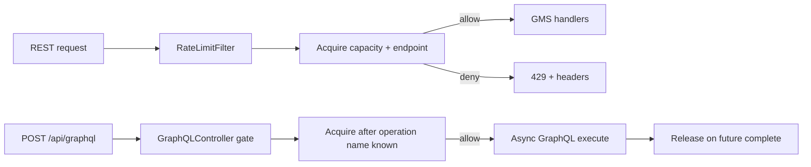

# GMS Rate Limiting

This guide explains how to enable, configure, observe, and troubleshoot **GMS HTTP service rate limiting** — limits on **incoming API traffic to GMS** (GraphQL, OpenAPI, Rest.li, native auth routes). It protects the Metadata Service from overload and caps abuse on sensitive endpoints such as `/auth/signUp`.

## What this is — and is not

DataHub has **three separate load-protection mechanisms**. They are easy to confuse because several can return **429**. This guide covers **only the first**:

| Mechanism                                                                                                                              | What it limits                                                                                 | When it applies                                         | Configuration                                                                                                                        |
| -------------------------------------------------------------------------------------------------------------------------------------- | ---------------------------------------------------------------------------------------------- | ------------------------------------------------------- | ------------------------------------------------------------------------------------------------------------------------------------ |
| **GMS service rate limiting** (**this guide**)                                                                                         | **HTTP requests served by GMS** — UI GraphQL, OpenAPI, Rest.li, `/auth/*` on GMS               | Before/during request handling on the GMS pod           | `RATE_LIMITS_*` env vars; bundled defaults under `datahub.gms.rateLimits` in `application.yaml`                                      |
| **MCP / Kafka ingest throttle** ([`APIThrottle`](../../metadata-io/src/main/java/com/linkedin/metadata/dao/throttle/APIThrottle.java)) | **Metadata write APIs** when **Kafka consumer lag** (MCL backlog) is too high                  | Backpressure after ingest pipeline falls behind         | `MCP_*` throttle env vars (see [Environment Variables — MCP Throttle](./environment-vars.md#metadata-change-proposal-configuration)) |
| **MCP consumer throttling**                                                                                                            | **Internal MCE/MCL consumer processing** — slows how fast GMS/consumers accept or process MCPs | Pipeline-side backpressure, not a per-client HTTP quota | `MCP_MCE_CONSUMER_THROTTLE_*`, `MCP_VERSIONED_*`, `MCP_TIMESERIES_*`                                                                 |

**This feature does not:**

- Rate-limit **ingestion connectors** (Python CLI, `datahub ingest`) — those are separate clients with their own retry behavior
- Replace **MCP throttle** or **Kafka lag backpressure** — enabling GMS rate limits does not change `metadataChangeProposal.throttle` or consumer lag behavior
- Apply to the **Play frontend** OAuth routes or an external WAF

**Purpose (GMS service rate limiting only)**

GMS rate limiting has two limit types with different semantics:

- **Capacity limits** — Netflix Gradient2 **adaptive in-flight** caps: how many requests of a given class may be executing concurrently on a pod. Sheds serving load before latency and thread pools degrade.
- **Endpoint limits** — Bucket4j **token buckets**: how many requests of a given path may be accepted per refill window (for example sign-up abuse guards on `/auth/signUp`).

### How GMS service rate limiting differs from MCP / Kafka throttling

Both **GMS service rate limiting** and **MCP ingest throttle** can return **429** to API callers, but they answer different questions:

|                       | **GMS service rate limiting**                                                                          | **MCP / Kafka ingest throttle**                                  |
| --------------------- | ------------------------------------------------------------------------------------------------------ | ---------------------------------------------------------------- |
| **Question answered** | “Is this GMS pod accepting more HTTP work right now?”                                                  | “Is the metadata pipeline too far behind to accept more writes?” |
| **Trigger**           | Configured rules + live request latency (Gradient2) or token buckets                                   | Kafka MCL topic backlog / lag                                    |
| **Retry-After**       | Capacity: `minRetryAfterSeconds`. Endpoint: `max(minRetryAfterSeconds, Bucket4j refill wait)` + jitter | Dynamic from lag estimate                                        |
| **Debug headers**     | `X-DataHub-RateLimit-*`                                                                                | Same `X-DataHub-RateLimit-*` (`Type`: `ingest` or `search`)      |
| **Ops entry point**   | `/openapi/v1/rate-limits/*`, `gms.rate_limit.*` metrics                                                | `/openapi/operations/throttle/*`, MCP throttle env vars          |

**Scope**

- GMS HTTP serving path only: GraphQL, OpenAPI, Rest.li, and GMS `/auth/*` routes
- **Capacity limits are per-pod** — no cluster-wide exact cap for adaptive in-flight in v1
- **Endpoint limits** are cluster-wide (distributed via Hazelcast); see [Endpoint limits](#endpoint-limits-token-bucket)

## How it works

Each incoming request is evaluated against **capacity limits** and **endpoint limits** separately. The two types use different algorithms and do not share state.

| Limit type   | Question answered                                                     | Algorithm                                | Rules per request                         |
| ------------ | --------------------------------------------------------------------- | ---------------------------------------- | ----------------------------------------- |
| **Capacity** | “How many requests like this may be in flight on this pod right now?” | Netflix Gradient2 (adaptive concurrency) | **At most one** — finest-grain match wins |
| **Endpoint** | “How many requests like this may be accepted in this time window?”    | Bucket4j token bucket                    | **At most one** — finest-grain match wins |

**Cross-type behavior:** A request must pass **both** checks when both match. For example, `POST /auth/signUp` typically acquires a slot from `_default_capacity` **and** consumes a token from an `auth-signup` endpoint rule. Denial on either type returns 429; if the endpoint bucket denies after capacity was acquired, the capacity slot is released.

**Within a type, rules do not stack.** A GraphQL search request matches either an operation-scoped rule in `capacity.rules` **or** the `capacity.graphql` pool — never both. Finer rules **replace** broader ones for matching traffic; they do not carve a sub-budget out of a parent pool.



### Capacity limits (adaptive in-flight)

Capacity limits cap **concurrent in-flight requests** per rule on each GMS pod. Each enabled capacity rule gets its own independent Gradient2 limiter. Limits adapt up or down based on observed latency for requests that acquired that rule's slot.

**Independent pools — no shared budget.** Capacity rules do **not** coordinate with each other. There is no parent/child accounting: an operation-scoped rule does not subtract from `capacity.graphql`, and neither subtracts from `capacity.default`. Each pool tracks its own in-flight count and adapts independently.

Because pools are disjoint, **total concurrent load on a pod can exceed any single rule's `maxLimit`**. With bundled defaults enabled, worst-case in-flight on one pod is roughly the **sum** of each active pool's current ceiling — for example `_default_capacity` (max 5000) + `_graphql_capacity` (max 2000) + any operation-scoped pools (each with its own max) can all be near their limits at the same time. All pools compete for the same underlying CPU, threads, and datastore, but the limiters do not see each other's pressure.

**Planning guidance:**

- Treat `capacity.default.maxLimit` as the ceiling for Rest.li, OpenAPI, auth, and other non-GraphQL HTTP traffic.
- Treat `capacity.graphql.maxLimit` as the ceiling for GraphQL operations **not** covered by a finer operation rule in `capacity.rules`.
- Treat operation-scoped capacity rules as additional concurrent budgets for heavy queries — not as reductions to the GraphQL pool.
- To enforce a hard total pod ceiling, lower `capacity.default.maxLimit` (and/or disable broader pools) rather than assuming finer rules inherit from a shared parent budget.
- Capacity limits are **per-pod**. Cluster-wide concurrent load is approximately `(GMS replica count) × (sum of per-pool inflight)`. There is no cluster-wide exact cap for adaptive capacity in v1.

**Rule selection (finest grain wins within capacity type):**

| Rank | Match                                                             | Typical rule id           |
| ---- | ----------------------------------------------------------------- | ------------------------- |
| 4    | GraphQL operation name in `graphqlOperationNames`                 | `graphql-search-capacity` |
| 3    | GraphQL path (`capacity.graphql` or path rule without operations) | `_graphql_capacity`       |
| 2    | Non-default path rule (for example `/auth/signUp`)                | custom path rule          |
| 1    | Global default (`capacity.default`)                               | `_default_capacity`       |

**GraphQL lifecycle:** The servlet filter does not acquire capacity for `POST /api/graphql`. The GraphQL controller acquires before execution and releases when the `CompletableFuture` completes. Gradient2 receives `onSuccess` only when the execution has **no GraphQL errors** (HTTP 200 with an `errors` array in the body is treated as a failed execution for adaptive tuning).

**Operation name selection:** Rule matching uses the request's `operationName` field when present. That value is **not cross-checked** against the parsed query document — a client can supply a less-restrictive operation name to bypass operation-scoped capacity rules (rank 4). When `operationName` is omitted, the server derives a name from the document (first named operation, or `graphql`). For abuse-sensitive deployments, prefer path-level limits (`capacity.graphql`), auth, or edge controls rather than relying solely on per-operation rules. Operation-scoped rules in `capacity.rules` / `endpoint.rules` are ignored when `capacity.graphql.operationRulesEnabled=false`.

**Async Spring MVC:** For controllers that return `CompletableFuture` (for example `/auth/*`), the servlet filter registers a servlet `AsyncListener` and holds the capacity slot until async processing completes, times out, or errors — same effective lifecycle as synchronous handlers. GraphQL uses a dedicated controller gate instead of the filter.

| Path class                                  | Async?                                                | Capacity tracking                |
| ------------------------------------------- | ----------------------------------------------------- | -------------------------------- |
| `POST /api/graphql`                         | Yes (`CompletableFuture`)                             | Dedicated controller gate        |
| Rest.li (`/entities/*`, `/aspects/*`, …)    | Internal async, servlet **blocks** on `future.join()` | Filter chain waits for Rest.li   |
| OpenAPI Spring controllers (`/openapi/**`)  | Synchronous in current codebase                       | Servlet filter                   |
| Auth Spring controllers (`/auth/signUp`, …) | Yes — `CompletableFuture.supplyAsync`                 | Servlet filter + `AsyncListener` |

### Endpoint limits (token bucket)

Endpoint limits cap **request rate over time** using Bucket4j token buckets. Each endpoint rule has its own bucket; buckets are independent of capacity pools and of each other.

**Combining with capacity:** Endpoint rules answer a different question than capacity rules. When both match a request, **both must allow** — capacity checks in-flight concurrency, endpoint checks tokens per refill window. A path can be denied because its in-flight pool is full even when tokens remain, or because tokens are exhausted even when in-flight headroom exists.

**Enable flags:** Independent toggles per limiter type (both default to off):

| Flag               | Env var                        | Default | Effect                                |
| ------------------ | ------------------------------ | ------- | ------------------------------------- |
| `capacity.enabled` | `RATE_LIMITS_CAPACITY_ENABLED` | `false` | Adaptive in-flight limits (Gradient2) |
| `endpoint.enabled` | `RATE_LIMITS_ENDPOINT_ENABLED` | `false` | Token-bucket limits (Bucket4j)        |

Enable one or both. Sub-pools (`capacity.default.enabled`, `capacity.graphql.enabled`) and typed rule lists (`capacity.rules`, `endpoint.rules`) further refine enforcement.

**Cluster-wide enforcement (endpoint):**

Endpoint limits always use Bucket4j with shared Hazelcast buckets when `endpoint.enabled=true`. Limits are **cluster totals** — `capacity` and `refill*` apply across all GMS replicas, not per pod.

Provision Hazelcast by setting **`endpoint.enabled=true`** (`RATE_LIMITS_ENDPOINT_ENABLED`). Startup fails if endpoint limits are enabled but Hazelcast cannot be reached. A `HazelcastInstance` is also created when `searchService.cacheImplementation=hazelcast` (search cache — separate from rate limiting).

**Planning limits:** Configure `capacity` / `refill*` as cluster-wide caps (e.g. 200 sign-ups/minute total across the fleet).

Example auth rule (under `rateLimits.endpoint` in policy files):

```yaml
rateLimits:
  endpoint:
    enabled: true
    rules:
      - id: auth-signup
        pathPattern: /auth/signUp
        methods: [POST]
        capacity: 200
        refillTokens: 200
        refillPeriodSeconds: 60
```

**429 response**

```json
{ "error": "Rate limit exceeded" }
```

Headers:

| Header                              | Meaning                                                             |
| ----------------------------------- | ------------------------------------------------------------------- |
| `X-DataHub-RateLimit-Rule`          | Winning or denying rule id                                          |
| `X-DataHub-RateLimit-Type`          | `capacity`, `endpoint`, `ingest`, or `search`                       |
| `X-DataHub-RateLimit-Source`        | `servlet-filter`, `graphql-gate`, `metadata-write`, or `opensearch` |
| `X-DataHub-RateLimit-Endpoint-Rule` | Endpoint rule id when both types applied on allow                   |
| `Retry-After`                       | Seconds (429 only)                                                  |

Example:

```bash
curl -sv -X POST http://localhost:8080/auth/signUp -H 'Content-Type: application/json' -d '{}'
```

## Enabling rate limiting

**Default:** off (`capacity.enabled=false`, `endpoint.enabled=false`).

### Staging (env toggles only)

```bash
export RATE_LIMITS_CAPACITY_ENABLED=true
# or: export RATE_LIMITS_ENDPOINT_ENABLED=true
# restart GMS
```

Bundled defaults live under **`datahub.gms.rateLimits`** in `application.yaml` (alongside other GMS settings such as `basePath` and `async`).

### Production checklist

1. Enable the limiter type(s) you need: `RATE_LIMITS_CAPACITY_ENABLED=true` and/or `RATE_LIMITS_ENDPOINT_ENABLED=true`
2. For endpoint caps: `RATE_LIMITS_ENDPOINT_ENABLED=true` (provisions Hazelcast automatically)
3. Mount a ConfigMap with your policy file and set `RATE_LIMITS_CONFIG_FILE_ENABLED=true`
4. Rollout-restart GMS pods (config changes require restart in v1)
5. Verify (requires `Manage System Operations` privilege):
   - `GET /openapi/v1/rate-limits/config` — effective merged config
   - `GET /openapi/v1/rate-limits/status` — live limits on the pod that served the request
   - Prometheus metrics `gms.rate_limit.*`

## Configuration reference

Bundled defaults:

```yaml
rateLimits:
  failOpen: true
  minRetryAfterSeconds: 60
  retryAfterJitterPercent: 10
  excludedPaths: /health,/health/live,/actuator/prometheus,/openapi/v1/rate-limits/**
  configFile:
    enabled: false
    path: /etc/datahub/rate-limits.yaml
  capacity:
    enabled: false # RATE_LIMITS_CAPACITY_ENABLED
    default:
      enabled: true # RATE_LIMITS_CAPACITY_DEFAULT_ENABLED
      initialLimit: 200 # RATE_LIMITS_CAPACITY_DEFAULT_INITIAL_LIMIT
      minLimit: 20 # RATE_LIMITS_CAPACITY_DEFAULT_MIN_LIMIT
      maxLimit: 5000 # RATE_LIMITS_CAPACITY_DEFAULT_MAX_LIMIT
    graphql:
      enabled: true # RATE_LIMITS_CAPACITY_GRAPHQL_ENABLED
      pathPattern: /api/graphql # RATE_LIMITS_CAPACITY_GRAPHQL_PATH_PATTERN
      operationRulesEnabled: true # RATE_LIMITS_CAPACITY_GRAPHQL_OPERATION_RULES_ENABLED
      initialLimit: 100 # RATE_LIMITS_CAPACITY_GRAPHQL_INITIAL_LIMIT
      minLimit: 20 # RATE_LIMITS_CAPACITY_GRAPHQL_MIN_LIMIT
      maxLimit: 2000 # RATE_LIMITS_CAPACITY_GRAPHQL_MAX_LIMIT
    rules: []
  endpoint:
    enabled: false # RATE_LIMITS_ENDPOINT_ENABLED
    hazelcastMapName: gmsRateLimitEndpointBuckets
    rules: []
  metrics:
    detailed: false
```

### Tier 1 — environment toggles

See [Environment Variables — GMS Rate Limiting](./environment-vars.md#gms-rate-limiting).

### Tier 2 — external YAML file

Mount production policy at `/etc/datahub/rate-limits.yaml` (or custom path). External files use a top-level **`rateLimits:`** fragment (the loader merges it into `datahub.gms.rateLimits`):

```yaml
rateLimits:
  capacity:
    enabled: true
    default:
      enabled: true
      initialLimit: 200
      maxLimit: 5000
    graphql:
      enabled: true
      initialLimit: 100
      maxLimit: 2000
    rules:
      - id: graphql-search-capacity
        pathPattern: /api/graphql
        methods: [POST]
        graphqlOperationNames: [searchAcrossEntities, scrollAcrossEntities]
        initialLimit: 30
        maxLimit: 400
  endpoint:
    enabled: true
    rules:
      - id: auth-signup
        pathPattern: /auth/signUp
        methods: [POST]
        capacity: 200
        refillTokens: 200
        refillPeriodSeconds: 60
```

Helm-style wiring:

```yaml
env:
  - name: RATE_LIMITS_ENDPOINT_ENABLED
    value: "true"
  - name: RATE_LIMITS_CAPACITY_ENABLED
    value: "true"
  - name: RATE_LIMITS_CONFIG_FILE_ENABLED
    value: "true"
  - name: RATE_LIMITS_CONFIG_FILE
    value: /etc/datahub/rate-limits/rate-limits.yaml
volumeMounts:
  - name: rate-limits-config
    mountPath: /etc/datahub/rate-limits
    readOnly: true
volumes:
  - name: rate-limits-config
    configMap:
      name: datahub-rate-limits
```

### Tier 3 — `RATE_LIMITS_CONFIG_JSON`

Optional emergency overlay (merged after the file). Must be valid JSON partial or full `rateLimits` object. Invalid JSON fails startup.

### Base path

Author **logical paths** in config (`/api/graphql`, `/auth/signUp`). GMS strips the configured base path at runtime. See [Base Path Configuration](./BASE_PATH_CONFIGURATION.md).

## Rule types (quick reference)

| Config source      | Type     | Semantics                                              | Example                         |
| ------------------ | -------- | ------------------------------------------------------ | ------------------------------- |
| `capacity.default` | Capacity | Global adaptive in-flight per pod                      | Rest.li, OpenAPI, auth fallback |
| `capacity.graphql` | Capacity | GraphQL POST adaptive in-flight per pod                | UI load ceiling                 |
| `capacity.rules[]` | Capacity | Finer adaptive in-flight pool (replaces broader match) | `searchAcrossEntities`          |
| `endpoint.rules[]` | Endpoint | Token-bucket rate per refill window                    | `/auth/signUp`, `batchIngest`   |

See [Capacity limits (adaptive in-flight)](#capacity-limits-adaptive-in-flight) and [Endpoint limits (token bucket)](#endpoint-limits-token-bucket) for selection, pooling, and planning details.

## Observability

Prometheus metrics (tagged by `rule_id`, `type`, `outcome`, and optionally `graphql_operation`):

| Metric                              | Description               |
| ----------------------------------- | ------------------------- |
| `gms.rate_limit.requests`           | Allow/deny counts         |
| `gms.rate_limit.adaptive.limit`     | Current Gradient2 ceiling |
| `gms.rate_limit.adaptive.inflight`  | In-flight gauge           |
| `gms.rate_limit.endpoint.remaining` | Token bucket headroom     |

`gms.rate_limit.requests` sets `graphql_operation` to the resolved operation name **only when an operation-scoped rule matched** (a rule with `graphqlOperationNames`); otherwise `none`. This bounds metric cardinality — arbitrary client-supplied operation names on the general GraphQL pool are not tagged.

Suggested alerts: sustained `outcome=deny`, adaptive limit pinned at `minLimit`, endpoint remaining near zero on auth rules. For capacity planning, sum `gms.rate_limit.adaptive.inflight` across `rule_id` tags on a pod — each tag is an independent pool.

**Inspection API** (`Manage System Operations` privilege):

| Endpoint                             | Purpose                                       |
| ------------------------------------ | --------------------------------------------- |
| `GET /openapi/v1/rate-limits/config` | Effective merged configuration                |
| `GET /openapi/v1/rate-limits/status` | Live state on the pod that served the request |

Status response includes `capacityEnabled`, `endpointEnabled`, plus per-rule `adaptive` (limit/inflight) and `endpoint` (remaining/capacity) maps.
