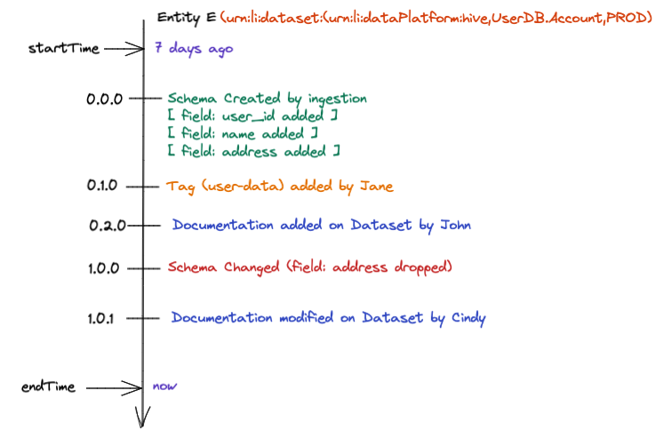
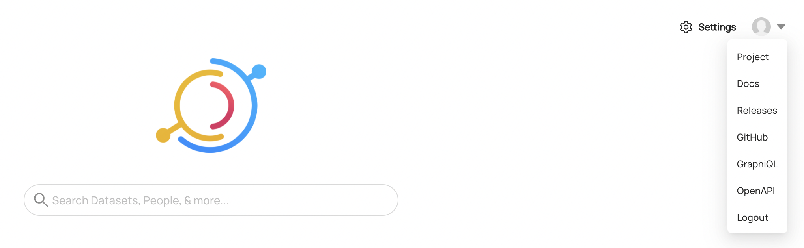
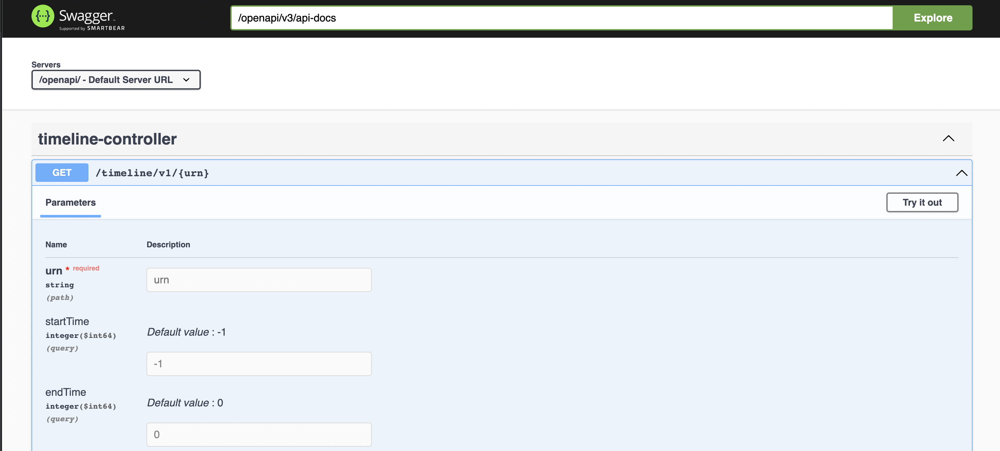

***

## título: "Timeline API"

La API de línea de tiempo admite la visualización del historial de versiones de esquemas, documentación, etiquetas, términos del glosario y otras actualizaciones
a entidades. En la actualidad, la API solo admite datasets.

## Compatibilidad

La API de línea de tiempo está disponible en versiones de servidor `0.8.28` y superior. El `cli` El comando timeline está disponible en [pypi](https://pypi.org/project/acryl-datahub/) Versiones `0.8.27.1` adelante.

# Conceptos

## Línea de tiempo de la entidad conceptualmente

Para los visualmente inclinados, aquí hay un diagrama conceptual que ilustra cómo pensar en la línea de tiempo de la entidad con cambios categóricos superpuestos en ella.



## Cambiar evento

Cada modificación se modela como un
[ChangeEvent](../../metadata-io/src/main/java/com/linkedin/metadata/timeline/data/ChangeEvent.java)
que se agrupan en [ChangeTransactions](../../metadata-io/src/main/java/com/linkedin/metadata/timeline/data/ChangeTransaction.java)
basado en la marca de tiempo. Un `ChangeEvent` consta de:

*   `changeType`: Un tipo operativo para el cambio, ya sea `ADD`, `MODIFY`o `REMOVE`
*   `semVerChange`9 " [semver](https://semver.org/) tipo de cambio basado en la compatibilidad del cambio. Esto se utiliza en el cálculo de la versión de nivel de transacción. Las opciones son `NONE`, `PATCH`, `MINOR`, `MAJOR`y `EXCEPTIONAL` para los casos en que se produjo una excepción durante el procesamiento, pero no fallamos en todo el cálculo del cambio
*   `target`: El objetivo de alto nivel del cambio. Esto suele ser un `urn`, pero puede diferir según el tipo de cambio.
*   `category`: La categoría en la que se encuentra un cambio, los aspectos específicos se asignan a cada categoría dependiendo de la entidad
*   `elementId`: Opcional, el identificador del elemento que se aplica al destino
*   `description`: Una descripción legible por humanos del cambio producido por el `Differ` Tipo calcular el diff
*   `changeDetails`: Un mapa de propiedades suelto de detalles adicionales sobre el cambio

### Cambiar ejemplos de eventos

*   Se aplicó una etiqueta a un *campo* de un conjunto de datos a través de la interfaz de usuario:
    *   `changeType`: `ADD`
    *   `target`: `urn:li:schemaField:(urn:li:dataset:(urn:li:dataPlatform:<platform>,<name>,<fabric_type>),<fieldPath>)` -> El campo al que se agrega la etiqueta
    *   `category`: `TAG`
    *   `elementId`: `urn:li:tag:<tagName>` -> El ID de la etiqueta que se está añadiendo
    *   `semVerChange`: `MINOR`
*   Se agregó una etiqueta directamente en el nivel superior a un conjunto de datos a través de la interfaz de usuario:
    *   `changeType`: `ADD`
    *   `target`: `urn:li:dataset:(urn:li:dataPlatform:<platform>,<name>,<fabric_type>)` -> El conjunto de datos al que se agrega la etiqueta
    *   `category`: `TAG`
    *   `elementId`: `urn:li:tag:<tagName>` -> El ID de la etiqueta que se está añadiendo
    *   `semVerChange`: `MINOR`

Tenga en cuenta el `target` y `elementId` en los ejemplos anteriores para familiarizarse con la semántica.

## Cambiar transacción

Cada `ChangeTransaction` se asigna una versión semántica calculada basada en el `ChangeEvents` que ocurrió dentro de ella,
a partir de `0.0.0` y actualización en función de si el cambio más significativo en la transacción es un `MAJOR`, `MINOR`o
`PATCH` cambio. La lógica de qué cambios constituyen un cambio mayor, menor o parche se codifica en la categoría específica `Differ` implementación.
Por ejemplo, el [SchemaMetadataDiffer](../../metadata-io/src/main/java/com/linkedin/metadata/timeline/differ/SchemaMetadataDiffer.java) tiene una lógica incorporada para determinar qué nivel de cambio semántico se basa un evento en la incompatibilidad hacia atrás y hacia adelante. Siga leyendo para conocer las diferentes categorías de cambios y cómo se interpretan los cambios semánticos en cada una.

# Categorías

ChangeTransactions contiene un `category` eso representa una especie de cambio que sucedió. El `Timeline API` permite al autor de la llamada especificar en qué categorías de cambios está interesado. Las categorías nos permiten abstraer el cambio técnico de bajo nivel que ocurrió en los metadatos (por ejemplo, el `schemaMetadata` aspecto cambiado) a un cambio semántico de alto nivel que ocurrió en los metadatos (por ejemplo, el `Technical Schema` del conjunto de datos modificado). Siga leyendo para obtener información sobre las diferentes categorías que se admiten hoy en día.

La entidad Dataset admite actualmente las siguientes categorías:

## Esquema técnico

*   Cualquier cambio estructural en el esquema técnico del conjunto de datos, como agregar, eliminar, cambiar el nombre de columnas.
*   Impulsado por el `schemaMetadata` aspecto.
*   Los cambios se marcan con el marcador de versión semántica apropiado basado en reglas bien entendidas para la compatibilidad hacia atrás y hacia adelante.

***NOTA***: Los cambios en las descripciones de los campos no se comunican a través de esta categoría, use la categoría Documentación para eso.

### Ejemplo de uso

Hemos proporcionado algunos scripts de ejemplo que demuestran cómo realizar cambios en un aspecto dentro de cada categoría y luego usar la API de línea de tiempo para consultar el resultado.
Todos los ejemplos se pueden encontrar en [prueba de humo/test_resources/línea de tiempo](../../smoke-test/test_resources/timeline) y debe ejecutarse desde ese directorio.

```console
% ./test_timeline_schema.sh
[2022-02-24 15:31:52,617] INFO     {datahub.cli.delete_cli:130} - DataHub configured with http://localhost:8080
Successfully deleted urn:li:dataset:(urn:li:dataPlatform:hive,testTimelineDataset,PROD). 6 rows deleted
Took 1.077 seconds to hard delete 6 rows for 1 entities
Update succeeded with status 200
Update succeeded with status 200
Update succeeded with status 200
http://localhost:8080/openapi/timeline/v1/urn%3Ali%3Adataset%3A%28urn%3Ali%3AdataPlatform%3Ahive%2CtestTimelineDataset%2CPROD%29?categories=TECHNICAL_SCHEMA&start=1644874316591&end=2682397800000
2022-02-24 15:31:53 - 0.0.0-computed
	ADD TECHNICAL_SCHEMA dataset:hive:testTimelineDataset (field:property_id): A forwards & backwards compatible change due to the newly added field 'property_id'.
	ADD TECHNICAL_SCHEMA dataset:hive:testTimelineDataset (field:service): A forwards & backwards compatible change due to the newly added field 'service'.
	ADD TECHNICAL_SCHEMA dataset:hive:testTimelineDataset (field:service.type): A forwards & backwards compatible change due to the newly added field 'service.type'.
	ADD TECHNICAL_SCHEMA dataset:hive:testTimelineDataset (field:service.provider): A forwards & backwards compatible change due to the newly added field 'service.provider'.
	ADD TECHNICAL_SCHEMA dataset:hive:testTimelineDataset (field:service.provider.name): A forwards & backwards compatible change due to the newly added field 'service.provider.name'.
	ADD TECHNICAL_SCHEMA dataset:hive:testTimelineDataset (field:service.provider.id): A forwards & backwards compatible change due to the newly added field 'service.provider.id'.
2022-02-24 15:31:55 - 1.0.0-computed
	MODIFY TECHNICAL_SCHEMA dataset:hive:testTimelineDataset (field:service.provider.name): A backwards incompatible change due to  native datatype of the field 'service.provider.id' changed from 'varchar(50)' to 'tinyint'.
	MODIFY TECHNICAL_SCHEMA dataset:hive:testTimelineDataset (field:service.provider.id): A forwards compatible change due to field name changed from 'service.provider.id' to 'service.provider.id2'
2022-02-24 15:31:55 - 2.0.0-computed
	MODIFY TECHNICAL_SCHEMA dataset:hive:testTimelineDataset (field:service.provider.id): A backwards incompatible change due to  native datatype of the field 'service.provider.name' changed from 'tinyint' to 'varchar(50)'.
	MODIFY TECHNICAL_SCHEMA dataset:hive:testTimelineDataset (field:service.provider.id2): A forwards compatible change due to field name changed from 'service.provider.id2' to 'service.provider.id'
```

## Propiedad

*   Cualquier cambio en la propiedad del conjunto de datos, agregar un propietario o cambiar el tipo de propietario.
*   Impulsado por el `ownership` aspecto.
*   Todos los cambios están marcados actualmente como `MINOR`.

### Ejemplo de uso

Hemos proporcionado algunos scripts de ejemplo que demuestran cómo realizar cambios en un aspecto dentro de cada categoría y luego usar la API de línea de tiempo para consultar el resultado.
Todos los ejemplos se pueden encontrar en [prueba de humo/test_resources/línea de tiempo](../../smoke-test/test_resources/timeline) y debe ejecutarse desde ese directorio.

```console
% ./test_timeline_ownership.sh
[2022-02-24 15:40:25,367] INFO     {datahub.cli.delete_cli:130} - DataHub configured with http://localhost:8080
Successfully deleted urn:li:dataset:(urn:li:dataPlatform:hive,testTimelineDataset,PROD). 6 rows deleted
Took 1.087 seconds to hard delete 6 rows for 1 entities
Update succeeded with status 200
Update succeeded with status 200
Update succeeded with status 200
http://localhost:8080/openapi/timeline/v1/urn%3Ali%3Adataset%3A%28urn%3Ali%3AdataPlatform%3Ahive%2CtestTimelineDataset%2CPROD%29?categories=OWNERSHIP&start=1644874829027&end=2682397800000
2022-02-24 15:40:26 - 0.0.0-computed
	ADD OWNERSHIP dataset:hive:testTimelineDataset (urn:li:corpuser:datahub): A new owner 'datahub' for the dataset 'urn:li:dataset:(urn:li:dataPlatform:hive,testTimelineDataset,PROD)' has been added.
	ADD OWNERSHIP dataset:hive:testTimelineDataset (urn:li:corpuser:jdoe): A new owner 'jdoe' for the dataset 'urn:li:dataset:(urn:li:dataPlatform:hive,testTimelineDataset,PROD)' has been added.
2022-02-24 15:40:27 - 0.1.0-computed
	REMOVE OWNERSHIP dataset:hive:testTimelineDataset (urn:li:corpuser:datahub): Owner 'datahub' of the dataset 'urn:li:dataset:(urn:li:dataPlatform:hive,testTimelineDataset,PROD)' has been removed.
2022-02-24 15:40:28 - 0.2.0-computed
	ADD OWNERSHIP dataset:hive:testTimelineDataset (urn:li:corpuser:datahub): A new owner 'datahub' for the dataset 'urn:li:dataset:(urn:li:dataPlatform:hive,testTimelineDataset,PROD)' has been added.
	REMOVE OWNERSHIP dataset:hive:testTimelineDataset (urn:li:corpuser:jdoe): Owner 'jdoe' of the dataset 'urn:li:dataset:(urn:li:dataPlatform:hive,testTimelineDataset,PROD)' has been removed.
Update succeeded with status 200
Update succeeded with status 200
Update succeeded with status 200
http://localhost:8080/openapi/timeline/v1/urn%3Ali%3Adataset%3A%28urn%3Ali%3AdataPlatform%3Ahive%2CtestTimelineDataset%2CPROD%29?categories=OWNERSHIP&start=1644874831456&end=2682397800000
2022-02-24 15:40:26 - 0.0.0-computed
	ADD OWNERSHIP dataset:hive:testTimelineDataset (urn:li:corpuser:datahub): A new owner 'datahub' for the dataset 'urn:li:dataset:(urn:li:dataPlatform:hive,testTimelineDataset,PROD)' has been added.
	ADD OWNERSHIP dataset:hive:testTimelineDataset (urn:li:corpuser:jdoe): A new owner 'jdoe' for the dataset 'urn:li:dataset:(urn:li:dataPlatform:hive,testTimelineDataset,PROD)' has been added.
2022-02-24 15:40:27 - 0.1.0-computed
	REMOVE OWNERSHIP dataset:hive:testTimelineDataset (urn:li:corpuser:datahub): Owner 'datahub' of the dataset 'urn:li:dataset:(urn:li:dataPlatform:hive,testTimelineDataset,PROD)' has been removed.
2022-02-24 15:40:28 - 0.2.0-computed
	ADD OWNERSHIP dataset:hive:testTimelineDataset (urn:li:corpuser:datahub): A new owner 'datahub' for the dataset 'urn:li:dataset:(urn:li:dataPlatform:hive,testTimelineDataset,PROD)' has been added.
	REMOVE OWNERSHIP dataset:hive:testTimelineDataset (urn:li:corpuser:jdoe): Owner 'jdoe' of the dataset 'urn:li:dataset:(urn:li:dataPlatform:hive,testTimelineDataset,PROD)' has been removed.
2022-02-24 15:40:29 - 0.2.0-computed
2022-02-24 15:40:30 - 0.3.0-computed
	ADD OWNERSHIP dataset:hive:testTimelineDataset (urn:li:corpuser:jdoe): A new owner 'jdoe' for the dataset 'urn:li:dataset:(urn:li:dataPlatform:hive,testTimelineDataset,PROD)' has been added.
2022-02-24 15:40:30 - 0.4.0-computed
	MODIFY OWNERSHIP urn:li:corpuser:jdoe (DEVELOPER): The ownership type of the owner 'jdoe' changed from 'DATAOWNER' to 'DEVELOPER'.
```

## Etiquetas

*   Cualquier cambio en las etiquetas aplicadas al conjunto de datos o a los campos del conjunto de datos.
*   Impulsado por el `schemaMetadata`, `editableSchemaMetadata` y `globalTags` Aspectos.
*   Todos los cambios están marcados actualmente como `MINOR`.

### Ejemplo de uso

Hemos proporcionado algunos scripts de ejemplo que demuestran cómo realizar cambios en un aspecto dentro de cada categoría y luego usar la API de línea de tiempo para consultar el resultado.
Todos los ejemplos se pueden encontrar en [prueba de humo/test_resources/línea de tiempo](../../smoke-test/test_resources/timeline) y debe ejecutarse desde ese directorio.

```console
% ./test_timeline_tags.sh
[2022-02-24 15:44:04,279] INFO     {datahub.cli.delete_cli:130} - DataHub configured with http://localhost:8080
Successfully deleted urn:li:dataset:(urn:li:dataPlatform:hive,testTimelineDataset,PROD). 9 rows deleted
Took 0.626 seconds to hard delete 9 rows for 1 entities
Update succeeded with status 200
Update succeeded with status 200
Update succeeded with status 200
http://localhost:8080/openapi/timeline/v1/urn%3Ali%3Adataset%3A%28urn%3Ali%3AdataPlatform%3Ahive%2CtestTimelineDataset%2CPROD%29?categories=TAG&start=1644875047911&end=2682397800000
2022-02-24 15:44:05 - 0.0.0-computed
	ADD TAG dataset:hive:testTimelineDataset (urn:li:tag:Legacy): A new tag 'Legacy' for the entity 'urn:li:dataset:(urn:li:dataPlatform:hive,testTimelineDataset,PROD)' has been added.
2022-02-24 15:44:06 - 0.1.0-computed
	ADD TAG dataset:hive:testTimelineDataset (urn:li:tag:NeedsDocumentation): A new tag 'NeedsDocumentation' for the entity 'urn:li:dataset:(urn:li:dataPlatform:hive,testTimelineDataset,PROD)' has been added.
2022-02-24 15:44:07 - 0.2.0-computed
	REMOVE TAG dataset:hive:testTimelineDataset (urn:li:tag:Legacy): Tag 'Legacy' of the entity 'urn:li:dataset:(urn:li:dataPlatform:hive,testTimelineDataset,PROD)' has been removed.
	REMOVE TAG dataset:hive:testTimelineDataset (urn:li:tag:NeedsDocumentation): Tag 'NeedsDocumentation' of the entity 'urn:li:dataset:(urn:li:dataPlatform:hive,testTimelineDataset,PROD)' has been removed.
```

## Documentación

*   Cualquier cambio en la documentación a nivel de conjunto de datos o a nivel de campo.
*   Impulsado por el `datasetProperties`, `institutionalMemory`, `schemaMetadata` y `editableSchemaMetadata`.
*   La adición o eliminación de documentación o enlaces se marca como `MINOR` Mientras que las ediciones de la documentación existente se marcan como `PATCH` Cambios.

### Ejemplo de uso

Hemos proporcionado algunos scripts de ejemplo que demuestran cómo realizar cambios en un aspecto dentro de cada categoría y luego usar la API de línea de tiempo para consultar el resultado.
Todos los ejemplos se pueden encontrar en [prueba de humo/test_resources/línea de tiempo](../../smoke-test/test_resources/timeline) y debe ejecutarse desde ese directorio.

```console
% ./test_timeline_documentation.sh
[2022-02-24 15:45:53,950] INFO     {datahub.cli.delete_cli:130} - DataHub configured with http://localhost:8080
Successfully deleted urn:li:dataset:(urn:li:dataPlatform:hive,testTimelineDataset,PROD). 6 rows deleted
Took 0.578 seconds to hard delete 6 rows for 1 entities
Update succeeded with status 200
Update succeeded with status 200
Update succeeded with status 200
http://localhost:8080/openapi/timeline/v1/urn%3Ali%3Adataset%3A%28urn%3Ali%3AdataPlatform%3Ahive%2CtestTimelineDataset%2CPROD%29?categories=DOCUMENTATION&start=1644875157616&end=2682397800000
2022-02-24 15:45:55 - 0.0.0-computed
	ADD DOCUMENTATION dataset:hive:testTimelineDataset (https://www.linkedin.com): The institutionalMemory 'https://www.linkedin.com' for the dataset 'urn:li:dataset:(urn:li:dataPlatform:hive,testTimelineDataset,PROD)' has been added.
2022-02-24 15:45:56 - 0.1.0-computed
	ADD DOCUMENTATION dataset:hive:testTimelineDataset (https://www.google.com): The institutionalMemory 'https://www.google.com' for the dataset 'urn:li:dataset:(urn:li:dataPlatform:hive,testTimelineDataset,PROD)' has been added.
2022-02-24 15:45:56 - 0.2.0-computed
	ADD DOCUMENTATION dataset:hive:testTimelineDataset (https://datahubproject.io/docs): The institutionalMemory 'https://datahubproject.io/docs' for the dataset 'urn:li:dataset:(urn:li:dataPlatform:hive,testTimelineDataset,PROD)' has been added.
	ADD DOCUMENTATION dataset:hive:testTimelineDataset (https://datahubproject.io/docs): The institutionalMemory 'https://datahubproject.io/docs' for the dataset 'urn:li:dataset:(urn:li:dataPlatform:hive,testTimelineDataset,PROD)' has been added.
	REMOVE DOCUMENTATION dataset:hive:testTimelineDataset (https://www.linkedin.com): The institutionalMemory 'https://www.linkedin.com' of the dataset 'urn:li:dataset:(urn:li:dataPlatform:hive,testTimelineDataset,PROD)' has been removed.
```

## Términos del glosario

*   Cualquier cambio en los términos del glosario aplicados al conjunto de datos o a los campos del conjunto de datos.
*   Impulsado por el `schemaMetadata`, `editableSchemaMetadata`, `glossaryTerms` Aspectos.
*   Todos los cambios están marcados actualmente como `MINOR`.

### Ejemplo de uso

Hemos proporcionado algunos scripts de ejemplo que demuestran cómo realizar cambios en un aspecto dentro de cada categoría y luego usar la API de línea de tiempo para consultar el resultado.
Todos los ejemplos se pueden encontrar en [prueba de humo/test_resources/línea de tiempo](../../smoke-test/test_resources/timeline) y debe ejecutarse desde ese directorio.

```console
% ./test_timeline_glossary.sh
[2022-02-24 15:44:56,152] INFO     {datahub.cli.delete_cli:130} - DataHub configured with http://localhost:8080
Successfully deleted urn:li:dataset:(urn:li:dataPlatform:hive,testTimelineDataset,PROD). 6 rows deleted
Took 0.443 seconds to hard delete 6 rows for 1 entities
Update succeeded with status 200
Update succeeded with status 200
Update succeeded with status 200
http://localhost:8080/openapi/timeline/v1/urn%3Ali%3Adataset%3A%28urn%3Ali%3AdataPlatform%3Ahive%2CtestTimelineDataset%2CPROD%29?categories=GLOSSARY_TERM&start=1644875100605&end=2682397800000
1969-12-31 18:00:00 - 0.0.0-computed
	None None  : java.lang.NullPointerException:null
2022-02-24 15:44:58 - 0.1.0-computed
	ADD GLOSSARY_TERM dataset:hive:testTimelineDataset (urn:li:glossaryTerm:SavingsAccount): The GlossaryTerm 'SavingsAccount' for the entity 'urn:li:dataset:(urn:li:dataPlatform:hive,testTimelineDataset,PROD)' has been added.
2022-02-24 15:44:59 - 0.2.0-computed
	REMOVE GLOSSARY_TERM dataset:hive:testTimelineDataset (urn:li:glossaryTerm:CustomerAccount): The GlossaryTerm 'CustomerAccount' for the entity 'urn:li:dataset:(urn:li:dataPlatform:hive,testTimelineDataset,PROD)' has been removed.
	REMOVE GLOSSARY_TERM dataset:hive:testTimelineDataset (urn:li:glossaryTerm:SavingsAccount): The GlossaryTerm 'SavingsAccount' for the entity 'urn:li:dataset:(urn:li:dataPlatform:hive,testTimelineDataset,PROD)' has been removed.
```

# Explorar la API

La API se puede navegar a través de la interfaz de usuario a través del menú desplegable.
Aquí hay algunas capturas de pantalla que muestran cómo navegar hasta él. Puede probar la API y enviar solicitudes de ejemplo.



# Labor futura

*   Versiones compatibles como parámetros de inicio y fin como parte de la llamada a la API de línea de tiempo
*   Entidades de apoyo más allá de los conjuntos de datos
*   Adición de compatibilidad con la API de GraphQL
*   Compatibilidad con la materialización de versiones calculadas para categorías de entidades (en comparación con el cálculo actual de versiones en tiempo de lectura)
*   Soporte en la interfaz de usuario para visualizar la línea de tiempo en varios lugares (por ejemplo, historial de esquemas, etc.)
