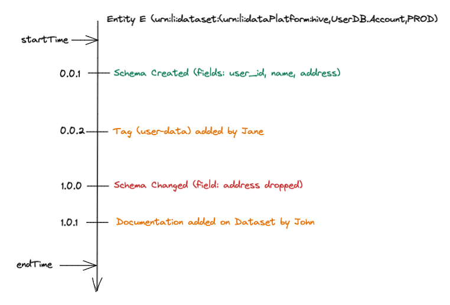

The Timeline API supports viewing version history of schemas, documentation, tags, glossary terms, and other updates
to entities. At present, the API only supports Datasets. 

# Concepts



## Change Event
Each modification is modeled as a 
[ChangeEvent](../../metadata-io/src/main/java/com/linkedin/metadata/timeline/data/ChangeEvent.java)
which are grouped under [ChangeTransactions](../../metadata-io/src/main/java/com/linkedin/metadata/timeline/data/ChangeTransaction.java) 
based on timestamp. A `ChangeEvent` consists of:

- `changeType`: An operational type for the change, either `ADD`, `MODIFY`, or `REMOVE`
- `semVerChange`: A [semver](https://semver.org/) change type based on the compatibility of the change. This gets utilized in the computation of the transaction level version. Options are `NONE`, `PATCH`, `MINOR`, `MAJOR`, and `EXCEPTIONAL` for cases where an exception occurred during processing, but we do not fail the entire change calculation
- `target`: The high level target of the change. This is usually an `urn`, but can differ depending on the type of change.
- `category`: The category a change falls under, specific aspects are mapped to each category depending on the entity
- `elementId`: Optional, the ID of the element being applied to the target
- `description`: A human readable description of the change produced by the `Differ` type computing the diff
- `changeDetails`: A loose property map of additional details about the change

### Change Event Examples
- A tag was added to a field on the dataset to a particular schema field through the UI: 
  - `changeType`: `ADD`
  - `target`: `urn:li:datasetField:(urn:li:dataset:(urn:li:dataPlatform:platform,name,PROD),fieldPath)` -> The field the tag is being added to
  - `category`: `TAG` 
  - `elementId`: `urn:li:tag:tagName` -> The ID of the tag being added
  - `semVerChange`: `NONE`
- A tag was added directly to a dataset through the UI:
  - `changeType`: `ADD`
  - `target`: `urn:li:dataset:(urn:li:dataPlatform:platform,name,PROD)` -> The dataset the tag is being added to
  - `category`: `TAG`
  - `elementId`: `urn:li:tag:tagName` -> The ID of the tag being added
  - `semVerChange`: `NONE`

## Change Transaction
Each `ChangeTransaction` is assigned a computed semantic version based on the `ChangeEvents` that occurred within it,
starting at `0.0.0` and updating based on whether the most significant change in the transaction is a `MAJOR`, `MINOR`, or 
`PATCH` change. At present, categories using the [BasicDiffer](../../metadata-io/src/main/java/com/linkedin/metadata/timeline/ebean/differ/BasicDiffer.java)
do not have logic for computing the significance of changes. In specialized differs, like the [SchemaDiffer](../../metadata-io/src/main/java/com/linkedin/metadata/timeline/ebean/differ/SchemaDiffer.java), we have baked in logic for determining what level of semantic change an event is based on backwards incompatibility.

# Categories
ChangeTransactions contain a `category` that represents a kind of change that happened. The `Timeline API` allows the caller to specify which categories of changes they are interested in. Categories allow us to abstract away the low-level technical change that happened in the metadata (e.g. the `schemaMetadata` aspect changed) to a high-level semantic change that happened in the metadata (e.g. the `Technical Schema` of the dataset changed). Read on to learn about the different categories that are supported today.

The Dataset entity currently supports the following categories:

## Technical Schema

Any structural changes in the technical schema of the dataset, such as adding, dropping, renaming columns. Driven by the `schemaMetadata` aspect. Changes are marked with the appropriate semantic version marker based on well-understood rules for backwards and forwards compatibility.
**_NOTE_**: Changes in field descriptions are not communicated via this category, use the Documentation category for that.

## Ownership

Any changes in ownership of the dataset, adding an owner, or changing the type of the owner. Driven by the `ownership` aspect. 
All changes are currently marked as `MINOR`.

## Tags

Any changes in tags applied to the dataset or to fields of the dataset. Driven by the `schemaMetadata`, `editableSchemaMetadata` and `globalTags` aspects.

## Documentation

Any changes to documentation at the dataset level or at the field level. Driven by the `datasetProperties`, `institutionalMemory`, `schemaMetadata` and `editableSchemaMetadata`.

## Glossary Terms

Any changes to applied glossary terms to the dataset or to fields in the dataset. Driven by the `schemaMetadata`, `editableSchemaMetadata`, `glossaryTerms` aspects.

# Example Usage

We have provided some example scripts to demonstrate the usage of the CLI. These examples ingest several MetadataChangeProposals
for a single Urn that does not currently exist in other sample data back-to-back and then make a call to the Timeline API resulting in a static list of changes.

All examples can be found in [smoke-test/test_resources/timeline](../../smoke-test/test_resources/timeline) and should be executed from that directory.

```commandline
% ./test_timeline.sh
[2022-02-23 11:07:03,489] INFO     {datahub.cli.delete_cli:130} - DataHub configured with http://localhost:8080
Nothing deleted for urn:li:dataset:(urn:li:dataPlatform:hive,testTimelineDataset,PROD)
Took 0.679 seconds to hard delete 0 rows for 1 entities
Update succeeded with status 200
Update succeeded with status 200
Update succeeded with status 200
http://localhost:8080/openapi/timeline/v1/urn%3Ali%3Adataset%3A%28urn%3Ali%3AdataPlatform%3Ahive%2CtestTimelineDataset%2CPROD%29?categories=TECHNICAL_SCHEMA&start=1644772026200&end=2682397800000
2022-02-23 11:07:04 - 0.0.0-computed
	ADD TECHNICAL_SCHEMA dataset:hive:testTimelineDataset (field:property_id): A forwards & backwards compatible change due to the newly added field 'property_id'.
	ADD TECHNICAL_SCHEMA dataset:hive:testTimelineDataset (field:service): A forwards & backwards compatible change due to the newly added field 'service'.
	ADD TECHNICAL_SCHEMA dataset:hive:testTimelineDataset (field:service.type): A forwards & backwards compatible change due to the newly added field 'service.type'.
	ADD TECHNICAL_SCHEMA dataset:hive:testTimelineDataset (field:service.provider): A forwards & backwards compatible change due to the newly added field 'service.provider'.
	ADD TECHNICAL_SCHEMA dataset:hive:testTimelineDataset (field:service.provider.name): A forwards & backwards compatible change due to the newly added field 'service.provider.name'.
	ADD TECHNICAL_SCHEMA dataset:hive:testTimelineDataset (field:service.provider.id): A forwards & backwards compatible change due to the newly added field 'service.provider.id'.
2022-02-23 11:07:05 - 0.0.0-computed
```

# Explore the API

The API is browse-able via the UI through through the dropdown.
Here are a few screenshots showing how to navigate to it. You can try out the API and send example requests.

# Future Work

- Supporting versions as start and end parameters as part of the call to the timeline API
- Supporting entities beyond Datasets
- Adding GraphQL API support
- Supporting materialization of computed versions for entity categories (compared to the current read-time version computation)
- Support in the UI to visualize the timeline in various places (e.g. schema history, etc.)

