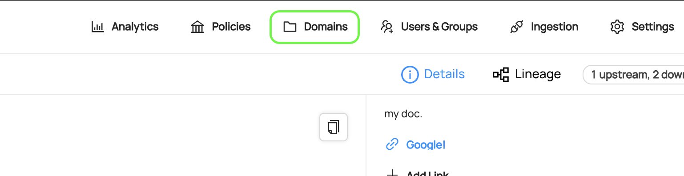
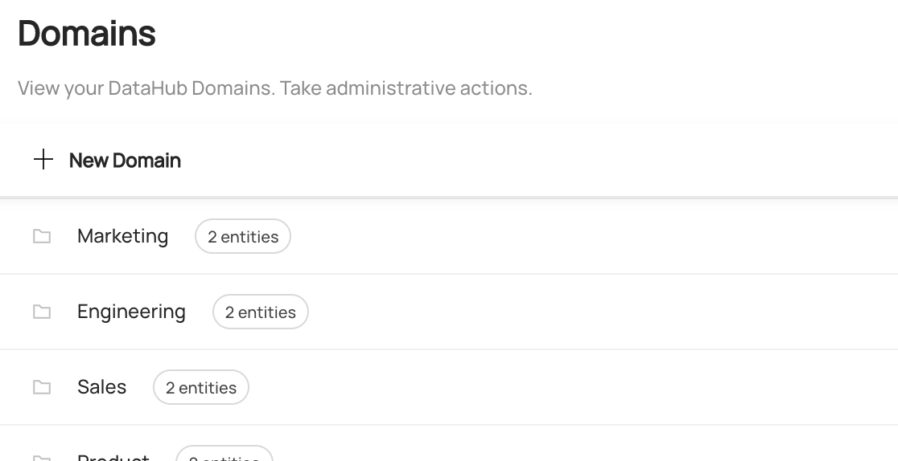
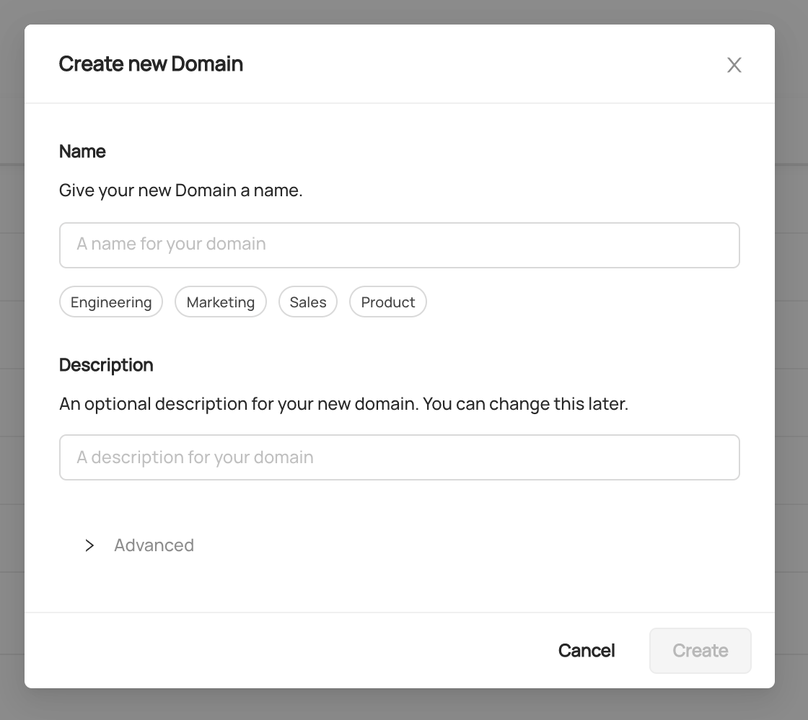
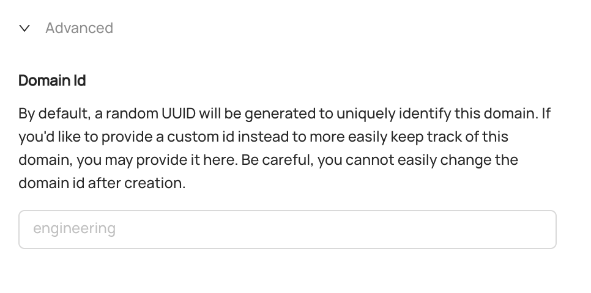
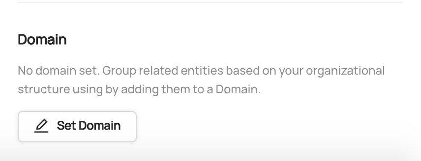
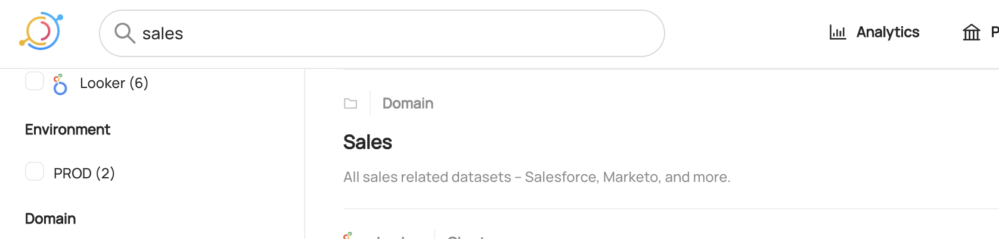
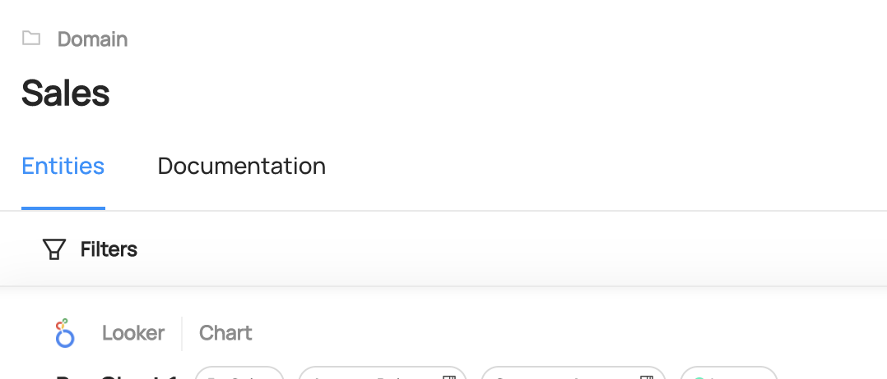
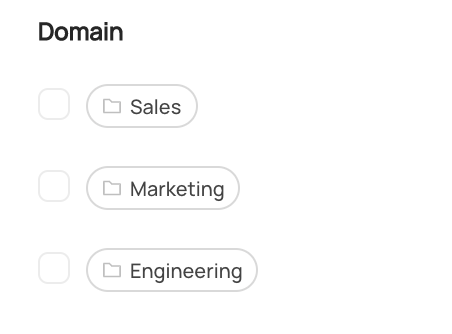
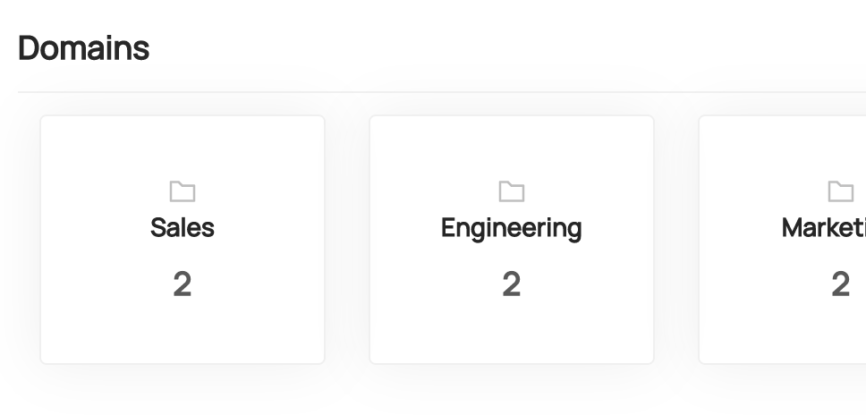

# Domains Guide

## What is a Domain? 

Starting in version `0.8.25`, DataHub supports grouping data assets into logical collections called **Domains**. Domains are curated, top-level
folders or categories where related assets can be explicitly grouped. Management of Domains can be centralized, or distributed out
to Domain owners. Currently, an asset can belong to only one Domain at a time. 

### Tags vs. Glossary Terms vs. Domains

DataHub supports Tags, Glossary Terms, & Domains as distinct types of Metadata that are suited for specific purposes:

- **Tags**: Informal, loosely controlled labels that serve as a tool for search & discovery. Assets may have multiple tags. No formal, central management.
- **Glossary Terms**: A controlled vocabulary, with optional hierarchy. Terms are typically used to standardize types of leaf-level attributes (i.e. schema fields) for governance. E.g. (EMAIL_PLAINTEXT)
- **Domains**: A set of top-level categories. Usually aligned to business units / disciplines to which the assets are most relevant. Central or distributed management. Single Domain assignment per data asset.


## Creating a Domain

To create a Domain, first navigate to the **Domains** tab in the top-right menu of DataHub. Users must have the Platform Privilege
called `Manage Domains` to view this tab, which can be granted by creating a new Platform [Policy](authorization/policies.md).



Once you're on the Domains page, you'll see a list of all the Domains that have been created on DataHub. Additionally, you can
view the number of entities inside each Domain. 



To create a new Domain, click '+ New Domain'.



Inside the form, you can choose a name for your name. Most often, this will align with your business units or groups, for example
'Platform Engineering' or 'Social Marketing'. You can also add an optional description. Don't worry, this can be changed later.

#### Advanced: Setting a Custom Domain id

Click on 'Advanced' to show the option to set a custom Domain id. The Domain id determines what will appear in the DataHub 'urn' (primary key)
for the Domain. This option is useful if you intend to refer to Domains by a common name inside your code, or you want the primary
key to be human-readable. Proceed with caution: once you select a custom id, it cannot be easily changed. 



By default, you don't need to worry about this. DataHub will auto-generate an unique Domain id for you. 

Once you've chosen a name and a description, click 'Create' to create the new Domain. 


## Assigning an Asset to a Domain 

To assign an asset to a Domain, simply navigate to the asset's profile page. At the bottom left-side menu bar, you'll 
see a 'Domain' section. Click 'Set Domain', and then search for the Domain you'd like to add to. When you're done, click 'Add'.



To remove an asset from a Domain, click the 'x' icon on the Domain tag. 

> Notice: Adding or removing an asset from a Domain requires the `Edit Domain` Metadata Privilege, which can be granted
> by a [Policy](authorization/policies.md).


## Searching by Domain

Once you've created a Domain, you can use the search bar to find it.



Clicking on the search result will take you to the Domain's profile, where you
can edit its description, add / remove owners, and view the assets inside the Domain. 



Once you've added assets to a Domain, you can filter search results to limit to those Assets
within a particular Domain using the left-side search filters. 



On the homepage, you'll also find a list of the most popular Domains in your organization.




## Domains API

Domains can be managed via the [GraphQL API](https://datahubproject.io/docs/api/graphql/overview/). Below you'll find the relevant Queries & Mutations
to achieve this. 

- [domain](https://datahubproject.io/docs/graphql/queries#domain) - Fetch a Domain's details by Urn. 
- [listDomains](https://datahubproject.io/docs/graphql/queries#listdomains) - List all Domains inside your DataHub instance. 
- [createDomain](https://datahubproject.io/docs/graphql/mutations#createdomain) - Create a new Domain.
- [setDomain](https://datahubproject.io/docs/graphql/mutations#setdomain) - Add an entity to a Domain
- [unsetDomain](https://datahubproject.io/docs/graphql/mutations#unsetdomain) - Remove an entity from a Domain.

### Examples

**Creating a Domain**

```graphql
mutation createDomain {
  createDomain(input: { name: "My New Domain", description: "An optional description" })
}
```

This query will return an `urn` which you can use to fetch the Domain details. 

**Fetching a Domain by Urn**

```graphql
query getDomain {
  domain(urn: "urn:li:domain:engineering") {
    urn
    properties {
        name 
        description
    }
    entities {
			total
    }
  }
}
```

**Adding a Dataset to a Domain**

```graphql
mutation setDomain {
  setDomain(entityUrn: "urn:li:dataset:(urn:li:dataPlatform:hdfs,SampleHdfsDataset,PROD)", domainUrn: "urn:li:domain:engineering")
}
```

> Pro Tip! You can try out the sample queries by visiting `<your-datahub-url>/api/graphiql`.

## Demo

Click [here](https://www.loom.com/share/72b3bcc2729b4df0982fa63ae3a8cb21) to see a full demo of the Domains feature. 

## Feedback / Questions / Concerns

We want to hear from you! For any inquiries, including Feedback, Questions, or Concerns, reach out on Slack!