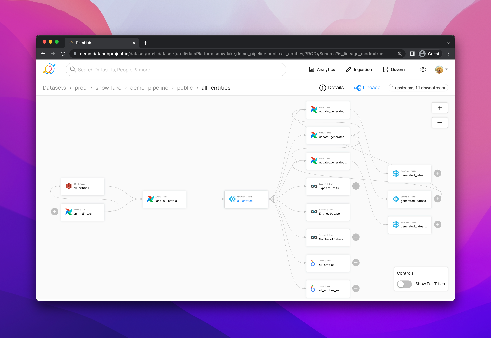
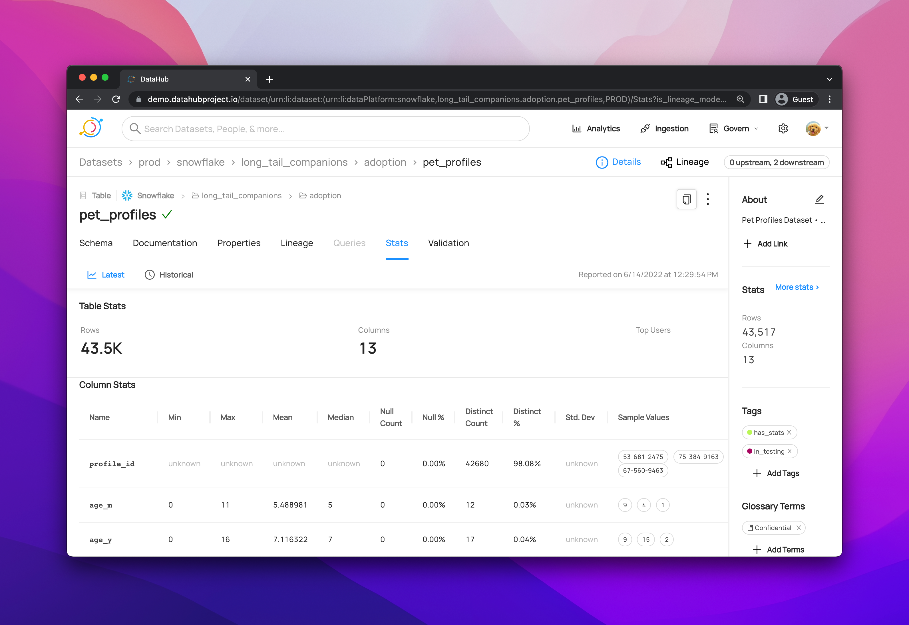
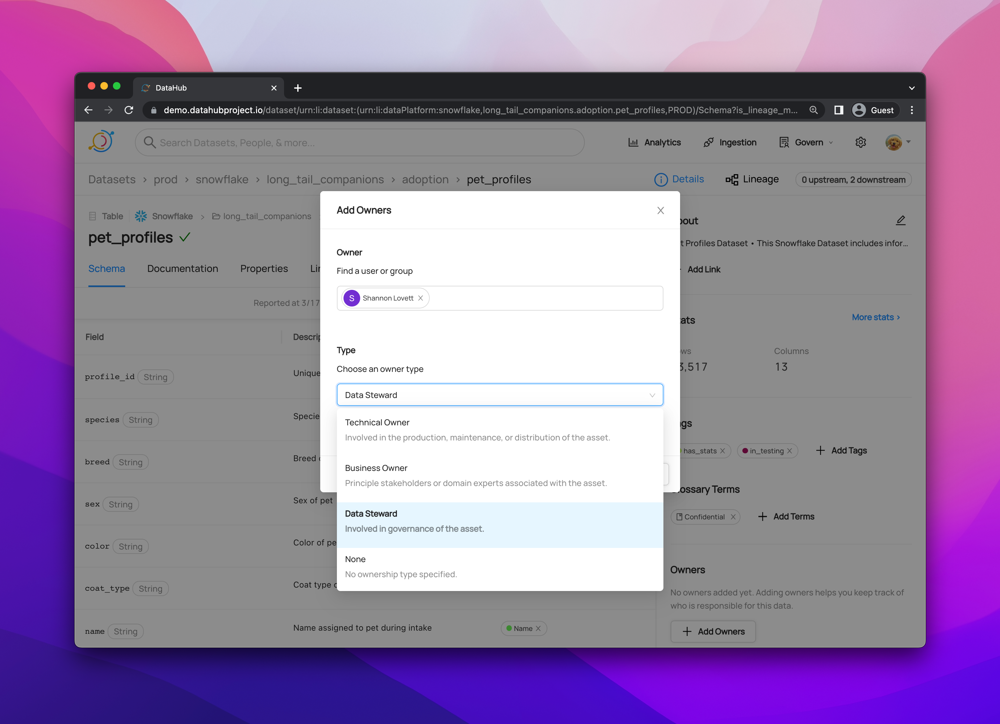
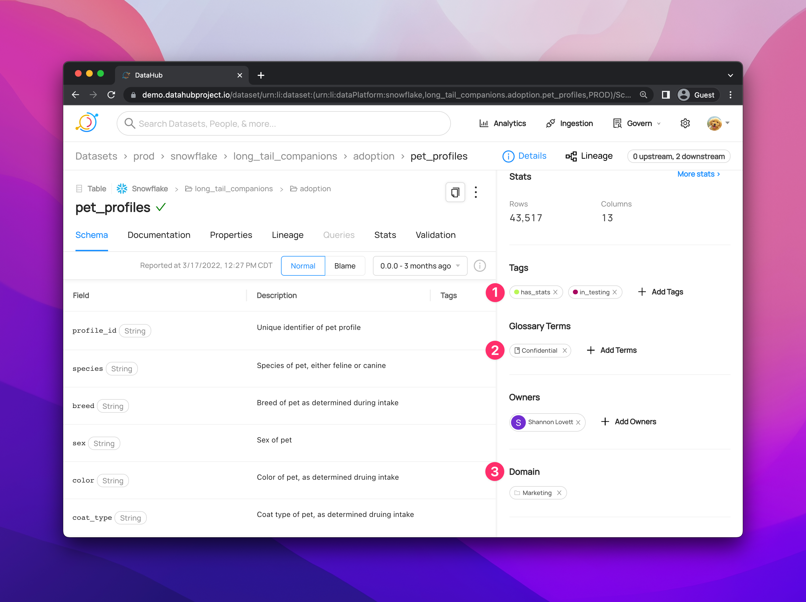
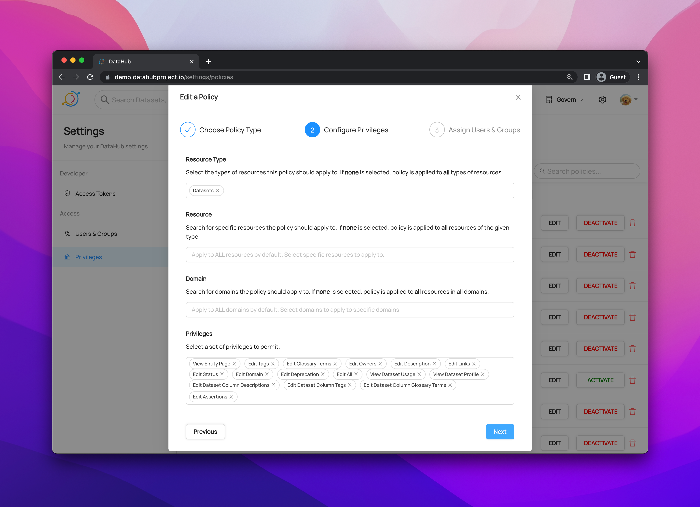
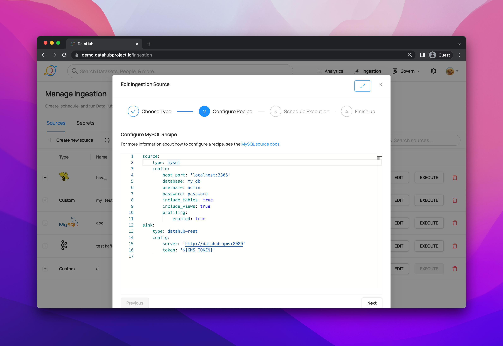

# DataHub Features Overview

DataHub is a modern data catalog built to enable end-to-end data discovery, data observability, and data governance. This extensible metadata platform is built for developers to tame the complexity of their rapidly evolving data ecosystems, and for data practitioners to leverage the full value of data within their organization.

Here’s an overview of DataHub’s current functionality. Check out our [roadmap](https://feature-requests.datahubproject.io/roadmap) to see what's to come.

---

## Search and Discovery

### **Search All Corners of Your Data Stack**

DataHub's unified search experience surfaces results across across databases, datalakes, BI platforms, ML feature stores, orchestration tools, and more.

<!--  -->

  

### **Trace End-to-End Lineage**

Easily understand the end-to-end journey of data by tracing lineage across platforms, datasets, ETL/ELT pipelines, charts, and dashboards, and beyond.

<!--  -->

  

### **View Metadata 360 at a Glance**

Combine *technical* and *logical* metadata to provide a robust 360º view of your data entities, including:

* **Dataset Stats** to understand the shape & distribution of the data
* **Validation outcomes** from tools like Great Expectations
* **Schema Version History** to track changes to the physical structure of data over time

<!--  -->

  

---

## Modern Data Governance

### **Govern in Real Time**

[The Actions Framework](./actions/README.md) powers the following real-time use cases:

* **Notifications:** Generate organization-specific notifications when a change is made on DataHub. For example, send an email to the governance team when a "PII" tag is added to any data asset.
* **Workflow Integration:** Integrate DataHub into your organization's internal workflows. For example, create a Jira ticket when specific Tags or Terms are proposed on a Dataset.
* **Synchronization:** Syncing changes made in DataHub into a 3rd party system. For example, reflecting Tag additions in DataHub into Snowflake.
* **Auditing:** Audit who is making what changes on DataHub through time.

    <iframe width="560" height="315" src="https://www.youtube.com/embed/yeloymkK5ow" title="YouTube video player" frameborder="0" allow="accelerometer; autoplay; clipboard-write; encrypted-media; gyroscope; picture-in-picture" allowfullscreen></iframe>

### **Manage Entity Ownership**
Quickly and easily assign entitiy ownership to users and/or user groups.

<!--  -->

  

### **Govern with Tags, Glossary Terms, and Domains**
Empower data owners to govern their data entities with:

1. **Tags:** Informal, loosely controlled labels that serve as a tool for search & discovery. No formal, central management.
2. **Glossary Terms:** A controlled vocabulary with optional hierarchy, commonly used to describe core business concepts and/or measurements.
3. **Domains:** Curated, top-level folders or categories, commonly used in Data Mesh to organize entities by department (i.e., Finance, Marketing) and/or Data Products.

  

---
## DataHub Administration

### **Create Users, Groups, & Access Policies**

DataHub admins can create Policies to define who can perform what action against which resource(s). When you create a new Policy, you will be able to define the following:

* **Policy Type Platform** (top-level DataHub Platform privileges, i.e. managing users, groups, and policies) or Metadata (ability to manipulate ownership, tags, documentation, & more)
* **Resource Type** - Specify the type of resource, such as Datasets, Dashboards, Pipelines, etc.
* **Privileges** - Choose the set of permissions, such as Edit Owners, Edit Documentation, Edit Links
* **Users and/or Groups** - Assign relevant Users and/or Groups; you can also assign the Policy to Resource Owners, regardless of which Group they belong to

  

### **Ingest Metadata from the UI**

Create, configure, schedule, & execute batch metadata ingestion using the DataHub user interface. This makes getting metadata into DataHub easier by minimizing the overhead required to operate custom integration pipelines.

  

