import FeatureAvailability from '@site/src/components/FeatureAvailability';

# About DataHub Business Glossary

<FeatureAvailability/>

## Introduction

When working in complex data ecosystems, it is very useful to organize data assets using a shared vocabulary. The Business Glossary feature in DataHub helps you do this, by providing a framework for defining a standardized set of data concepts and then associating them with the physical assets that exist within your data ecosystem.

Within this document, we'll introduce the core concepts comprising DataHub's Business Glossary feature and show you how to put it to work in your organization. 

### Terms & Term Groups

A Business Glossary is comprised of two important primitives: Terms and Term Groups.

- **Terms**: words or phrases with a specific business definition assigned to them.
- **Term Groups**: act like folders, containing Terms and even other Term Groups to allow for a nested structure.

Both Terms and Term Groups allow you to add documentation and unique owners.

For Glossary Terms, you are also able to establish relationships between different Terms in the **Related Terms** tab. Here you can create Contains and Inherits relationships. Finally, you can view all of the entities that have been tagged with a Term in the **Related Entities** tab.

## Getting to your Glossary

In order to view a Business Glossary, users must have the Platform Privilege called `Manage Glossaries` which can be granted by creating a new Platform [Policy](../authorization/policies.md).

Once granted this privilege, you can access your Glossary by clicking the dropdown at the top of the page called **Govern** and then click **Glossary**:

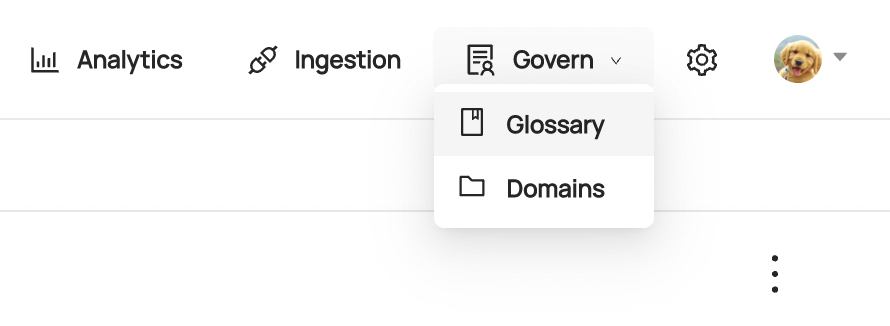

You are now at the root of your Glossary and should see all Terms and Term Groups with no parents assigned to them. You should also notice a hierarchy navigator on the left where you can easily check out the structure of your Glossary!

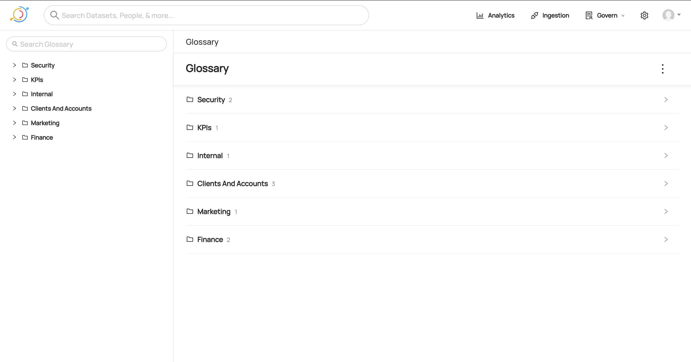

## Creating a Term or Term Group

There are two ways to create Terms and Term Groups through the UI. First, you can create directly from the Glossary home page by clicking the menu dots on the top right and selecting your desired option:

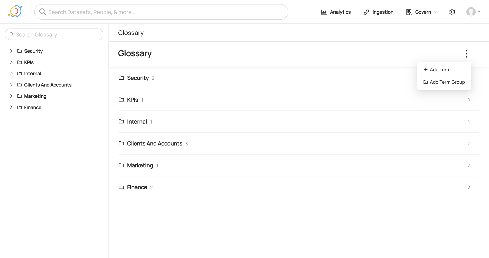

You can also create Terms or Term Groups directly from a Term Group's page. In order to do that you need to click the menu dots on the top right and select what you want:

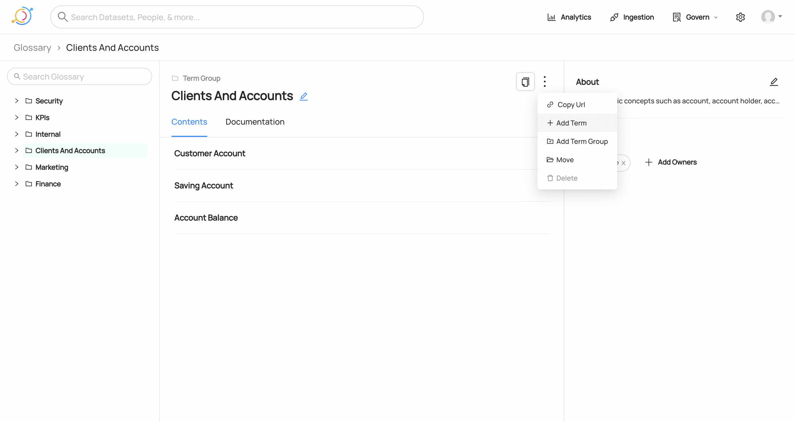

Note that the modal that pops up will automatically set the current Term Group you are in as the **Parent**. You can easily change this by selecting the input and navigating through your Glossary to find your desired Term Group. In addition, you could start typing the name of a Term Group to see it appear by searching. You can also leave this input blank in order to create a Term or Term Group with no parent.

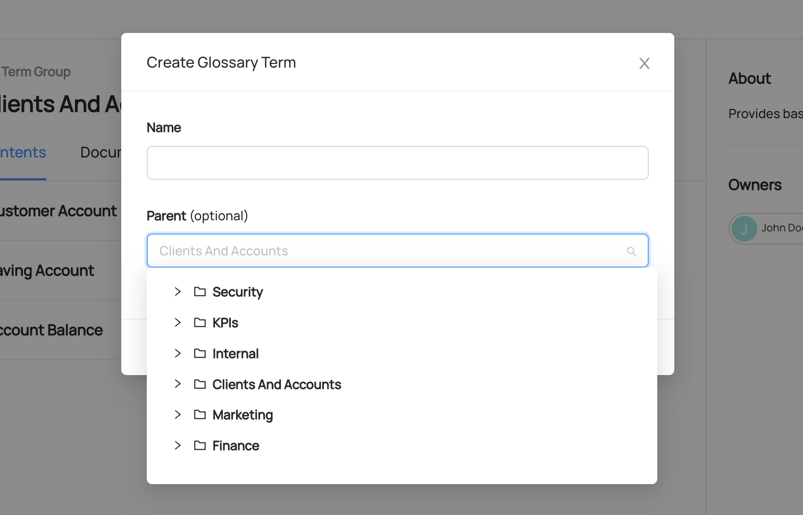

## Editing a Term or Term Group

In order to edit a Term or Term Group, you first need to go the page of the Term or Term group you want to edit. Then simply click the edit icon right next to the name to open up an inline editor. Change the text and it will save when you click outside or hit Enter.

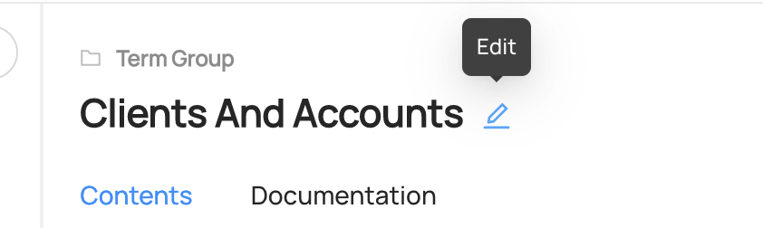

## Moving a Term or Term Group

Once a Term or Term Group has been created, you can always move it to be under a different Term Group parent. In order to do this, click the menu dots on the top right of either entity and select **Move**.

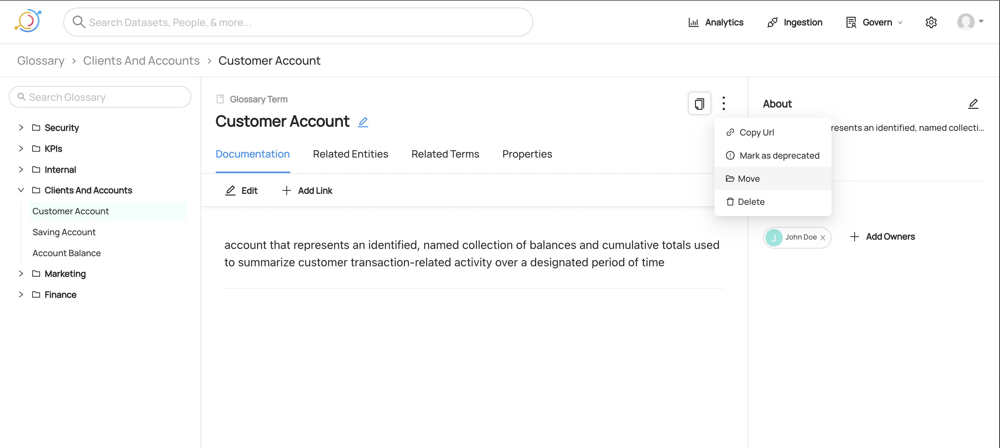

This will open a modal where you can navigate through your Glossary to find your desired Term Group.

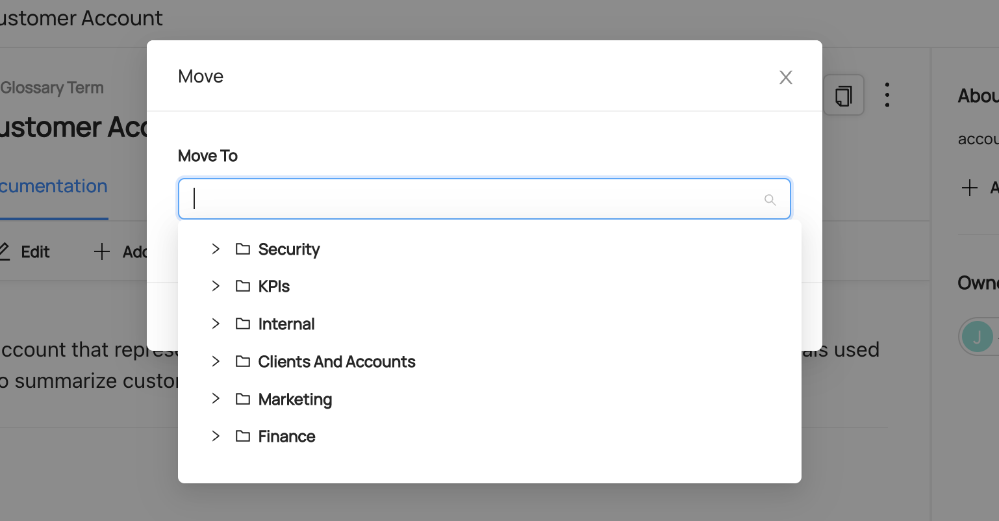

## Deleting a Term or Term Group

In order to delete a Term or Term Group, you need to go to the entity page of what you want to delete then click the menu dots on the top right. From here you can select **Delete** followed by confirming through a separate modal. **Note**: at the moment we only support deleting Term Groups that do not have any children. Until cascade deleting is supported, you will have to delete all children first, then delete the Term Group.

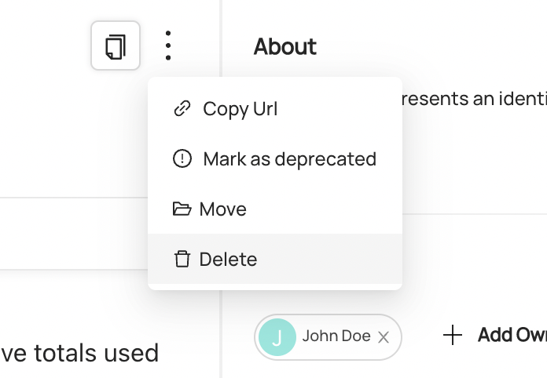

## Adding a Term to an Entity

Once you've defined your Glossary, you can begin attaching terms to data assets. To add a Glossary Term to an asset, go to the entity page of your asset and find the **Add Terms** button on the right sidebar.

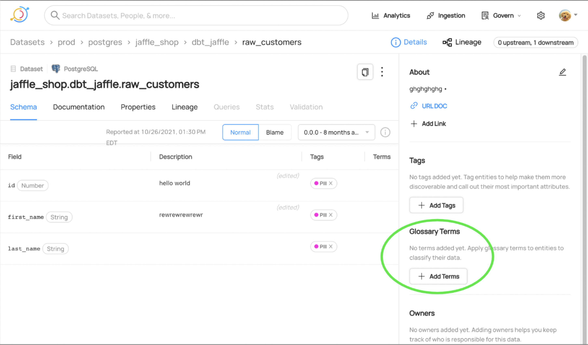

In the modal that pops up you can select the Term you care about in one of two ways:
- Search for the Term by name in the input
- Navigate through the Glossary dropdown that appears after clicking into the input

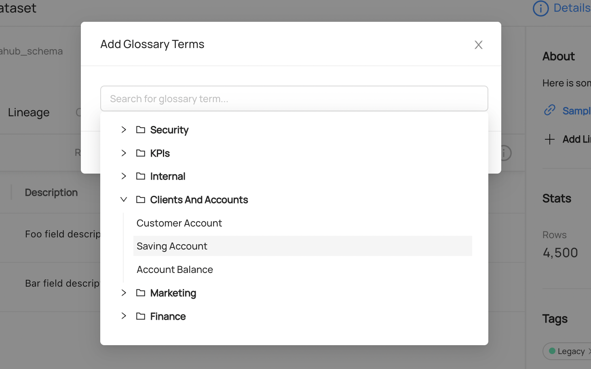

## Demo

Check out [our demo site](https://demo.datahubproject.io/glossary) to see an example Glossary and how it works!

## Resources
- [Creating a Business Glossary and Putting it to use in DataHub](https://blog.datahubproject.io/creating-a-business-glossary-and-putting-it-to-use-in-datahub-43a088323c12)
- [Tags and Terms: Two Powerful DataHub Features, Used in Two Different Scenarios](https://medium.com/datahub-project/tags-and-terms-two-powerful-datahub-features-used-in-two-different-scenarios-b5b4791e892e)

## Feedback / Questions / Concerns

We want to hear from you! For any inquiries, including Feedback, Questions, or Concerns, reach out on Slack!
