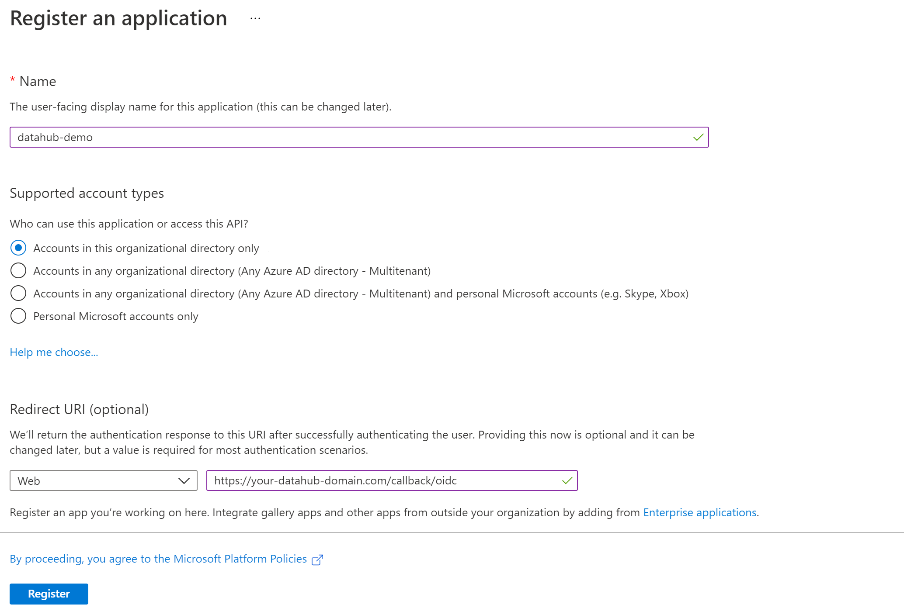

# Configuring Azure Authentication for React App (OIDC)
*Authored on 21/12/2021*

`datahub-frontend` server can be configured to authenticate users over OpenID Connect (OIDC). As such, it can be configured to
delegate authentication responsibility to identity providers like Microsoft Azure.

This guide will provide steps for configuring DataHub authentication using Microsoft Azure.

## Steps

### 1. Create an application registration in Microsoft Azure portal

a. Using an account linked to your organization, navigate to the [Microsoft Azure Portal](https://portal.azure.com).

b. Select **App registrations**, then **New registration** to register a new app.

c. Name your app registration and choose who can access your application.

d. Select `Web` as the **Redirect URI** type and enter the following:
```
https://your-datahub-domain.com/callback/oidc
```
If you are just testing locally, the following can be used: `http://localhost:9002/callback/oidc`.
Azure supports more than one redirect URI, so both can be configured at the same time from the **Authentication** tab once the registration is complete.

At this point, your app registration should look like the following:



e. Click **Register**.

### 2. Configure Authentication (optional)

Once registration is done, you will land on the app registration **Overview** tab.  On the left-side navigation bar, click on **Authentication** under **Manage** and add extra redirect URIs if need be (if you want to support both local testing and Azure deployments).


Click **Save**.

### 3. Configure Certificates & secrets

On the left-side navigation bar, click on **Certificates & secrets** under **Manage**.  
Select **Client secrets**, then **New client secret**.  Type in a meaningful description for your secret and select an expiry.  Click the **Add** button when you are done.

**IMPORTANT:** Copy the `value` of your newly create secret since Azure will never display its value afterwards.


### 4. Configure API permissions

On the left-side navigation bar, click on **API permissions** under **Manage**.  DataHub requires the following four Microsoft Graph APIs:

1. `User.Read` *(should be already configured)*
2. `profile`
3. `email`
4. `openid`

Click on **Add a permission**, then from the **Microsoft APIs** tab select **Microsoft Graph**, then **Delegated permissions**.  From the **OpenId permissions** category, select `email`, `openid`, `profile` and click **Add permissions**.

At this point, you should be looking at a screen like the following:


### 5. Obtain Application (Client) ID

On the left-side navigation bar, go back to the **Overview** tab.  You should see the `Application (client) ID`. Save its value for the next step.

### 6. Obtain Discovery URI

On the same page, you should see a `Directory (tenant) ID`. Your OIDC discovery URI will be formatted as follows:

```
https://login.microsoftonline.com/{tenant ID}/v2.0/.well-known/openid-configuration
```

### 7. Configure `datahub-frontend` to enable OIDC authentication

a. Open the file `docker/datahub-frontend/env/docker.env`

b. Add the following configuration values to the file:

```
AUTH_OIDC_ENABLED=true
AUTH_OIDC_CLIENT_ID=your-client-id
AUTH_OIDC_CLIENT_SECRET=your-client-secret
AUTH_OIDC_DISCOVERY_URI=https://login.microsoftonline.com/{tenant ID}/v2.0/.well-known/openid-configuration
AUTH_OIDC_BASE_URL=your-datahub-url
AUTH_OIDC_SCOPE="openid profile email"
```

Replacing the placeholders above with the client id (step 5), client secret (step 3) and tenant ID (step 6) received from Microsoft Azure.

### 9. Restart `datahub-frontend-react` docker container

Now, simply restart the `datahub-frontend-react` container to enable the integration.

```
docker-compose -p datahub -f docker-compose.yml -f docker-compose.override.yml  up datahub-frontend-react
```

Navigate to your DataHub domain to see SSO in action.

## Resources
- [Microsoft identity platform and OpenID Connect protocol](https://docs.microsoft.com/en-us/azure/active-directory/develop/v2-protocols-oidc/)