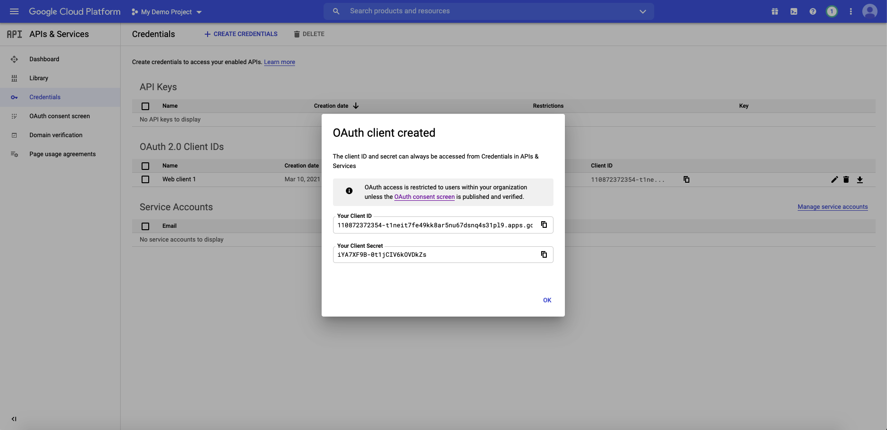

# Configuring Google Authentication for React App (OIDC)
*Authored on 3/10/2021*

`datahub-frontend` server can be configured to authenticate users over OpenID Connect (OIDC). As such, it can be configured to delegate 
authentication responsibility to identity providers like Google. 

This guide will provide steps for configuring DataHub authentication using Google.

## Steps

### 1. Create a project in the Google API Console

Using an account linked to your organization, navigate to the [Google API Console](https://console.developers.google.com/) and select **New project**. 
Within this project, we will configure the OAuth2.0 screen and credentials. 

### 2. Create OAuth2.0 consent screen

a. Navigate to `OAuth consent screen`. This is where you'll configure the screen your users see when attempting to 
log in to DataHub. 

b. Select `Internal` (if you only want your company users to have access) and then click **Create**. 
Note that in order to complete this step you should be logged into a Google account associated with your organization. 

c. Fill out the details in the App Information & Domain sections. Make sure the 'Application Home Page' provided matches where DataHub is deployed
at your organization. 


Once you've completed this, **Save & Continue**. 

d. Configure the scopes: Next, click **Add or Remove Scopes**. Select the following scopes:
    
    - `.../auth/userinfo.email`
    - `.../auth/userinfo.profile`
    - `openid`

Once you've selected these, **Save & Continue**. 

### 3. Configure client credentials

Now navigate to the **Credentials** tab. This is where you'll obtain your client id & secret, as well as configure info 
like the redirect URI used after a user is authenticated. 

a. Click **Create Credentials** & select `OAuth client ID` as the credential type.

b. On the following screen, select `Web application` as your Application Type. 

c. Add the domain where DataHub is hosted to your 'Authorized Javascript Origins'.

```
https://your-datahub-domain.com
```

d. Add the domain where DataHub is hosted with the path `/callback/oidc` appended to 'Authorized Redirect URLs'. 

```
https://your-datahub-domain.com/callback/oidc
```

e. Click **Create**

f. You will now receive a pair of values, a client id and a client secret. Bookmark these for the next step.

At this point, you should be looking at a screen like the following:



Success!

### 4. Configure `datahub-frontend` to enable OIDC authentication

a. Open the file `docker/datahub-frontend/env/docker.env`

b. Add the following configuration values to the file: 

```
AUTH_OIDC_ENABLED=true
AUTH_OIDC_CLIENT_ID=your-client-id
AUTH_OIDC_CLIENT_SECRET=your-client-secret
AUTH_OIDC_DISCOVERY_URI=https://accounts.google.com/.well-known/openid-configuration
AUTH_OIDC_BASE_URL=your-datahub-url
AUTH_OIDC_SCOPE="openid profile email"
AUTH_OIDC_USER_NAME_CLAIM=email
AUTH_OIDC_USER_NAME_CLAIM_REGEX=([^@]+)
```

Replacing the placeholders above with the client id & client secret received from Google in Step 3f.  


### 5. Restart `datahub-frontend-react` docker container

Now, simply restart the `datahub-frontend-react` container to enable the integration. 

```
docker-compose -p datahub -f docker-compose.yml -f docker-compose.override.yml  up datahub-frontend-react
```

Navigate to your DataHub domain to see SSO in action. 


## References

- [OpenID Connect in Google Identity](https://developers.google.com/identity/protocols/oauth2/openid-connect)