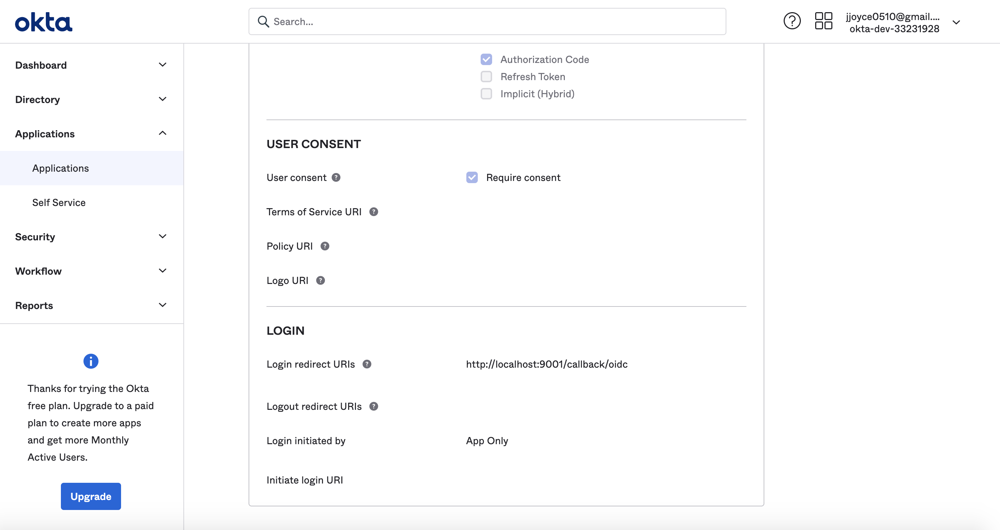

# Configuración de la autenticación okta para la aplicación React (OIDC)

*Escrito el 3/10/2021*

`datahub-frontend` El servidor se puede configurar para autenticar usuarios a través de OpenID Connect (OIDC). Como tal, se puede configurar para
delegar la responsabilidad de la autenticación a proveedores de identidad como Okta.

Esta guía proporcionará los pasos para configurar la autenticación de DataHub mediante Okta.

## Pasos

### 1. Crear una aplicación en Okta Developer Console

un. Inicie sesión en su cuenta de administrador de Okta y navegue hasta la consola del desarrollador

b. Escoger **Aplicaciones**entonces **Agregar aplicación**el **Crear nueva aplicación** para crear una nueva aplicación.

c. Seleccione `Web` como el **Plataforma**y `OpenID Connect` como el **Método de inicio de sesión**

d. Haga clic en **Crear**

e. En "Configuración general", asigne un nombre a la aplicación

f. A continuación, agregue un **URI de redireccionamiento de inicio de sesión**. Esto debe tener el formato de

    https://your-datahub-domain.com/callback/oidc

Si solo está probando localmente, esto puede ser `http://localhost:9002/callback/oidc`.

g. A continuación, agregue un **URI de redireccionamiento de cierre de sesión**. Esto debe tener el formato de

    https://your-datahub-domain.com

h. \[Opcional] Si está habilitando el inicio de sesión de DataHub como un mosaico de Okta, deberá proporcionar el **Iniciar URI de inicio de sesión**. Tú
puede establecer si en

    https://your-datahub-domain.com/authenticate

Si solo está probando localmente, esto puede ser `http://localhost:9002`.

i. Haga clic en **Salvar**

### 2. Obtener credenciales de cliente

En la pantalla siguiente, debería ver las credenciales del cliente. Marque el `Client id` y `Client secret` para el siguiente paso.

### 3. Obtener URI de descubrimiento

En la misma página, debería ver un `Okta Domain`. El URI de detección de OIDC tendrá el siguiente formato:

    https://your-okta-domain.com/.well-known/openid-configuration

por ejemplo `https://dev-33231928.okta.com/.well-known/openid-configuration`.

En este punto, deberías estar mirando una pantalla como la siguiente:

¡Éxito!

### 4. Configurar `datahub-frontend` Para habilitar la autenticación OIDC

un. Abrir el archivo `docker/datahub-frontend/env/docker.env`

b. Agregue los siguientes valores de configuración al archivo:

    AUTH_OIDC_ENABLED=true
    AUTH_OIDC_CLIENT_ID=your-client-id
    AUTH_OIDC_CLIENT_SECRET=your-client-secret
    AUTH_OIDC_DISCOVERY_URI=https://your-okta-domain.com/.well-known/openid-configuration
    AUTH_OIDC_BASE_URL=your-datahub-url
    AUTH_OIDC_SCOPE="openid profile email groups"

Reemplazar los marcadores de posición anteriores con el id de cliente y el secreto de cliente recibidos de Okta en el Paso 2.

> **¡Consejo profesional!** Puede habilitar fácilmente Okta para devolver los grupos a los que está asociado un usuario, que se aprovisionarán en DataHub, junto con el inicio de sesión del usuario,
> si aún no existen en DataHub. Puede habilitar su aplicación Okta para devolver una notificación de 'grupos' desde la consola de Okta en Aplicaciones > su aplicación -> Iniciar sesión -> Configuración del token de ID de conexión de OpenID (requiere una edición).
>
> De forma predeterminada, asumimos que los grupos aparecerán en una notificación denominada "grupos". Esto se puede personalizar utilizando el `AUTH_OIDC_GROUPS_CLAIM` configuración del contenedor.
>
> 

### 5. Reiniciar `datahub-frontend-react` contenedor docker

Ahora, simplemente reinicie el `datahub-frontend-react` contenedor para habilitar la integración.

    docker-compose -p datahub -f docker-compose.yml -f docker-compose.override.yml  up datahub-frontend-react

Desplácese hasta su dominio de DataHub para ver el inicio de sesión único en acción.

## Recursos

*   [Descripción general de OAuth 2.0 y OpenID Connect](https://developer.okta.com/docs/concepts/oauth-openid/)
