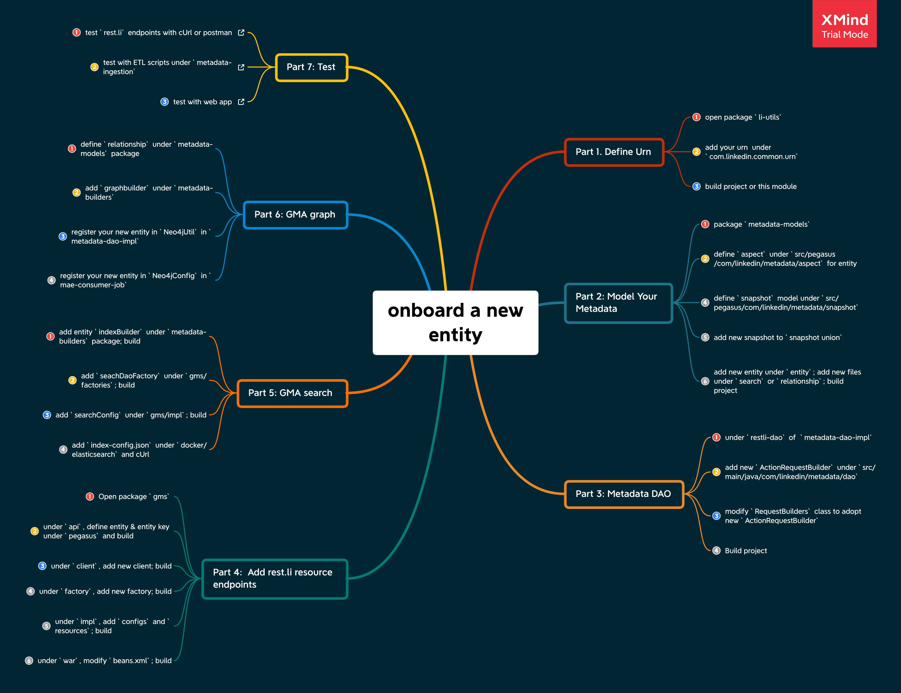

# How to onboard an entity?

> Refer to [this doc](./add-new-aspect.md) if you're only interested in adding a new aspect to an existing entity 

Currently, DataHub only has a support for 3 [entity] types: `datasets`, `users` and `groups`.
If you want to extend DataHub with your own use cases such as `metrics`, `charts`, `dashboards` etc, you should follow the below steps in order.

Also we use this following diagram to help you visualize the process.
 

## 1. Define URN
Refer to [here](../what/urn.md) for URN definition.

## 2. Model your metadata
Refer to [metadata modelling](metadata-modelling.md) section.
Make sure to do the following:
1. Define [Aspect] models.
2. Define aspect union model. Refer to [`DatasetAspect`] as an example.
3. Define [Snapshot] model. Refer to [`DatasetSnapshot`] as an example.
4. Add your newly defined snapshot to [Snapshot Union] model.

## 3. GMA search onboarding
Refer to [search onboarding](search-onboarding.md) if you need to search the entity.

## 4. GMA graph onboarding
Refer to [graph onboarding](graph-onboarding.md) if you need to perform graph queries against the entity.

## 5. Add rest.li resource endpoints
See [`CorpUsers`] for an example of top-level [resource endpoint]. Optionally add an aspect-specific [sub-resource endpoint] such as [`CorpUsersEditableInfoResource`].

## 6. Configure dependency injection
GMS uses [Spring Framework](https://docs.spring.io/spring-framework/docs/current/spring-framework-reference/core.html#beans) for dependency injection. You'll need to add [various factories](https://github.com/linkedin/datahub/tree/master/gms/factories/src/main/java/com/linkedin/gms/factory) to create any custom DAOs used by the rest.li endpoint. You'll also need to add any custom package to the `base-package` of `<context:component-scan>` tag in [beans.xml](https://github.com/linkedin/datahub/blob/master/gms/war/src/main/webapp/WEB-INF/beans.xml)

## 7. UI for entity onboarding [WIP]

[Aspect]: ../what/aspect.md
[`DatasetAspect`]: ../../metadata-models/src/main/pegasus/com/linkedin/metadata/aspect/DatasetAspect.pdl
[Snapshot]: ../what/snapshot.md
[`DatasetSnapshot`]: ../../metadata-models/src/main/pegasus/com/linkedin/metadata/snapshot/DatasetSnapshot.pdl
[Snapshot Union]: ../../metadata-models/src/main/pegasus/com/linkedin/metadata/snapshot/Snapshot.pdl
[Entity]: ../what/entity.md
[DatasetEntity]: ../../metadata-models/src/main/pegasus/com/linkedin/metadata/entity/DatasetEntity.pdl
[`CorpUsers`]: ../../gms/impl/src/main/java/com/linkedin/metadata/resources/identity/CorpUsers.java
[resource endpoint]: https://linkedin.github.io/rest.li/user_guide/restli_server#writing-resources
[sub-resource endpoint]: https://linkedin.github.io/rest.li/user_guide/restli_server#sub-resources
[`CorpUsersEditableInfoResource`]: ../../gms/impl/src/main/java/com/linkedin/metadata/resources/identity/CorpUsersEditableInfoResource.java
