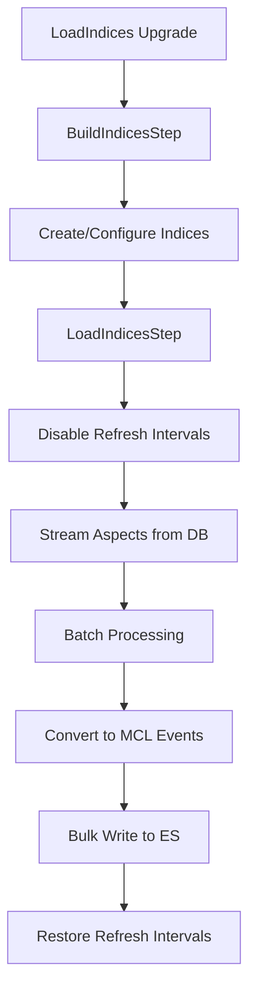

# Load Indices: High-Performance Bulk Index Loading

LoadIndices is a high-performance upgrade task designed for bulk loading metadata aspects directly from the database into Elasticsearch/OpenSearch indices. Unlike RestoreIndices which focuses on correctness and consistency, LoadIndices is optimized for speed and throughput during initial deployments or large-scale data migrations.

## Overview

LoadIndices bypasses the standard event-driven processing pipeline to directly stream data from the `metadata_aspect_v2` table into search indices using optimized bulk operations. This approach provides significant performance improvements for large installations while making specific architectural trade-offs that prioritize speed over consistency.

🚨 **CRITICAL WARNING**: LoadIndices is designed for specific use cases only and should **NEVER** be used in production environments with active concurrent writes, MCL-dependent systems, or real-time consistency requirements. See [Performance Trade-offs & Implications](#performance-trade-offs--implications) for complete details.

### Key Features

- **🚀 High Performance**: Direct streaming from database with optimized bulk operations
- **⚡ Fast Bulk Loading**: Optimized for speed over consistency during initial loads
- **🔧 Refresh Management**: Automatically disables refresh intervals during loading for optimal performance
- **📊 Comprehensive Monitoring**: Real-time progress reporting and performance metrics
- **⚙️ Configurable Isolation**: Utilizes READ_UNCOMMITTED transactions for faster scanning

---

## Performance Trade-offs & Implications

⚠️ **Critical Understanding**: LoadIndices prioritizes **performance over consistency** by making several architectural trade-offs. Understanding these implications is crucial before using LoadIndices in production environments.

### 🚨 Key Trade-offs Made

#### **1. BYPASS Kafka/MCL Event Pipeline**

- **What**: LoadIndices completely bypasses Kafka MCL (Metadata Change Log) topics that normally propagate all metadata changes
- **Architecture**: `Database → LoadIndices → Elasticsearch` **vs** normal flow of `Database → Kafka MCL → Multiple Consumers → Elasticsearch/Graph/etc`
- **Impact**: **No MCL events published** - downstream systems lose visibility into metadata changes
- **Critical Implication**:
  - **MCL-Dependent Analytics**: Won't have audit trail of metadata changes
  - **Integrations**: External systems won't be notified of changes
  - **Custom MCL Consumers**: Any custom consumers will miss these events entirely
  - **✅ Graph Service**: WILL be updated (UpdateIndicesService handles graph indices) **⚠️ Only when Elasticsearch is used for graph storage**

#### **2. BROKEN DataHub Event Architecture**

- **What**: Violates DataHub's core design principle that "all metadata changes flow through Kafka MCL"
- **Normal Flow**: `Metadata Change → MCL Event → Kafka → Multiple Consumers → Various Stores`
- **LoadIndices Flow**: `Metadata Change → LoadIndices → Direct ES Write` (**Skips Kafka entirely**)

#### **3. READ_UNCOMMITTED Isolation**

- **What**: Uses `TxIsolation.READ_UNCOMMITTED` for faster database scanning
- **Impact**: May read **uncommitted changes** or **dirty reads** from concurrent transactions
- **Implication**: Data consistency not guaranteed during active writes to database

#### **4. Refresh Interval Manipulation**

- **What**: Automatically disables refresh intervals during bulk operations
- **Impact**: **Recent updates may not be immediately searchable**
- **Implication**: Users won't see real-time updates in search until refresh intervals are restored

#### **5. No Write Concurrency Controls**

- **What**: No coordination with concurrent Elasticsearch writes from live ingestion
- **Impact**: **Potential conflicts** with active ingestion pipelines
- **Implication**: Concurrent writes may cause data inconsistency or operation failures

### ⚠️ When NOT to Use LoadIndices

**❌ DO NOT use LoadIndices if you have:**

- **Active ingestion pipelines** writing to Elasticsearch simultaneously
- **MCL-dependent systems** that need event notifications
- **Neo4j-based graph storage** (graph updates will be missing)
- **Real-time search requirements** during the loading process
- **Production traffic** that requires immediate search consistency

### ✅ When LoadIndices is Appropriate

**✅ Safe to use LoadIndices when:**

- **Fresh deployment** with empty Elasticsearch cluster
- **Offline migration** with no concurrent users
- **Standalone indexing** without DataHub services running
- **Read-only replica environments** with no active writes
- **Development/testing** environments
- **Disaster recovery** scenarios where faster restoration is prioritized
- **Independent cluster setup** where you need to populate indices before services start
- **Elasticsearch-based graph storage** (graph gets updated automatically)

### 🔒 Safety Requirements

Before using LoadIndices in any environment:

1. **Verify Minimal Infrastructure**:

   - **Database**: MySQL/PostgreSQL with `metadata_aspect_v2` table accessible (via Ebean ORM)
   - **Elasticsearch**: Running cluster accessible via HTTP/HTTPS
   - **DataHub Services**: ✅ **NOT required** - LoadIndices can run independently
   - **⚠️ Check Graph Storage**: Verify if using Elasticsearch-based graph storage
   - **⚠️ Check Database Type**: Confirm NOT using Cassandra (not supported)

2. **Stop All Ingestion** (if DataHub is running):

   ```bash
   # Disable all Kafka consumers
   kubectl scale deployment --replicas=0 datahub-mae-consumer
   kubectl scale deployment --replicas=0 datahub-mce-consumer
   kubectl scale deployment --replicas=0 datahub-gms
   ```

3. **Check Database Configuration**:

   ```bash
   # Check if using Cassandra (LoadIndices NOT supported)
   grep -i cassandra /path/to/datahub/docker/docker-compose.yml

   # Verify MySQL/PostgreSQL database is configured
   grep -E "mysql\|postgres" /path/to/datahub/docker/docker-compose.yml

   # ⚠️ If Cassandra detected, LoadIndices is NOT available
   # Must use RestoreIndices instead
   ```

4. **Check Graph Storage Configuration**:

   ```bash
   # Check if using Neo4j (graph updates will be MISSING)
   grep -r "neo4j" /path/to/datahub/docker/docker-compose.yml

   # Check DataHub configuration for graph service selection
   grep -i "graph.*elasticsearch\|neo4j" /path/to/datahub/conf/application.yml

   # ⚠️ If Neo4j is detected, LoadIndices will NOT update graph
   ```

5. **Verify No Concurrent Writes**:

   ```bash
   # Check for active Elasticsearch indexing
   curl -s "localhost:9200/_nodes/stats" | grep "index_current"
   # Should show "index_current": 0
   ```

6. **Index Clean State**:

   ```bash
   # Ensure clean indexing state
   curl -s "localhost:9200/_nodes/stats" | grep -E "refresh.*active"
   ```

7. **Coordinate with Operations**:
   - **Maintenance window** scheduling
   - **User notification** of search unavailability
   - **Monitoring** of downstream system dependencies

### 📊 Consistency Guarantees

| Level                                   | LoadIndices   | RestoreIndices      |
| --------------------------------------- | ------------- | ------------------- |
| **URN-level Ordering**                  | ✅ Guaranteed | ✅ Guaranteed       |
| **Real-time Searchability**             | ❌ Delayed    | ✅ Immediate        |
| **Graph Service Updates (ES-based)**    | ✅ Updated    | ✅ Updated          |
| **Graph Service Updates (Neo4j-based)** | ❌ Missing    | ✅ Updated          |
| **MCL Event Propagation**               | ❌ Bypassed   | ✅ Full propagation |
| **Concurrent Write Safety**             | ❌ Not safe   | ✅ Safe             |

#### **2. Restore Normal Operations**

- **Re-enable ingestion** pipelines gradually
- **Monitor Elasticsearch** for conflicts
- **Validate downstream systems** are synchronized

#### **3. Emergency Rollback Plan**

```bash
# If issues arise, prepare rollback:
# 1. Stop LoadIndices immediately
# 2. Restore from backup indices
# 3. Re-run with RestoreIndices for correctness
```

---

## How LoadIndices Works

LoadIndices operates as an upgrade task that can run **independently** without requiring DataHub services to be running. It consists of two main steps:

1. **BuildIndicesStep**: Creates and configures Elasticsearch indices (creates indices if they don't exist)
2. **LoadIndicesStep**: Streams aspects from database and bulk loads them into indices

### 🔧 Independent Operation Mode

**Key Advantage**: LoadIndices only requires:

- ✅ **MySQL/PostgreSQL** source database (via Ebean ORM)
- ✅ **Elasticsearch/OpenSearch** destination cluster
- ❌ **No DataHub services** (maui, frontend, etc.) required
- ❌ **Cassandra**: ⚠️ **NOT supported** (Ebean doesn't support Cassandra)

This enables **offline bulk operations** during maintenance windows or initial deployments where DataHub infrastructure is being set up incrementally.

**Index Creation**: The BuildIndicesStep automatically creates all required Elasticsearch indices based on `IndexConvention` patterns, so empty Elasticsearch clusters are fully supported.

### Architecture Flow



### Key Differences from RestoreIndices

| Aspect                 | RestoreIndices                | LoadIndices                |
| ---------------------- | ----------------------------- | -------------------------- |
| **Purpose**            | Correctness & consistency     | Speed & throughput         |
| **Processing**         | Event-driven via MCL events   | Direct bulk operations     |
| **Isolation**          | READ_COMMITTED                | READ_UNCOMMITTED           |
| **Refresh Management** | Static configuration          | Dynamic disable/restore    |
| **Performance Focus**  | Accurate replay               | Maximal speed              |
| **Use Case**           | Recovery from inconsistencies | Initial loads & migrations |

---

## Deployment & Execution

### 🚀 Standalone Deployment Advantage

**Key Benefit**: LoadIndices can run with **minimal infrastructure** without requiring DataHub services to be running:

```bash
# Minimal requirements
✅ MySQL/PostgreSQL database (with metadata_aspect_v2 table)
✅ Elasticsearch/OpenSearch cluster
❌ DataHub GMS/Maui services - NOT needed
❌ Kafka cluster - NOT needed
❌ Frontend services - NOT needed
```

### 🔧 Execution Methods

LoadIndices can be executed via:

1. **Gradle Task** (Recommended)

```bash
# From datahub-upgrade directory
./gradlew runLoadIndices

# With custom thread count
./gradlew runLoadIndices -PesThreadCount=6
```

2. **IDE Execution**: Run `UpgradeTask.main()` with LoadIndices arguments

3. **Standalone JAR**: Build and run datahub-upgrade JAR independently

---

## LoadIndices Configuration Options

### 🔄 Performance & Throttling

| Argument    | Description                                | Default                        | Example             |
| ----------- | ------------------------------------------ | ------------------------------ | ------------------- |
| `batchSize` | Number of aspects per batch for processing | `10000`                        | `-a batchSize=5000` |
| `limit`     | Maximum number of aspects to process       | `Integer.MAX_VALUE` (no limit) | `-a limit=50000`    |

### 📅 Time Filtering

| Argument       | Description                                                           | Example                         |
| -------------- | --------------------------------------------------------------------- | ------------------------------- |
| `gePitEpochMs` | Only process aspects created **after** this timestamp (milliseconds)  | `-a gePitEpochMs=1609459200000` |
| `lePitEpochMs` | Only process aspects created **before** this timestamp (milliseconds) | `-a lePitEpochMs=1640995200000` |

### 🔍 Content Filtering

| Argument      | Description                                     | Example                                   |
| ------------- | ----------------------------------------------- | ----------------------------------------- |
| `urnLike`     | SQL LIKE pattern to filter URNs                 | `-a urnLike=urn:li:dataset:%`             |
| `aspectNames` | Comma-separated list of aspect names to process | `-a aspectNames=ownership,schemaMetadata` |

### ⚙️ System Configuration

| Environment Variable         | Description                             | Default                             | Example                        |
| ---------------------------- | --------------------------------------- | ----------------------------------- | ------------------------------ |
| `ELASTICSEARCH_THREAD_COUNT` | Number of I/O threads for BulkProcessor | `2` (app config), `4` (Gradle task) | `ELASTICSEARCH_THREAD_COUNT=4` |
| `ES_BULK_ASYNC`              | Enable asynchronous bulk operations     | `true`                              | `ES_BULK_ASYNC=true`           |
| `ES_BULK_REQUESTS_LIMIT`     | Maximum bulk requests per buffer        | `10000`                             | `ES_BULK_REQUESTS_LIMIT=15000` |
| `ES_BULK_FLUSH_PERIOD`       | Bulk flush interval in seconds          | `300` (5 minutes)                   | `ES_BULK_FLUSH_PERIOD=300`     |

---

## Running LoadIndices

### 🐳 Docker Compose

If you're using Docker Compose with the DataHub source repository:

```bash
# Basic LoadIndices execution
./docker/datahub-upgrade/datahub-upgrade.sh -u LoadIndices

# LoadIndices with performance tuning
./docker/datahub-upgrade/datahub-upgrade.sh -u LoadIndices \
  -a batchSize=15000 \
  -a limit=100000
```

### 🎯 Gradle Task (Development)

For development and testing environments:

```bash
# Run LoadIndices with default settings
./gradlew :datahub-upgrade:runLoadIndices

# Run with custom thread count and batch size
./gradlew :datahub-upgrade:runLoadIndices \
  -PesThreadCount=4 \
  -PbatchSize=15000 \
  -Plimit=50000
```

The Gradle task supports these parameters:

- `esThreadCount`: Set `ELASTICSEARCH_THREAD_COUNT` (default: `4`)
- `batchSize`: Override batch size (default: `10000`)
- `limit`: Set processing limit
- `urnLike`: Filter by URN pattern
- `aspectNames`: Filter by aspect names
- `lePitEpochMs`: Process records created before this timestamp
- `gePitEpochMs`: Process records created after this timestamp

### 🐳 Docker Environment Variables

Configure LoadIndices through Docker environment:

```bash
# Target specific entity types
docker run --rm datahub-upgrade \
  -u LoadIndices \
  -a urnLike=urn:li:dataset:% \
  -a batchSize=20000

# Process specific aspects only
docker run --rm datahub-upgrade \
  -u LoadIndices \
  -a aspectNames=ownership,status,schemaMetadata \
  -a batchSize=15000

# Time-based filtering
docker run --rm datahub-upgrade \
  -u LoadIndices \
  -a gePitEpochMs=1640995200000 \
  -a limit=50000
```

---

## Performance Optimization

### 🚀 Elasticsearch/OpenSearch Configuration

#### Bulk Processing Tuning

```bash
# Optimize bulk settings for LoadIndices
export ES_BULK_REQUESTS_LIMIT=15000
export ES_BULK_FLUSH_PERIOD=10
export ES_BULK_ASYNC=true
export ELASTICSEARCH_THREAD_COUNT=4
```

#### Connection Pool Optimization

LoadIndices automatically configures connection pooling based on thread count:

```yaml
# datahub-upgrade/build.gradle configuration
environment "ELASTICSEARCH_THREAD_COUNT", "4" # Auto-adjusts maxConnectionsPerRoute
```

## Comparison with RestoreIndices

Understanding when to use LoadIndices vs RestoreIndices is crucial for optimal performance and data consistency.

### 🎯 Purpose & Design Philosophy

| Aspect                | RestoreIndices                 | LoadIndices                     |
| --------------------- | ------------------------------ | ------------------------------- |
| **Primary Purpose**   | Data consistency & correctness | Speed & throughput              |
| **Design Philosophy** | Event-driven precision         | Performance optimization        |
| **Consistency Model** | Full consistency guarantee     | Speed-optimized trade-offs      |
| **Use Case**          | Production recovery            | Bulk migrations & initial loads |

### 📊 Technical Comparison

| Feature                           | RestoreIndices               | LoadIndices              |
| --------------------------------- | ---------------------------- | ------------------------ |
| **Database Isolation**            | READ_COMMITTED               | READ_UNCOMMITTED         |
| **MCL Events**                    | ✅ Full MCL pipeline         | ❌ Bypasses MCL entirely |
| **Graph Updates (Elasticsearch)** | ✅ Updated                   | ✅ Updated               |
| **Graph Updates (Neo4j)**         | ✅ Updated                   | ❌ Missing               |
| **Database Support**              | MySQL, PostgreSQL, Cassandra | MySQL, PostgreSQL only   |
| **Performance**                   | Slower, safer                | Faster, optimized        |
| **Real-time Consistency**         | ✅ Immediate                 | ❌ Delayed until refresh |
| **Concurrency Safety**            | ✅ Safe                      | ❌ Not safe              |

### 🚀 When to Use Each Tool

#### ✅ **Use RestoreIndices For:**

- **Production recovery** from inconsistencies
- **Neo4j-based graph storage** deployments
- **Cassandra-based** metadata storage
- **Active ingestion** pipelines running
- **MCL-dependent systems** requiring event notifications
- **Precise event replay** scenarios

#### ✅ **Use LoadIndices For:**

- **Fresh deployments** with empty clusters
- **Bulk migrations** during maintenance windows
- **MySQL/PostgreSQL + Elasticsearch** configurations
- **Offline scenarios** with no concurrent writes
- **Development/testing** environments
- **Performance-critical** initial data loads
