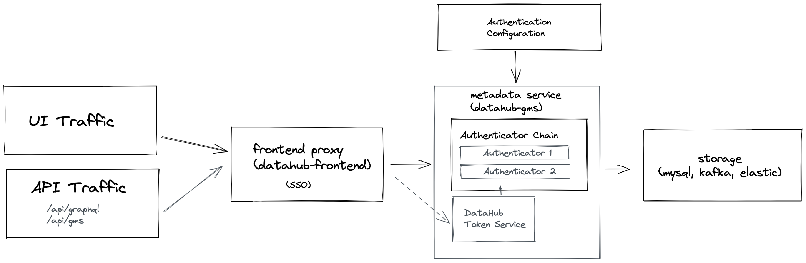

# Metadata Service Authentication

## Introduction

We recently introduced Authentication in the Metadata Service layer. This document will provide a technical overview of the feature aimed at developers
evaluating or operating DataHub. It will include a characterization of the motivations for the feature, the key components in its design, the new capabilities it provides, & configuration instructions. 

## Background

Let's recall 2 critical components of DataHub's architecture: 

- **DataHub Frontend Proxy** (datahub-frontend) - Resource server that routes requests to downstream Metadata Service
- **DataHub Metadata Service** (datahub-gms) - Source of truth for storing and serving DataHub Metadata Graph. 

Previously, Authentication was exclusively handled by the Frontend Proxy. This service would perform the following steps 
when a user navigated to `http://localhost:9002/`:

  a. Check for the presence of a special `PLAY_SESSION` cookie.

  b. If cookie was present + valid, redirect to the home page

  c. If cookie was invalid, redirect to either a) the DataHub login screen (for [JAAS authentication](https://datahubproject.io/docs/how/auth/jaas/) or b) a [configured OIDC Identity Provider](https://datahubproject.io/docs/how/auth/sso/configure-oidc-react/) to perform authentication.

Once authentication had succeeded at the frontend proxy layer, a stateless (token-based) session cookie (PLAY_SESSION) would be set in the users browser.
All subsequent requests, including the GraphQL requests issued by the React UI, would be authenticated using this session cookie. Once a request had made it beyond
the frontend service layer, it was assumed to have been already authenticated. Hence, there was **no native authentication inside of the Metadata Service**. 

### Problems with this approach

The major challenge with this situation is that requests to the backend Metadata Service were completely unauthenticated. There were 2 options for folks who required authentication at the Metadata Service layer:

1. Set up a proxy in front of Metadata Service that performed authentication
2. [A more recent possibility] Route requests to Metadata Service through DataHub Frontend Proxy, including the PLAY_SESSION
Cookie with every request.
   
Neither of which are ideal. Setting up a proxy to do authentication takes time & expertise. Extracting and setting a session cookie from the browser for programmatic is
clunky & unscalable. On top of that, extending the authentication system was difficult, requiring implementing a new [Play module](https://www.playframework.com/documentation/2.8.8/api/java/play/mvc/Security.Authenticator.html) within DataHub Frontend.

## Introducing Authentication in DataHub Metadata Service

To address these problems, we introduced configurable Authentication inside the **Metadata Service** itself, 
meaning that requests are no longer considered trusted until they are authenticated by the Metadata Service.

Why push Authentication down? In addition to the problems described above, we wanted to plan for a future
where Authentication of Kafka-based-writes could be performed in the same manner as Rest writes. 

Next, we'll cover the components being introduced to support Authentication inside the Metadata Service. 

### Concepts & Key Components 

We introduced a few important concepts to the Metadata Service to make authentication work:

1. Actor
2. Authenticator
3. AuthenticatorChain
4. AuthenticationFilter
5. DataHub Access Token
6. DataHub Token Service
 
In following sections, we'll take a closer look at each individually. 


*High level overview of Metadata Service Authentication*

#### What is an Actor?

An **Actor** is a concept within the new Authentication subsystem to represent a unique identity / principal that is initiating actions (e.g. read & write requests) 
on the platform. 

An actor can be characterized by 2 attributes:

1. **Type**: The "type" of the actor making a request. The purpose is to for example distinguish between a "user" & "service" actor. Currently, the "user" actor type is the only one 
formally supported.
2. **Id**: A unique identifier for the actor within DataHub. This is commonly known as a "principal" in other systems. In the case of users, this
represents a unique "username". This username is in turn used when converting from the "Actor" concept into a Metadata Entity Urn (e.g. CorpUserUrn).
   
For example, the root "datahub" super user would have the following attributes:

```
{
   "type": "USER",
   "id": "datahub"
}
```

Which is mapped to the CorpUser urn:

```
urn:li:corpuser:datahub
```

for Metadata retrieval. 

#### What is an Authenticator? 

An **Authenticator** is a pluggable component inside the Metadata Service that is responsible for authenticating an inbound request provided context about the request (currently, the request headers).
Authentication boils down to successfully resolving an **Actor** to associate with the inbound request.

There can be many types of Authenticator. For example, there can be Authenticators that

- Verify the authenticity of access tokens (ie. issued by either DataHub itself or a 3rd-party IdP)
- Authenticate username / password credentials against a remote database (ie. LDAP)

and more! A key goal of the abstraction is *extensibility*: a custom Authenticator can be developed to authenticate requests
based on an organization's unique needs. 

DataHub ships with 2 Authenticators by default:

- **DataHubSystemAuthenticator**: Verifies that inbound requests have originated from inside DataHub itself using a shared system identifier
  and secret. This authenticator is always present. 

- **DataHubTokenAuthenticator**: Verifies that inbound requests contain a DataHub-issued Access Token (discussed further in the "DataHub Access Token" section below) in their 
'Authorization' header. This authenticator is required if Metadata Service Authentication is enabled. 
  
#### What is an AuthenticatorChain?

An **AuthenticatorChain** is a series of **Authenticators** that are configured to run one-after-another. This allows
for configuring multiple ways to authenticate a given request, for example via LDAP OR via local key file. 

Only if each Authenticator within the chain fails to authenticate a request will it be rejected. 

The Authenticator Chain can be configured in the `application.yml` file under `authentication.authenticators`:

```
authentication:
  .... 
  authenticators:
    # Configure the Authenticators in the chain 
    - type: com.datahub.authentication.Authenticator1
      ...
    - type: com.datahub.authentication.Authenticator2 
    .... 
```

#### What is the AuthenticationFilter?

The **AuthenticationFilter** is a [servlet filter](http://tutorials.jenkov.com/java-servlets/servlet-filters.html) that authenticates each and requests to the Metadata Service. 
It does so by constructing and invoking an **AuthenticatorChain**, described above. 

If an Actor is unable to be resolved by the AuthenticatorChain, then a 401 unauthorized exception will be returned by the filter. 


#### What is a DataHub Token Service? What are Access Tokens?  

Along with Metadata Service Authentication comes an important new component called the **DataHub Token Service**. The purpose of this
component is twofold:

1. Generate Access Tokens that grant access to the Metadata Service 
2. Verify the validity of Access Tokens presented to the Metadata Service

**Access Tokens** granted by the Token Service take the form of [Json Web Tokens](https://jwt.io/introduction), a type of stateless token which
has a finite lifespan & is verified using a unique signature. JWTs can also contain a set of claims embedded within them. Tokens issued by the Token
Service contain the following claims:

- exp: the expiration time of the token
- version: version of the DataHub Access Token for purposes of evolvability (currently 1)
- type: The type of token, currently SESSION (used for UI-based sessions) or PERSONAL (used for personal access tokens)
- actorType: The type of the **Actor** associated with the token. Currently, USER is the only type supported.
- actorId: The id of the **Actor** associated with the token.

Today, Access Tokens are granted by the Token Service under two scenarios:

1. **UI Login**: When a user logs into the DataHub UI, for example via [JaaS](https://datahubproject.io/docs/how/auth/jaas/) or 
   [OIDC](https://datahubproject.io/docs/how/auth/sso/configure-oidc-react/), the `datahub-frontend` service issues an 
   request to the Metadata Service to generate a SESSION token *on behalf of* of the user logging in. (*Only the frontend service is authorized to perform this action).
2. **Generating Personal Access Tokens**: When a user requests to generate a Personal Access Token (described below) from the UI. 

> At present, the Token Service supports the symmetric signing method `HS256` to generate and verify tokens. 

Now that we're familiar with the concepts, we will talk concretely about what new capabilities have been built on top
of Metadata Service Authentication. 

### New Capabilities

#### Personal Access Tokens

With these changes, we introduced a way to generate a "Personal Access Token" suitable for programmatic use with both the DataHub GraphQL
and DataHub Rest.li (Ingestion) APIs. 

Personal Access Tokens have a finite lifespan (default 3 months) and currently cannot be revoked without changing the signing key that
DataHub uses to generate these tokens (via the TokenService described above). Most importantly, they inherit the permissions
granted to the user who generates them. 

##### Generating Personal Access Tokens

To generate a personal access token, users must have been granted the "Generate Personal Access Tokens" (GENERATE_PERSONAL_ACCESS_TOKENS) Privilege via a [DataHub Policy](./policies.md). Once
they have this permission, users can navigate to **'Settings'** > **'Access Tokens'** > **'Generate Personal Access Token'** to generate a token.


The token expiration dictates how long the token will be valid for. We recommend setting the shortest duration possible, as tokens are not currently
revokable once granted (without changing the signing key). 


#### Using a Personal Access Token

The user will subsequently be able to make authenticated requests to DataHub frontend proxy or DataHub GMS directly by providing
the generated Access Token as a Bearer token in the `Authorization` header:

```
Authorization: Bearer <generated-access-token> 
```

For example, using a curl to the frontend proxy (preferred in production):

`curl 'http://localhost:9002/api/gms/entities/urn:li:corpuser:datahub' -H 'Authorization: Bearer <access-token>`

or to Metadata Service directly:

`curl 'http://localhost:8080/entities/urn:li:corpuser:datahub' -H 'Authorization: Bearer <access-token>`

Without an access token, making programmatic requests will result in a 401 result from the server if Metadata Service Authentication
is enabled.

### Configuring Metadata Service Authentication

Metadata Service Authentication is currently **opt-in**. This means that you may continue to use DataHub without Metadata Service Authentication without interruption.
To enable Metadata Service Authentication:

- set the `METADATA_SERVICE_AUTH_ENABLED` environment variable to "true" for the `datahub-gms` AND `datahub-frontend` containers / pods. 
  
OR

- change the Metadata Service `application.yml` configuration file to set `authentication.enabled` to "true" AND
- change the Frontend Proxy Service `application.config` configuration file to set `metadataService.auth.enabled` to "true"

After setting the configuration flag, simply restart the Metadata Service to start enforcing Authentication. 

Once enabled, all requests to the Metadata Service will need to be authenticated; if you're using the default Authenticators
that ship with DataHub, this means that all requests will need to present an Access Token in the Authorization Header as follows:

```
Authorization: Bearer <access-token> 
```

For users logging into the UI, this process will be handled for you. When logging in, a cookie will be set in your browser that internally
contains a valid Access Token for the Metadata Service. When browsing the UI, this token will be extracted and sent to the Metadata Service
to authenticate each request.

For users who want to access the Metadata Service programmatically, i.e. for running ingestion, the current recommendation is to generate
a **Personal Access Token** (described above) from the root "datahub" user account, and using this token when configuring your [Ingestion Recipes](https://datahubproject.io/docs/metadata-ingestion/#recipes). 
To configure the token for use in ingestion, simply populate the "token" configuration for the `datahub-rest` sink:

```
source:
  # source configs
sink:
  type: "datahub-rest"
  config:
    ...
    token: <your-personal-access-token-here!> 
```

> Note that ingestion occurring via `datahub-kafka` sink will continue to be Unauthenticated *for now*. Soon, we will be introducing
> support for providing an access token in the event payload itself to authenticate ingestion requests over Kafka. 


### The Role of DataHub Frontend Proxy Going Forward

With these changes, DataHub Frontend Proxy will continue to play a vital part in the complex dance of Authentication. It will serve as the place
where UI-based session authentication originates and will continue to support 3rd Party SSO configuration (OIDC)
and JAAS configuration as it does today. 

The major improvement is that the Frontend Service will validate credentials provided at UI login time
and generate a DataHub **Access Token**, embedding it into traditional session cookie (which will continue to work).

In summary, DataHub Frontend Service will continue to play a vital role to Authentication. It's scope, however, will likely
remain limited to concerns specific to the React UI.

## Where to go from here

These changes represent the first milestone in Metadata Service Authentication. They will serve as a foundation upon which we can build new features, prioritized based on Community demand:

1. **Dynamic Authenticator Plugins**: Configure + register custom Authenticator implementations, without forking DataHub. 
2. **Service Accounts**: Create service accounts and generate Access tokens on their behalf. 
3. **Kafka Ingestion Authentication**: Authenticate ingestion requests coming from the Kafka ingestion sink inside the Metadata Service.
4. **Access Token Management**: Ability to view, manage, and revoke access tokens that have been generated. (Currently, access tokens inlcude no server side state, and thus cannot be revoked once granted)

...and more! To advocate for these features or others, reach out on [Slack](https://datahubspace.slack.com/join/shared_invite/zt-nx7i0dj7-I3IJYC551vpnvvjIaNRRGw#/shared-invite/email). 

## Q&As 

### What if I don't want to use Metadata Service Authentication?

That's perfectly fine, for now. Metadata Service Authentication is disabled by default, only enabled if you provide the 
environment variable `METADATA_SERVICE_AUTH_ENABLED` to the `datahub-gms` container or change the `authentication.enabled` to "true"
inside your DataHub Metadata Service configuration (`application.yml`). 

That being said, we will be recommending that you enable Authentication for production use cases, to prevent
arbitrary actors from ingesting metadata into DataHub. 

### If I enable Metadata Service Authentication, will ingestion stop working? 

If you enable Metadata Service Authentication, you will want to provide a value for the "token" configuration value
when using the `datahub-rest` sink in your [Ingestion Recipes](https://datahubproject.io/docs/metadata-ingestion/#recipes). See
the [Rest Sink Docs](https://datahubproject.io/docs/metadata-ingestion/sink_docs/datahub#config-details) for configuration details.

We'd recommend generating a Personal Access Token (described above) from a trusted DataHub Account (e.g. root 'datahub' user) when configuring
your Ingestion sources.

Note that you can also provide the "extraHeaders" configuration in `datahub-rest` sink to specify a custom header to
pass with each request. This can be used in conjunction to authenticate using a custom Authenticator, for example. 

### How do I generate an Access Token for a service account?

There is no formal concept of "service account" or "bot" on DataHub (yet). For now, we recommend you configure any
programmatic clients of DataHub to use a Personal Access Token generated from a user with the correct privileges, for example
the root "datahub" user account. 

### I want to authenticate requests using a custom Authenticator? How do I do this? 

You can configure DataHub to add your custom **Authenticator** to the **Authentication Chain** by changing the `application.yml` configuration file for the Metadata Service:

```yml
authentication:
  enabled: true # Enable Metadata Service Authentication 
  ....
  authenticators: # Configure an Authenticator Chain 
    - type: <fully-qualified-authenticator-class-name> # E.g. com.linkedin.datahub.authentication.CustomAuthenticator
      configs: # Specific configs that should be passed into 'init' method of Authenticator
        customConfig1: <value> 
```

Notice that you will need to have a class that implements the `Authenticator` interface with a zero-argument constructor available on the classpath
of the Metadata Service java process.

We love contributions! Feel free to raise a PR to contribute an Authenticator back if it's generally useful. 

### Now that I can make authenticated requests to either DataHub Proxy Service and DataHub Metadata Service, which should I use?

Previously, we were recommending that folks contact the Metadata Service directly when doing things like

- ingesting Metadata via recipes
- issuing programmatic requests to the Rest.li APIs 
- issuing programmatic requests to the GraphQL APIs 

With these changes, we will be shifting to the recommendation that folks direct all traffic, whether it's programmatic or not, 
to the **DataHub Frontend Proxy**, as routing to Metadata Service endpoints is currently available at the path `/api/gms`. 
This recommendation is in effort to minimize the exposed surface area of DataHub to make securing, operating, maintaining, and developing
the platform simpler.

In practice, this will require migrating Metadata [Ingestion Recipes](https://datahubproject.io/docs/metadata-ingestion/#recipes) use the `datahub-rest` sink to pointing at a slightly different
host + path.

Example recipe that proxies through DataHub Frontend 

```yml
source:
  # source configs
sink:
  type: "datahub-rest"
  config:
    ...
    token: <your-personal-access-token-here!> 
```

## Feedback / Questions / Concerns

We want to hear from you! For any inquiries, including Feedback, Questions, or Concerns, reach out on [Slack](https://datahubspace.slack.com/join/shared_invite/zt-nx7i0dj7-I3IJYC551vpnvvjIaNRRGw#/shared-invite/email)!