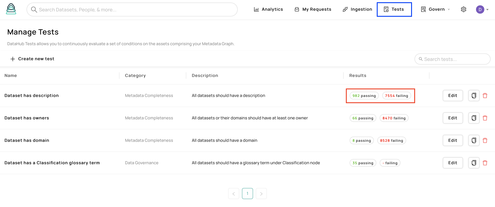

# Metadata Tests

## Introduction

Many tools like Great Expectations, DBT Tests, Deequ allow you to create assertions or tests on the data inside the data sources. These help you define the minimum requirements that each data source needs to meet to ensure data quality.&#x20;

Similarly, ensuring that you have high-quality **metadata** is equally important. Do highly used datasets (or tier 1 datasets) have owners assigned? Do tables under the Finance domain have the term Confidential attached? Answering such questions can ensure you have healthy metadata setting a high bar on accountability, data governance, and much more.&#x20;

**Metadata tests** allow data platform engineers, governance officers, etc. to define custom tests (assertions) regarding the metadata of data sources on DataHub. We designed the feature to ensure the following:

1. Must be able to fully customize tests based on all metadata ingested into DataHub
2. Must be integrated into DataHub experience end-to-end: test status should be visible from a low level (entity-level) as well as high level (platform-level)

Note that metadata test is an active feature, and we will be actively improving the experience in the near future! This doc aims at walking through the current state of **metadata tests** feature and how to take advantage of it.&#x20;

## Prerequisites

In order to create and edit Metadata Tests. you must have the `Metadata Tests` Platform Privilege. This privilege can be granted to users or groups using an Access Policy in **Settings > Privileges**.&#x20;

## Overview&#x20;

We will start the walk-through by going over the various UI elements we added to visualize tests. First, let's look at the test configuration page.&#x20;



If you have permission to manage tests, you will see the "Tests" button on the top right (denoted by the blue box). On this page, you can find the list of configured tests. We have configured four initial tests to start with. You can check out the detailed configuration or make modifications by clicking on the edit button. You can also see summary statistics on how many entities pass/fail the test and click on the buttons (denoted by the red box) to land on a search page to look at the passing/failing entities.&#x20;

Most users will be able to see the test status on each entity page. Click on the Validation tab (denoted by the blue box in the image below) and the Test sub-tab (denoted by the red box) to find the list of tests that were evaluated for the given entities and their status.&#x20;


Tests are evaluated every time there is a change to the entity i.e. ingestion, edits on UI, etc. with a 3-second buffer. For example, after adding a domain to pass the "Dataset has domain" test, refresh the page to see the test status change. We also evaluate tests for all entities once a day to make sure they are eventually consistent.&#x20;

We will add more UI elements to visualize tests in the near future including adding a test tab on the Analytics page to check the overall test status across the platform, adding a test entity page to easily find entities that are passing/failing the test, and adding a test tab in the owner page to quickly find entities owned by the user that are failing tests to take action.&#x20;

### Configuring Tests (Beta)

Configuring tests requires defining the test in the YAML format described below. Note, we are designing a UI based method for defining tests to aid this process.&#x20;

Following is an example test for making sure all BigQuery datasets have owners assigned.&#x20;

```
on: // (1)
  types: // (2)
    - dataset
  match: // (3)
    - 
      query: dataPlatformInstance.platform
      operation: equals // (4)
      params: // (5)
        values: ["urn:li:dataPlatform:bigQuery"]
rules: // (6)
  -
    query: ownership.owners.owner
    operation: exists

```

A test definition consists of two main parts: targetting rules (1) and the test evaluation rules (6). Targeting rules define whether this test should be applied to a given entity. Some tests are generic and thus should be applied to all datasets, while a stronger set of tests must be applied to datasets tagged with "Tier 1". Each "on" clause that defines the targeting rules must have a "types" clause (2) denoting the list of entities that this test should apply to, and an optional "match" clause (3) which defines specific rules that need to pass.&#x20;

Each rule is a collection of predicates that by default applies in a conjunctive manner (AND operation). You can also use an OR operation to combine predicates as seen below (7). Each predicate consists of a "query" denoting the field in the metadata graph to fetch, "operation" denoting the operation to run, and optional "params" that must contain the required set of parameters to run the operation.&#x20;

Currently, the query syntax traverses our Aspect graph. You start by specifying the aspect of the entity to fetch and then the fields in the aspect to fetch. It also hops to the linked entity and continues traversing its aspect graph. i.e. query in (8) below fetches the parent node of the glossary terms attached to this entity. Refer to  We will add more guides and UI elements to help find the correct one for your need.&#x20;

Once the query is constructed, you can use the appropriate binary operation to run to define the predicate. The list of supported operations is in the next section.

In the above example (3), it is asking that the platform of the entity must equal "urn:li:dataPlatform:bigQuery" a.k.a the test targets all BigQuery datasets. You can also add "**negate: true"** to any predicate to negate the predicate.&#x20;

The main rules define the actual content of the test to evaluate. The rules must hold for the test to pass for a given targeted entity. In the above case, the rules state that the entity must have at least one owner assigned.&#x20;

```
rules: 
  or: // (7)
    - query: glossaryTerms.terms.urn.glossaryTermInfo.parentNode // (8)
      operation: equals
      params:
        values: ["urn:li:glossaryNode:Category"]
    - query: container.container.glossaryTerms.terms.urn.glossaryTermInfo.parentNode
      condition: equals
      values: ["urn:li:glossaryNode:Category"]
```

#### Supported Operations

Note, we will continue to expand the set of supported operations.&#x20;

| Operation | Description                                                                                     | Params                                                                              |
| --------- | ----------------------------------------------------------------------------------------------- | ----------------------------------------------------------------------------------- |
| equals    | Checks whether any of the queried values are equal to any of the values specified in the params | "values" with a list of values to compare or "value" with a single value to compare |
| exists    | Checks whether the query returns any non-empty values                                           | No required params                                                                  |

#### Example Queries

Here are some example queries for datasets that you can use to configure tests.&#x20;

| Query                                              | Description                                                        | Note                                                                                            |
| -------------------------------------------------- | ------------------------------------------------------------------ | ----------------------------------------------------------------------------------------------- |
| ownership.owners.owner                             | List of owners assigned to this entity                             |                                                                                                 |
| glossaryTerms.terms.urn                            | List of glossary terms assigned to this entity                     |                                                                                                 |
| glossaryTerms.terms.urn.glossayTermInfo.parentNode | List of parent nodes of the glossary terms assigned to this entity |                                                                                                 |
| datasetProperties.description                      | Original description of the dataset that was ingested              | Note, this value is overriden by the below editable properties when it is edited through the UI |
| editableDatasetProperties.description              | Description of the dataset edited through the UI                   | Note, if this is empty, the above description is shown in the UI.                               |
| dataPlatformInstance.platform                      | Data Platform of the entity                                        |                                                                                                 |
| globalTags.tags.tag                                | List of tags assigned to this entity                               |                                                                                                 |

### Stay Tuned

We will continue to improve the metadata tests feature in the next two quarters.&#x20;
